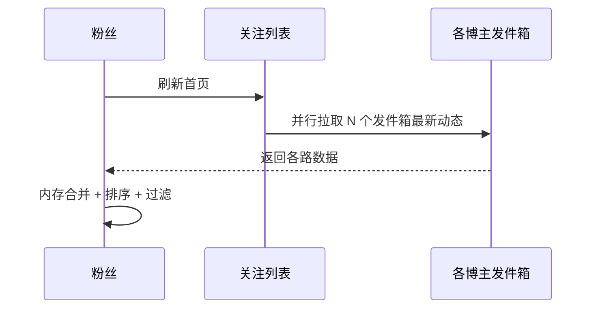

# Feed 信息流设计

> 朋友圈、微博、小红书首页——你永远刷不到头的列表，就是 Feed 流。它的核心难题是：如何把用户关注的内容，高效拼装并推到眼前。推、拉、混合三种模式，本质是"写贵还是读贵"的权衡。

本文与「[长连接](长连接.md)」（推送通道）、「[抖音支付发券](抖音支付十万级%20TPS%20流量发券实践.md)」（海量写扩散）呼应：Feed 分发同样依赖推送网络与高吞吐写链路。

## 一、Feed 流的三种模式

| 模式 | 别名 | 写行为 | 读行为 | 核心权衡 |
|------|------|--------|--------|---------|
| 拉模式 Pull | 读扩散 | 只写自己发件箱（1 次） | 拉取所有关注者发件箱再合并 | 写轻、读重 |
| 推模式 Push | 写扩散 | 写入每个粉丝收件箱（N 次） | 直接读自己收件箱（O(1)） | 写重、读轻 |
| 混合 Hybrid | 推拉结合 | 普通用户推、大 V 拉 | 读时合并推送 + 拉取大 V | 兼顾两者 |

> 行业读写比常约 **100:1**（刷远大于发），所以普遍倾向"写重一点，换读快一点"——除非遇到超大粉丝的大 V。

## 二、拉模式（读扩散）



- **优点**：写极快（只写 1 次）、存储省（一份）、过滤排序灵活（个性化/屏蔽）。
- **缺点**：读延迟高。关注 2000 人刷新要查 2000 次，扇出大、CPU/IO 高，分页困难（滑到后面很麻烦）。
- **适用**：关注人少、刷新不频繁的场景。

## 三、推模式（写扩散）⭐

```mermaid
flowchart LR
    P[博主发帖] --> DB[(写自己发件箱)]
    DB --> MQ[[MQ 异步]]
    MQ --> F[Feed 分发服务]
    F --> R1[粉丝1 收件箱 Redis ZSet]
    F --> R2[粉丝2 收件箱 Redis ZSet]
    F --> R3[粉丝N 收件箱 Redis ZSet]
    U[粉丝刷新] --> READ[读自己收件箱 O(1)]
```

- **实现**：每用户一个收件箱（常用 Redis `ZSet`，score=时间戳），发帖后异步（MQ）批量写入所有粉丝收件箱。
- **优点**：读性能极强 O(1)，契合读多写少，体验流畅。
- **致命缺点**：**写放大**。1 万粉丝 = 1 万次写；微信朋友圈正是此模式（好友上限 5000，扩散可控）。

## 四、混合模式（推拉结合，工业界主流）⭐⭐

核心思想：**按粉丝数/活跃度动态选策略**——普通用户推，大 V 拉。

```mermaid
flowchart TD
    POST[用户发帖] --> TYPE{是普通用户 还是 大V?}
    TYPE -- 普通用户 粉丝少 --> PUSH[异步写所有粉丝收件箱]
    TYPE -- 大V 粉丝多 --> W[只写自己发件箱]
    W --> ACTIVE[异步推给活跃粉丝收件箱]
    W --> INACTIVE[不活跃粉丝: 登录时从发件箱拉]
    READ[粉丝刷首页] --> MERGE[合并: 收件箱(推送) + 并行拉取关注大V发件箱]
    MERGE --> SORT[去重 + 排序 + 过滤]
    SORT --> DETAIL[批量查帖子详情]
```

- **普通用户**：粉丝有限，写扩散换粉丝极佳读体验（值得）。
- **大 V（千万粉）**：不全网推（否则后台地震）。只写自己发件箱；异步推给**活跃粉丝**（最近登录、二八定律覆盖 80% 流量）；不活跃粉丝登录时再拉。
- **读时合并**：粉丝首页 = 自己收件箱（来自普通关注） + 并行拉取关注大 V 的发件箱，再合并去重排序。

> 微博即典型混合：明星发博走"写扩散+读扩散"结合，服务好 20% 活跃粉丝覆盖 80% 读取流量。

## 五、关键配套设计

| 子问题 | 方案 |
|--------|------|
| 收件箱存储 | Redis ZSet（score=时间），分页用 `ZREVRANGE`；或时序表 |
| 写扩散异步化 | MQ 解耦，发帖写自己发件箱即返回成功，后台投递 |
| 热点大 V | 识别阈值（如粉丝 > X 万）→ 转拉模式 / 仅推活跃粉 |
| 未读数 | `INCR unread:{userId}`，打开 App Pipeline 批量读，定时同步 DB |
| 点赞防重复 | `SADD post:liked:{id}` + Lua 原子（已赞则失败） |
| 长期不登录 | 再登录时从关注大 V 发件箱统一拉取补齐 |
| 内容过滤 | 拉取后在内存做屏蔽词/拉黑/个性化排序 |

## 六、选型决策

| 场景 | 推荐 |
|------|------|
| 朋友圈（好友≤5000） | 推模式（写扩散） |
| 微博/小红书（含大 V） | 混合模式（普通推 + 大 V 拉） |
| 关注人少、刷新少 | 拉模式（读扩散） |
| 强实时个性化推荐 | 拉模式（读时实时计算排序） |

> ⚠️ **注意**：
> 1. **写放大爆炸**：纯推模式遇千万粉大 V 不可行 → 必须混合或限推活跃粉。
> 2. **存储冗余**：推模式数据多份复制，需控制收件箱长度（截断旧 Feed）防无限膨胀。
> 3. **一致性延迟**：写扩散异步，热点事件下粉丝可能延迟几秒才看到，需监控投递延迟。

## 七、生产 Checklist

- [ ] 按粉丝规模分流：普通用户推、大 V 拉（混合是默认答案）。
- [ ] 收件箱用 Redis ZSet，分页 `ZREVRANGE`，控制长度上限。
- [ ] 写扩散经 MQ 异步，发帖先落自己发件箱即返回。
- [ ] 大 V 只推活跃粉丝，不活跃登录时拉取补齐。
- [ ] 配套未读数、点赞去重（Lua）、内容过滤。
- [ ] 监控：投递延迟、收件箱大小、拉取扇出耗时。

## 八、分页方案深挖（cursor 是底线）

| 方案 | 实现 | 问题 |
|------|------|------|
| offset/limit ❌ | 跳过 N 条 | 数据变动导致重复/遗漏（滑着滑着就乱了） |
| cursor by score ✅ | `ZREVRANGE key 0 19`，下次带 `(lastScore, lastMember)` | 唯一稳妥：按时间戳游标，天然防重复 |
| cursor by id | 按自增 ID 游标 | 需 ID 单调，插入中间位置会漏 |

```
首屏:  ZREVRANGE feed:{uid} 0 19
下页:  ZREVRANGEBYSCORE feed:{uid} (1631xxx, 0 LIMIT 0 20   ← 带上次最后一条的 score
排序稳定性: 同 score 时 ZSet 按 member 字典序，游标要带 member 兜底
```

> 面试题「Feed 分页怎么做」答 cursor + 原因（防重复防遗漏）；再说为什么不用 offset——数据在插入时，offset 漂移导致用户看到重复/跳条。

## 九、核心指标与排障速查

| 维度 | 指标 | 说明 |
|------|------|------|
| 体验 | 首页首屏耗时、刷到内容新鲜度 | P95 < 300ms 是体验线 |
| 分发 | 投递延迟 P95、收件箱写入失败率 | 写扩散健康度 |
| 存储 | 收件箱平均长度、单用户峰值 | 控制膨胀 |
| 扇出 | 大 V 发帖扇出耗时、活跃粉丝识别准确率 | 大 V 链路 |
| 一致性 | 同内容多端重复率、遗漏率 | cursor 质量 |

**排障速查**：
- 刷新慢 → 看拉取扇出（关注大 V 数量 × 单次耗时），或收件箱过大；
- 内容不全 → 看投递延迟/失败（MQ lag）与「不活跃粉丝拉取」兜底是否触发；
- 重复/跳条 → 分页实现是否用了 cursor（八成是 offset 惹的祸）；
- 大 V 发帖卡 → 检查是否误走了全量推扩散（应转活跃粉推 + 拉）。

## 十、与「时间线合并」的进阶话题（了解）

- **合并去重**：收件箱内容 + 大 V 发件箱拉取内容，按内容 ID 去重（`Set`），再按时间倒序；
- **个性化重排**：拉模式读时可做实时个性化（权重分），推模式收件箱为固定顺序，混排需在读侧二次排序；
- **同城/热榜 Feed**：不走关注关系，直接全局写一份热榜（score=热度衰减分），全体用户读同一份——大促/热搜场景的削峰手段。

> 参考：微博 Timeline 架构（混合模式）、微信朋友圈写扩散设计、Twitter/微博 Engineering Blog、高并发 Feed 系统设计（推拉结合 + 活跃粉丝识别）。
