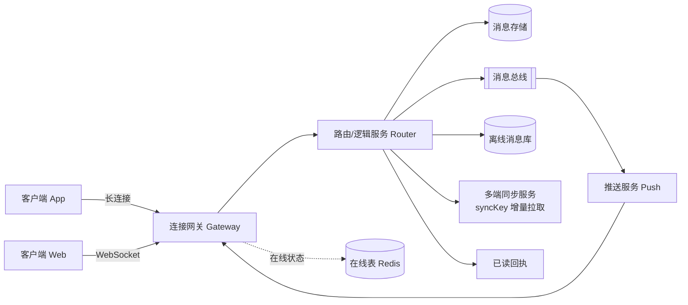
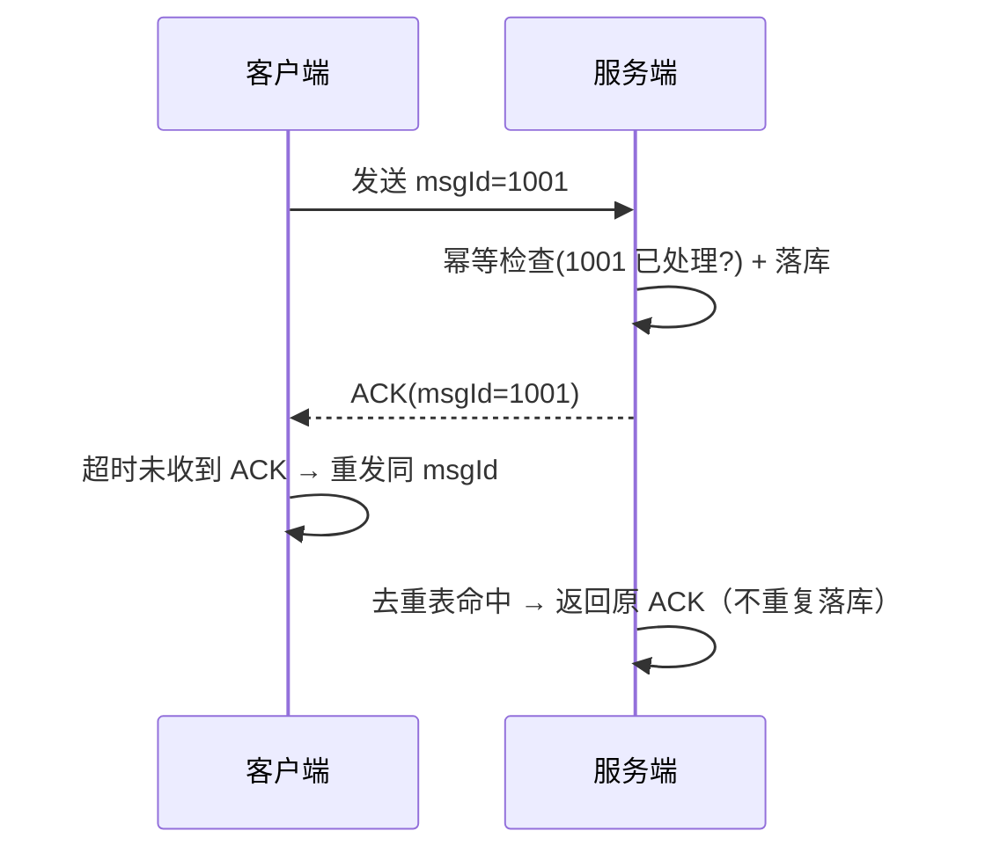

# IM 消息系统设计

## 〇、本体介绍

**IM（Instant Messaging）**：微信/钉钉/直播间聊天的底层系统。表面是"发一条消息"，实则是**连接管理 + 消息可靠投递 + 时序一致 + 多端同步 + 已读回执**的组合拳。

**核心矛盾**：
1. 消息**不能丢、不能重、不能乱**：恰好一次（exactly once）在分布式下只能靠"至少一次 + 去重"逼近；
2. **在线/离线**：消息发给离线用户要暂存，上线后增量拉取；
3. **群聊扇出**：万人群一条消息要送达万人，写扩散会打爆存储；
4. **多端同步与已读**：手机/PC/平板三端时序一致，已读状态跨端共享。

**核心主线**：连接接入 → 消息路由 → 可靠投递 → 存储 → 多端同步 → 群聊扇出 → 搜索与归档。

> 与「[长连接](长连接.md)」互链：本文聚焦**消息系统**（存储/投递/同步），传输通道细节（心跳/重连/网关容量）见长连接篇。

---

## 一、整体架构



| 层 | 职责 | 要点 |
|----|------|------|
| **接入层 Gateway** | 维护长连接、编解码、鉴权、心跳 | 无状态、可水平扩展；`userId → gatewayNode` 存在线表 |
| **逻辑层 Router** | 消息路由、会话校验、群成员拉取、权限 | 无状态、按 `conversationId` 哈希路由保证有序 |
| **存储层** | 消息/会话/已读游标落库 | 冷热分离：热数据快存、历史归档 |
| **异步层** | 离线存储、推送、多端同步、统计 | MQ 削峰，失败重试 |

> 口诀：**"网关只收连接，逻辑只管路由，存储管不丢，MQ 管异步。"**

---

## 二、数据模型：会话 + 消息

### 2.1 单聊

```sql
CREATE TABLE conversation (
    id             BIGINT PRIMARY KEY,      -- 会话ID（单聊可用两人 ID 有序拼接）
    type           TINYINT,                 -- 1单聊 2群聊
    member_cnt     INT,
    last_msg_id    BIGINT,
    last_msg_time  DATETIME,
    version        BIGINT                   -- 会话版本号，用于多端增量同步
) COMMENT '会话表';

CREATE TABLE message (
    id              BIGINT PRIMARY KEY,     -- 全局唯一消息ID（发号器）
    conversation_id BIGINT NOT NULL,
    sender_id       BIGINT NOT NULL,
    msg_type        TINYINT,                -- 文本/图片/语音/文件
    content         MEDIUMTEXT,             -- 内容（图片为 URL）
    seq             BIGINT NOT NULL,        -- 会话内单调递增序号
    status          TINYINT DEFAULT 0,      -- 0正常 1撤回 2删除
    created_at      DATETIME,
    KEY idx_conversation (conversation_id, seq)   -- 按会话拉取
) COMMENT '消息表';
```

- **消息 ID（全局）**：雪花/号段发号器生成，全局唯一，用于去重与幂等（见「[分布式ID生成](分布式ID生成.md)」）。
- **消息序号 seq（会话内）**：单聊/群聊各自单调递增，客户端**按 seq 排序**保证不乱序；拉历史/增量同步都靠它做游标。
- **会话 version**：每次有新消息 `version+1`，多端用它判断"有没有新东西"。

### 2.2 群聊：写扩散 vs 读扩散

| 方案 | 做法 | 存储 | 群规模 | 已读统计 |
|------|------|------|--------|----------|
| **写扩散（收件箱模型）** | 每条群消息给**每个成员** inbox 插一条 | 成员×消息，爆炸 | ≤ 500 人群 | 天然精确 |
| **读扩散（拉取模型）** | 群消息只存一份，成员按游标拉取 | 一份 | 万人大群 | 需已读游标统计 |

- **小群（≤500）写扩散**：体验最好，已读天然精确，SQL 简单。
- **大群（万人）读扩散**：存储一份 + 每人一个 `group_read_cursor(uid, group_id, last_seq)`；已读人数 = 游标 ≥ 消息 seq 的人数（用 Redis Bitmap 或聚合表）。
- 微信实际是"**大小群混合**"：普通群写扩散，万人群读扩散 + 群公告单独存储。

```sql
-- 读扩散关键：群成员游标
CREATE TABLE group_cursor (
    user_id      BIGINT NOT NULL,
    group_id     BIGINT NOT NULL,
    last_seq     BIGINT NOT NULL,      -- 该用户读到的最大 seq
    updated_at   DATETIME,
    PRIMARY KEY (user_id, group_id)
) COMMENT '群已读游标';
```

> 口诀：**"小群写扩散、大群读扩散；游标记已读，Bitmap 数人头。"**

---

## 三、消息可靠投递（不丢不重不乱序）

### 3.1 至少一次 + 去重 = 恰好一次



- **幂等键 = msgId**：客户端生成、重试复用；服务端 `(sender_id, msgId)` 唯一索引去重。
- 接收端同样维护 `(conversationId, seq)` 去重集合：重推/多端同步不会重复展示。

### 3.2 乱序处理

- 服务端给消息分配 **seq 后才落库/下发**（不能边收边发边编号）。
- 客户端收到 seq 不连续时**先缓存等缺口补齐再上屏**（微信"接收中"就是缺口等待）。
- 下行通道（网关）按 `conversationId` 哈希路由到同一节点，保证同一会话的写入顺序。

### 3.3 离线消息

- 发送路径：先落库 → 再查在线表 → 在线走网关下发，离线落离线库/靠多端增量拉取。
- 离线消息不单独建表：**增量同步天然覆盖离线**（syncKey 落后的消息就是离线消息），简化实现。

---

## 四、多端同步（syncKey 增量拉取）

### 4.1 微信风格：每条消息有全局递增 id

```text
客户端维护 syncKey（本地已同步的最大消息 id）
   → 定时/上线时: 拉取 messages where id > syncKey
   → 服务端返回 [消息列表, 新 syncKey]
```

| 维度 | 实现 |
|------|------|
| 增量游标 | 全局发号器的消息 id 单调递增（雪花/号段），`id > syncKey` 即增量 |
| 会话变更 | 会话表 `version` 也纳入增量：先拉会话变更，再拉消息 |
| 多端冲突 | 三端各自维护 syncKey，服务端返回各自缺口；撤回/删除也走增量事件 |
| 上限保护 | 增量超过 N 条分页拉取，防止追消息风暴 |

### 4.2 已读回执

- 单聊已读：客户端回 `mark_read(conversationId, seq)`，服务端更新会话 `read_cursor`，反向推送"对方已读"。
- 群聊已读：更新 `group_cursor`；已读人数用 Redis 聚合（Bitmap：`group_read:{msgId}` 按成员索引置位，`BITCOUNT` 数人头）。
- **跨端已读共享**：已读游标存在服务端，任一端的已读操作其他端同步生效。

---

## 五、消息撤回 / 删除 / 编辑

| 操作 | 实现 | 注意 |
|------|------|------|
| 撤回 | 双向替换：`status=1` + 前端占位文案"你撤回了一条消息" | 时间窗（2 分钟）；超时不可撤；群聊撤回要广播 |
| 删除 | 仅本地删除（本地标记）vs 双向删除 | 双向删除需服务端记录，多端同步删除事件 |
| 编辑 | 新版本消息：`edit_version+1`，各端拉取最新内容 | 保留编辑历史可选 |

- 撤回/删除对**多端同步**是新的增量事件：`message_update{msgId, type=recall}`，游标同样适用。
- 已撤回消息对**搜索/归档**不可见，落库时加过滤条件。

---

## 六、消息存储优化

| 手段 | 说明 |
|------|------|
| **冷热分离** | 近 90 天热消息在 MySQL/ES；更早归档对象存储 + 元数据表，搜索走归档索引 |
| **分库分表** | 按 `conversation_id` 哈希分片；群聊消息量大可单独按 `group_id` 分片 |
| **内容外置** | 图片/语音/文件传 OSS，消息表只存 URL（见「[分片上传与断点续传](分片上传与断点续传：秒传、大文件与网盘.md)」） |
| **过期策略** | 企业 IM 不删；C 端聊天按合规周期清理，或提示"消息已过期" |
| **消息索引** | 会话列表页靠 `conversation.version` 排序，不走消息表扫全量 |

> ⚠️ 群消息是存储大头：万人群每天百万级消息，读扩散 + 冷归档 + 分片三件套缺一不可。

---

## 七、消息搜索

- 全文检索：消息进 ES（`conversation_id + sender + content` 分词），范围限定在"该会话/该群"，避免跨会话泄露。
- 搜索实时性：MQ 消费写 ES，秒级可见即可；撤回消息异步删索引。
- 隐私边界：仅能搜自己参与的会话；管理员审计搜索单独鉴权。

---

## 八、踩坑与权衡

- **并发发消息乱序**：同会话并发写，seq 分配必须原子（DB 行锁 / Redis INCR / 单节点路由）。
- **ACK 丢失无限重发**：重试要退避（指数 + 抖动），上限后提示"网络差，稍后再试"。
- **僵尸连接**：客户端异常退出但 TCP 未断开，心跳超时才回收，期间消息误投（见「[长连接](长连接.md)」）。
- **推送风暴**：万人群发消息瞬间海量下行，网关分桶推送 + 限流，见「[稳定性三板斧](稳定性三板斧：限流-熔断-降级.md)」。
- **消息积压**：MQ 消费慢了先扩消费者，别让消息堵在内存。
- **存储膨胀**：群消息不归档会拖垮查询，冷热分离要提前设计，别等磁盘报警。
- **多端同步重复**：增量拉取与推送双通道可能重复下发，客户端 `(conversationId, seq)` 去重兜底。

---

## 九、与相关主题的关联

- 「[长连接](长连接.md)」：传输通道、心跳、网关容量。
- 「[异步 Servlet](异步Servlet.md)」：Web 端推送通道（SSE/WebSocket 的 HTTP 异步实现）。
- 「[通知中心与站内信设计](通知中心与站内信设计.md)」：系统通知 vs 聊天消息，投递模式互通。
- 「[分布式ID生成](分布式ID生成.md)」：消息 ID / syncKey 的全局发号。
- 「[幂等设计](幂等设计.md)」：msgId 去重、至少一次投递。
- 「[社交IM业务模型](../业务模型/社交IM业务模型.md)」：行业视角的 IM 业务模型。

---

## 十、速查表

| 主题 | 一句话 |
|------|--------|
| 架构 | 网关管连接、逻辑管路由、存储管不丢、MQ 管异步 |
| 存储 | conversation + message 两表，群消息按 seq 游标 |
| 群聊 | 小群写扩散、大群读扩散 + 游标 |
| 可靠投递 | 至少一次 + msgId 幂等 + seq 去重 |
| 乱序 | 服务端分配 seq 后落库下发，客户端缺口等待 |
| 多端 | syncKey 增量拉取，撤回/删除也是增量事件 |
| 已读 | 游标记录 + Redis Bitmap 数群已读 |
| 冷热 | 热 MySQL / 冷归档对象存储，内容外置 OSS |

---

## 面试高频问题（15+ 条）

1. **IM 消息怎么做到不丢？** 服务端先落库再下发；客户端 ACK 超时重发（幂等 msgId）；离线靠增量拉取补。
2. **怎么做到不重？** 发送幂等（msgId 唯一）+ 接收去重（conversationId+seq）。
3. **怎么做到不乱序？** 服务端统一分配 seq 再落库下发；客户端按 seq 排序，缺口等待补齐。
4. **单聊和群聊表怎么设计？** conversation 会话表 + message 消息表；群聊加 group_cursor 游标表。
5. **万人群消息怎么存？** 读扩散：消息存一份，成员按游标拉取；已读用 Bitmap 统计。
6. **小群为什么可以写扩散？** 成员少（≤500），每人一份的存储量可控，已读天然精确，实现简单。
7. **已读回执怎么实现？** 客户端 mark_read 更新游标，服务端反向通知对方；群聊 Bitmap 数人头。
8. **多端同步怎么做？** 全局递增消息 id 做 syncKey，客户端拉 `id > syncKey` 的增量。
9. **消息 ID 用什么生成？** 雪花/号段发号器，全局唯一；seq 是会话内单调序号，两者别混。
10. **撤回的实现？** 服务端状态置撤回 + 前端占位文案，多端走增量事件同步；限时 2 分钟。
11. **离线消息存在哪？** 不单独建表，靠多端增量同步天然覆盖；或者单独离线队列 + 上线拉取。
12. **100 万人在线怎么支撑？** 网关无状态水平扩展、在线表 Redis 分片、消息路由按会话哈希（见「[长连接](长连接.md)」容量规划）。
13. **消息搜索怎么做？** 消息进 ES 分词索引，限定会话范围，撤回异步删索引。
14. **聊天的消息会过期吗？** 企业 IM 一般不过期；C 端按合规策略清理并冷归档。
15. **群公告和群消息区别？** 公告走读扩散单独存储（全员拉取），消息按游标；公告有置顶/已读统计。
16. **消息积压怎么处理？** 先扩 MQ 消费者，再查慢查询；网关下发限流保护客户端。
17. **IM 和普通 HTTP 系统的最大区别？** 状态化长连接 + 服务端主动下行 + 离线/增量同步，不能无脑用请求-响应模型。

---

> 配套：传输通道 →「[长连接](长连接.md)」；推送 →「[通知中心与站内信设计](通知中心与站内信设计.md)」；行业模型 →「[社交IM业务模型](../业务模型/社交IM业务模型.md)」。
