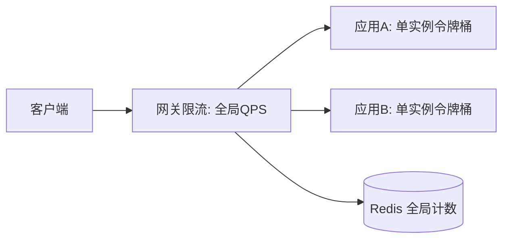

# Redis 实现限流

Redis 可以通过多种数据结构实现限流，常见的限流算法包括固定窗口限流、滑动窗口限流、令牌桶算法和漏桶算法。以下是这些算法的实现原理和基于 Redis 的实现方式。

## 1. 固定窗口限流

**原理**：将时间划分为固定大小的窗口（如每分钟），在每个窗口内限制请求次数。

**实现**：
- 使用 Redis 的 `INCR` 命令记录窗口内的请求次数。
- 使用 `EXPIRE` 命令设置窗口的过期时间。
- 如果请求次数超过阈值，拒绝请求。

**代码示例**：

```java
public boolean isAllowed(String key, int limit, int windowSeconds) {
    String redisKey = "rate_limit:" + key;
    Long count = redisTemplate.opsForValue().increment(redisKey);
    if (count == 1) {
        redisTemplate.expire(redisKey, windowSeconds, TimeUnit.SECONDS);
    }
    return count <= limit;
}
```

**缺点**：在窗口切换时可能出现流量突增。

## 2. 滑动窗口限流

**原理**：将时间划分为多个小窗口，统计当前时间窗口内的请求数量。

**实现**：
- 使用 Redis 的有序集合（ZSET）记录请求时间戳。
- 每次请求时移除过期的时间戳。
- 统计当前窗口内的请求数量。

**代码示例**：

```java
public boolean isAllowed(String key, int limit, int windowSeconds) {
    String redisKey = "rate_limit:" + key;
    long currentTime = Instant.now().getEpochSecond();
    long windowStart = currentTime - windowSeconds;

    redisTemplate.opsForZSet().add(redisKey, String.valueOf(currentTime), currentTime);
    redisTemplate.opsForZSet().removeRangeByScore(redisKey, 0, windowStart);
    Long count = redisTemplate.opsForZSet().zCard(redisKey);

    return count != null && count <= limit;
}
```

## 3. 令牌桶算法

**原理**：以固定速率向桶中添加令牌，请求需要消耗令牌，桶空时拒绝请求。

**实现**：
- 使用 Redis 的 Lua 脚本实现原子操作，确保线程安全。

**代码示例**：

```java
public boolean allowRequest(int tokensNeeded) {
    Object result = jedis.eval(LUA_SCRIPT, 1, REDIS_KEY, String.valueOf(tokensNeeded),
                               String.valueOf(capacity), String.valueOf(rate), String.valueOf(System.currentTimeMillis() / 1000));
    return (Long) result == 1;
}
```

## 4. 漏桶算法

**原理**：以固定速率处理请求，多余的请求被丢弃。

**实现**：
- 使用 Redis 的 Lua 脚本实现原子操作。

**代码示例**：

```java
public boolean allowRequest() {
    Object result = jedis.eval(LUA_SCRIPT, 1, REDIS_KEY, String.valueOf(System.currentTimeMillis() / 1000),
                               String.valueOf(capacity), String.valueOf(rate));
    return (Long) result == 1;
}
```

## 选择合适的限流算法

- **固定窗口限流**：适用于流量均匀的场景，实现简单，但可能在窗口切换时出现流量突增。
- **滑动窗口限流**：适用于对流量分布敏感的场景，能更平滑地控制请求频率。
- **令牌桶算法**：适用于需要精确控制速率且支持突发流量的场景。
- **漏桶算法**：适用于需要平滑处理请求的场景。

根据具体需求选择合适的限流算法，并结合 Redis 的数据结构实现高效的限流机制。

## 5. 令牌桶算法（完整 Lua 实现）

令牌桶允许突发：桶容量 `capacity`，令牌生成速率 `rate`/秒。下面用 Lua 脚本保证"计算+扣减"原子执行，避免并发竞态。

```lua
-- KEYS[1] 限流 key
-- ARGV[1] capacity  ARGV[2] rate(每秒)  ARGV[3] now(秒)  ARGV[4] requested(本次请求令牌数)
local key = KEYS[1]
local capacity = tonumber(ARGV[1])
local rate = tonumber(ARGV[2])
local now = tonumber(ARGV[3])
local requested = tonumber(ARGV[4])

local data = redis.call('HMGET', key, 'tokens', 'ts')
local tokens = tonumber(data[1])
local last = tonumber(data[2])
if tokens == nil then
  tokens = capacity
  last = now
end

local delta = math.min(capacity, (now - last) * rate)
tokens = math.min(capacity, tokens + delta)
local allowed = 0
if tokens >= requested then
  tokens = tokens - requested
  allowed = 1
end
redis.call('HMSET', key, 'tokens', tokens, 'ts', now)
redis.call('EXPIRE', key, math.ceil(capacity / rate) + 1)
return allowed
```

## 6. 漏桶算法（完整 Lua 实现）

漏桶平滑流出，超出容量直接拒绝：

```lua
-- KEYS[1] key  ARGV[1] capacity  ARGV[2] rate(每秒漏出)  ARGV[3] now  ARGV[4] 本次水量
local key = KEYS[1]
local capacity = tonumber(ARGV[1])
local rate = tonumber(ARGV[2])
local now = tonumber(ARGV[3])
local requested = tonumber(ARGV[4])

local data = redis.call('HMGET', key, 'water', 'ts')
local water = tonumber(data[1]) or 0
local last = tonumber(data[2]) or now

local leaked = math.min(water, (now - last) * rate)
water = water - leaked
local allowed = 0
if water + requested <= capacity then
  water = water + requested
  allowed = 1
end
redis.call('HMSET', key, 'water', water, 'ts', now)
redis.call('EXPIRE', key, math.ceil(capacity / rate) + 1)
return allowed
```

## 7. 滑动窗口计数（ZSET Lua 实现）

```lua
-- KEYS[1] key  ARGV[1] window(秒)  ARGV[2] limit  ARGV[3] now(毫秒)  ARGV[4] 唯一成员
local key = KEYS[1]
local window = tonumber(ARGV[1])
local limit = tonumber(ARGV[2])
local now = tonumber(ARGV[3])
local member = ARGV[4]

redis.call('ZREMRANGEBYSCORE', key, 0, now - window * 1000)
local count = redis.call('ZCARD', key)
local allowed = 0
if count < limit then
  redis.call('ZADD', key, now, member)
  allowed = 1
end
redis.call('PEXPIRE', key, window * 1000)
return allowed
```

## 8. 压测对比与选型建议

| 算法 | 平滑度 | 突发支持 | 存储开销 | Redis 命令 | 适用场景 |
|------|--------|----------|----------|-----------|----------|
| 固定窗口 | 差（临界突增） | 不支持 | 1 key | INCR | 简单计数 |
| 滑动窗口(ZSET) | 好 | 不支持 | 多（每请求1成员） | ZADD/ZCARD | 精准计数 |
| 令牌桶 | 中 | 支持 | 1 hash | Lua | API 限流、突发 |
| 漏桶 | 最好 | 不支持 | 1 hash | Lua | 流量整形、保护下游 |

> 压测要点：使用 `redis-benchmark` 或自研压测（如 1 万并发、持续 60s）。Lua 脚本在单线程内原子执行，QPS 可达 5w+，但长脚本会阻塞其他命令，需控制脚本复杂度。固定窗口因无脚本开销吞吐最高，但精度最低。

```bash
# 令牌桶压测示意（伪命令：-E eval 执行脚本）
redis-benchmark -n 100000 -c 100 -r 1000 \
  -E eval -s "$(cat token_bucket.lua)" 1 rl:api 100 10 "$(date +%s)" 1
```

## 九、分布式限流与网关限流配合

单实例限流无法约束集群总流量，需"网关层 + 应用层 + 全局"分层：



- **网关层（全局）**：Nginx/APISIX/Sentinel 按路由做集群总 QPS 限流，挡掉大部分超额流量。
- **应用层（单实例）**：本地令牌桶做精细化（如单用户、单接口），保护自身。
- **全局计数（Redis）**：跨实例共享的配额（如"全局 1 万 QPS"），用 Lua 原子扣减。
- **协作**：网关拦 90%，应用层拦突发，Redis 兜全局配额，三者阈值需叠加设计。

## 十、集群下限流精度问题

Redis Cluster 下 key 分布在多 slot，问题：
1. **跨 slot 原子性**：Lua 多 key 必须同 slot，否则 `CROSSSLOT` 报错 ⇒ 用 `hash tag`（如 `{rl}:api`）把相关 key 绑同一 slot。
2. **时间漂移**：多节点 `now` 不一致导致令牌计算偏差 ⇒ 在 Lua 内用 `redis.call('TIME')` 取服务端时间。
3. **单点压力**：热点限流 key 落在单节点 ⇒ 分片（按 uid hash 到 N 个 key）降低单节点压力，但精度变粗。

```lua
-- 用服务端时间避免客户端时钟漂移
local now = tonumber(redis.call('TIME')[1])
```

## 十一、自适应限流（基于负载）

固定阈值在流量形态变化时易误杀/漏放。自适应思路：
- **CPU/延迟驱动**：当系统 CPU > 70% 或 P99 > 阈值，自动下调令牌速率（如 ×0.8）。
- **BBR 拥塞控制思路**：Google SRE 的"客户端限制 + 服务端限制"采集延迟与吞吐，估算最优 QPS。
- **Sentinel 系统保护**：基于 `Load/RT/线程数/入口QPS` 自动降级，无需手动配阈值。

## 十二、压测数据对比（参考量级）

| 方案 | 单节点 QPS | 精度 | 备注 |
|------|-----------|------|------|
| 固定窗口 INCR | ~10w | 低（临界突增） | 最简单 |
| 滑动窗口 ZSET | ~3w | 高 | 每请求占成员，内存高 |
| 令牌桶 Lua | ~5w | 中 | 原子好，脚本稍长 |
| 网关层(Sentinel) | ~20w | 中 | 旁路统计 |

> 注：上述为参考量级，实际取决于 key 分布、脚本复杂度与实例规格。Lua 越长越阻塞单线程，建议脚本 < 100 行且避免 `KEYS *` 类操作。

## 十三、与 Sentinel 限流整合

Sentinel 提供：
- **流控规则**：QPS/线程数、直接/关联/链路、快速失败/WarmUp/排队等待。
- **热点参数限流**：对 `userId` 等参数维度限流，底层即参数级令牌桶。
- **系统保护**：自适应（见上）。
- **与 Redis 配合**：Sentinel 做进程内/集群流控，Redis 做"跨服务共享配额"（如全局发券限额）。二者互补。

```java
// Sentinel 资源埋点
try (Entry entry = SphU.entry("createOrder")) {
    orderService.create();
} catch (BlockException e) {
    // 被限流，返回 429 / 降级响应
}
```

## 十四、踩坑与权衡（深入）

- **限流粒度**：太粗（全局）易误伤正常请求；太细（每用户）key 爆炸。按"路由 + 关键参数"折中。
- **拒绝策略**：限流后返回 429 + `Retry-After`，前端做退避，而非静默丢弃。
- **压测要带限流**：全链路压测需开启限流，否则测的是"无保护峰值"，与真实不符。

## 十五、限流 vs 熔断 & 返回规范

### 限流与熔断的区别
| 概念 | 触发 | 目的 | 实现 |
|------|------|------|------|
| 限流 | 超过配额 | 保护自身不被打垮 | 令牌桶/计数器 |
| 熔断 | 下游错误率/RT 超阈值 | 快速失败避免雪崩 | 半开探测 |
| 降级 | 资源不足 | 保核心弃边缘 | 返回兜底 |

三者常组合：限流挡总量，熔断挡依赖故障，降级兜体验。

### 返回规范
- HTTP `429 Too Many Requests` + `Retry-After: 2`（秒）。
- 响应体带 `code=RateLimitExceeded` 与 `request_id` 便于排查。
- 客户端：指数退避 + 抖动重试，不立即暴力重试。
- 网关层统一返回，避免各服务各自实现导致语义不一致。

### 配额计算示例
目标保护 QPS=1 万，单实例令牌桶 capacity=2000，rate=2000/s；N 实例总 capacity = 2000×N，需 ≥ 1 万 ⇒ N ≥ 5。再叠加 20% 余量 ⇒ 6 实例。
