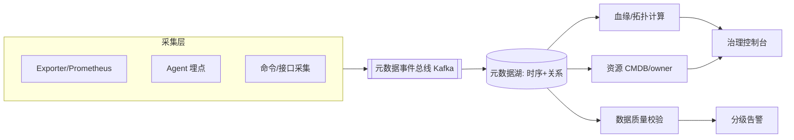

# 各中间件基本的数据

> 以下内容为笔记截图，保留原图便于查阅，未做文字转录。


## 二、什么是中间件基础数据

中间件基础数据（又称"中间件元数据 / 黄金指标"）是指**用于描述各类中间件（Redis、Kafka、MySQL、ES、MQ 等）自身运行状态与资源水位的核心指标数据**。它区别于业务数据，是稳定性保障、容量规划与故障定位的"地基"。

- **作用对象**：CPU/内存/连接/队列/慢查询等运行时状态。
- **消费方**：监控告警、容量评估、根因分析、自动扩缩容。

## 三、常见中间件基础数据清单

| 中间件 | 核心基础数据 | 说明 |
|--------|--------------|------|
| Redis | 内存占用、命中率、连接数、ops/sec、键数量、淘汰次数 | 反映缓存健康度 |
| Kafka | 分区堆积量、消费 Lag、生产/消费 TPS、ISR 收缩、副本落后 | 反映消息管道阻塞 |
| MySQL | QPS/TPS、慢查询数、连接数、Buffer Pool 命中率、主从延迟 | 反映数据库瓶颈 |
| ES | 集群健康状态、索引写入/查询速率、JVM GC、分片未分配数 | 反映检索集群状态 |
| RocketMQ | 消息堆积、消费 TPS、broker 磁盘使用率 | 反映投递能力 |
| Nginx | 活跃连接、QPS、5xx/4xx 比例、上游响应时间 | 反映接入层质量 |

## 四、采集方式

1. **Exporter + Prometheus**：Redis（redis_exporter）、MySQL（mysqld_exporter）、Kafka（kafka_exporter）暴露 `/metrics`，Prometheus 拉取。
2. **Agent 埋点**：在客户端/SDK 侧埋点上报（如 Redis 连接池监控）。
3. **命令/接口采集**：定时执行 `INFO`、`SHOW STATUS` 等命令解析。

```bash
# 示例：采集 Redis 基础数据
redis-cli INFO memory | grep -E "used_memory_human|mem_fragmentation_ratio"
redis-cli INFO stats  | grep -E "instantaneous_ops_per_sec|keyspace_hits|keyspace_misses"
```

## 五、治理要点

- **统一指标规范**：命名、单位、标签（cluster/role/instance）标准化，避免"同名不同义"。
- **分级存储**：高频明细短期留存（如 15 天），聚合指标长期留存用于趋势分析。
- **基线化**：建立容量基线（如内存周同比），偏离基线即预警。
- **数据质量**：采集失败、缺失、跳变要被监控，防止"假健康"。
- **成本治理**：仅保留有 SLO 价值的指标，避免指标爆炸带来的存储与计算开销。

## 六、踩坑与权衡
- **采样与精度**：全量采集开销大，需权衡采样率；关键指标（堆积、慢查）应全量。
- **标签爆炸（cardinality）**：高基数标签（如 user_id）会让 Prometheus 崩溃，需收敛。
- **告警疲劳**：基础数据过多易误报告警，应基于 SLO 设阈值而非拍脑袋。

## 七、元数据治理平台架构

当中间件规模达到数百集群、上千实例时，零散的 Exporter 采集不足以支撑"统一治理"，需要建设**中间件元数据治理平台**。其定位是：把"每个中间件的运行时指标 + 拓扑关系 + 配置 + owner"收敛到一个平台，支撑容量、巡检、血缘与自愈。



- **采集层**：复用 Exporter 拉取 + Agent 补充（如客户端连接池、慢调用）。
- **总线**：元数据变更以事件形式入 Kafka，避免对采集端直连。
- **存储**：时序指标落 Prometheus/Thanos；拓扑/配置/owner 落图数据库（Neo4j）或关系表。
- **计算**：定时任务跑拓扑发现（谁依赖哪个 Redis 集群）、质量校验。

### 采集与血缘

- **自动拓扑**：通过客户端上报的 `cluster → app → instance` 三元组，构建"应用 ↔ 中间件"调用图，用于故障影响面分析（某 Redis 故障影响哪些业务）。
- **血缘**：配置变更、扩容、主从切换事件接入，形成"变更 → 指标异常"的因果链，辅助复盘。
- **标签体系**：统一 `env / cluster / role / app / owner / SLO` 标签，作为聚合与告警维度。

### 质量校验

| 校验项 | 规则 | 处理 |
|--------|------|------|
| 采集缺失 | 5 分钟无新数据点 | 标记采集异常，通知 owner |
| 跳变 | 单指标环比 > 300% | 触发复核，排除误报 |
| 基线偏离 | 偏离周同比 > 2σ | 预警（容量/异常） |
| 标签缺失 | 实例无 owner/无 SLO | 治理工单 |

## 八、与配置中心的关系

元数据（运行时状态）与**配置中心**（预期状态）是"事实 vs 期望"的两面：

| 维度 | 元数据/监控 | 配置中心（如 Nacos/Apollo） |
|------|-------------|------------------------------|
| 内容 | 当前内存、连接、Lag 等运行时值 | 连接数上限、TTL、副本数等预期值 |
| 时效 | 实时/秒级 | 变更触发 |
| 用途 | 发现异常、容量 | 下发与变更 |

二者联动：配置中心下发"maxmemory=8G"，元数据平台监控"used_memory"逼近该值即预警——这就是"预期 vs 实际"的闭环。建议把关键配置项镜像到元数据平台做一致性校验。

## 九、落地案例：Redis 集群容量治理

某业务 Redis 集群 200+ 实例，治理平台落地后：

1. **自动巡检**：每日扫描 `mem_fragmentation_ratio>1.5`、`connected_clients>80% maxclients`、`evicted_keys>0` 等风险项，生成工单。
2. **容量预测**：基于 `used_memory` 周同比斜率，提前 7 天预测触顶，主动扩容。
3. **影响面**：某集群故障，平台 10s 内列出受影响 app 清单，加速止损。
4. **成本回收**：识别 30 天 0 访问的"僵尸实例" 40+，下线节约成本。

## 十、踩坑与权衡（深入）

- **指标爆炸**：默认采集所有 Redis 命令耗时会导致基数爆炸，应按"命令分组 + 采样"收敛。
- **时序库选型**：VictoriaMetrics / Thanos / M3 各有取舍，长周期高基数场景优先列式压缩。
- **元数据也需要 SLO**：治理平台自身不可用不应导致业务告警丢失，需独立高可用。
- **告警收敛**：同一根因引发的多指标告警需做"告警抑制/聚合"，否则值班被淹没。

## 十一、Prometheus 采集配置与告警规则（可直接用）

**redis_exporter 抓取配置**：
```yaml
scrape_configs:
  - job_name: redis
    static_configs:
      - targets: ['redis-01:9121','redis-02:9121']
    relabel_configs:
      - source_labels: [__address__]
        target_label: instance
```

**关键告警规则**：
```yaml
groups:
  - name: redis.rules
    rules:
      - alert: RedisMemoryHigh
        expr: redis_memory_used_bytes / redis_memory_max_bytes > 0.85
        for: 5m
        labels: {severity: warning}
        annotations: {summary: "Redis 内存使用 > 85%"}
      - alert: RedisEvicting
        expr: increase(redis_evicted_keys_total[5m]) > 0
        for: 2m
        labels: {severity: critical}
      - alert: RedisNoSLO
        expr: absent(redis_up{instance=~".+"})
        for: 10m
        labels: {severity: critical}
```

- **Kafka Lag 告警**：`kafka_consumergroup_lag > 100000` 持续 5m 告警，区分"消费慢"与"生产突增"。
- **MySQL 连接数**：`mysql_global_status_threads_connected / mysql_global_variables_max_connections > 0.8` 预警。
- **ES 未分配分片**：`elasticsearch_cluster_health_unassigned_shards > 0` 告警。

### 治理闭环
采集 → 指标 → 告警 → 工单 → 处理 → 复盘，每个告警都应能回溯到"SLO 影响"，否则下掉。

## 十二、元数据类型分级（治理优先级）

不同中间件的"基础数据"重要性不同，按 SLO 影响分级治理：

| 级别 | 中间件/指标 | 采集要求 | 告警要求 |
|------|-------------|----------|----------|
| P0 | MySQL 主从延迟、Redis 内存/命中率 | 全量 5s | 实时电话 |
| P1 | Kafka Lag、ES 健康 | 全量 15s | 告警通知 |
| P2 | Nginx 4xx、连接数 | 采样 30s | 周报 |
| P3 | 低频内部工具指标 | 可选 | 不告警 |

分级后，P0/P1 重点保障，P2/P3 收敛成本；新中间件接入需先定级再接采集。
