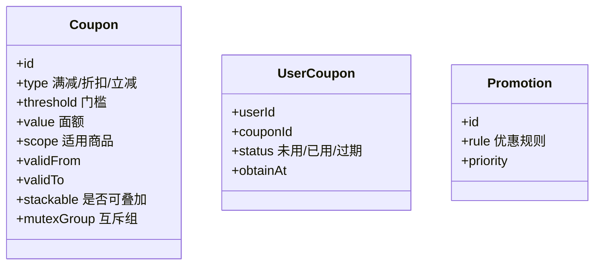

# 优惠券与促销引擎设计实战

> 优惠券与促销是电商、本地生活等业务的转化核心，也是规则最复杂的系统之一：满减、折扣、叠加、互斥、门槛、时效、库存，任一处理不当都会引发资损或客诉。

## 1. 业务模型



## 2. 优惠类型

| 类型 | 说明 | 计算 |
| --- | --- | --- |
| 满减券 | 满 X 减 Y | 订单≥X 则减 Y |
| 折扣券 | 打 N 折 | 金额 × N/10 |
| 立减券 | 无门槛减 Y | 直接减 Y |
| 运费券 | 免/减运费 | 减运费部分 |
| 组合促销 | 满赠/第二件半价 | 按规则匹配 |

## 3. 规则引擎设计

核心是把"优惠计算"从硬编码变成**可配置规则**，支持运营自助配置：

```python
class Rule:
    def match(self, order) -> bool: ...
    def apply(self, order) -> float: ...

def calc_best(order, coupons):
    candidates = [c for c in coupons if c.match(order)]
    # 处理互斥组：同组只能选一个
    best = choose_max_saving(order, candidates)
    return best
```

- **优先级**：平台券 < 店铺券 < 商品券，或反之，需明确顺序。
- **叠加/互斥**：同互斥组不可叠加；可叠加券需上限控制防资损。

## 4. 领券与库存

- **库存扣减**：Redis 原子 `DECR` 扣库存，防超发；库存为 0 即止。
- **幂等领取**：用户重复点击只发一张，用 `userId+couponId` 唯一约束。
- **防刷领取**：限制单用户领取上限、设备指纹、行为风控。

```redis
-- 扣库存
local stock = redis.call('GET', KEYS[1])
if tonumber(stock) > 0 then
  redis.call('DECR', KEYS[1])
  return 1
end
return 0
```

## 5. 核销与幂等

- **下单核销**：创建订单时锁定用券，防止一券多用。
- **失败回滚**：订单取消/支付失败，券状态回退为可用。
- **幂等**：用券记录带唯一流水号，重复请求不重复核销。

## 6. 资损防控

| 风险 | 防控 |
| --- | --- |
| 优惠叠加超限 | 叠加上限 + 互斥组校验 |
| 门槛绕过 | 服务端重算，不信任前端 |
| 时间穿越 | 校验券有效期（服务端时间） |
| 库存超发 | 原子扣减 + 对账 |
| 计算错误 | 双写校验 + 金额对账 |

> 黄金法则：**优惠金额永远由服务端重算**，前端只传"用了哪些券"。

## 7. 性能与一致性

- 券模板配置放缓存，变更走广播刷新。
- 用户券列表按 `userId` 分片。
- 大促前预热库存到 Redis，避免 DB 压力。

## 8. 常见坑

| 坑 | 现象 | 对策 |
| --- | --- | --- |
| 前端算价被篡改 | 用户少付 | 服务端重算 |
| 券超发 | 库存变负 | 原子扣减 |
| 一券多用 | 资损 | 核销幂等+锁定 |
| 互斥失效 | 叠加过多 | 互斥组强校验 |
| 时区错误 | 提前/延后用券 | 统一服务端时间 |

## 9. 面试题

1. 优惠计算为什么必须服务端重算？
2. 优惠券库存如何防止超发？
3. 叠加与互斥如何实现？
4. 订单取消后优惠券如何回滚？
5. 大促下券系统如何抗住高并发？

## 10. 小结

优惠券系统 = 规则引擎 + 库存扣减 + 核销幂等 + 资损防控。规则要可配置但边界要硬校验，所有金额以服务端为准，并用对账兜底。
