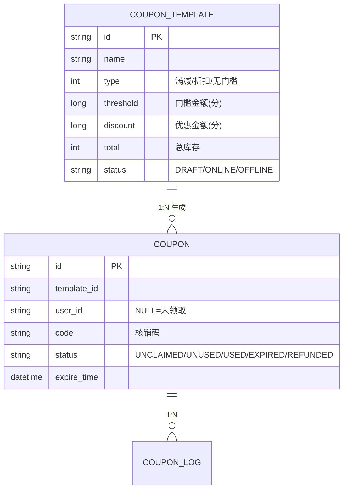
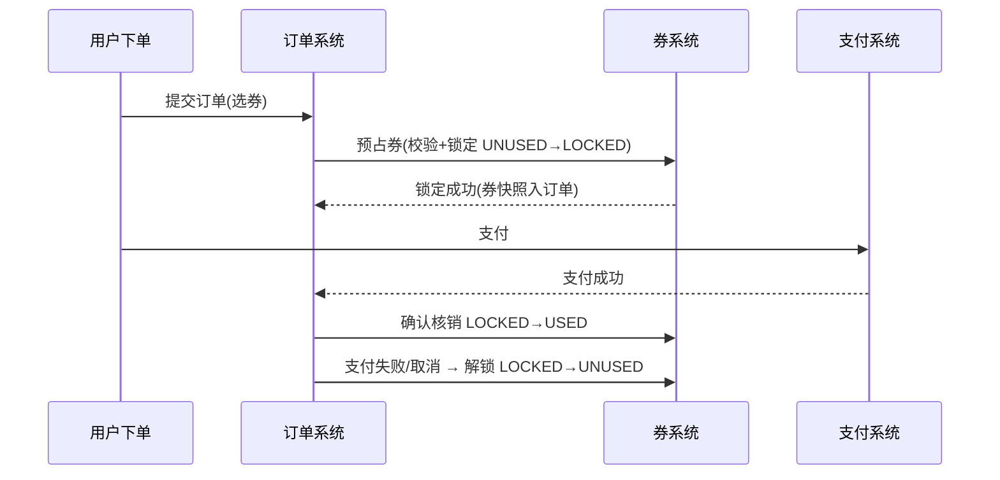

# 优惠券系统设计

## 〇、本体介绍

**优惠券系统**：券的"模板 → 发放 → 领取 → 核销 → 对账"全生命周期。它融合了**库存扣减（防超发）、幂等（防重复领取/核销）、高并发写热点（秒杀券）、状态机（券生命周期）**四大经典问题，是营销域的核心系统，也常作为系统设计面试题。

**核心矛盾**：
1. 券库存有限，**不能超发**，但领取瞬间 QPS 极高（秒杀券）；
2. 用户**不能重复领取**同一张券，核销**不能重复使用**；
3. 券与订单/支付联动，**状态流转必须严谨**（资损风险）。

**核心主线**：领域模型 → 发券方式 → 库存控制 → 领取防重 → 核销状态机 → 对账补偿。

---

## 一、领域模型



| 概念 | 说明 |
|------|------|
| **券模板** | 发券规则（面额/门槛/有效期/总量），不可变 |
| **券实例** | 具体一张券（绑定用户、有状态、有核销码） |
| **券码（code）** | 核销凭证：券 ID 编码 / 预生成码池 |
| **状态机** | 未领取 → 未使用 → 已使用 / 已过期；未使用 → 已退款 |

---

## 二、发券方式

| 方式 | 流程 | 特点 |
|------|------|------|
| **主动领取**（页面/弹窗） | 用户点"领取" | 高并发热点，需库存控制 |
| **定向发放**（营销名单） | 系统/批量任务直发到账户 | 无并发，注意幂等 |
| **券码兑换**（卡密） | 预生成码池，兑换码换券 | 线下/合作渠道 |
| **购买/秒杀券** | 限量抢购 | 最强热点，独立资源池 |

**券码池化**（卡密/兑换券）：
- 预生成 N 个不重复券码（编码校验位防伪造）→ 库存=码池剩余；
- 兑换时原子 POP 码池（见「[抢红包系统设计](抢红包系统设计.md)」同款 Lua 思路）；
- 码池分批补充，兑换日志留痕。

---

## 三、库存控制与防超发（核心）

### 3.1 领取原子操作（Lua）

```lua
-- KEYS[1]=库存  KEYS[2]=用户已领Set  ARGV[1]=userId  ARGV[2]=limit
if redis.call("SISMEMBER", KEYS[2], ARGV[1]) == 1 then
    return -1   -- 已领过
end
if tonumber(redis.call("GET", KEYS[1])) <= 0 then
    return -2   -- 库存不足
end
redis.call("DECR", KEYS[1])
redis.call("SADD", KEYS[2], ARGV[1])
return 1
```

- **防超发**：DECR 前判断 >0（或 DECR 后 <0 回滚），Redis 单线程保证原子。
- **防重复领取**：用户维度 Set 判重（一人限领 N 张：Set 长度判断）。
- **DB 异步**：领取成功 → MQ → 券实例落库（Redis 是权威计数，DB 最终一致）。

### 3.2 方案对比

| 方案 | 防超发 | 并发能力 | 复杂度 |
|------|--------|----------|--------|
| DB `UPDATE ... SET stock=stock-1 WHERE stock>0` | ✅ 行锁原子 | 单行热点，秒杀场景瓶颈 | 低 |
| **Redis DECR + Lua** | ✅ | 10 万+ QPS | 中（主流） |
| 预生成码池 POP | ✅ 天然 | 高 | 中（仅卡密类） |
| MQ 排队发放 | ✅ 串行 | 吞吐受限 | 中（秒杀削峰用） |

> 生产组合：**秒杀券 = Redis 预扣 + MQ 异步落库 + DB 行锁兜底**（Redis 挂了降级 DB 条件更新）。

---

## 四、核销与状态机（资损控制）

### 4.1 核销流程



### 4.2 关键机制

- **两阶段（预占→核销）**：下单锁定、支付后核销；失败解锁——避免"券用了但订单没支付"。
- **状态机严格迁移**：`UNUSED → LOCKED → USED`；非法迁移直接拒绝。
- **幂等**：核销接口用订单号/券码幂等（重复回调不重复核销）；退款是 `USED → REFUNDED`，**只退一次**。
- **过期**：定时任务批量 `UNUSED → EXPIRED`（见「[延迟任务与订单超时关闭](延迟任务与订单超时关闭.md)」）；过期券前端隐藏。
- **对账**：`已领取 == 已用 + 未用 + 已过期 + 已退`；券面额 × 数量与财务账核对（资损零容忍，见「[SRE与稳定性工程/06-日志与告警规则库](../SRE与稳定性工程/06-日志与告警规则库.md)」）。

---

## 五、与订单/支付的联动细节

- **券快照**：下单时把券的**面额/规则快照**存入订单（券改了不影响历史订单）。
- **金额计算**：优惠金额 = min(券面额, 实付门槛校验)；**优惠不能为负**、满减券校验门槛。
- **分布式事务**：下单锁定券与创建订单是跨系统动作 → 用**本地消息表/事务消息**保证最终一致（见「[中间件/分布式事务Seata](../基础知识/中间件/分布式事务Seata.md)」）。
- **并发抢券下单**：券与商品库存双扣，按"先锁券再锁库存"统一顺序防死锁。

---

## 六、防刷与风控

- **领取频率限制**：账号/设备/IP 维度限流（见「[Redis 实现限流](redis实现限流.md)」）。
- **黑产识别**：设备指纹、异常时段批量领取检测；券码防伪（校验位 + 领换码一次）。
- **领取渠道管控**：秒杀券独立资源池 + 验证码/答题门槛（流量削峰）。

---

## 七、与其他板块的关系

- **抢红包系统设计**：同款"预扣 + Lua + 异步落库"高并发资源发放。
- **Redis 实现限流 / 幂等设计**：防刷与重复领取/核销。
- **延迟任务与订单超时关闭**：过期/解锁的定时处理。
- **抖音支付发券实践**：十万级 TPS 发券的工程落地案例。
- **中间件/分布式事务 Seata**：锁券与订单的跨系统一致。
- **业务模型/电商**：营销域在业务全景中的位置。

---

## 八、速查表

| 主题 | 一句话 |
|------|--------|
| 模型 | 模板（规则）→ 券实例（状态）→ 券码 |
| 发券 | 领取/定向/码池；秒杀独立池 |
| 防超发 | Redis Lua DECR 判断 + DB 条件更新兜底 |
| 防重领 | 用户 Set 判重 |
| 核销 | 预占→核销两阶段，失败解锁 |
| 幂等 | 订单号/券码幂等核销；退款一次 |
| 对账 | 领取=用+未用+过期+退；面额对财务 |
| 防刷 | 频率限流 + 设备指纹 + 码校验位 |

---

## 面试高频问题（15+ 条）

1. **优惠券系统核心难点？** 防超发、防重领、核销状态机、与订单支付联动、对账。
2. **券库存怎么防超发？** Redis Lua：GET≤0 判断 + DECR 原子；DB UPDATE stock>0 兜底。
3. **怎么防止同一用户重复领？** 用户已领 Set + SISMEMBER 原子判重。
4. **秒杀券和普通券有什么不同？** 秒杀是强热点，独立资源池 + 预扣 + 异步落库 + 入口削峰。
5. **预生成券码池怎么做？** 预生成不重复码（带校验位），POP 原子兑换，日志留痕。
6. **核销为什么要两阶段？** 下单锁定、支付核销；防"券用了但订单没支付"。
7. **核销怎么幂等？** 订单号/券码维度去重，重复回调不重复核销。
8. **退款怎么处理？** USED→REFUNDED 状态迁移，只退一次，对账兜底。
9. **券过期怎么办？** 定时批量状态迁移 + 前端隐藏；延迟任务体系处理。
10. **下单时券和订单怎么保证一致？** 事务消息/本地消息表最终一致；按固定顺序加锁防死锁。
11. **为什么订单要存券快照？** 券规则后续变更不影响历史订单。
12. **怎么防止黑产刷券？** 频率限流、设备指纹、券码校验位、验证码门槛。
13. **Redis 挂了怎么发券？** 降级 DB 条件更新（UPDATE stock=stock-1 WHERE stock>0），吞吐下降但不超发。
14. **对账怎么对？** 领取总数 = 各状态之和；券面额与财务核销额核对。
15. **优惠金额怎么算？** 门槛校验 + min(面额, 可优惠额)，金额用分，不得为负。
