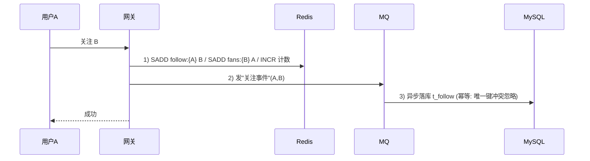

# 关注关系与粉丝系统设计

## 〇、本体介绍

**关注/粉丝系统**：社交产品的基础关系层——`A 关注 B`，则 A 的"关注列表"含 B，B 的"粉丝列表"含 A。它是**读多写多、双向派生、分页查询高频**的经典场景（微博/Twitter 级别：亿级用户、单大 V 千万粉丝）。

**核心矛盾**：
1. **双向派生**：一次关注操作，要同时反映在关注列表、粉丝列表、双向关注、计数四处；
2. **大 V 粉丝列表**：千万级数据的写入与分页；
3. **判断关系（互关？已关注？）**是高频小查询，不能每次都查库；
4. 关注列表/粉丝列表的**顺序与分页**（按时间倒序）要求稳定索引。

**核心主线**：关系建模 → 存储（DB+Redis）→ 关注/取关流程 → 列表与计数 → 一致性。

---

## 一、关系建模

### 1.1 关系表（MySQL 为主存储）

```sql
CREATE TABLE t_follow (
    id          BIGINT PRIMARY KEY AUTO_INCREMENT,
    follower_id BIGINT NOT NULL,   -- 关注者
    followee_id BIGINT NOT NULL,   -- 被关注者
    status      TINYINT NOT NULL DEFAULT 1, -- 1关注 0取关（软删保留轨迹）
    created_at  DATETIME NOT NULL,
    UNIQUE KEY uk_rel (follower_id, followee_id)
) COMMENT '关注关系';
```

- **唯一键 `(follower_id, followee_id)`**：同一对关系只有一行（幂等基础）。
- **取关用软删（status=0）而非物理删**：可恢复、可统计"取关率"、避免主键膨胀重建。
- 需要反查场景（B 的粉丝列表 = `followee_id = B` 的行）：按 `followee_id` 建索引，或直接分表——见 1.3。

### 1.2 双向关注（互关）怎么表达

- 不需要单独字段：`查互关 = 查 A 关注 B 且 B 关注 A`（两次存在性判断）。
- 需要**互关列表**时，Redis 侧维护"双向关注集合"（见第二节）。

### 1.3 规模路由

| 规模 | 方案 |
|------|------|
| 百万级 | 单表 + `(followee_id, created_at)` 索引 |
| 亿级 | 按关系方向分表：`t_follow_uid`（按 follower_id）与 `t_follow_uid_fan`（按 followee_id）两套冗余表，各自天然支持对应方向的分页 |
| 超大规模 | 双表 + 按 uid 分库分表（见「[分库分表与数据迁移总览](../分库分表与数据迁移/分库分表与数据迁移总览.md)」） |

> 口诀：**"一对关系一行，唯一键幂等；列表按方向存，互关靠双向查。"**

---

## 二、Redis 存储（读侧加速）

关系读写比高（读多写少），Redis 承载**读侧全部热点**（参考微博关系服务的做法：Redis hash + set 组合）：

| 结构 | key | 值 | 用途 |
|------|-----|-----|------|
| 关注列表 | `follow:{uid}` | Set 或 ZSet（score=关注时间） | 我的关注列表 |
| 粉丝列表 | `fans:{uid}` | Set / ZSet | 我的粉丝列表 |
| 互关列表 | `both:{uid}` | Set | 我关注且关注我的 |
| 计数 | `cnt:follow:{uid}` / `cnt:fans:{uid}` | Int | 关注数/粉丝数 |

- **ZSet vs Set**：需要按时间排序展示 → ZSet（score=关注时间戳）；只判存在 → Set。
- **大 V 粉丝**：`fans:{大V}` 可能千万级 → **不分页全量缓存，粉丝列表走 DB 分页，Redis 只存计数与近期粉丝**（热点保护）。
- 大 V 的 `follow:{uid}`（大 V 关注了谁）很小，正常缓存。

### 判断关系（高频小查询）

```
A 是否关注 B:  EXISTS follow:{A} 中 B     （SISMEMBER）
是否互关:     SISMEMBER follow:{A} B && SISMEMBER follow:{B} A
批量判断（Feed 里每条内容是否已关注作者）:  用 SMEMBERS 拉取 A 的关注集合做内存判断（一次内存比较替代 N 次 Redis 调用）
```

---

## 三、关注/取关流程



1. **Redis 先行**：关注/取关实时更新 Redis（用户看到立即生效）。
2. **DB 异步落库**：MQ 消费写 `t_follow`，唯一键冲突即幂等跳过（重复事件安全）。
3. **互关集合**：`SADD both:{A} B / both:{B} A` 在事件处理里判断后维护（若 B 已关注 A，则加互关）。
4. **取关**：SREM 两集合 + 计数 DECR + 写 status=0。
5. **失败补偿**：Redis 更新成功但落库失败 → 重试；Redis 与 DB 以 DB 为权威，定期**全量对账重放**（见第五节）。

---

## 四、列表与计数

| 查询 | 方案 |
|------|------|
| 我的关注列表（分页） | Redis ZSet 按 score 分页（缓存热数据）；冷数据/大列表 DB 分页 |
| 某大 V 的粉丝列表（分页） | DB：`WHERE followee_id=? ORDER BY created_at DESC LIMIT`（走 followee_id 索引） |
| 关注数/粉丝数 | Redis 计数（权威展示）+ DB 定期回填（防丢失） |
| 用户主页"已关注/互关"状态 | Redis 存在性判断 + 批量集合拉取 |

- **粉丝列表顺序**：按关注时间倒序（"最新关注"）——`created_at` 索引天然支持；老牌产品多采用"最近活跃/时间"排序。

---

## 五、一致性：Redis 与 DB 对账

1. 计数对账：每日统计 DB 各用户关系数，与 Redis 计数比对，差异回填修正（借鉴账务对账思想，见「[钱包与账务系统设计](钱包与账务系统设计：账户、流水与日终对账.md)」）。
2. 关系对账：抽样/全量比对 Redis 集合与 DB 关系表，Redis 以 DB 为准重建。
3. 丢失场景：Redis 被清空/崩溃 → 从 DB 冷加载重建缓存（按 uid 分片渐进式重建，防缓存击穿）。
4. 告警与修复规则见「[SRE与稳定性工程/06-日志与告警规则库](../SRE与稳定性工程/06-日志与告警规则库.md)」。

---

## 六、与其他板块的关系

- **Feed 信息流设计**：关注列表是 Feed 拉取（关注池）的数据源；"是否关注"批量判断是 Feed 渲染的常见开销点。
- **Redis 实现限流**：关注/取关是高操作频次接口，需限流与防刷（关注轰炸）。
- **分布式锁 / 幂等设计**：异步落库的幂等（唯一键）与重试。
- **排行榜与实时统计**：粉丝数变化是涨粉榜等榜单的数据源。
- **分库分表**：亿级关系数据的双表冗余与分片方案。

---

## 七、速查表

| 主题 | 一句话 |
|------|--------|
| 建模 | t_follow 一对一行，唯一键 (follower, followee) |
| 方向 | 关注列表按 follower，粉丝列表按 followee（双表冗余） |
| 取关 | 软删 status=0，保留轨迹 |
| Redis | follow/fans/both 三集合 + 计数；ZSet 按时间排序 |
| 判断 | SISMEMBER；批量用 SMEMBERS 内存判断 |
| 大 V | 粉丝列表 DB 分页，Redis 只存计数+近期 |
| 一致性 | DB 权威，Redis 先行，事件落库，每日对账 |

---

## 面试高频问题（12+ 条）

1. **关注关系表怎么设计？** `t_follow(follower_id, followee_id, status, created_at)`，唯一键防重复。
2. **粉丝列表和关注列表为什么反着查很慢？** 单表只有一个方向的主索引；双表冗余（按 follower / followee 各建一表）各查各的。
3. **怎么判断 A、B 是否互关？** 两次存在性判断（A→B 且 B→A）；互关集合 Redis 维护。
4. **取关要不要删行？** 不要，软删（status=0），可恢复可统计。
5. **Redis 怎么存关系？** follow/fans/both 三个集合（Set 判存在 / ZSet 排序）+ 计数。
6. **大 V 的千万粉丝怎么处理？** 粉丝列表不整体缓存，DB 分页；Redis 只存计数和近期粉丝；缓存重建分片渐进。
7. **关注操作先写 Redis 还是 DB？** Redis 先行（体验实时）+ 事件异步落库（DB 权威、幂等）。
8. **落库失败怎么办？** 唯一键幂等 + 重试队列 + 每日对账重放。
9. **批量判断"是否已关注"怎么做？** 拉取关注集合一次 SMEMBERS，内存集合判断，避免 N 次网络请求。
10. **Redis 丢了怎么办？** DB 权威，从 DB 冷加载重建；计数每日对账回填。
11. **怎么防关注轰炸/刷粉？** 入口限流 + 频控 + 异常行为风控。
12. **关注数实时吗？** Redis 计数实时展示，DB 每日回填，对账纠偏。

---

> 配套：关注池与内容流 →「[Feed 信息流设计](Feed信息流设计.md)」；涨粉/热榜 →「[排行榜与实时统计](排行榜与实时统计.md)」。
