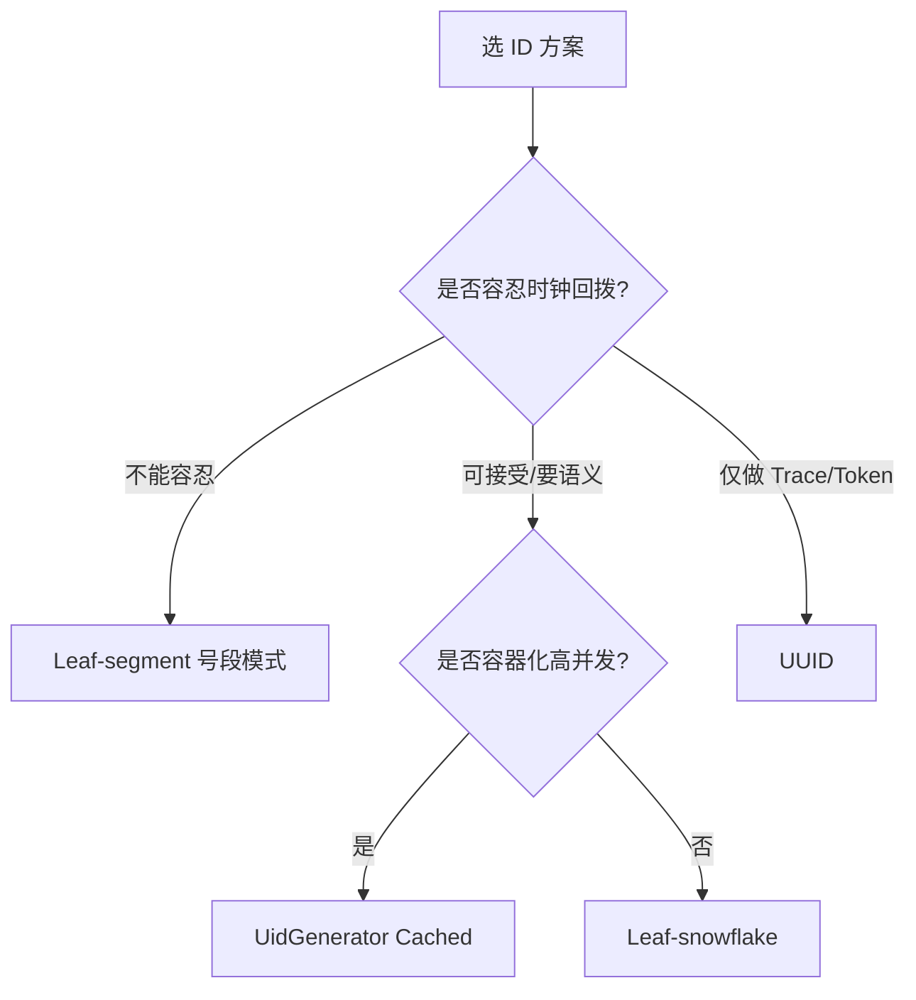

# 分布式 ID 生成

> 分布式 ID 是分库分表、微服务、消息追踪的"身份证"。一个糟糕的 ID 方案会在高并发下暴露重复、性能瓶颈与时钟回拨三大坑。

在单体架构里，数据库自增主键就能满足唯一性；但一旦进入**分库分表、微服务集群、分布式存储**场景，自增主键既无法跨节点保证全局唯一，又因无序写入导致 InnoDB 页分裂、性能塌方。于是需要独立的分布式 ID 生成体系。

## 一、ID 设计准则（行业黄金标准）

| 准则 | 说明 | 优先级 |
|------|------|--------|
| 全局唯一 | 全生命周期、全集群绝对不重复 | 最高（基础要求） |
| 趋势递增 | 适配 B+Tree 索引，减少页分裂、提升写入性能 | 高 |
| 高性能 | 低延迟、高吞吐，单实例万级 QPS，核心链路无 IO 阻塞 | 高 |
| 高可用 | 无单点、可水平扩展、具备容灾降级 | 高 |
| 信息安全 | 不可被恶意遍历，避免泄露业务量级、时间 | 中（订单/金融敏感） |
| 易用/可扩展 | 接入成本低、位数结构可定制、支持扩缩容 | 中 |

> 口诀：**"唯一是底线，递增护索引，高可用兜底，安全看场景。"**

## 二、主流方案全景

### 1. UUID
```
标准式：8-4-4-4-12 共 36 字符，如 550e8400-e29b-41d4-a716-446655440000
```
- **优点**：本地生成，零网络开销，性能极高。
- **缺点**：128 位太长，作为 MySQL 主键会导致二级索引膨胀（InnoDB 二级索引携带主键）；无序性引发数据位置频繁移动，写入性能差；基于 MAC 生成可能泄露机器信息。
- **结论**：仅适合做幂等 Token、traceId 等**非主键**场景，不推荐做数据库主键。

### 2. 数据库自增 / 号段（基础版）
- 原生自增：强依赖 DB，主从切换可能重复发号，性能受单库限制。
- Flickr Ticket Server：多机设置 `auto_increment_increment = N` + 不同 `offset`，每台发不同奇偶序列，缓解单点。缺点：水平扩容极复杂，ID 仅趋势递增。

### 3. Snowflake（雪花算法）⭐
Twitter 开源的纯内存方案，用 64 位 Long 结构化拼接：


- **结构**：`1bit 符号位(0)` + `41bit 时间戳(可用 69 年)` + `10bit workerId(1024 节点)` + `12bit 序列号(每毫秒 4096 个)`。
- **优点**：纯内存、无 IO、理论峰值 **409.6 万 QPS**；高位是时间，整体趋势递增，对索引友好；位结构可定制。
- **致命缺陷**：**强依赖机器时钟**，时钟回拨会导致 ID 重复；workerId 需手动分配，容器化易冲突。

### 4. 美团 Leaf（工业级双模式）⭐⭐
名字取自莱布尼茨"世界上没有两片相同的树叶"，同时提供两种模式，是**国内生产环境最主流**的方案（[美团技术博客](https://tech.meituan.com/2017/04/21/mt-leaf.html)、[GitHub](https://github.com/Meituan-Dianping/Leaf)）。

**Leaf-segment（号段模式）**——彻底摆脱时钟依赖：
```sql
-- 号段表：按 biz_tag 隔离不同业务
CREATE TABLE leaf_alloc (
  biz_tag   varchar(128) PRIMARY KEY,  -- 业务标识：order / user / coupon
  max_id    bigint       NOT NULL,     -- 当前已分配的最大 ID
  step      int          NOT NULL,     -- 号段步长
  update_time timestamp  NOT NULL
);
-- 取号段：事务内原子推进 max_id，业务在内存慢慢发完
UPDATE leaf_alloc SET max_id = max_id + step WHERE biz_tag = 'order';
SELECT max_id, step FROM leaf_alloc WHERE biz_tag = 'order';
```
- **双 Buffer 异步预加载**：当前号段用到 10% 阈值时，异步线程提前申请下一个号段，消除 IO 毛刺。
- **动态步长**：根据号段使用时长自动放大/缩小 step，使"更新周期"趋近定值。
- **容灾**：DB 宕机时本地号段仍可撑一段时间。

**Leaf-snowflake（雪花优化版）**：
- workerId 由 ZooKeeper 顺序节点自动分配，弱依赖（ZK 挂了读本地缓存文件）。
- 启动时校验当前时间 > ZK 持久化的最大时间戳，否则启动失败；运行时轻微回拨（<5ms）等待，超阈值拒绝服务。

### 5. 百度 UidGenerator（云原生高性能）
- 默认结构：28bit 秒级时间戳 + 22bit workerId（支持 419 万实例，契合容器扩缩容）+ 13bit 序列号。
- **CachedUidGenerator**：RingBuffer 环形缓存预生成 + 无锁 + 伪共享填充，官方测试单实例 **600 万+ QPS**；预生成未来时间 ID，**完全屏蔽时钟回拨**。

### 6. 滴滴 TinyID
基于号段模式，支持号段按步长分发到多台机器，适合简单号段需求。

## 三、方案横向对比

| 方案 | 全局唯一 | 趋势递增 | 时钟回拨风险 | 单实例峰值 QPS | 核心依赖 | 推荐场景 |
|------|---------|---------|------------|--------------|---------|---------|
| UUID | 是 | 否 | 无 | 极高 | 无 | 非主键 Token/traceId |
| 原生号段 | 是 | 趋势 | 无 | 10 万+ | MySQL | 低流量简单场景 |
| 原生 Snowflake | 是 | 是 | 极高 | 409 万 | 无 | 仅测试 |
| Leaf-segment | 是 | 趋势 | 无 | 100 万+ | MySQL | **强烈推荐（核心业务）** |
| Leaf-snowflake | 是 | 是 | 极低 | 100 万+ | ZK+MySQL | 推荐（有语义需求） |
| UidGenerator(Cached) | 是 | 是 | 极低 | 600 万+ | MySQL | 高并发/容器化 |



## 四、核心痛点：时钟回拨与应对

时钟回拨指服务器时间因 NTP 同步、硬件故障、容器时钟异常跳回过去，导致时间戳回退、生成重复 ID。全维度解法：

| 层级 | 策略 | 要点 |
|------|------|------|
| 等待兜底 | sleep 等待时间追上 last_timestamp | 回拨 <5ms 直接等，超阈值拒绝 |
| 重启根治 | 每次重启换绑新 workerId | 放大 workerId 位数，历史隔离 |
| 事前预防 | 持久化最大时间戳 + 启动校验 | 每秒落盘/ZK，启动若时间 < 持久值则禁启 |
| 高性能屏蔽 | RingBuffer 预生成未来 ID | 回拨落在预生成窗口内则无感 |
| 终极容灾 | 号段 + 雪花混合 | 回拨时切号段兜底，恢复再切回 |
| 根因治理 | NTP 用 slew 模式（只向前慢调） | 禁止步进回拨，容器与宿主机时钟同步 |

> ⚠️ **风险**：Snowflake 类方案绝不能在未做时钟防护的容器环境裸用——K8s 节点 NTP 校正一次就可能让全集群 ID 重复。

## 五、生产落地 Checklist

- [ ] 主键场景优先选**趋势递增**方案（Leaf-segment / Snowflake 优化版），保护 InnoDB 写入。
- [ ] 资金/订单等敏感 ID 加**随机因子**或脱敏，防止被遍历泄露单量。
- [ ] 雪花方案必须配 workerId 自动分配 + 时钟回拨防护（ZK/本地文件缓存）。
- [ ] 号段模式设置合理 step + 双 Buffer，避免号段耗尽毛刺。
- [ ] 监控：号段使用率、QPS、DB 访问耗时、workerId 冲突告警。
- [ ] 分库分表键与业务 ID 解耦设计，ID 生成服务独立部署、多机房容灾。

## 六、面试高频追问

1. Q：为什么不用数据库自增当分布式主键？ A：跨库不全局唯一、主从切换可能重复；写热点集中在单库；无序写入加剧 InnoDB 页分裂。
2. Q：Snowflake 的 ID 里能读出什么？ A：时间（高位时间戳）、机房/机器（workerId）、并发量（序列号）——所以订单 ID 不能裸用雪花，要加随机因子。
3. Q：时钟回拨怎么办？ 分四层：等待/重启换 workerId/持久化校验/预生成窗口（RingBuffer）；（进阶）回拨超阈值时切号段兜底。
4. Q：Leaf 号段为什么快？ A：DB 只负责「批号段」，业务内存中逐号发放；双 Buffer 预取消除 IO 毛刺。
5. Q：ID 生成服务自己挂了怎么办？ A：本地缓存号段/workerId 兜底 + 独立部署 + 多机房 + 降级到备用方案（对照 SRE 容灾思路）。
6. Q：ID 要不要趋势递增？ A：主键要（B+Tree 写入性能）；分布式消息/日志 key 不必，UUID 即可。

## 七、选型决策速查

| 你的场景 | 直接选 |
|----------|--------|
| 订单/支付主键，强一致高可靠 | **Leaf-segment**（不依赖时钟） |
| 需要 ID 含时间语义 + 容器化百万 QPS | **UidGenerator Cached** |
| 已有 ZK 且想用雪花语义 | **Leaf-snowflake** |
| 幂等 Token / traceId / 日志 ID | **UUID**（简单，不进 DB 主键） |
| 测试 / 原型 | 自增或简化雪花 |

> 一句话总结：**核心业务主键首选号段（Leaf-segment），无时钟风险、有 DB 兜底；追求语义与极致性能再上雪花变体（配好时钟防护）；Token/traceId 用 UUID。**

> 参考：美团 Leaf 技术博客与开源（tech.meituan.com / GitHub Meituan-Dianping/Leaf）、百度 UidGenerator、滴滴 TinyID、Twitter Snowflake 原始设计。
