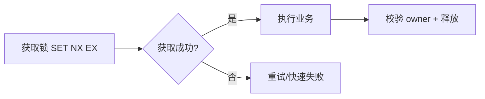
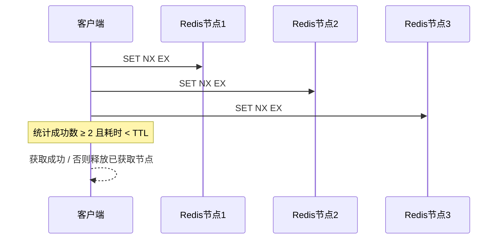

# 分布式锁

> 在分布式系统中，多个进程可能同时访问共享资源。分布式锁通过协调访问顺序，保证关键操作的原子性与隔离性——它是并发安全的最后一道闸门，但用错比不用更危险。

与「[幂等设计](幂等设计.md)」配合：锁负责"串行化临界区"，幂等负责"重复请求安全"。典型场景：**订单防重、库存扣减、定时任务防重复执行、缓存刷新协调**。

## 一、核心要求与方案谱系

| 要求 | 说明 |
|------|------|
| 互斥性 | 同一时刻仅一个客户端持有锁 |
| 防死锁 | 客户端崩溃也能自动释放（过期时间） |
| 谁持有谁释放 | 释放时必须校验持有者，防误删 |
| 可重入 | 同一线程可多次获取（可选） |
| 高可用 | 避免单点，容错 |



## 二、方案 1：SET NX EX（原子操作，单节点推荐）

原始 `SETNX + EXPIRE` 非原子，可能设了锁没设过期导致死锁，**已淘汰**。正确做法用一条原子命令：

```bash
# value 用唯一随机值（UUID），用于安全释放
SET resource_name my_random_value NX EX 30
```

- **优点**：原子、简单、自带过期防死锁。
- **缺点**：无自动续期，长事务可能锁提前释放；单节点故障可能失效。

## 三、方案 2：Redlock（多节点，争议方案）

向 N 个独立 Redis 节点申请锁，多数派（≥ N/2+1）成功且总耗时 < TTL 才算获取成功。



- **优点**：不依赖单点，容错性高（金融级诉求）。
- **缺点**：依赖精确时钟同步，网络分区可能脑裂；实现复杂，生产中较少采用（Martin Kleppmann 与 antirez 曾有著名论战）。

## 四、方案 3：Redisson（生产最佳实践）⭐

Redisson 封装了成熟实现，核心特性：**WatchDog 自动续期、可重入、公平锁、读写锁、红锁**。

```java
Config config = new Config();
config.useSingleServer().setAddress("redis://127.0.0.1:6379");
RedissonClient redisson = Redisson.create(config);

RLock lock = redisson.getLock("order:pay:123456");
try {
    lock.lock();                 // 默认 30s 过期, WatchDog 每 10s 续期
    // 业务: 扣库存 / 入账 ...
} finally {
    lock.unlock();               // 校验 owner 后释放
}
```

- **WatchDog**：未显式指定 leaseTime 时，后台线程定期（过期 1/3 间隔）延长持有时间，解决"业务超时锁已释放"。
- **可重入**：同一线程多次 `lock()` 计数 +1，需等量 `unlock()`。
- **锁命名**：`业务:功能:资源` 三级，如 `order:pay:orderId_123`。

## 五、方案 4：ZooKeeper 临时顺序节点

- 创建**临时节点**（会话断自动删，天然防死锁）+ **顺序节点**（最小序号者获锁，避免羊群效应）。
- 优点：强一致、无时钟依赖、自动释放可靠。缺点：写性能低于 Redis，依赖 ZK 集群。

## 六、方案 5：数据库悲观锁

```sql
SELECT * FROM orders WHERE id = 1 FOR UPDATE;  -- 命中索引, 行锁
```
- 优点：无额外组件。缺点：性能差、RR 隔离下可能 Next-Key Lock 锁范围大、易死锁。生产中较少作为分布式锁首选。

## 七、释放锁的安全性（致命细节）

**误删场景**：A 获锁后因 GC 停顿超期，锁过期；B 获锁；A 恢复执行 `del`，把 B 的锁删了。

正确做法：释放时用 **Lua 脚本原子校验 value 再删**（或 Redisson 内置）：

```lua
-- 原子: 仅当 value 匹配才删除
if redis.call("get", KEYS[1]) == ARGV[1] then
    return redis.call("del", KEYS[1])
else
    return 0
end
```

> ⚠️ **三大陷阱**：
> 1. **主从切换丢锁**：主节点未同步锁即崩溃，从节点升级后锁丢失 → 关键场景用 Redlock 或业务幂等兜底。
> 2. **时钟漂移**：Redlock 多节点时间不同步可能致锁失效。
> 3. **误删他人锁**：必须校验 owner（唯一随机值 + Lua），绝不能裸 `del`。

## 八、方案横向对比

| 方案 | 优点 | 缺点 | 适用 |
|------|------|------|------|
| SET NX EX | 原子、简单 | 无续期、单点 | 短期简单锁定 |
| Redisson 普通锁 | 自动续期、API 友好 | 单节点故障可能失效 | 单 Redis 节点 |
| Redisson 红锁 | 更高可用 | 开销大、实现复杂 | 金融级高要求 |
| ZooKeeper | 强一致、自动释放 | 性能较低、依赖 ZK | 强一致诉求 |
| 数据库锁 | 零组件 | 性能差、易死锁 | 不推荐作主锁 |

## 九、生产最佳实践 Checklist

- [ ] 锁 key 命名规范：`业务:功能:资源ID`，粒度尽量细（按订单号而非全局锁）。
- [ ] 过期时间 = 业务最大耗时 × 2~3；长事务用 WatchDog 或手动续期。
- [ ] 释放锁必须校验 owner（Lua / Redisson），防止误删。
- [ ] 获取失败策略：返回"处理中"、查历史结果，或指数退避重试（≤3 次）。
- [ ] 进入锁后仍要查业务状态/幂等流水（锁只保证串行，不保证历史未处理），与「[幂等设计](幂等设计.md)」组合。
- [ ] 监控：锁等待时间、持有时间、获取失败率、死锁次数。
- [ ] Redis 不可用降级：资金类宁返回失败也不熔断放行；普通场景可降级为 DB 唯一索引。

> 参考：Redis 官方分布式锁文档（Redis Distributed Locks / Redlock）、Redisson 文档、ZooKeeper  Recipes（Curator 分布式锁）、Martin Kleppmann《How to do distributed locking》。
