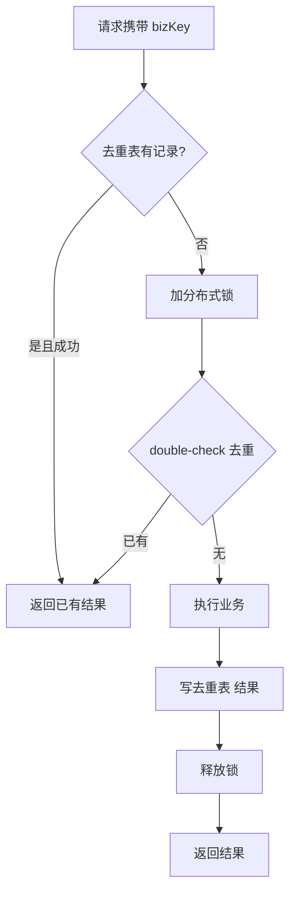

# 分布式锁与幂等设计

> 板块：场景设计 　|　 返回：[README](README.md)
> 关联：[支付系统核心设计](支付系统核心设计.md)、[缓存经典三问与一致性](缓存经典三问与一致性.md)、[CAP定理与一致性模型](../架构/CAP定理与一致性模型.md)

分布式系统下，多实例并发操作同一资源（扣库存、发奖励、跑定时任务、处理支付回调），需要两类保障：**互斥**（同一时刻只有一人能操作）与**幂等**（重复执行结果一致）。二者常被混淆，但解决不同问题。本文系统拆解。

## 一、为什么需要

- **多实例部署**：原来单进程的 `synchronized`/进程内锁失效（跨 JVM、跨机器）。
- **并发操作共享资源**：库存、账户余额、优惠券、任务调度、配置更新。
- **网络不可靠**：请求可能超时重试、消息可能重投、用户可能重复点击、网关可能重复转发。

两件事要分开想：

| 概念 | 解决 | 例子 |
|------|------|------|
| 锁（互斥） | 同一时刻只一人改 | 防止两个实例同时扣同一 SKU 库存 |
| 幂等（重复无害） | 多次执行 ≠ 多次效果 | 支付回调重试不重复扣款 |

> 锁管"并发"，幂等管"重复"。只加锁不幂等 → 重试仍重复；只幂等不加锁 → 并发竞态仍可能双写。

## 二、分布式锁方案

| 方案 | 实现 | 优点 | 缺点 | 适用 |
|------|------|------|------|------|
| Redis `SET NX EX` | 单命令加锁 | 简单、快、生态成熟 | 主从切换可能双持锁、需处理续期 | 大多数场景 |
| Redlock | 多节点多数派 | 比单实例更稳 | 有争议（fencing/时钟假设）、实现复杂 | 对可靠性要求极高 |
| ZooKeeper | 临时顺序节点 | 可靠、可重入、有 watch | 重、依赖 ZK、写性能一般 | 已有 ZK 集群 |
| etcd | 租约 + 事务 | CP、可靠、支持 Lease | 需维护 etcd | K8s 生态 |
| 数据库唯一约束 | 唯一索引抢行 / `SELECT FOR UPDATE` | 零额外组件 | 依赖 DB、性能受限、锁范围大 | 简单、低频 |
| 数据库乐观锁 | `WHERE version=?` | 无锁、并发好 | 冲突需重试 | 更新类 |

### 2.1 Redis 锁要点

- `SET key token NX EX seconds`：不存在才设、带过期，**一步完成**（避免 `SETNX` 后 `EXPIRE` 之间进程挂导致死锁）。
- **value 用唯一 token**（如 UUID + 线程 ID）：释放时校验，防误删别人的锁。
- **释放用 Lua 原子**：先 GET 比对再 DEL，否则可能删掉刚被别人拿走的锁。

```bash
# 加锁（仅当不存在）
SET lock:order:123 $token NX EX 30
# 释放（仅当持有者）
if redis.call('GET', KEYS[1]) == ARGV[1] then return redis.call('DEL', KEYS[1]) end
```

```java
// Redisson 封装（含看门狗自动续期）
RLock lock = redisson.getLock("lock:order:123");
lock.lock();                 // 默认30s, watchdog每10s续期
try { /* 业务 */ } finally { lock.unlock(); }
```

### 2.2 锁的风险与缓解

| 风险 | 现象 | 缓解 |
|------|------|------|
| 业务未完成锁过期 | 两实例同时进临界区 | 看门狗自动续期（Redisson）；或过期为业务耗时数倍 |
| GC/网络停顿 | 客户端以为还持锁其实已过期 | 引入 **fencing token**（单调递增，旧操作被新操作拒绝） |
| 不可重入 | 同线程重入死锁 | 用重入锁（持有者+计数）或避免重入设计 |
| 主从切换丢锁 | master 锁未同步到 replica 即故障切换 | 用 Redlock/etd/ZK（CP）；或接受极小概率（兜底幂等） |
| 锁被误删 | 错删他人锁，临界区双入 | 释放时校验 token（Lua） |

> **fencing token** 思路：每次加锁获得一个单调递增令牌，写入资源时校验令牌≥已有令牌，旧操作即使后到也被拒绝。这是 Martin Kleppmann 对 Redlock 批评的核心补救手段。

### 2.3 锁粒度

- 太粗：锁住整个方法/表 → 并发度低，热点串行。
- 太细：只锁 ID 却改了关联资源 → 漏保护。
- 建议：**锁到"资源维度"**（如订单号、SKU ID、用户 ID），而非方法维度；能分段就分段（如库存按 bucket 分片锁）。

```java
// 按资源维度加锁，而非锁整个方法
String lockKey = "lock:sku:" + skuId;
RLock lock = redisson.getLock(lockKey);
```

## 三、幂等设计

幂等 = 同一请求（相同参数）执行一次与多次结果一致。注意：幂等针对"相同的业务请求"，不是"相同的 HTTP 请求"——重试必须携带相同的业务幂等键。

### 3.1 需要幂等的场景

- 网络重试（HTTP 超时客户端重试、网关重试）。
- 消息重投（MQ at-least-once 语义）。
- 用户重复点击（连点提交、双击支付）。
- 前端防重 token 未生效 / 移动端弱网重发。
- 补偿机制重放（Saga 重试）。

### 3.2 实现手段

| 手段 | 做法 | 适用 |
|------|------|------|
| 唯一键 | DB 唯一索引（订单号/流水号）拦截重复插入 | 新增类（创建订单） |
| 去重表 | 已处理 key 记表，先查再执行；处理完写回 | 通用 |
| 状态机 | 只有「待处理」能转「已处理」，重复事件被拒 | 有状态的流程（支付） |
| Token 机制 | 前端下单先拿一次性 token，重复提交校验已用即拒 | 表单提交 |
| 版本号/乐观锁 | `UPDATE ... WHERE version=?` | 更新类、防并发覆盖 |
| 幂等接口设计 | 业务键 + 处理结果缓存（返回上次结果） | 查询式幂等 |

### 3.3 代码：去重表 + 状态机

```sql
CREATE TABLE idempotent_record (
    biz_key VARCHAR(64) PRIMARY KEY,   -- 业务幂等键
    status  TINYINT,                   -- 1处理中 2成功 3失败
    result  TEXT,
    created_at DATETIME
);
```

```java
// 伪：先查去重表，已成功直接返回；否则加锁处理
IdempRecord rec = idemDao.get(bizKey);
if (rec != null && rec.status == SUCCESS) return rec.result;  // 幂等返回
try (Entry e = SphU.entry("process")) { /* 并发限流 */ }
lock(bizKey);
try {
    rec = idemDao.get(bizKey);
    if (rec != null && rec.status == SUCCESS) return rec.result;  // double check
    Object result = doBusiness();
    idemDao.insert(bizKey, SUCCESS, result);  // 唯一键防并发重复插入
    return result;
} finally { unlock(bizKey); }
```

## 四、典型组合：锁 + 幂等

```
请求 → 幂等键查重(去重表/唯一索引)
        ├─ 已处理 → 直接返回已有结果（幂等）
        └─ 未处理 → 加分布式锁 → 再 double-check → 执行业务 → 记结果 → 释放锁
```

- 锁解决"并发互斥"（两个不同请求同时到）。
- 幂等解决"重复执行"（同一请求的多次到达）。
- 二者配合才能既防并发又防重试。



## 五、定时任务防重复执行

多实例部署下，定时任务可能被多个节点同时触发：

- **DB 行锁抢占**：任务表 `UPDATE job SET locked=1 WHERE name=? AND locked=0`，抢到者执行。
- **分布式锁**：执行前抢锁，持锁者运行，释放时校验 token。
- **分片**：按实例 ID 取模，各自负责不同分片任务。
- **调度框架**：XXL-JOB / Elastic-Job 自带分片与防重。

```sql
UPDATE schedule_job SET locked_by='node1', locked_at=NOW()
WHERE job_name='syncOrder' AND locked_by IS NULL;
-- 影响行数=1 → 本节点执行；0 → 别的节点已抢到
```

## 六、与事务配合

- **锁 + 本地事务**：业务失败回滚，锁释放；注意锁释放要在事务提交后，避免"锁放了事务还没提交"的窗口。
- **跨服务**：用 Saga / TCC，每一步都幂等且可补偿（重试安全）。详见 [支付系统核心设计](支付系统核心设计.md)。
- **消息幂等**：消费者用 `msgId` 去重表，处理前查重；处理与写去重表在同一事务（防查重通过但写失败导致重试又查重说已处理）。

## 七、常见坑

1. **锁不设过期** → 实例挂死锁，资源永久锁住（必须有过期 + 续期）。
2. **释放锁不校验持有者** → 误删别人锁，临界区被双重进入（用 Lua 校验 token）。
3. **只加锁不幂等** → 重试仍造成重复（资损、重复发券）。
4. **锁粒度太粗/太细** → 性能差或漏保护（锁到资源维度）。
5. **依赖时钟判断过期** → 时钟漂移出错（用 fencing token / 版本）。
6. **去重表与业务不在一个事务** → 查重通过但写失败，重试又查重说已处理（状态不一致）。
7. **锁释放早于事务提交** → 别的实例读到未提交数据（调整顺序）。
8. **幂等键设计不当** → 用请求 ID 而非业务键，重试换了请求 ID 就失效（用业务唯一号）。
9. **Redis 锁主从切换** → 极小概率双持，关键场景加 fencing 或兜底幂等。
10. **忘了网络分区** → 锁在分区两侧都被持，需 CP 存储或接受并靠幂等兜底。

## 八、选型速查

| 诉求 | 推荐 |
|------|------|
| 通用、已有 Redis、能接受极小概率 | Redis `SET NX EX` + 看门狗 + 释放校验 |
| 强一致、已有 ZK/etcd | ZK 临时节点 / etcd Lease |
| 极简、低频、有 DB | DB 唯一约束 / 行锁抢占 |
| 更新类并发 | 乐观锁 version |
| 防重复提交 | 前端 token + 后端去重表 |

## 九、落地清单

1. 识别并发点（库存/账户/任务/回调），确定资源维度。
2. 选锁方案（Redis/ZK/etcd/DB），设过期 + 续期 + 释放校验。
3. 设计幂等键（业务唯一号），去重表/唯一索引 + double-check。
4. 锁释放顺序与事务一致；跨服务用 Saga/TCC 且每步幂等。
5. 定时任务加防重（行锁/分片/调度框架）。
6. 压测验证并发与重试下的正确性。

## 十、延伸阅读

- [支付系统核心设计](支付系统核心设计.md)
- [缓存经典三问与一致性](缓存经典三问与一致性.md)
- [CAP定理与一致性模型](../架构/CAP定理与一致性模型.md)
- [分布式事务与最终一致性实战](../场景设计/分布式事务与最终一致性实战.md)
