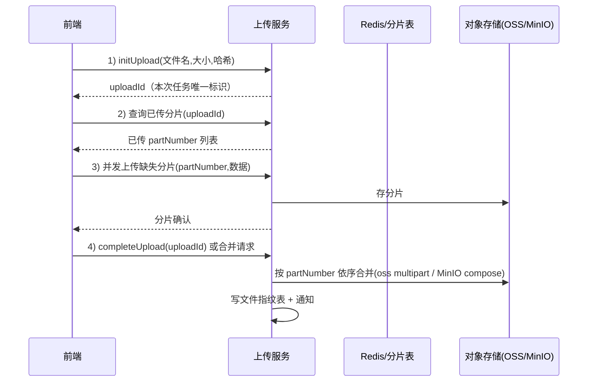

# 分片上传与断点续传：秒传、大文件与网盘

## 〇、本体介绍

**分片上传**：大文件（视频/安装包/数据集）在上传前切成 N 个分片，**并发上传分片、服务端按序合并**。**秒传**与**断点续传**是它之上衍生的两个能力，本质是同一套机制的复用。

**核心矛盾**：
1. 大文件单请求上传：**易超时、易失败、失败全重来**（网络抖动不可控）；
2. 上传链路（前端 → 网关 → 存储）**状态要可恢复、可查询**；
3. **秒传**需要整文件指纹（哈希）服务端比对，且哈希本身对大文件有成本；
4. 分片**乱序到达**，合并顺序与幂等（重复传同一分片）要处理好。

**核心主线**：上传机制对比 → 分片设计 → 秒传实现 → 断点续传 → 后端接口与合并 → 清理与兜底。

---

## 一、三种机制对比

| 机制 | 原理 | 解决 |
|------|------|------|
| **分片上传** | 文件切 N 片，并发上传，服务端按 partNumber 合并 | 单请求超时、内存占用、速度 |
| **断点续传** | 上传前查询"哪些分片已传"，只传缺失分片 | 网络中断/失败后全量重传 |
| **秒传** | 整文件哈希与已有文件比对，命中直接复用 | 重复文件零上传（网盘/资源站） |

- **断点续传和秒传都是分片上传之上的能力**：续传=查已传分片；秒传=整文件级"已存在"判定。

> 口诀：**"切分并发传，续传只补缺，秒传看指纹——三件套同一套底座。"**

---

## 二、分片设计

| 参数 | 建议 | 理由 |
|------|------|------|
| 分片大小 | **5~10MB**（阿里 OSS 官方建议，可配 1MB~5GB） | 太小：请求数爆炸；太大：单请求仍易超时 |
| 并发数 | **3~5 片** | 并发不是越多越快，受带宽与设备负载约束（官方也这么说） |
| 分片标识 | **partNumber（1 起自增）** | 顺序由 partNumber 决定，可乱序并发上传 |
| 前端切分 | `Blob.slice(start, end)` | 浏览器原生，按字节切 |

---

## 三、秒传（文件指纹）

1. 上传前**计算整文件哈希**：`MD5`（或 SHA-1，部分场景用快速哈希 + 后端校验）。
   - 大文件本地哈希也有成本（读全文件）→ 前端**抽样哈希**或**后台线程 + 分片并行哈希**；服务端对命中文件做**二次校验**（抽查/重算）。
2. 调接口：`check?hash=xxx&size=yyy` → 服务端查**文件指纹表**：

```sql
CREATE TABLE file_meta (
    id           BIGINT PRIMARY KEY,
    file_hash    VARCHAR(64) UNIQUE NOT NULL,  -- 指纹（唯一索引）
    file_size    BIGINT NOT NULL,
    object_key   VARCHAR(255) NOT NULL,        -- 存储key（OSS/MinIO路径）
    ref_count    INT DEFAULT 1                 -- 引用计数（同名文件复用）
) COMMENT '文件指纹';
```

3. 命中 → 返回已有 `object_key` + **秒传成功**（复用存储，只加引用）。
4. 未命中 → 走正常分片上传，合并完成后**写指纹表**（并发同时传同一文件：指纹表唯一索引防重，重复者复用先完成的）。

---

## 四、断点续传与完整流程



### 4.1 后端关键接口

| 接口 | 作用 | 幂等性 |
|------|------|--------|
| `initUpload` | 创建上传任务，返回 uploadId | 同文件重复 init 复用 uploadId |
| `listParts(uploadId)` | 返回已传分片（断点定位） | 只读 |
| `uploadPart(uploadId, partNumber, data)` | 传一个分片 | **分片级幂等**：同 partNumber 重传覆盖 |
| `completeUpload(uploadId)` | 合并所有分片 | 重复调用返回同一结果 |

### 4.2 分片记录（断点续传的状态源）

```sql
CREATE TABLE part_record (
    id          BIGINT PRIMARY KEY,
    upload_id   VARCHAR(64) NOT NULL,      -- 任务ID
    part_number INT NOT NULL,
    etag        VARCHAR(64),               -- OSS/MinIO 返回的分片标识
    size        BIGINT,
    status      TINYINT,                   -- 0待传 1已传
    UNIQUE KEY uk_task_part (upload_id, part_number)
) COMMENT '分片记录';
```

- 断点续传 = `listParts` 过滤出缺失分片，**只补传缺口**。
- **并发安全**：同 uploadId 同 partNumber 以 OSS/MinIO 的 multipart API 为准（覆盖写），服务端记录乐观更新。
- **大文件直接用对象存储的 multipart API**（阿里 OSS `initMultipartUpload/uploadPart/completeMultipartUpload`、MinIO 同款），服务端只做编排与记录，不自己拼文件流。

---

## 五、失败处理与清理

| 场景 | 处理 |
|------|------|
| 单个分片失败 | 只重传该分片（断点续传的粒度） |
| 网络中断 | 前端记录已传分片（本地持久化），下次先查再补 |
| 分片合并失败 | 重试 completeUpload；仍失败标记任务失败，可重新合并 |
| **孤儿分片** | 任务长期未 complete（用户放弃）→ 定时任务按 uploadId 清理过期分片（OSS `abortMultipartUpload`） |
| 上传中并发相同文件 | 指纹表唯一索引 + 后到者复用先完成者 |

---

## 六、与其他板块的关系

- **大促容量规划与备战**：上传是带宽/网关大流量入口，需要容量预估与限流。
- **Redis 实现限流**：上传接口并发限制与防滥用。
- **分布式锁**：文件指纹表写入与"并发秒传同一文件"的互斥可借助唯一索引/分布式锁。
- **数据库存储设计**：文件元数据（指纹表、分片表）的分表与索引设计。

---

## 七、速查表

| 主题 | 一句话 |
|------|--------|
| 分片 | 5~10MB/片，3~5 并发，partNumber 定序 |
| 秒传 | 整文件哈希查指纹表，命中复用 object_key |
| 续传 | listParts 查已传，只补缺失分片 |
| 接口 | initUpload / listParts / uploadPart / completeUpload |
| 合并 | 交给 OSS/MinIO multipart，按 partNumber 序 |
| 幂等 | 同 partNumber 重传覆盖；同文件并发靠唯一索引 |
| 清理 | 孤儿分片定时 abort |

---

## 面试高频问题（12+ 条）

1. **为什么大文件要分片？** 单请求易超时、占内存、失败全重来；分片并发快且失败只重传单片。
2. **分片大小怎么定？** 5~10MB 平衡请求数与单请求体积；官方（OSS）也是这个建议。
3. **并发越多越快吗？** 不是，受带宽与设备负载限制，一般 3~5 并发最佳。
4. **秒传原理？** 整文件哈希 → 查指纹表 → 命中返回已有存储 key，复用不重传。
5. **大文件哈希成本高怎么办？** 前端抽样/异步并行哈希，后端二次校验兜底。
6. **断点续传怎么实现？** initUpload 拿 uploadId → listParts 查已传分片 → 只传缺失 → completeUpload。
7. **分片乱序到达怎么合？** partNumber 定序，OSS/MinIO multipart API 按 partNumber 合并。
8. **同一分片传两次？** 分片级幂等，同 partNumber 覆盖写，服务端记录乐观更新。
9. **两个用户同时传同一文件？** 指纹表唯一索引，后到者复用先完成者，不重复存储。
10. **用户传一半放弃怎么办？** 定时任务 abortMultipartUpload 清理孤儿分片，防存储泄漏。
11. **合并失败怎么办？** 重试 completeUpload（幂等）；仍失败标记失败可重新合并。
12. **前端怎么知道哪些分片传过？** 本地持久化已传分片 + 服务端 listParts 双保险。

---

> 配套：上传后的元数据存储 →「[mysql知识](../基础知识/mysql知识.md)」；入口流量 →「[大促容量规划与备战](大促容量规划与备战.md)」。
