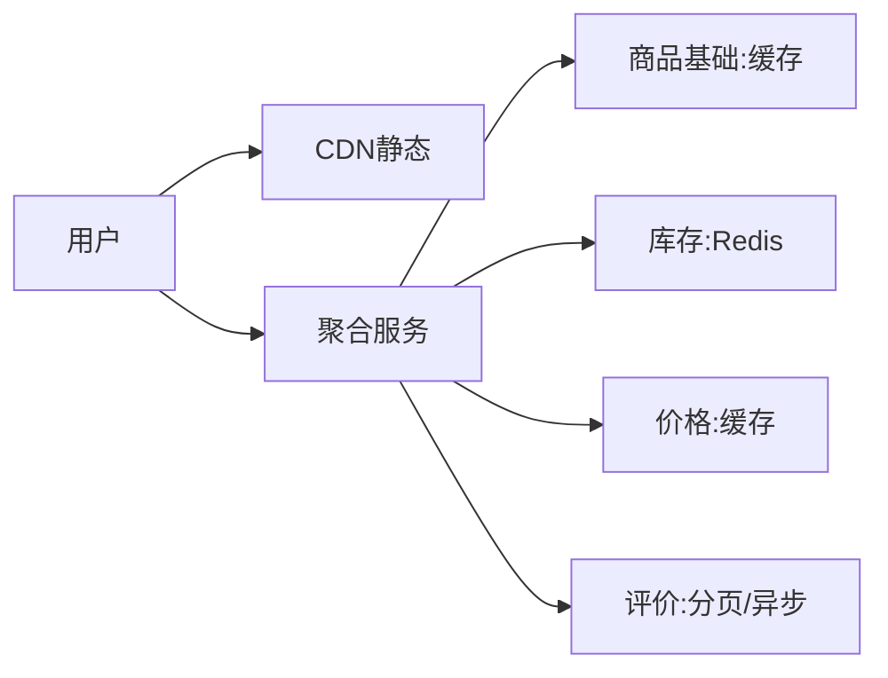

# 商品详情页与高并发读实战

> 商品详情页（PDP）是典型的"超高读、写少、容忍短暂不一致"场景：大促时 QPS 极高，且聚合了商品、库存、价格、评价、推荐多源数据。架构目标是在极低成本下扛住洪峰、秒开、不串数据。

## 1. 页面数据构成

## 2. 分层缓存

- **静态资源**：图片/描述走 CDN，边缘命中。
- **商品基础**：Redis 缓存，结构预拼（避免多次 IO）。
- **价格/库存**：独立缓存，更新频率高，单独失效。
- **评价/推荐**：容忍延迟，异步加载或降级。

## 3. 聚合与降级

- 聚合服务合并多源，一次返回页面所需。
- **超时降级**：某依赖慢则返回默认/旧值，保主流程。
- **骨架屏**：先出框架再填数据，提升体感。

## 4. 大促备战

- 热点商品预加载到本地 + Redis。
- 库存用分段（sub-key）防单 key 热点。
- 限流 + 排队，保护后端。
- 静态化：能静态的部分提前生成。

## 5. 常见坑

| 坑 | 现象 | 对策 |
| --- | --- | --- |
| 数据串 | A 商品显 B 价 | key 隔离 |
| 慢依赖拖垮 | 整页慢 | 超时降级 |
| 库存热点 | 卡顿 | 分段 key |
| 雪崩 | 同时失效 | 过期抖动 |
| 超卖 | 库存错 | 原子扣减 |

## 6. 面试题

1. PDP 如何分层缓存？
2. 依赖慢如何降级？
3. 库存热点怎么处理？
4. 大促如何备战详情页？
5. 多源聚合如何保一致？

## 7. 小结

商品详情页 = CDN 静态 + 多级缓存 + 聚合降级 + 热点分段。核心是"把读在越前端终结、把慢依赖隔离降级、把热点打散"。
