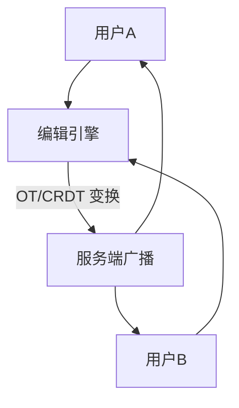

# 在线协同编辑进阶实战

> 多人同时编辑同一文档，要看到彼此的光标、实时合并改动、不丢字符不冲突。协同编辑是分布式一致性在"人因"上的极致体现：CRDT 与 OT 是两大路线，冲突解决、离线同步、光标位同步缺一不可。

## 1. 协同模型



## 2. OT vs CRDT

| 维度 | OT | CRDT |
| --- | --- | --- |
| 一致性 | 中心变换 | 数学可交换 |
| 离线 | 需重放 | 天然支持 |
| 复杂度 | 中 | 低（但数据膨胀） |
| 典型 | 早期协同 | 现代 Yjs/Automerge |

## 3. CRDT 思路

- **字符/节点带唯一 ID**（如 `(site, counter)`），插入位置用 ID 定位。
- **操作可交换**：无论到达顺序，最终状态一致。
- **合并无冲突**：并发插入各自保留，按 ID 排序定序。

```javascript
// Yjs 风格：文档为共享类型
const ydoc = new Y.Doc();
const ytext = ydoc.getText('content');
ytext.insert(0, 'Hello');
// 远端同步 update，自动合并
ydoc2.applyUpdate(encodeStateAsUpdate(ydoc));
```

## 4. 光标与选区同步

- 每客户端广播光标位置（基于文档坐标而非屏幕）。
- 远端渲染他人光标 + 名字标签。
- 编辑时重映射他人光标，避免错位。

## 5. 离线同步

- 本地先应用，记录操作日志。
- 重连后把本地 ops 推送给服务端，合并广播。
- CRDT 天然幂等，重复同步安全。

## 6. 常见坑

| 坑 | 现象 | 对策 |
| --- | --- | --- |
| 光标乱跳 | 体验差 | 基于文档坐标 |
| 冲突丢字 | 内容错 | CRDT/OT 保证 |
| 数据膨胀 | 文档巨大 | 定期压缩快照 |
| 离线冲突 | 合并不了 | 可交换操作 |
| 性能卡顿 | 大文档卡 | 分块 + 惰性加载 |

## 7. 面试题

1. OT 和 CRDT 区别？
2. 为什么需要唯一 ID 定位？
3. 离线编辑如何同步？
4. 多人光标如何不错位？
5. 大文档协同性能怎么优化？

## 8. 小结

协同编辑 = 冲突免费数据结构（CRDT/OT） + 实时广播 + 光标同步 + 离线合并。核心是"并发操作最终一致、用户无感、光标不乱"。
