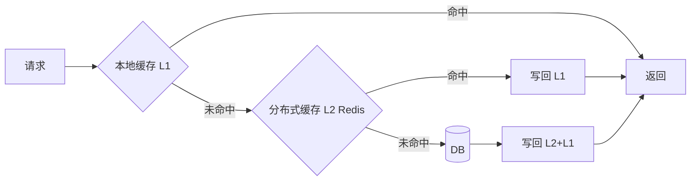
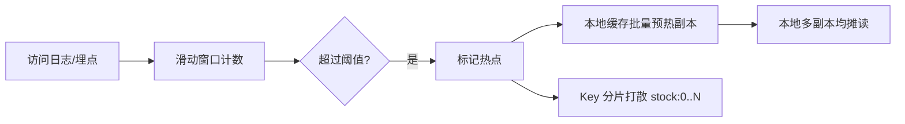

# 多级缓存框架

## 一、什么是多级缓存

阿里开源的 jetcache：

> jetcache 是阿里开源的多级缓存与缓存抽象框架，支持本地（Caffeine/LinkedHashMap）+ 远程（Redis/Tair）两级缓存、自动刷新与分布式锁。

### 1.1 为什么需要多级缓存

- 单级 Redis 在**热点 key**、**超大并发**下存在网络开销与单点压力。
- 本地缓存（进程内）访问纳秒级，但存在多实例一致性问题。
- 多级缓存 = **本地缓存 + 分布式缓存 + 回源（DB）**，逐层挡住流量。



## 二、核心组件

| 层 | 选型 | 特点 | 一致性策略 |
|----|------|------|-----------|
| L1 本地 | Caffeine/Guava | 纳秒级、容量小、易失效 | 过期/TTL、主动失效 |
| L2 分布式 | Redis/Tair | 共享、容量大、网络开销 | 发布订阅失效、版本号 |
| 回源 | MySQL/ES | 权威数据源 | 以 DB 为准 |

## 三、热点 Key 处理

- **热 key 探测**：实时统计访问频次（滑动窗口），识别热点。
- **本地多副本**：热点 key 在本地缓存放大副本数，分散单实例压力。
- **拆分/打散**：对极端热点（如爆款库存）做 key 分片（`stock:{0..N}`）。

## 四、一致性方案

1. **写后失效（Write-Invalidate）**：更新 DB 后删除缓存，下一次读回源。简单但存在脏读窗口。
2. **写后更新（Write-Update）**：更新 DB 后主动写缓存，减少回源但并发写易脏。
3. **Binlog 订阅（Canal）**：监听 DB binlog 异步失效/更新缓存，解耦业务，保证最终一致。
4. **广播失效**：Redis Pub/Sub 或 MQ 广播失效事件，各实例清本地缓存。

```java
// jetcache 多级缓存示例（本地+远程）
@Cached(name = "user:", cacheType = CacheType.BOTH,
        local = @LocalCache(size = 10000, expire = 100, timeUnit = TimeUnit.SECONDS),
        remote = @RemoteCache(expire = 3600, timeUnit = TimeUnit.SECONDS))
public User getUser(long userId) {
    return userMapper.selectById(userId);
}

// 更新后失效
@CacheInvalidate(name = "user:", key = "#user.id")
public void updateUser(User user) { userMapper.updateById(user); }
```

## 五、踩坑与权衡
- **一致性 vs 性能**：多级缓存天然牺牲强一致，用"短暂不一致 + 最终一致"换性能。
- **本地缓存内存**：容量设置过大易 OOM，需结合 GC 与监控调优。
- **惊群效应**：缓存同时失效导致大量回源，需加分布式锁或 single-flight 合并回源。
- **广播风暴**：失效广播在集群规模大时开销高，可按 key 哈希分区订阅。

## 六、缓存一致性：失效 vs 更新（深入）

| 策略 | 流程 | 优点 | 缺点 | 适用 |
|------|------|------|------|------|
| Cache-Aside（读穿透写失效） | 读 miss 回源写缓存；写更新 DB 后 `del` 缓存 | 简单、主流 | 存在脏读窗口 | 绝大多数 |
| Read-Through/Write-Through | 由缓存层代理读写 | 业务无感 | 实现复杂 | 框架内置 |
| Write-Behind | 写先落缓存异步刷 DB | 写极快 | 丢数据风险 | 日志类 |
| Binlog 异步失效（Canal） | 监听 binlog 失效/更新缓存 | 解耦、最终一致 | 架构重 | 高一致要求 |

**Cache-Aside 的并发坑**：线程 A 写（删缓存 → 更新 DB），线程 B 在"删缓存后、DB 提交前"读到旧值并写回缓存 ⇒ 脏数据。缓解：
1. **延迟双删**：更新 DB 后再 `sleep` 几百 ms 删一次缓存。
2. **串行化**：同一 key 的读写路由到同一线程/队列（单线程模型）。
3. **binlog 兜底**：以 Canal 的 DB 提交事件为权威失效源。

## 七、热点 Key 探测与本地缓存预热



- **探测**：在 Redis 代理层（如 Codis/Agent）对 key 访问计数，实时识别热点。
- **预热**：大促前将预热名单（热点商品）主动写入各实例本地缓存。
- **分片**：`stock:0..N` 把单 key 流量打散到 N 个子 key，本地再聚合。

## 八、击穿 / 穿透 / 雪崩实战

| 问题 | 原因 | 解法 |
|------|------|------|
| 缓存击穿 | 单热点 key 过期瞬间海量并发回源 | 互斥锁/single-flight；逻辑过期（不真删） |
| 缓存穿透 | 查询不存在的 key，直击 DB | 布隆过滤器；空值缓存(短TTL) |
| 缓存雪崩 | 大量 key 同时过期/Redis 宕机 | 过期时间加随机抖动；多级降级；Redis 高可用 |

**single-flight（Go）示例**：
```go
var group singleflight.Group
val, _, _ := group.Do(key, func() (interface{}, error) {
    return loadFromDB(key) // 同一 key 同一时刻只有一个回源
})
```

## 九、布隆过滤器代码（防穿透）

```java
// Guava BloomFilter
BloomFilter<String> bf = BloomFilter.create(
        Funnels.stringFunnel(StandardCharsets.UTF_8), 1_000_000, 0.01);
bf.put("existing-key");
if (!bf.mightContain(key)) {
    return null; // 一定不存在，直接拦截，不查 DB
}
// 注意：布隆有误判率(1%)，不存在的也可能误判存在，需 DB 兜底
```

## 十、TMC / 阿里 Tair 思路

- **TMC（透明多级缓存思路）**：在应用进程内嵌"本地缓存"，远程缓存命中后自动同步到本地；通过配置中心下发失效事件精准清理，解决"广播风暴"。
- **Tair（阿里）**：自研分布式 KV，支持 `localcache + remote` 多级，提供 `MDB/LDB` 多种引擎，支持一致性哈希与热点迁移。
- **设计要点**：本地缓存容量受控（LRU + 最大条数），失效采用"版本号 + 主动通知"而非全量广播。

## 十一、踩坑与权衡（深入）

- **逻辑过期的一致性**：用"逻辑过期时间"避免击穿时，需后台异步重建，重建失败会一直返回旧值，要有兜底。
- **本地缓存与 GC**：大对象本地缓存会进入 old gen，触发更久 Full GC，需控制单条大小与总量。
- **多级缓存的失效顺序**：推荐"先清远程再清本地"，避免清完本地立刻又被旧远程值回填。

## 十二、JetCache 完整配置与缓存监控指标

**Spring Boot 配置**：
```yaml
jetcache:
  statIntervalMinutes: 15
  local:
    default:
      type: caffeine
      limit: 10000
      expireAfterWrite: 100s
  remote:
    default:
      type: redis
      keyConvertor: fastjson
      valueEncoder: java
      expireAfterWrite: 3600s
  areaInCache:
    type: redis
    expireAfterWrite: 7200s
```

**监控指标（jetcache 自带）**：
| 指标 | 含义 | 告警 |
|------|------|------|
| get 命中率 | 本地+远程命中比例 | < 90% 排查 |
| 回源次数 | 穿透到 DB 的次数 | 突增=缓存失效/雪崩 |
| 平均 GET/PUT 耗时 | 缓存操作 RT | > 10ms 排查 Redis |
| 本地缓存大小 | 当前条目数 | 接近 limit 预警 |

### 热点 key 实战小结
- 大促前用「历史访问日志 + 离线统计」预标记热点，主动预热到本地缓存。
- 极端热点（如爆款）用 `stock:{0..N}` 分片 + 本地多副本，单实例只读本地副本，把远程访问降到极低。
- 监控本地缓存命中率，命中率掉说明热点漂移，需重新预热。

## 十三、本地缓存框架选型对比

| 框架 | L1 | L2 | 亮点 |
|------|----|----|------|
| JetCache | Caffeine | Redis/Tair | 注解驱动、统计内置 |
| Caffeine 直接使用 | Caffeine | 无 | 轻量、手动控制 |
| Guava Cache | Guava | 无 | 老牌、API 简单 |
| Spring Cache | 任意 | 任意 | 与 Spring 集成好 |

> 选型建议：新业务优先 JetCache（多级 + 统计开箱即用）；遗留系统用 Caffeine 手动挡即可。

## 十四、缓存典型事故案例

- **案例1 雪崩**：某大促大量 key 同一 TTL 过期，瞬间回源打死 DB。修复：TTL 加随机抖动 + Redis 高可用 + 本地缓存兜底。
- **案例2 穿透**：爬虫遍历不存在的 id，全部打到 DB。修复：布隆过滤器 + 空值缓存。
- **案例3 击穿**：热点 key 失效瞬间万 QPS 回源。修复：single-flight 合并 + 逻辑过期。
- **案例4 一致性**：更新 DB 后删缓存失败，用户长期读旧值。修复：binlog 兜底失效 + 延迟双删。
