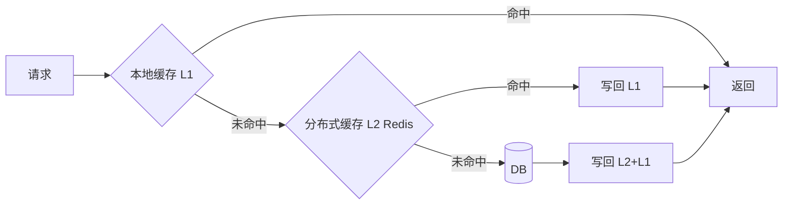

# 多级缓存框架

> ⚠️ 本页内容待补充。

阿里开源的 jetcache。

> jetcache 是阿里开源的多级缓存与缓存抽象框架，支持本地（Caffeine/LinkedHashMap）+ 远程（Redis/Tair）两级缓存、自动刷新与分布式锁。

## 二、为什么需要多级缓存

- 单级 Redis 在**热点 key**、**超大并发**下存在网络开销与单点压力。
- 本地缓存（进程内）访问纳秒级，但存在多实例一致性问题。
- 多级缓存 = **本地缓存 + 分布式缓存 + 回源（DB）**，逐层挡住流量。



## 三、核心组件

| 层 | 选型 | 特点 | 一致性策略 |
|----|------|------|-----------|
| L1 本地 | Caffeine/Guava | 纳秒级、容量小、易失效 | 过期/TTL、主动失效 |
| L2 分布式 | Redis/Tair | 共享、容量大、网络开销 | 发布订阅失效、版本号 |
| 回源 | MySQL/ES | 权威数据源 | 以 DB 为准 |

## 四、热点 Key 处理

- **热 key 探测**：实时统计访问频次（滑动窗口），识别热点。
- **本地多副本**：热点 key 在本地缓存放大副本数，分散单实例压力。
- **拆分/打散**：对极端热点（如爆款库存）做 key 分片（`stock:{0..N}`）。

## 五、一致性方案

1. **写后失效（Write-Invalidate）**：更新 DB 后删除缓存，下一次读回源。简单但存在脏读窗口。
2. **写后更新（Write-Update）**：更新 DB 后主动写缓存，减少回源但并发写易脏。
3. **Binlog 订阅（Canal）**：监听 DB binlog 异步失效/更新缓存，解耦业务，保证最终一致。
4. **广播失效**：Redis Pub/Sub 或 MQ 广播失效事件，各实例清本地缓存。

```java
// jetcache 多级缓存示例（本地+远程）
@Cached(name = "user:", cacheType = CacheType.BOTH,
        local = @LocalCache(size = 10000, expire = 100, timeUnit = TimeUnit.SECONDS),
        remote = @RemoteCache(expire = 3600, timeUnit = TimeUnit.SECONDS))
public User getUser(long userId) {
    return userMapper.selectById(userId);
}

// 更新后失效
@CacheInvalidate(name = "user:", key = "#user.id")
public void updateUser(User user) { userMapper.updateById(user); }
```

## 六、踩坑与权衡
- **一致性 vs 性能**：多级缓存天然牺牲强一致，用"短暂不一致 + 最终一致"换性能。
- **本地缓存内存**：容量设置过大易 OOM，需结合 GC 与监控调优。
- **惊群效应**：缓存同时失效导致大量回源，需加分布式锁或 single-flight 合并回源。
- **广播风暴**：失效广播在集群规模大时开销高，可按 key 哈希分区订阅。
