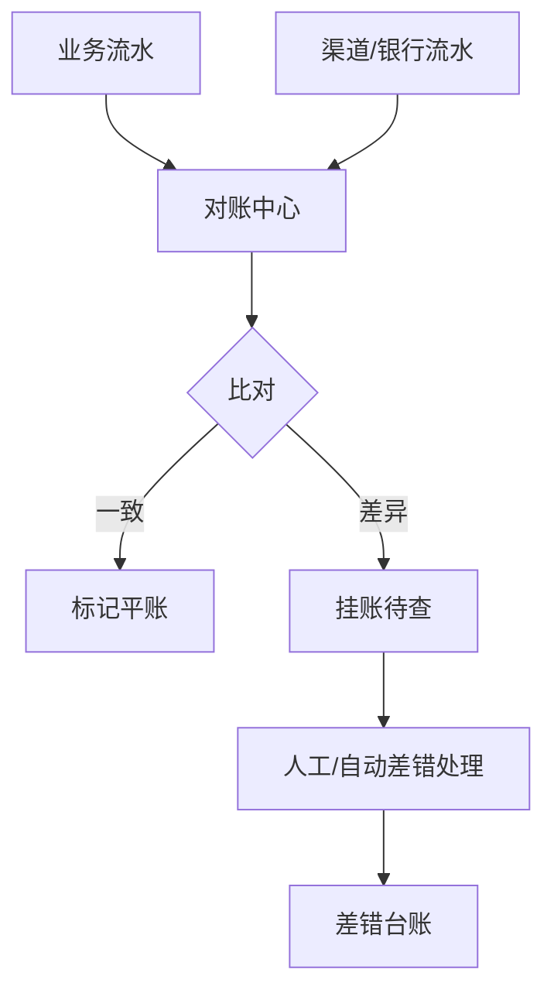

# 对账与清结算系统设计实战

> 对账是金融与交易系统的"最后一道防线"：每天把"我方流水"和"渠道/对方流水"逐笔核对，发现长短款、漏单、重复记账。清结算则把可结算资金按规则分给各方。两者都要求**零差错、可追溯**。

## 1. 对账分层



## 2. 对账流程

- **文件/接口拉取**：T+1 从渠道下载对账单（或实时流水）。
- **标准化**：统一字段（订单号、金额、时间、状态）。
- **勾兑**：以业务主键匹配双方记录，比对金额/状态。
- **差异分类**：漏单、多单、金额不符、状态不符。

```sql
-- 找我方有、渠道无的漏单
SELECT b.order_no FROM biz_flow b
LEFT JOIN chan_flow c ON b.order_no = c.order_no
WHERE c.order_no IS NULL AND b.biz_date = :date;
```

## 3. 清结算

- **计费规则**：按合同比例、阶梯、固定费拆分。
- **结算单**：生成应收/应付，支持对冲。
- **打款**：批量化付款指令，留痕可追溯。

| 要素 | 说明 |
| --- | --- |
| 结算周期 | T+1 / 周结 / 月结 |
| 分账比例 | 平台 / 商户 / 服务商 |
| 入账账户 | 虚拟户 / 实体户 |
| 凭证 | 结算单 + 流水号 |

## 4. 一致性保障

- **幂等入账**：结算单号唯一，重复执行不产生重复打款。
- **最终一致**：记账先写本地，MQ 通知对方，失败重试 + 告警。
- **审计**：所有金额变动留操作日志与凭证。

## 5. 常见坑

| 坑 | 现象 | 对策 |
| --- | --- | --- |
| 漏单 | 钱没到账 | 双向对账 + 告警 |
| 重复打款 | 多付 | 结算单幂等 |
| 时区错位 | 日期对不上 | 统一交易日 |
| 金额精度 | 分厘误差 | 用分/整数记账 |
| 渠道延迟 | 当天对不平 | 容忍窗口 + 次日复对 |

## 6. 面试题

1. 对账为什么通常是 T+1？
2. 双向对账与单向对账区别？
3. 清结算如何防止重复打款？
4. 金额用什么类型存储最安全？
5. 差异挂账后如何闭环？

## 7. 小结

对账 = 拉取 → 标准化 → 勾兑 → 差错处理；清结算 = 计费 → 结算单 → 幂等打款。核心是"逐笔可核、差异可查、资金可追溯"，宁可慢不可错。
