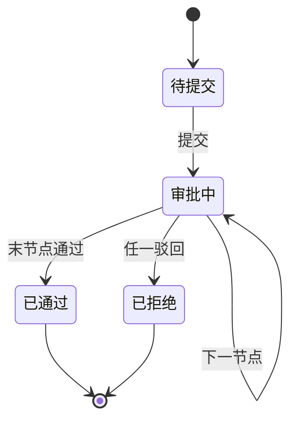

# 工单与审批流系统设计

> 板块：场景设计 　|　 返回：[README](README.md)
> 适用：OA 审批、客服工单、运维变更审批、财务报销流。

审批流的本质是**状态机 + 流程编排**：把"谁、在什么条件下、做什么、流转到哪"结构化，支持串行/并行/会签等复杂模式，并保证可追溯与 SLA。

## 一、核心模型

| 实体 | 含义 |
|------|------|
| 工单（Ticket） | 一个待处理事项，含状态、优先级、处理人 |
| 流程定义（ProcessDef） | 审批模板（节点 + 连线） |
| 节点（Node） | 审批环节（人/角色/自动） |
| 任务（Task） | 流程实例在某节点的待办 |
| 流转（Transition） | 节点间的条件跳转 |

## 二、审批模式

| 模式 | 说明 |
|------|------|
| 串行 | A 审完 → B 审 |
| 并行 | 多人同时审，全部通过才进下步 |
| 会签 | 多人审批，按"全部/多数/一票通过"规则 |
| 或签 | 任一人通过即过 |
| 委托/加签 | 临时转交他人或插入审批人 |
| 条件分支 | 金额 > X 走总监，否则主管 |

## 三、状态机实现



```java
// 简化状态流转
enum Status { DRAFT, PENDING, APPROVED, REJECTED, CANCELED }
void transition(Ticket t, Event e) {
    if (t.status==PENDING && e==APPROVE && isLastNode(t))
        t.status = APPROVED;
    else if (e==REJECT) t.status = REJECTED;
    // 校验非法流转
}
```

## 四、流程引擎选型

- **自研**：简单固定流可自研状态机，灵活可控。
- **工作流引擎**：Activiti/Flowable/Camunda（BPMN）、或轻量状态机（Spring Statemachine）。
- **低代码**：流程可视化配置，业务自助改流。

## 五、SLA 与提醒

- 节点超时自动提醒/升级（如 24h 未批自动转上级）。
- 催办：申请人/系统主动提醒处理人。
- 优先级：紧急工单插队。

## 六、可追溯与审计

- 每步操作留痕：谁、何时、意见、前后状态。
- 流程版本：改流程不影响在途工单（灰度新版本）。
- 操作回放：支持审计与争议复盘。

## 七、常见坑

1. **硬编码流程** → 改流程要发版；用配置/引擎解耦。
2. **并发审批覆盖** → 加锁/版本号防并发改同一工单。
3. **驳回后状态混乱** → 明确"驳回=终止 or 退回修改"语义。
4. **会签规则不清** → 一票通过还是多数，需明确。
5. **超时无人处理** → 无升级机制，工单石沉大海；需 SLA 自动流转。
6. **在途工单被新流程影响** → 流程改了旧单错乱；按实例绑定流程版本。

## 八、延伸阅读

- [场景设计/通知中心与站内信设计](通知中心与站内信设计.md)
- [架构/高可用架构设计实战](高可用架构设计实战.md)
- [设计模式/行为型/状态模式](行为型/状态模式.md)
