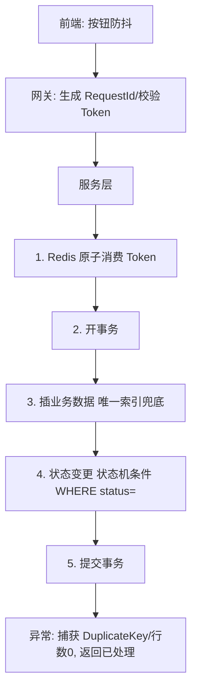

# 幂等设计

> 网络是不可靠的。超时、用户手抖、网关重试、MQ 重复投递，都会让同一请求到达多次。幂等设计就是让"重试"变得安全——这是分布式系统的安全带。

本文与「[长连接](长连接.md)」的消息可靠投递（At-Least-Once + 去重）一脉相承，也与「[分布式锁](分布式锁.md)」互补：锁串行化临界区，幂等兜底重复请求。

## 一、什么是幂等

数学定义：`f(f(x)) = f(x)`。API 语义里：**同一条件的请求，无论调用多少次，服务端产生的副作用与返回结果都一致**。

| 操作 | 是否天然幂等 | 说明 |
|------|------------|------|
| GET / HEAD | 是 | 查询不改变状态 |
| PUT / DELETE | 协议定义是 | 但复杂业务逻辑仍需额外控制 |
| POST | 否 | 创建/扣减通常非幂等，必须设计 |

**正反案例**：支付扣款重试两次 → 只扣一次钱 ✅；创建订单重试两次 → 只生成一笔订单 ✅。无幂等保障则资损、脏数据、逻辑错乱。

## 二、为什么必须做（痛点）

分布式环境下重复请求的来源：网络超时重试、用户连点、前端 Retry、MQ 至少一次投递、微服务框架（Dubbo/Feign）超时重试。**只要改变业务状态的接口，都必须幂等**——尤其是资金、库存、订单、优惠券。

## 三、七大实战方案

### 1. 数据库唯一索引（最可靠兜底）
```sql
CREATE TABLE t_order (
  id int PRIMARY KEY AUTO_INCREMENT,
  code varchar(64) NOT NULL,
  UNIQUE uk_code (code)         -- 订单流水号唯一
);
```
重复插入触发 `DuplicateKeyException`，捕获后返回已有结果。适合**创建类**操作。

### 2. 乐观锁（更新类首选）
```sql
UPDATE account SET balance = balance - 100, version = version + 1
WHERE id = 1 AND version = 1;   -- 版本不匹配则影响行数=0
```
并发重复时 version 已变，更新失效，代码判 `rows==0` 即视为重复/冲突。适合余额扣减、库存修改。

### 3. 状态机（业务语义幂等）
```sql
UPDATE orders SET status = 'PAID' WHERE id = 123 AND status = 'CREATED';
```
利用状态单向流转：重复支付时状态已是 PAID，影响行数 0，逻辑自然终止。适合订单/审批流。

### 4. 防重表 / 流水表（通用）
```sql
CREATE TABLE deduplication (
  id int PRIMARY KEY AUTO_INCREMENT,
  processed_code varchar(64) NOT NULL,
  UNIQUE uk_code (processed_code)
);
```
处理前插入业务流水号，冲突即重复。必须与业务操作**同一事务**（回滚则去重记录一起回，否则"记录写了业务没成"不一致）。适合 MQ 消费去重、跨库业务。

### 5. Token 令牌机制（防表单重复提交）
```java
// 1. 进入页面获取 Token, 存 Redis 5 分钟
String token = UUID.randomUUID().toString();
redis.setex("submit_token:" + token, 300, "1");
// 2. 提交时校验并原子删除(Redis 6.2+ GETDEL / Lua)
Long deleted = redis.getDel("submit_token:" + token);
if (deleted == 0) return Result.fail("请勿重复提交");
// 3. 再执行业务
```
> ⚠️ 用 `GETDEL`/Lua 做"校验+删除"原子操作，不能先 GET 再 DEL（并发下可能都通过）。

### 6. 唯一请求 ID / 业务单号
网关/客户端为每个请求生成全局 Request-ID 或业务单号，服务端查去重表，未处理才执行并缓存结果。

### 7. MQ 消息去重消费
消费者以 Message-ID / 业务主键查去重表，未处理才执行并记消费结果，再提交 Offset。

## 四、组合拳（生产推荐）

金融/电商高并发典型组合：**Token + 唯一索引 + 状态机**。



| 场景 | 首选方案 | 原因 |
|------|---------|------|
| 创建订单/注册 | 业务唯一键 + 唯一索引 | 数据库底层保证，绝对不重复 |
| 支付回调 | 状态机 + 去重表 + 分布式锁 | 状态防回退，流水防重复入账 |
| 扣余额/扣库存 | 乐观锁 / 状态机 | 防并发错乱 |
| 前端连点 | Token 机制 | 体验好，源头防重 |
| MQ 消费 | 消息ID + 唯一索引 | 去重消费 |

## 五、常见误区与注意事项

> ⚠️ **四大坑**：
> 1. **只靠前端不够**：按钮置灰可绕过（抓包重放），服务端必须兜底。
> 2. **幂等 ≠ 阻塞**：重复请求应快速返回结果，而非让第二个请求干等（除非用锁且允许等，通常直接返回）。
> 3. **返回结果要一致**：第一次返回成功，第二次最好也返回成功及相同数据（资金类尤其）。
> 4. **清理机制**：Redis 去重记录务必设 TTL（> 重复窗口期，如 24h），防内存膨胀。

- 优先级原则：能用业务唯一键解决 → 优先；能用唯一索引兜底 → 别只靠缓存；有状态流转 → 用状态机；需串行临界区 → 才上分布式锁。
- 性能权衡：Redis 锁/去重表增加 RT；低频非核心（如点赞）可适度容忍少量重复 + 事后对账；资金类必须严格多层兜底。

## 六、幂等 vs 分布式锁（别搞混）

| 维度 | 分布式锁 | 幂等设计 |
|------|----------|----------|
| 目标 | **互斥**：同一时刻只允许一个执行 | **去重**：重复请求只生效一次（可串行可并发） |
| 粒度 | 临界区串行化 | 结果唯一 |
| 典型场景 | 定时任务互斥、库存扣减临界区 | 支付回调、订单创建、MQ 消费 |
| 关系 | 锁是过程控制 | 幂等是结果保证 |
| 组合 | 锁 + 幂等双保险：锁防并发进入，幂等兜底重放 |

> 一句话：**锁管「同一时间只一人进」，幂等管「同一请求只生效一次」**。支付回调这种「并发到达 + 重试到达」双风险场景，两者都要上（呼应 [支付系统设计](支付系统设计：回调、幂等与对账.md)）。

## 七、面试高频追问

1. Q：POST 一定不幂等吗？ A：协议上 POST 不保证幂等，但业务可以设计成幂等（业务单号 + 唯一索引）。
2. Q：幂等键放哪里？ A：请求头（网关生成 Request-Id）或业务字段（订单号/流水号），服务端统一解析。
3. Q：去重表和业务操作不一致怎么办？ A：必须在**同一事务**提交；或用事务消息，先发后办、办完回执。
4. Q：Redis 去重挂了怎么办？ A：降级到 DB 唯一索引兜底；Redis 只做第一道快速拦截。
5. Q：怎么保证「第二次返回和第一次一致」？ A：记录处理结果（如订单表存返回体），重复请求直接回查缓存结果。
6. Q：多机部署下的幂等有什么额外要求？ A：判定必须走共享存储（DB 索引/Redis），不能靠本地内存；注意时钟与事务边界。

> 参考：阿里 Java 开发规约、美团/得物技术博客（并发与幂等）、Martin Fowler 关于 Idempotency 的讨论、HTTP 语义规范（RFC 7231）。
