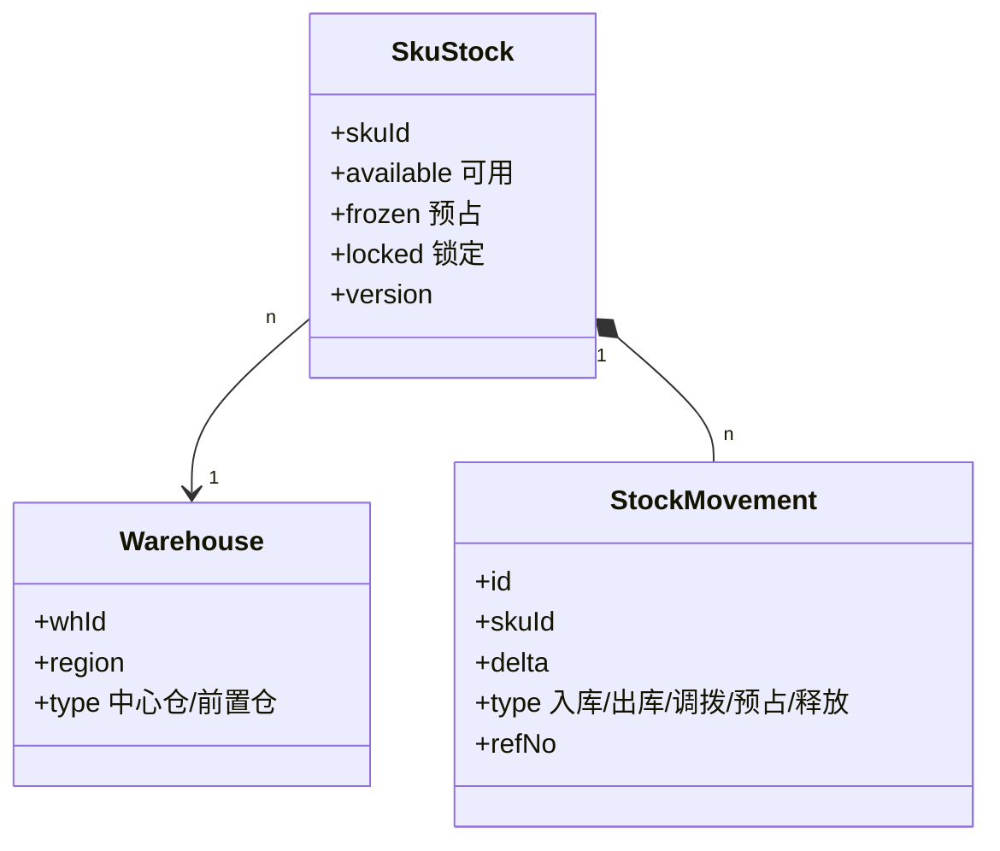

# 库存与仓储系统设计实战

> 库存是电商与零售的"生命线"，错一分就资损，慢一秒就超卖。它要在高并发扣减、多仓调拨、预占释放之间维持精确一致，是分布式系统中最考验正确性的场景之一。

## 1. 库存模型



## 2. 扣减核心：预占 + 实扣

- **预占（frozen）**：下单时冻结，不减少可用。
- **实扣**：支付成功后 frozen→0、available 减少。
- **释放**：取消/超时，frozen 回退 available。

```redis
-- Lua 原子扣减预占
local a = tonumber(redis.call('HGET', KEYS[1], 'available'))
local f = tonumber(redis.call('HGET', KEYS[1], 'frozen'))
if a - f >= tonumber(ARGV[1]) then
  redis.call('HINCRBY', KEYS[1], 'frozen', ARGV[1])
  return 1
end
return 0
```

## 3. 多仓与寻仓

- **库存分层**：中心仓（深库存）+ 前置仓（近用户、快时效）。
- **寻仓策略**：就近 + 有货 + 成本最优，按区域路由。
- **调拨**：基于销量预测在仓间调拨，平衡水位。

## 4. 一致性保障

| 方案 | 适用 | 取舍 |
| --- | --- | --- |
| 单库事务 | 单仓低并发 | 强一致但扩展差 |
| Redis 预占 + DB 落账 | 高并发 | 最终一致，需对账 |
| 分库分表 + 冗余 | 海量 SKU | 复杂但可扩展 |

## 5. 热点与超卖防控

- **热点 SKU**：库存拆分到多个 sub-key，扣减时随机选，降低单 key 竞争。
- **超卖兜底**：DB 层加 `available >= 0` 约束，扣减失败回滚预占。
- **对账**：每日将 Redis 预占与 DB 实际库存比对，差异告警。

## 6. 常见坑

| 坑 | 现象 | 对策 |
| --- | --- | --- |
| 超卖 | 卖多于库存 | 原子扣减 + 约束 |
| 预占未释放 | 库存"假空" | 超时任务释放 |
| 跨仓不一致 | 显示有货发不出 | 寻仓前校验真实库存 |
| 缓存与DB漂移 | 数字对不上 | 对账 + 校正 |
| 大促雪崩 | Redis 打满 | 本地缓存 + 限流 |

## 7. 面试题

1. 预占和实扣为什么要分开？
2. 如何用 Redis + Lua 防超卖？
3. 多仓库存如何寻仓？
4. 库存与订单如何对账？
5. 热点 SKU 库存如何拆分？

## 8. 小结

库存系统 = 预占实扣模型 + 原子扣减 + 多仓寻仓 + 对账兜底。正确性的优先级永远高于性能，一切以"不超卖、可对账"为底线。
