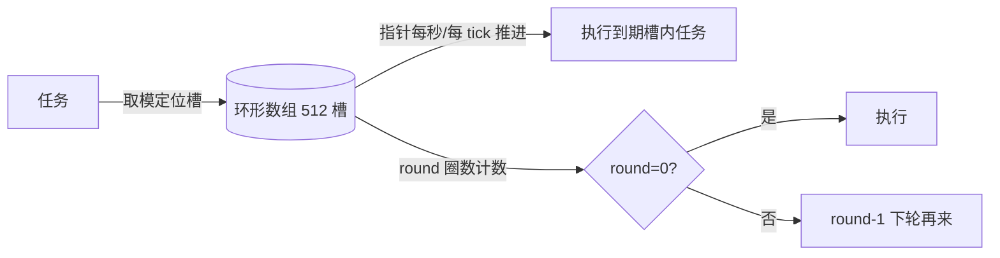
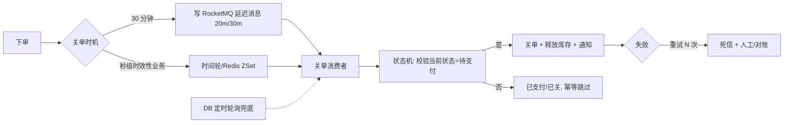

# 延迟任务与订单超时关闭

## 〇、本体介绍

**延迟任务**：一个任务在"未来某时刻"执行——订单超时未支付自动关闭、支付后超时未回调、优惠券到期提醒、直播开播提醒。最典型的是**订单超时关闭**（30 分钟未支付自动取消）。

**核心矛盾**：
1. 任务量大（千万级订单）、精度要求不一（秒级 vs 分钟级）；
2. 方案众多（轮询/延迟队列/时间轮/MQ 延迟消息），**没有银弹，必须按精度分级**；
3. 关单动作必须**幂等**（重复执行不产生副作用）。

**核心主线**：方案谱系对比 → 时间轮原理 → Redis ZSet 方案 → RocketMQ 延迟消息 → 生产分级组合 → 幂等关单。

---

## 一、方案谱系对比（面试常考全景）

| 方案 | 精度 | 容量 | 复杂度 | 适用 |
|------|------|------|--------|------|
| **DB 轮询**（定时扫 created_at） | 分钟级 | 千万级（靠索引+分批） | 低 | 起步最简 |
| **JDK DelayQueue** | 高 | 单机内存 | 低 | 单机小量 |
| **Redis ZSet 扫描** | 秒级 | 千万级（内存有限） | 中 | 中等规模 |
| **Redisson DelayedQueue** | 秒级 | 受内存 | 低 | Spring 生态 |
| **RocketMQ 延迟消息** | **分级固定**（18 级） | 千万+ | 低 | 分钟级延迟主流 |
| **时间轮（HashedWheelTimer/Netty）** | 高（毫秒） | 内存受限 | 中 | 秒级/毫秒级海量 |
| **Kafka 死信队列（延迟队列技巧）** | 秒级 | 大 | 高 | 自定义场景 |

> 面试核心结论：**没有万能方案，按精度分级组合**——毫秒/秒级走时间轮，分钟级走 MQ 延迟消息，兜底走 DB 轮询。

---

## 二、时间轮原理（HashedWheelTimer）



- **数据结构**：环形数组 + 每槽一个任务链表；指针按固定 tick 推进。
- **圈数（round）**：任务到期需要经过多轮才执行 → 任务挂链表上带 `round` 计数，每轮 -1，为 0 才执行。
- **复杂度**：插入 O(1)、推进 O(每 tick 到期任务数)；Netty `HashedWheelTimer`、Kafka 的 Timer（分层时间轮）、RocketMQ 定时消息都用它。
- **缺点**：内存驻留（任务都堆在内存），海量任务占内存；进程重启丢任务 → 需配合持久化兜底。

```java
// Netty HashedWheelTimer 示例：5s 后执行
HashedWheelTimer timer = new HashedWheelTimer();
timer.newTimeout(t -> closeOrder(orderId), 5, TimeUnit.SECONDS);
```

---

## 三、Redis ZSet 方案（秒级、中等规模）

### 3.1 原理

- `ZADD delay:order <到期时间戳> <订单id>`，member=任务、score=到期时间。
- 定时扫描 `ZRANGEBYSCORE delay:order -inf now`（拿已到期任务），执行后 `ZREM`。
- 用 `ZSET` 保证"按到期时间有序"，取到期集合 O(log n + m)。

```bash
# 下单 30 分钟 = now+1800s
ZADD delay:order 1730000000 order_10086
# 每 1s 扫一次到期任务
ZRANGEBYSCORE delay:order -inf 1729998200 WITHSCORES
# 执行成功删除；失败留下轮重试
ZREM delay:order order_10086
```

### 3.2 关键细节

- **多实例消费要抢锁/用 Lua 原子**：`ZRANGEBYSCORE` + `ZREM` 必须原子（Lua 或 Redisson 锁），防多实例重复执行。
- **任务失败重试**：执行失败不 ZREM，标记重试次数；超限进死信。
- **容量**：内存受限（订单量 1000 万 × 50B ≈ 500MB，可接受但要注意 TTL 清理）。
- **与 Redisson DelayedQueue**：封装好的 `RBlockingDeque` + `RDelayedQueue`，原理即 ZSet + 阻塞队列，Spring 项目最快落地。

---

## 四、RocketMQ 延迟消息（分钟级主流）

- **RocketMQ** 内置 **18 个固定级别**：1s 5s 10s 30s 1m 2m 3m 4m 5m 6m 7m 8m 9m 10m 20m 30m 1h 2h（`Message.setDelayTimeLevel()`）。
- 原理：消息先落**延迟队列**，`ScheduleMessageService` 到点后投递到真实 topic（内部用延迟级别队列 + 时间轮）。
- **优点**：消息持久化、不丢、支持海量、消费天然带重试与幂等。
- **局限**：**精度是固定级别**（没有 90s 级别；30m 之后直接 1h）；业务要自定义时长需改配置或自研。
- 替代：Kafka 无原生延迟消息 → 用"延迟 topic + 死信/时间轮"自己拼，或换 RocketMQ/Pulsar（`delayed`）。

```java
Message msg = new Message("order-topic", "close", body);
msg.setDelayTimeLevel(9); // 第 9 级 = 10 分钟（30 分钟关单用 20m=16 级或自定）
producer.send(msg);
```

---

## 五、生产组合方案（推荐架构）



**分层原则**：
1. **秒级/毫秒级**（开播提醒、会话过期）→ 时间轮（单机）或 Redis ZSet（分布）。
2. **分钟级固定档**（30 分钟关单、支付超时）→ **RocketMQ 延迟消息**（最稳、不丢）。
3. **兜底**（一切延迟任务都可能丢）→ **DB 轮询扫描**（每 5 分钟扫超时未关订单），保证最终关闭。
4. **幂等**：关单消费者校验订单状态机，**重复执行无害**。

> 口诀：**"秒级时间轮，分钟走延迟消息，兜底 DB 轮询，关单必幂等。"**

---

## 六、订单超时关闭业务细节

- **状态机**：`待支付 → (超时) 已关闭`；`待支付 → (已支付) 已支付`。并发场景（支付成功与关单同时发生）靠**状态校验 + 乐观锁/分布式锁**保证只有一个生效（见「[幂等设计](幂等设计.md)」「[分布式锁](分布式锁.md)」）。
- **关单动作**：改状态 → 释放库存/优惠券 → 通知（可异步）。
- **半开处理**：关单后发现已支付（竞态）→ 补偿（恢复订单、回补库存流水）→ 对账兜底。
- **性能**：关单是低频（远小于下单），消费者线程数不必大；但**延迟消息堆积要监控**（见「[SRE与稳定性工程/06-日志与告警规则库](../SRE与稳定性工程/06-日志与告警规则库.md)」MQ 堆积告警）。

---

## 七、与其他板块的关系

- **Redis 知识**：ZSet 数据结构；Redisson DelayedQueue 实现原理。
- **中间件/任务调度 XXL-JOB**：DB 轮询类定时任务的调度平台。
- **中间件/分布式事务 Seata**：关单与库存释放的最终一致（消息驱动）。
- **幂等设计**：关单/补偿的幂等保障。
- **业务模型/电商**：超时关单是订单核心状态流转。

---

## 八、速查表

| 方案 | 精度 | 容量 | 一句话 |
|------|------|------|--------|
| DB 轮询 | 分钟 | 千万+ | 兜底/起步方案 |
| DelayQueue | 高 | 单机小 | 进程内简单 |
| Redis ZSet | 秒 | 千万 | ZRANGEBYSCORE + 原子 ZREM |
| Redisson DelayedQueue | 秒 | 受内存 | Spring 最快落地 |
| RocketMQ 延迟 | 固定 18 级 | 千万+ | 分钟级主流 |
| 时间轮 | 毫秒 | 内存 | Netty/Kafka 内部 |
| 组合 | 分级 | — | 秒级时间轮+分钟级 MQ+兜底轮询 |

---

## 面试高频问题（15+ 条）

1. **订单 30 分钟未支付怎么关？** 分级：RocketMQ 延迟消息（30m 级）+ DB 轮询兜底；秒级需求用时间轮/Redis ZSet。
2. **延迟消息有哪些实现？** 轮询、DelayQueue、Redis ZSet、MQ 延迟消息、时间轮。
3. **时间轮原理？** 环形数组 + 槽链表 + 指针推进 + round 圈数计数；插入 O(1)。
4. **时间轮缺点？** 任务全在内存、重启丢；海量任务占内存，需持久化兜底。
5. **Redis ZSet 做延迟队列？** score=到期时间，ZRANGEBYSCORE 取到期任务，原子 ZREM。
6. **多实例消费延迟任务怎么防重复？** Lua 原子取删或分布式锁。
7. **RocketMQ 延迟消息有什么限制？** 固定 18 个级别，无自定义时长；30m 后直接 1h。
8. **延迟消息投递原理？** 先入延迟队列，ScheduleMessageService 到点再投真实 topic。
9. **Kafka 能做延迟消息吗？** 无原生支持，需自研（延迟 topic/死信）或换 RocketMQ/Pulsar。
10. **关单和支付同时发生怎么办？** 状态机校验 + 乐观锁/分布式锁；先到者生效，失败方补偿。
11. **关单要做什么？** 改状态、释放库存/券、异步通知；动作可重试。
12. **关单失败怎么办？** 重试 N 次 → 死信队列 → 人工/对账兜底。
13. **为什么需要 DB 轮询兜底？** 所有延迟任务都可能丢（重启/堆积），轮询保证最终一致。
14. **关单消息堆积怎么监控？** consumer_lag 告警（MQ 堆积 P1）。
15. **哪些场景用延迟任务？** 超时关单、支付超时回调、到期提醒、定时推送。
