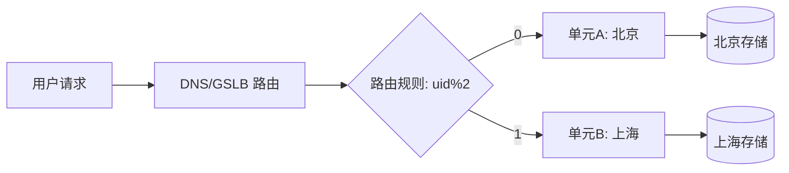
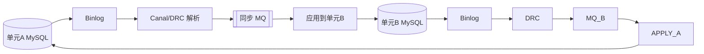

# 异地多活

> 异地多活 = 多个地理区域同时对外提供服务（Multi-Active），任一区域故障不影响全局可用性。是高可用架构的终极形态。


## 一、核心目标与概念

异地多活 = **多个地理区域同时对外提供服务（Multi-Active）**，任一区域故障不影响全局可用性。对比：

| 架构 | 特点 | 缺陷 |
|------|------|------|
| 同城主备 | 主机房宕机切备 | RTO 较大、备机资源闲置 |
| 异地冷备 | 异地备份不接流 | 故障切换慢、数据可能丢失 |
| 异地多活 | 多区域同时接流 | 一致性/冲突成本高，但可用性最强 |

## 三、单元化（Unitization）

- 将业务按 **分流维度（user_id / 订单号取模）** 切分为"单元"，每个单元自包含（接入+应用+存储）。
- 用户请求被路由到**归属单元**，单元内闭环，跨单元调用尽量少。



## 四、路由策略

- **接入层路由**：DNS/GSLB、网关按分流键计算归属单元。
- **流量染色**：请求携带 `routeKey`，全链路透传，防止跳单元。
- **逃生路由**：单元故障时，流量切到就近单元（可能跨单元访问，需评估一致性）。

## 五、数据同步与冲突解决

- **同步通道**：binlog（Canal/DRC）+ MQ 双向复制；DTS 跨地域同步。
- **冲突解决**：
  - 单元内写、异步同步，冲突靠**业务主键（如订单号全局唯一）**天然避免。
  - 真冲突场景用 CRDT / 最后写入获胜（LWW）/ 时间戳仲裁。
- **一致性级别**：单元内强一致，跨单元最终一致。

## 六、容灾切换

1. **故障检测**：拨测 + 心跳 + 业务指标（错误率/RT）。
2. **流量调度**：GSLB 切走故障单元流量到健康单元。
3. **数据补偿**：故障恢复后补同步增量，校验数据差异。
4. **演练**：定期混沌演练，验证 RTO/RPO。

## 七、踩坑与权衡
- **跨单元写**：务必避免，否则一致性成本指数级上升。
- **热点用户**：少数超大用户跨单元，需特殊处理（专用单元）。
- **同步延迟**：跨地域延迟下，读己之写需单元内闭环保证。
- **成本**：多区域全量部署成本高，按业务重要性分级多活。

## 八、单元化路由具体算法

单元化核心是"分流键 → 单元"的稳定映射。常见算法：

| 算法 | 公式 | 优点 | 缺点 |
|------|------|------|------|
| 取模路由 | `uid % N` | 简单均匀 | 扩单元需数据迁移 |
| 一致性哈希 | `hash(uid) % 2^32` 落环 | 扩缩容影响小 | 需虚拟节点防倾斜 |
| 查表路由 | uid → unit 映射表 | 灵活（可手动调度） | 多一次查表/依赖存储 |
| 号段分配 | 用户注册时分配归属单元 | 不变更、好迁移 | 需注册期决策 |

```mermaid
flowchart LR
    R[请求] --> H[计算 routeKey=hash(uid)]
    H --> C{一致性哈希环}
    C --> U1[单元A]
    C --> U2[单元B]
    C --> U3[单元C]
```

**路由规则下发**：路由表放配置中心，网关/SDK 本地缓存，变更秒级生效；逃生时把某单元流量整体切走。

## 九、数据同步链路（DRC / Canal / otter）



- **Canal**：伪装 slave 解析 binlog，单链路简单，适合单向/小规模。
- **DRC（阿里/字节）**：支持双向同步、冲突检测、过滤与转换，多活首选。
- **otter**：基于 Canal 的异地双向同步，含冲突处理与校验。
- **注意**：同步需过滤掉"由对端同步过来的事件"，避免回环（加 `source` 标记）。

## 十、冲突解决（去重 / 时间戳 / 业务补偿）

- **天然避免**：同一业务主键（订单号/用户ID）只在归属单元写，跨单元不写 ⇒ 无冲突。
- **真冲突场景**（如全局配置、库存）：
  1. **去重**：以全局唯一 `opId` 幂等应用，重复事件丢弃。
  2. **时间戳仲裁（LWW）**：取 `max(ts)`，适合可覆盖数据。
  3. **CRDT**：计数器类用 PN-Counter，自动合并。
  4. **业务补偿**：金额/库存类不允许丢，触发对账与人工/自动冲正。

## 十一、容灾切换演练 SOP

1. **预案**：明确每个单元的"逃生单元"，切换影响面评估。
2. **检测**：拨测 + 业务错误率 + 同步 Lag 多维判定故障。
3. **决策**：满足切换条件（如错误率>5% 持续 1min）→ 一键切 GSLB。
4. **执行**：GSLB 把故障单元 `uid%N` 流量切到逃生单元（跨单元访问，读本地/写远端或拒绝写）。
5. **恢复**：故障单元修复后，先追平同步 Lag，再做"反向切回"或保持。
6. **复盘**：记录 RTO/RPO 实际值，更新预案。

> RTO 目标：< 5min（DNS 缓存可能拖到 10min，故重要域名用短 TTL 或 HTTPDNS）。

## 十二、支付 / 交易多活难点

- **资金一致性**：跨单元转账/支付不能丢不能重，必须单元内闭环 + 全局账务核对。
- **全局唯一流水号**：交易号需跨单元唯一（号段/雪花 + 单元前缀）。
- **对账**：日终/实时对账发现跨单元金额偏差，自动冲正。
- **强一致写入**：少数核心（账户余额）采用"单 unit 写 + 异步广播只读副本"，牺牲部分可用性换一致。
- **合规**：部分国家要求数据不出境，多活需满足数据驻留（data residency）。

## 十三、踩坑与权衡（深入）

- **脑裂**：双中心同时认为对方故障并接管写 ⇒ 数据分叉。需"租约/仲裁节点"防止双主。
- **同步 Lag 与读己之写**：用户在自己单元写后立即读，若被路由到远端单元会读不到 ⇒ 需 sticky 路由。
- **扩单元成本**：取模路由扩 N 需迁移大量数据，建议新业务直接用一致性哈希或查表路由。

## 十四、多活灰度发布与架构对比

### 灰度发布（基于单元）
1. 新版本先发"灰度单元"（小比例 uid 区间）。
2. 流量按 `uid % 100` 切 1% 到灰度单元，观察错误率/RT。
3. 逐步放大到 10% → 50% → 100%，每步校验同步 Lag 与对账。
4. 异常一键回滚到旧版本单元。

### 多活架构对比
| 维度 | 同城双活 | 异地多活（2 中心） | 三地五中心 |
|------|----------|--------------------|------------|
| 延迟 | < 2ms | 50-200ms | 跨洲 > 200ms |
| RTO | 秒级 | 分钟级 | 分钟级 |
| 成本 | 中 | 高 | 极高 |
| 一致性 | 近实时 | 最终一致 | 最终一致 |
| 适用 | 多数业务 | 核心交易 | 金融/监管 |

### 数据驻留（合规）
- 欧盟 GDPR、中东数据本地化要求数据不出境 ⇒ 多活需在对应区域独立闭环，禁止跨境同步 PII。
- 解法：按"数据主权域"切分，仅同步非 PII 的聚合指标。

## 十五、多活接入层设计与容灾指标

### 接入层
- **GSLB/HTTPDNS**：按地域 + 单元健康返回就近单元 IP，支持秒级切流。
- **网关染色**：请求进单元即打 `routeKey` 标签，全链路透传，防止业务逻辑误跳单元。
- **逃生通道**：故障单元流量整体切到逃生单元，逃生单元按"只读/降级写"策略接流。

### 容灾指标
| 指标 | 目标 | 说明 |
|------|------|------|
| RTO | < 5min | GSLB 切流 + 应用就绪 |
| RPO | 0（最终一致） | 异步同步，零数据丢失不可达，靠补偿 |
| 同步 Lag | < 500ms | 跨域数据延迟 |
| 切换成功率 | 100% | 自动化切换不走人工 |

### 演练频率
- 单元级故障演练：月度；
- 区域级演练：季度；
- 真实切流（带业务校验）：半年一次。

## 十六、多活与单活的成本权衡

多活不是银弹，需按业务重要性决策：

| 业务 | 建议架构 | 理由 |
|------|----------|------|
| 核心交易/支付 | 异地多活 | 可用性 > 成本 |
| 中频业务 | 同城双活 | 性价比高 |
| 内部系统/长尾 | 主备/单活 | 成本低，RTO 可接受 |

- 多活新增成本：双份存储、同步链路、治理人力。
- 决策原则：资损/口碑影响 × 发生概率 > 多活成本 ⇒ 上多活。
- 渐进式：先核心多活，再逐步把边缘业务纳入，避免一次性齐活的高成本。
