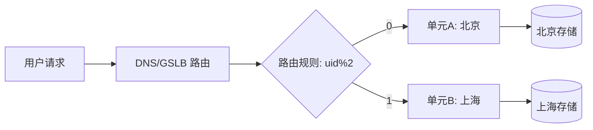

# 异地多活

> 以下内容为笔记截图，保留原图便于查阅，未做文字转录。

## 二、核心目标与概念

异地多活 = **多个地理区域同时对外提供服务（Multi-Active）**，任一区域故障不影响全局可用性。对比：

| 架构 | 特点 | 缺陷 |
|------|------|------|
| 同城主备 | 主机房宕机切备 | RTO 较大、备机资源闲置 |
| 异地冷备 | 异地备份不接流 | 故障切换慢、数据可能丢失 |
| 异地多活 | 多区域同时接流 | 一致性/冲突成本高，但可用性最强 |

## 三、单元化（Unitization）

- 将业务按 **分流维度（user_id / 订单号取模）** 切分为"单元"，每个单元自包含（接入+应用+存储）。
- 用户请求被路由到**归属单元**，单元内闭环，跨单元调用尽量少。

## 四、路由策略

- **接入层路由**：DNS/GSLB、网关按分流键计算归属单元。
- **流量染色**：请求携带 `routeKey`，全链路透传，防止跳单元。
- **逃生路由**：单元故障时，流量切到就近单元（可能跨单元访问，需评估一致性）。

## 五、数据同步与冲突解决

- **同步通道**：binlog（Canal/DRC）+ MQ 双向复制；DTS 跨地域同步。
- **冲突解决**：
  - 单元内写、异步同步，冲突靠**业务主键（如订单号全局唯一）**天然避免。
  - 真冲突场景用 CRDT / 最后写入获胜（LWW）/ 时间戳仲裁。
- **一致性级别**：单元内强一致，跨单元最终一致。

## 六、容灾切换

1. **故障检测**：拨测 + 心跳 + 业务指标（错误率/RT）。
2. **流量调度**：GSLB 切走故障单元流量到健康单元。
3. **数据补偿**：故障恢复后补同步增量，校验数据差异。
4. **演练**：定期混沌演练，验证 RTO/RPO。

## 七、踩坑与权衡
- **跨单元写**：务必避免，否则一致性成本指数级上升。
- **热点用户**：少数超大用户跨单元，需特殊处理（专用单元）。
- **同步延迟**：跨地域延迟下，读己之写需单元内闭环保证。
- **成本**：多区域全量部署成本高，按业务重要性分级多活。
