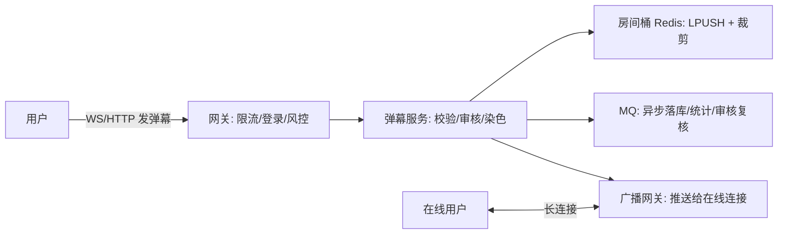

# 弹幕系统设计（直播/视频弹幕）

## 〇、本体介绍

**弹幕**：用户在观看直播/视频时发送的**实时短消息**，需要**毫秒级发布、秒级广播到同房间所有在线用户**，还要叠加密度控制、审核、染色、关键词笑点等体验处理。属于「直播/视频业务中延迟最敏感的读写场景」。

**核心难点**：
1. **广播时效**：一条弹幕要从直播间 10 万在线用户都看到，< 500ms；
2. **写入风暴**：大主播直播间峰值可上万条/秒（代入感强、刷屏），不能把 DB 打穿；
3. **体验控制**：弹幕不能太多挤爆屏幕、不能有脏话/违规（审核）、要能定位刷屏机器人；
4. **用户状态**：进房/退房实时感知（在线数、弹幕分发目标集合）。

**核心主线**：发布 → 校验/审核 → 入房间桶 → 广播（长连接）→ 秒级落库（可按需）→ 回放加载。

---

## 一、需求与指标

| 项目 | 要求 |
|------|------|
| 发布 → 同房间可见延迟 | < 500ms（直播弹幕） |
| 峰值写入 | 单房间上万条/秒，平台级百万/秒 |
| 在线人数/房间 | 头部直播间 10 万+ 在线 |
| 可靠性 | 允许丢少量弹幕（非资金），但不能把服务打挂 |
| 审核 | 涉政/色情/广告词等即时拦截（自研词表 + AI 模型降级） |

> **与 IM 的本质差异**：IM 是一对一/小群「点对点实时」，弹幕是**大房间「一对多广播 + 高并发写入」**——发布同样频繁，但**广播是核心差异点**。因此弹幕几乎不用「消息存库 + 客户端拉」模型（拉不动），而是**推为主**。

---

## 二、整体架构：推模式 vs 拉模式

| 模式 | 做法 | 优缺点 |
|------|------|--------|
| 推（Push） | 发布 → 服务端直接广播到在线通道 | 延迟低（<500ms），但**广播压力随在线数线性增长** |
| 拉（Pull） | 客户端定时轮询新弹幕 | 实现简单，但 1s 级延迟 + 轮询放大流量 |
| 推拉结合 | 直播用推，回放/离线用拉 | 主流：直播推、历史拉 |

**选型结论**：直播弹幕必须**推**（长连接通道，见「[长连接](长连接.md)」），回放弹幕用**拉**（定时加载 + 游标）。

### 2.1 发布链路（写路径）



- 弹幕内容**先内存校验**（长度/表情/敏感词快速命中），再入 Redis 房间桶；
- **广播与落库分离**：广播走内存/长连接即时送达，落库走 MQ 异步（弹幕可容忍少量丢失）。

---

## 三、房间桶：Redis 的 3 个关键用法

### 3.1 在线集合（广播目标）

```
key = room:{roomId}:online    SET: userId 集合（进房 SADD + TTL 续期）
广播时: 遍历集合推连接        ← 或由网关维护在线连接表, 按房间分片
```

> 在线集合的更新（进房/退房）**不阻塞弹幕发布**：广播基于「连接注册表」而非实时查询 SET，在线集合只用于统计与离线补偿。

### 3.2 弹幕桶（限尺寸 + 防刷屏）

```
key = room:{roomId}:barrage   LIST：LPUSH 弹幕, 超长 LTRIM 只留最新 500 条
```

- **房间弹幕桶** = 回放/迟到用户的「最近弹幕」来源（避免冷启动要拉库）；
- 展示端**密度控制**：客户端按屏幕宽度对弹幕做「每屏最多 N 条」编排，服务端只保证送达，不保证全展示。

### 3.3 频率控制（防刷屏/防机器人）

```
key = user:{uid}:barrage:rate   INCR + EXPIRE 1s → 每秒最多 3 条
key = room:{roomId}:barrage:rate 房间级总量限流, 超限丢弃低优先级
```

> 刷屏机器人特征：同 IP 高频、同文案、无观看时长、批量账号——频控只是第一道，风控模型在离线侧做画像（呼「[AB 测试与实验平台设计](AB测试与实验平台设计.md)」）。

---

## 四、广播细节：长连接与降级

### 4.1 连接管理

| 方案 | 说明 |
|------|------|
| WebSocket（推荐） | 双向、低延迟、HTTP 升级兼容 |
| SSE | 单向推送，天然重连，配合 HTTP/2 多路复用 |
| 轮询兜底 | WebSocket 连不上时 1s 轮询「增量接口」 |

- 每个房间的在线连接**按节点分片**（连接挂在哪个接入节点，就由该节点负责广播），局域网内节点间通过 MQ/共享内存互转（小房间可单节点）。
- 重连恢复：断线重连后拉**最近桶内弹幕**（Redis 桶）补上下文。

### 4.2 广播压力控制（百万在线的关键）

- **扇形广播**：大房间的广播不是「一条消息发给 10 万个连接」，而是**每个接入节点只向本节点的连接广播**（节点内扇出），跨节点只发一个副本；
- **批量压缩**：同房间多条弹幕合并为一个批次（如 200ms 一帧）广播，减少协议开销；
- **丢帧策略**：节点过载时**丢弃低优先级弹幕**（普通用户）保 VIP/官方弹幕，绝不拖垮连接。

---

## 五、审核：即时 + 异步双重

| 层 | 手段 | 延迟 |
|----|------|------|
| 第一层（即时） | 本地词库（内存 Bloom/AC 自动机）快速拦截明显违规 | <1ms |
| 第二层（秒级） | 语义模型（图/文本分类），命中转人工 | 秒级 |
| 第三层（异步） | 全量弹幕异步复核 + 用户画像更新 | 分钟级 |

- **「先发后审」还是「先审后发」**：直播弹幕为了体验通常**先发后审**（违规弹幕靠后续删除 + 提交记录追责）；金融/政务直播间可配置**先审后发**（牺牲体验保合规）。
- 违规弹幕在广播后被发现：统一广播「删除指令」给在线客户端，弹幕内容可被撤回。

---

## 六、持久化与回放

- 弹幕落库选 **MQ → 时序/文档存储**（如 ClickHouse/TiDB），按 `roomId + 时间` 分区；
- 回放加载用**游标分页 + 按时间切片批量拉取**（弹幕历史几百万条/热门直播，不做全量一次性加载）；
- 「时间轴对齐」：回放弹幕必须与视频时间戳对齐，存库时记录 `videoTime`。
- 高频弹幕区（名场面）可预计算索引，回放跳转到名场面时秒级出数据。

---

## 七、速查表

| 主题 | 一句话 |
|------|--------|
| 广播 | 长连接推为主；接入节点内扇出 + 批次合并 |
| 房间在线 | Redis SET/连接注册表，进房 SADD 续期 |
| 弹幕桶 | LPUSH + LTRIM 留最新 500 条，重连/回放兜底 |
| 防刷屏 | 用户级 + 房间级 Redis 频控 |
| 审核 | 内存词库即时 + 语义模型秒级 + 异步复核 |
| 落库 | MQ 异步 → ClickHouse 分区，回放游标分页 |
| 降级 | 节点过载丢低优先级弹幕，保连接稳定 |

---

## 八、面试高频追问（10+）

1. Q：弹幕用推还是拉？ A：直播必须推（长连接，<500ms）；回放/历史用拉（游标分页）。推拉结合。
2. Q：10 万人在线怎么广播？ A：接入节点分片，广播只在本节点扇出，跨节点一个副本；批次合并（200ms 一帧）+ 压缩。
3. Q：弹幕存哪？ A：Redis 房间桶（热）+ MQ 异步落库到 ClickHouse/TiDB（持久化回放），按房间+时间分区。
4. Q：怎么防刷屏？ A：Redis 用户级/房间级频率限制（INCR+EXPIRE），超限丢弃；离线风控画像识别机器人。
5. Q：弹幕审核怎么做？ A：三层：内存词库即时拦截 + 语义模型秒级 + 异步全量复核；直播默认先发后审。
6. Q：断线重连怎么补弹幕？ A：重连后从房间桶（Redis 最新 500 条）拉增量，避免冷启动。
7. Q：回放弹幕和直播数据一样吗？ A：回放需要带 videoTime 时间戳对齐视频，游标分页加载，热门区预计算索引。
8. Q：弹幕和 IM 一样吗？ A：IM 点对点，弹幕大房间一对多广播；IM 重可靠必达，弹幕允许少量丢（体验优先）。
9. Q：弹幕服务挂了会怎样？ A：广播降级为轮询增量 + 房间桶兜底，弹幕延迟变 1s 但不丢失；丢失率优先于完美。
10. Q：房间在线数怎么算？ A：Redis 房间在线集合维护 + 连接心跳；不用精确，统计用采样即可。

---

## 九、与其他篇的关系

- 长连接/推送通道见「[长连接](长连接.md)」「[异步 Servlet 与服务端推送](异步Servlet.md)」。
- 房间在线与「[排行榜与实时统计](排行榜与实时统计.md)」的在线人数统计同源（Bitmap/集合/采样）。
- 频控与「[Redis 实现限流](redis实现限流.md)」一致；审核与「[通知中心与站内信设计](通知中心与站内信设计.md)」的风控复用。
- 直播业务侧（低延迟、推流）见「业务模型/网络直播」篇。

> 一句话：**弹幕 = 长连接推广播（节点内扇出）+ Redis 房桶兜底（重连/回放）+ 频控防刷屏（Redis 计数）+ 三层审核保合规——延迟敏感、可容忍少量丢失，但绝不能拖垮连接。**