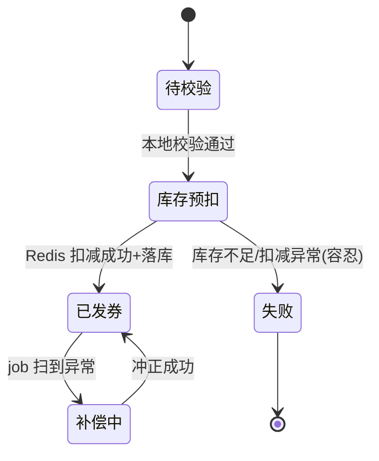

# 抖音支付十万级 TPS 流量发券实践

## 〇、本体介绍

**场景**：大促营销活动中，支付成功瞬间向用户发放优惠券/立减券，峰值流量达到**十万级 TPS**（全量用户同一时刻支付）的实战案例复盘。

**核心矛盾**：
1. 发券与支付强耦合，但不能拖慢支付体验（异步化）；
2. 库存（券批次）是**热点**（同一个批次被全体用户抢），Redis 单点被打爆；
3. **资损红线**：多发 = 真金白银损失，少发只是体验受损——决策优先级明确。

**核心主线**：异步化（支付与发券解耦）→ 双层本地队列削峰 → 库存本地化扣减（热点治理）→ 幂等与资损防控 → 补偿兜底 → 绿色通道。

**核心方案速览**：异步发券 + 双层本地队列差速器 + Redis 聚合请求扣减与本地内存前置校验 + 优雅退出持久化 + job 补偿 + 绿色通道同步兜底（详见各节）。

---

## 核心方案

1. **异步发券**。
2. **双层本地队列**：引入外部 MQ 会带来额外的技术问题，因此采用双层本地队列作为差速器，保证两个系统间交互流量的平滑。
3. **库存扣减放在 Redis**：为降低热点数据产生的概率，采用「聚合请求 + 本地扣减」的方式。

   另外，扣减库存前的校验逻辑其实不需要每次都访问 Redis。该校验只是一个前置校验，最终扣减是否成功仍取决于后续扣减操作的执行结果；校验的最大作用是在 Redis 库存不足后拦截不必要的扣减动作，并不要求十分精准。因此，我们在应用本地内存中维护了一份券批次的库存信息，定时将 Redis 库存同步到本地；发券时只需在本地内存中做简单校验，无需访问远程 Redis。

4. **优雅的系统退出**：通过通知或钩子（hook）等方式，将本地内存的数据持久化到共享队列。
5. **兜底补偿——保证最终一致性**：通过 job 定时扫描完成补偿。
6. **绿色通道**：异步发券完成后，若用户去钱包查看券信息，上游会再次调用发券，但打上「绿色通道」标识；后台识别到该标识后直接同步发券。

## 资损防控相关

1. **幂等校验**：发券生成唯一 ID 落库。
2. **用户维度的风控**。
3. **券的批次互斥**。
4. **库存防超卖**：

   上文提到，营销券批次的库存数据存放在 Redis。每次对 Redis 进行库存扣减时，可能会因网络超时、失败等异常导致扣减结果处于未知状态。此时我们选择「容忍」，认为发券失败，直接结束发券逻辑，不做回滚；扣减库存成功后，再为用户实际发券，若发券失败，可尝试回滚 Redis 库存（因已确定本次成功扣减了库存）。若回滚也失败，则不再做额外重试。这样会导致少发券，是一种折中的考虑。

5. **数据监控与核对**：包括内存队列的数据，定时任务判断券的数量与实际发放的数量是否大致相同。

## 七、延伸思考：可复用模式

1. **差速器模式（本地双队列）**：当上下游速率不匹配且引入外部 MQ 成本过高时，用"内存队列 + 磁盘/共享队列"做本地差速缓冲，是去中间件依赖的通用解。
2. **本地内存前置校验**：将远程共享状态（如库存）低频同步到本地内存做粗筛，仅在通过后才访问远程，典型"以空间换远程调用"。
3. **容忍式扣减（少发优于多发）**：资损防控中选择"少发券"而非"多发券"，因为多发是实际资金损失，少发仅体验受损，这是资损优先级判断的关键权衡。
4. **绿色通道（同步兜底）**：异步链路完成后，用户主动查询触发同步补偿，兼顾异步性能与用户感知。

## 八、压测与容量评估

| 维度 | 方法 | 目标 |
|------|------|------|
| 单实例发券 TPS | 全链路压测，逐步加压至瓶颈 | 验证十万级 TPS 下 RT/P99 |
| 本地队列水位 | 制造消费慢节点，观察队列积压与降级 | 验证差速器抗突发能力 |
| Redis 库存扣减 | 热点 key 压测（同批次并发扣减） | 验证聚合+本地扣减扛热点 |
| 下游依赖 | 对发券下游做强弱依赖标记，弱依赖故障演练 | 验证降级不阻断主链路 |

- 容量评估：按大促峰值 × 安全系数（1.2~1.5）预留机器；本地队列容量需覆盖"消费暂停期"的最大积压。

## 九、监控告警

- **业务指标**：发券成功率、TPS、券实际发放数 vs 内存队列数（对账）。
- **中间件指标**：本地队列长度、Redis 库存剩余、MQ（若有）堆积 Lag。
- **资损核对**：job 定时扫描"已扣库存但未发券""已发券但未落库"的偏差，超阈值告警。
- **兜底补偿**：补偿 job 执行次数、失败数监控，失败需人工介入。

## 十、踩坑与权衡
- **优雅退出丢数据**：退出前必须先把本地队列持久化到共享队列，否则积压发券丢失 → 资损。
- **本地内存校验不准**：同步周期过长会放过"库存已空但本地仍以为有"的请求，需权衡同步频率与 Redis 压力。
- **异步不可见**：用户发券后立刻查可能查不到，需靠"绿色通道"同步兜底保障体验。

## 十一、流量调度与削峰

- **入口分层限流**：网关按"用户维度 + 活动维度"双层限流，先拦超高峰值，保护发券主链路。
- **本地队列差速**：内存队列吸收"瞬时洪峰"，消费端按自身能力匀速处理（差速器），详见正文"双层本地队列"。
- **分时段发放**：大促将发券请求打散到多个时间窗，错峰降低峰值 QPS。
- **本地内存前置校验**：Redis 库存低频同步到本地做粗筛（见正文），减少远程调用，是"以空间换调用"的典型。
- **消费降级**：下游弱依赖（如积分、通知）故障时自动跳过，主链路（发券+落库）不被阻断。

## 十二、幂等与对账

- **幂等设计**：发券请求带业务唯一键（用户+批次+活动），落库 `unique` 约束防重复发；重试直接命中已存在记录返回成功。
- **对账体系**：
  1. **实时对账**：本地队列记录数 vs 实际发放数，偏差超阈值告警。
  2. **准实时对账**：job 扫"已扣库存未发券""已发券未落库"两类异常，触发补偿。
  3. **离线对账**：T+1 核对 Redis 库存扣减总量 vs 实际发券总量 vs 预算，发现资损。
- **资损红线**：少发（体验）优于多发（真实资金损失），见正文"容忍式扣减"权衡。

## 十三、容灾

- **优雅退出**：发版/缩容前通过 hook 把本地队列持久化到共享队列，避免积压发券丢失（资损）。
- **共享队列兜底**：本地队列不可用时降级到外部 MQ/共享存储，保证不丢。
- **多机房**：发券服务多机房部署，单机房故障流量切走；Redis 库存用多副本 + 跨机房同步。
- **补偿 job 高可用**：补偿任务多实例选主执行，失败告警人工介入，避免"没人补偿导致漏发"。

## 十四、压测结论（从现有实践延伸）

- **十万级 TPS 达成路径**：聚合请求 + 本地扣减把热点 Redis 访问降为"低频同步 + 本地校验"，是扛住峰值的关键；纯远程扣减在十万 TPS 下 Redis 单分片必先成为瓶颈。
- **本地队列水位**：差速器在消费慢节点能吸收数倍突发，但队列容量必须覆盖"消费暂停期最大积压"，否则 OOM/丢数据。
- **RT 构成**：发券 RT ≈ 本地校验(~0.1ms) + 偶发 Redis 同步(~5ms) + 落库(~10ms)，P99 受落库与 GC 影响，需对 DB 做连接池与批处理优化。
- **瓶颈迁移**：限流打开后瓶颈从 Redis 转移到"本地队列消费 + 落库"，据此继续优化批写与连接池。
- **容量公式**：实例数 = 峰值 TPS × 单实例 RT / 目标利用率；本地队列内存 = 单条大小 × 最大积压。

## 十五、踩坑与权衡（深入）

- **少发的运营补偿**：容忍式扣减导致少发，需运营侧补发机制，避免用户客诉升级。
- **本地内存同步延迟**：同步周期过长会放过"已空"请求，周期过短压 Redis；按库存消耗速度动态调整同步频率。
- **队列持久化选型**：共享队列优先选"不丢 + 可重放"（如 Kafka），纯内存共享仍有丢风险。

## 十六、发券状态机与本地队列代码骨架

### 发券状态机


### 本地双队列骨架（示意）
```java
// 内存队列（差速器）
BlockingQueue<SendTask> memQueue = new LinkedBlockingQueue<>(1_000_000);
// 消费线程：匀速处理，慢则积压在队列
void consume() {
    while (running) {
        SendTask t = memQueue.poll(100, ms);
        if (t == null) continue;
        if (!rateLimiter.tryAcquire()) { memQueue.put(t); continue; } // 限速
        doSend(t);
    }
}
// 优雅退出：持久化剩余队列到共享存储
void shutdown() {
    running = false;
    persistToSharedQueue(memQueue.drainTo(list));
}
```
- 内存队列满时反压到上游（丢弃/拒收），避免 OOM。
- 共享队列（外部 MQ）作为不可用时兜底，保证不丢。

## 十七、关键指标与压测看板

| 指标 | 含义 | 目标 |
|------|------|------|
| 发券 TPS | 实际发放速率 | ≥ 峰值 × 1.2 |
| 本地队列积压 | 待消费任务数 | < 容量 60% |
| 发券成功率 | 成功/总请求 | > 99.9% |
| 库存剩余 | Redis 批次余量 | 实时监控防超发 |
| 补偿 job 执行 | 补偿次数/失败 | 失败=0 |

> 压测看板需同时展示"入口 QPS、本地队列水位、落库 RT、Redis 库存"四曲线，才能判断瓶颈在哪一环。

---

## 十八、速查表

| 主题 | 一句话 |
|------|--------|
| 异步化 | 支付成功后事件驱动发券，不拖支付主链路 |
| 削峰 | 双层本地队列差速器，消费端匀速，防打爆下游 |
| 热点治理 | Redis 库存低频同步到本地内存，本地校验 + 远程扣减 |
| 资损红线 | 少发优于多发：扣库存失败容忍，发券失败才回滚 |
| 幂等 | 发券唯一 ID 落库 + 业务键 unique，重试命中返回成功 |
| 补偿 | job 定时扫「已扣未发/已发未落」偏差，自动冲正 |
| 绿色通道 | 用户主动查询触发同步兜底发券，兼顾异步性能 |
| 容灾 | 优雅退出持久化本地队列 + 共享队列兜底 + 多机房 |
| 监控 | 发券 TPS/成功率/队列水位/库存余量四曲线 + 对账偏差告警 |

---

## 十九、面试高频追问（12+）

1. Q：为什么发券要走异步？ A：支付链路延迟敏感（用户等结果），发券量大且偶发慢——异步把瞬时十万 TPS 摊平，支付体验不受影响。
2. Q：十万 TPS 最怕什么？ A：Redis 热点（同批次库存被全体用户抢）与下游同步调用阻塞——所以库存本地化 + 本地队列差速。
3. Q：库存热点怎么解决？ A：Redis 库存低频同步到本地内存，发券先本地粗校验（不访问 Redis），通过后再远程扣减——把每秒十万次远程调用降为低频同步 + 少量扣减。
4. Q：本地校验不准怎么办？ A：同步周期内「库存已空仍放行」的请求会在远程扣减时失败——最终正确性由远程扣减保证，本地校验只负责拦截明显售罄，是性能与准确性的权衡。
5. Q：为什么选择「少发」而不是「多发」？ A：多发 = 实际资金损失；少发 = 体验受损可运营补偿。资损防控的优先级：宁少勿多。
6. Q：本地队列丢了怎么办？ A：优雅退出（发版/缩容）时 hook 持久化到共享队列；共享队列不可用再降级外部 MQ；补偿 job 兜底扫描。
7. Q：怎么保证不重复发券？ A：发券唯一 ID（用户+批次+活动）落库 unique 约束；重试命中已存在直接返回成功（幂等）。
8. Q：绿色通道是什么？ A：异步发券还没完成时用户来查券，上游带绿色通道标识再次调用，后台识别后同步补发。
9. Q：对账怎么做？ A：三层：实时（队列记录 vs 实际发放）、准实时（job 扫两类偏差）、离线（T+1 核对库存扣减总量 vs 发券总量 vs 预算）。
10. Q：和消息队列削峰的区别？ A：本地队列无外部依赖、无网络开销，但牺牲持久性；外部 MQ 可靠但引入中间件。此案例用本地队列当主、MQ/共享队列兜底。
11. Q：压测结论是什么？ A：瓶颈不在 Redis（本地化后），而在「本地队列消费 + 落库」——优化批写与连接池；容量公式：实例数 = 峰值 TPS × 单实例 RT / 目标利用率。
12. Q：这个方案能套用到别的场景吗？ A：能——「高频小写 + 强热点 + 可容忍短暂延迟」场景通用：签到、消息推送、指标采集等（差速器模式）。

---

> 一句话：**十万 TPS 发券 = 异步解耦 + 本地队列差速削峰 + 库存本地化治热点 + 宁少勿多的资损红线 + 幂等/补偿/绿色通道三道兜底。**
