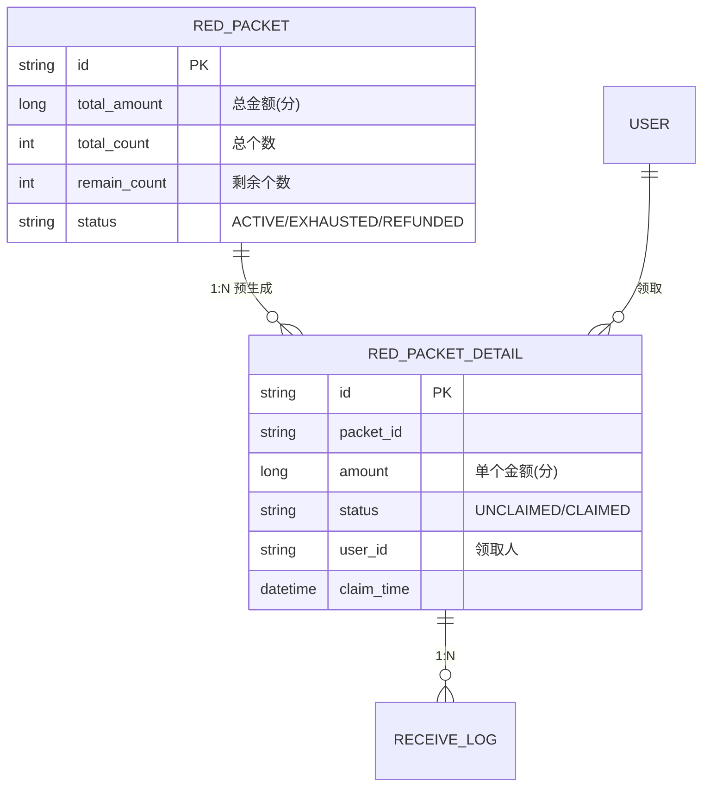
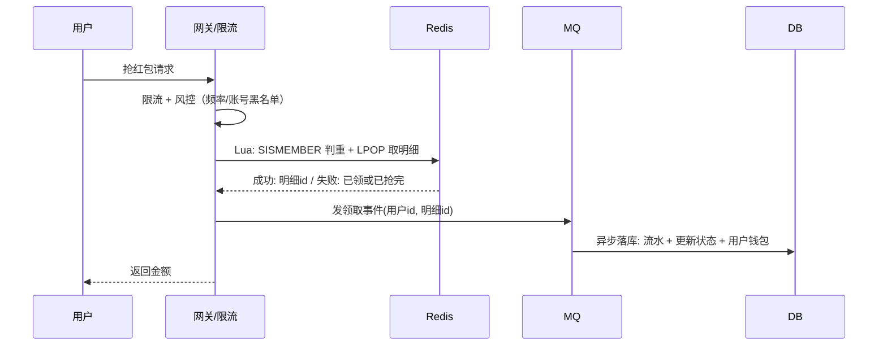

# 抢红包系统设计

## 〇、本体介绍

**抢红包**：群/订单场景下，一次总金额拆成 N 个随机金额，多人高并发抢，每个红包只能被领一次，直到拆完。它是**高并发写热点 + 金额精度 + 幂等防重**的经典综合体。

**核心矛盾**：
1. 一个红包被千万人同时抢（**单点写热点**）；
2. 金额拆分算法要**随机且公平**（不能第一个抢走 99.9%）；
3. 拆包、领取必须**不超发、不重复领、金额精确到分**；
4. 需要支撑**异步高并发**（抢的瞬间 QPS 峰值）。

**核心主线**：拆分算法 → 存储设计 → 并发控制 → 领取流程 → 幂等防刷 → 过期退回。

---

## 一、需求与约束

| 约束 | 典型值 | 设计影响 |
|------|--------|----------|
| 拆分红包数 | 1 万~10 万/个 | 预生成明细的规模 |
| 抢的瞬间 QPS | 10 万+（群红包秒没） | 必须 Redis 扛、DB 异步 |
| 金额精度 | 分（0.01 元） | 全程整数分运算，禁浮点 |
| 规则 | 每人限 1 个、拆完为止、金额>0 | 幂等 + 原子扣减 |
| 失败容忍 | 抢到但入账失败要补偿 | 状态机 + 对账 |

> 金额一律用**整数「分」**存储与计算（浮点 0.1+0.2 的坑见「[基础知识/计算机原理](../基础知识/计算机原理.md)」）。

---

## 二、拆分算法

### 2.1 方案对比

| 算法 | 思路 | 优点 | 缺点 |
|------|------|------|------|
| **二倍均值法** | 剩余每人 ≤ 剩余均值 ×2 | 金额分布均匀（微信思路） | 靠后的人金额趋同 |
| **随机区间法** | 固定区间随机 | 简单 | 方差大，可能极端 |
| **截尾正态** | 中间多两头少 | 符合真实体验 | 实现复杂 |
| **预生成池（抢包前拆好）** | 一次性拆 N 个入库 | 抢时零拆分计算、可控公平 | 建包有成本 |

### 2.2 二倍均值法（面试手写重点）

```java
// 剩余金额 remain，剩余人数 n：随机范围 [1, remain/n * 2 - 1]，最后一个全给
long avg = remain / n;
long max = avg * 2;  // 最大 = 2 倍均值
long amt = (n == 1) ? remain : 1 + (long)(Math.random() * (max - 1));
```

- **公平性**：每次期望都是 remain/n，先抢后抢期望相同；先抢上限高、后抢保底高，体验平衡。
- **关键细节**：最后一人 = 剩余全部（保证总额精确）。

### 2.3 预生成红包池（高并发推荐）

建包时一次性用算法拆出 N 个金额明细写入（DB 表 + Redis 队列/List），抢的过程只是 **POP + 标记**，拆包计算完全离线：

- 优点：抢的瞬间零计算、金额分布可预先审计、单红包独立库存天然防超发。
- 缺点：建包耗时（万级明细批插入）；金额明细预存储。

> 口诀：**"拆包在离线，抢包只 POP；均分二倍均值，精确用整数分。"**

---

## 三、存储设计



| 表 | 作用 | 写入时机 |
|----|------|----------|
| 红包主表 | 总金额/总个数/状态 | 建包 |
| 红包明细表 | 预拆的每个金额 | 建包（预生成） |
| 领取流水表 | 谁领了哪个（幂等判重） | 领取 |

- **Redis 侧**：明细列表（List 存待领明细 id）+ 领取去重 Set + 剩余数计数器（配合 Lua 原子操作）。

---

## 四、并发控制（核心）

### 4.1 抢包原子操作（Lua 脚本，防超发/防重领）

```lua
-- KEYS[1]=待领List  KEYS[2]=已领Set  ARGV[1]=userId  ARGV[2]=detailId
if redis.call("SISMEMBER", KEYS[2], ARGV[1]) == 1 then
    return -1              -- 已领过
end
local detail = redis.call("LPOP", KEYS[1])
if not detail then
    return -2              -- 抢完了
end
redis.call("SADD", KEYS[2], ARGV[1])
return detail              -- 返回抢到的明细 id
```

- **为什么用 Lua**：List POP + Set 判重必须原子（防两个线程同时 POP 同一明细）。
- **超发防护**：POP 是天然互斥——**一条明细只会被 POP 一次**，从根上杜绝超发。
- **DB 异步落库**：Redis 抢成功后异步写 DB（流水 + 更新明细状态），Redis 是权威、DB 最终一致。

### 4.2 不预生成的方案（无 List，直接扣减）

若无预生成明细，则用**原子扣计数**：

```lua
-- KEYS[1]=剩余数  KEYS[2]=已领Set  ARGV[1]=userId  ARGV[2]=amount
if redis.call("SISMEMBER", KEYS[2], ARGV[1]) == 1 then return -1 end
local remain = redis.call("DECR", KEYS[1])
if remain < 0 then redis.call("INCR", KEYS[1]) return -2 end
redis.call("SADD", KEYS[2], ARGV[1])
return ARGV[2]   -- 金额由服务端算好传入
```

- 缺点：拆包在抢时做（CPU 压力），且需自己防负数。

### 4.3 与「分布式锁」的关系

- **红包明细 POP 天然不需要分布式锁**（List 原子操作即互斥），这是比"抢红包用 Redisson 锁"更好的方案——锁粒度粗（锁整个红包）会串行化所有用户。
- 锁只用于**对账/退款**等低频管理操作（见「[分布式锁](分布式锁.md)」）。

> 口诀：**"原子操作是王道，别拿全局锁串行抢红包；List POP + Set 判重 Lua 一把梭。"**

---

## 五、领取完整流程



1. **前置风控**：限流、设备/账号维度防刷（见「[Redis 实现限流](redis实现限流.md)」）。
2. **Redis 原子抢**：Lua 判重 + POP。
3. **异步落库**：MQ 削峰，DB 只扛"实际领取量"。
4. **失败补偿**：落库失败 → 重试队列；长期失败 → 对账把明细回滚进 List。
5. **查询**：红包详情/已抢列表走 Redis 缓存 + DB 兜底。

---

## 六、过期退回与对账

- **退回**：到期未领完 → 定时任务把剩余明细金额**原路退回**（标记 REFUNDED，退回流水单独记录）。
- **对账**：`已领总额 + 退回总额 == 建包总额`；每日跑对账，差异告警（见「[SRE与稳定性工程/06-日志与告警规则库](../SRE与稳定性工程/06-日志与告警规则库.md)」）。
- **幂等入账**：入钱包操作用业务流水号幂等（防重复入账，见「[幂等设计](幂等设计.md)」）。

---

## 七、与其他板块的关系

- **分布式锁**：本场景证明"原子原语 > 全局锁"，但管理操作仍需锁。
- **幂等设计**：领取入账幂等、防重复领。
- **Redis 实现限流**：抢包入口的流量与风控。
- **场景设计/稳定性三板斧**：抢包服务降级（如降为只读状态）、熔断。
- **抖音支付发券实践**：同构的"高并发资源发放"体系。
- **分库分表**：红包明细量大时按红包 id 分表。

---

## 八、速查表

| 主题 | 一句话 |
|------|--------|
| 金额 | 整数分，禁浮点 |
| 拆分 | 二倍均值/预生成池；拆包离线 |
| 并发 | Lua：POP 原子 + SISMEMBER 判重 |
| 防超发 | List 原子 POP 天然互斥 |
| 防重领 | 已领 Set 判重 |
| 落库 | MQ 异步 + 重试补偿 |
| 退回 | 到期定时退回，对账兜底 |
| 锁 | 抢包用原子操作，锁给低频管理 |

---

## 面试高频问题（15+ 条）

1. **抢红包的核心难点？** 单点写热点、金额精确、不超发、不重领、峰值高。
2. **金额怎么拆分才公平？** 二倍均值法：随机 [1, 2×剩余均值)；期望每次=剩余均值。
3. **为什么用整数分？** 浮点 0.1+0.2 有误差，金额必须精确运算。
4. **怎么防止超发？** 预生成明细 + List 原子 POP，一条明细只会被弹出一次。
5. **怎么防止重复领取？** 已领 Set + SISMEMBER 原子判重（和 POP 同 Lua）。
6. **为什么用 Lua 脚本？** Redis 单线程执行脚本原子性，避免竞态。
7. **预生成和即时拆包怎么选？** 预生成：抢时零计算、防超发、可控审计；即时拆包省存储，但峰值 CPU 高。
8. **抢包要不要分布式锁？** 不用；原子操作即可，全局锁会串行化所有用户。
9. **DB 压力怎么扛？** Redis 抢成功 → MQ 异步落库，DB 只扛实际量。
10. **落库失败怎么办？** 重试队列；长期失败回滚明细；每日对账兜底。
11. **过期红包怎么办？** 定时任务退回剩余金额，退回流水单独记。
12. **怎么对账？** 已领+已退 == 总额；差异告警。
13. **金额进钱包怎么防重复？** 业务流水号幂等。
14. **用户怎么防刷？** 入口限流 + 账号/设备维度的风控（频率、黑名单）。
15. **单红包拆 10 万份要注意什么？** 建包批插入、明细表分片、List 预写入分批。
