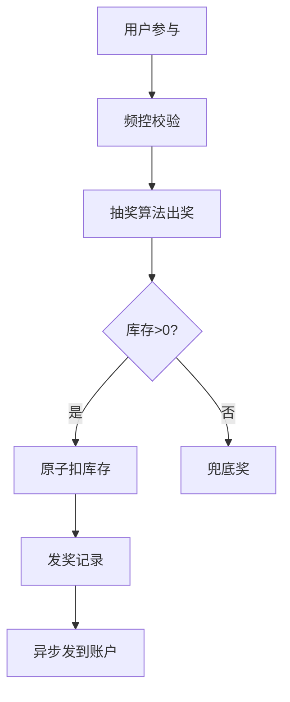

# 抽奖与营销活动系统设计实战

> 抽奖、转盘、盲盒等营销活动是拉新促活的利器，但其难点在于**概率可控、库存不超发、公平防刷、实时发奖**。任何偏差都会引发用户投诉或资损。

## 1. 核心概念

| 概念 | 说明 |
| --- | --- |
| 奖池 | 奖品集合，含概率/库存/权重 |
| 概率 | 每个奖品的中奖概率 |
| 库存 | 奖品剩余数量，0 则不再出 |
| 预算 | 活动总成本控制 |
| 频控 | 用户参与次数限制 |

## 2. 抽奖算法

### 2.1 加权随机抽样

```python
import random
def draw(prizes):
    # prizes: [(id, weight, stock)]
    avail = [p for p in prizes if p[2] > 0]
    total = sum(p[1] for p in avail)
    r = random.uniform(0, total)
    acc = 0
    for pid, w, stock in avail:
        acc += w
        if r <= acc:
            return pid
    return None  # 未中任何（兜底谢谢参与）
```

- 概率 = 权重 / 总权重，库存为 0 的奖品剔除。
- **兜底奖**：保证必有结果（如"谢谢参与"），避免空奖。

### 2.2 概率校准

运营配置的是"期望概率"，实际发奖受库存约束：
- 高价值奖品库存少，抽中后立即从奖池移除。
- 用"动态概率"：剩余库存 / 剩余参与次数，防止提前发完或发不出。

## 3. 库存与发奖



- **原子扣库存**：Redis `DECR` 或 Lua 脚本，保证不超发。
- **发奖幂等**：`userId+activityId+round` 唯一，重复请求不重复发。

## 4. 防刷设计

| 风险 | 对策 |
| --- | --- |
| 脚本批量刷奖 | 设备指纹 + 行为风控 + 验证码 |
| 小号薅羊毛 | 账号等级/实名门槛 |
| 频控绕过 | 服务端强频控，不信任前端 |
| 概率外挂 | 服务端算奖，前端只展示结果 |

## 5. 概率透明与合规

- 法律要求公示中奖概率（尤其有奖销售）。
- 后台记录每次抽奖的随机种子/结果，可审计。
- 大奖需额外风控与人工复核。

## 6. 高并发

- 奖池配置缓存，变更广播。
- 库存预扣到 Redis，DB 异步落库。
- 抽奖与发奖解耦：先扣库存记中奖，再异步发货，提升吞吐。

## 7. 实时性与一致性

- 用户中奖后立即在"我的奖品"可见（最终一致可接受短暂延迟）。
- 库存与 DB 定期对账，差异告警。
- 活动结束强制停止，余量回收或公示。

## 8. 常见坑

| 坑 | 现象 | 对策 |
| --- | --- | --- |
| 库存超发 | 奖品多发 | Lua 原子扣减 |
| 概率失真 | 实际≠配置 | 动态概率+校准 |
| 重复发奖 | 资损 | 发奖幂等 |
| 刷奖 | 被薅 | 风控+频控 |
| 概率不公示 | 合规风险 | 后台可审计+公示 |

## 9. 面试题

1. 如何实现可控概率且库存不超发？
2. 抽奖结果为什么必须在服务端算？
3. 发奖如何保证幂等？
4. 动态概率相比静态概率好在哪里？
5. 营销活动如何防刷？

## 10. 小结

抽奖系统 = 加权随机 + 原子库存 + 发奖幂等 + 防刷风控。核心是"服务端算奖、原子扣库存、结果可审计"，兼顾体验与合规。
