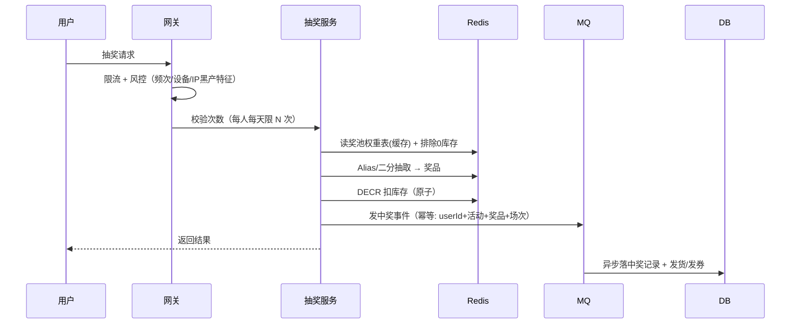

# 抽奖系统设计：权重、库存与防刷

## 〇、本体介绍

**抽奖**：按**配置权重**从奖池中抽取一个结果，并把**有库存的奖品**真正发给用户。核心是"**抽得公平（概率可控）+ 发得不出错（库存不多发）+ 刷不了（防薅）**"。

**核心矛盾**：
1. **权重概率**要精确可配置：百分位、千分位甚至万分位；
2. **库存扣减**不能超卖：奖品库存是硬约束，与概率叠加；
3. 抽奖**高峰期 QPS 高**（活动刚开），且被黑产盯着薅；
4. 概率与库存的**联动**：库存为 0 的奖品不能继续被抽中。

**核心主线**：权重抽取算法 → 库存扣减 → 完整流程 → 防刷 → 活动配置。

---

## 一、权重抽取算法

### 1.1 方案对比

| 算法 | 预处理 | 每次抽取 | 特点 |
|------|--------|----------|------|
| **线性扫描** | 无 | O(n) | 简单，奖品多时慢 |
| **累加权重 + 二分** | O(n) | O(log n) | 主流折中方案 |
| **Alias Method** | O(n) | **O(1)** | 奖品多/高 QPS 最优，面试亮点 |
| **真随机兜底** | — | — | 仅作对比：概率不可控，不用于业务 |

### 1.2 累加权重 + 二分（工程标配）

```java
// 权重 [10, 20, 30, 40]  → 前缀和 [10, 30, 60, 100]
// 随机 r ∈ [0, 100)，二分找到第一个 ≥ r 的前缀和下标即为奖品
long[] pre = {10, 30, 60, 100};
long r = ThreadLocalRandom.current().nextLong(100);
int idx = Arrays.binarySearch(pre, r);        // 找第一个 >= r 的位置
idx = idx >= 0 ? idx : -idx - 1;              // 插值定位
```

### 1.3 Alias Method（O(1) 抽取，面试加分）

- **预处理 O(n)**：把 n 个权重摊平到 n 个桶，每桶恰好 `总权重/n`，多余部分挂到"别名"；
- **抽取 O(1)**：随机桶 i + 随机比例 u，`u < prob[i]` 取 i，否则取 **alias[i]**；
- 每次抽取只做两次随机 + 一次比较，QPS 再高也是常数时间。

```
桶:    [P0, P1, P2]      alias: [-, 2, -]
随机 i=1, u=0.7 → u > prob[1] → 取 alias[1]=2 → 奖品2
```

- 场景：**奖品多（几十上百档）且高并发**的活动；奖品少时二分法已足够，别过度设计。

> 口诀：**"概率先建表，二分是标配；追求极致上 Alias，预处理换 O(1)。"**

---

## 二、库存扣减（防超卖）

### 2.1 奖品模型

```sql
CREATE TABLE prize (
    id         BIGINT PRIMARY KEY,
    activity_id BIGINT NOT NULL,
    name       VARCHAR(64),
    weight     INT NOT NULL,          -- 配置权重
    stock      INT NOT NULL,          -- 总库存
    remain     INT NOT NULL,          -- 剩余库存
    status     TINYINT                -- 上架/下架
) COMMENT '奖品';
```

### 2.2 扣减策略

| 方案 | 做法 | 适用 |
|------|------|------|
| **DB 条件更新** | `UPDATE prize SET remain=remain-1 WHERE id=? AND remain>0` | 低并发、需强一致 |
| **Redis 原子扣减 + 异步落库（主流）** | `DECR remain:{pid}` 后判断 ≥0；库存为 0 移出奖池 | 高并发活动 |

```lua
-- KEYS[1]=库存计数  ARGV[1]=prizeId
local remain = redis.call("DECR", KEYS[1])
if remain < 0 then
    redis.call("INCR", KEYS[1])   -- 回滚，返回 -1 表示无货
    return -1
end
return 1
```

### 2.3 概率与库存联动

1. **抽取前过滤**：奖池计算时把 `remain=0` 的奖品**排除出权重表**（保底/谢谢参与权重保留）——库存 0 的奖品"天然不可抽中"，等价于权重清零。
2. **抽取后扣减**：抽中 → 原子扣减 → 扣失败（库存没了）→ **重抽一次**（最多 N 次）或按"谢谢参与"处理。
3. **顺序**：先按权重抽，再校验库存；并发下库存比权重优先（宁可"谢谢参与"不可超卖）。

---

## 三、完整流程



1. **入口防刷**：限流 + 次数校验（每人/天）+ 黑产特征（见「[Redis 实现限流](redis实现限流.md)」）。
2. **抽取与扣减在 Redis**：权重表缓存 + Lua 扣减，扛住峰值。
3. **落库异步幂等**：中奖事件带 `userId+activityId+roundId` 幂等键，DB 唯一索引兜底。
4. **兑奖**：优惠券走发券链路（见「[优惠券系统设计](优惠券系统设计.md)」），实物走发货系统。

---

## 四、防刷（抽奖特有重点）

| 手段 | 说明 |
|------|------|
| 频控 | 每人每天/每活动限次，Redis 计数 |
| 设备/IP 指纹 | 同设备多账号、同 IP 聚集识别 |
| 黑名单 | 黑产账号池拦截（羊毛党） |
| 抽奖前校验 | 账号等级/实名/活跃度门槛 |
| 异常分析 | 中奖率异常账号（全是头奖）实时风控 |
| 中奖率审计 | 按奖品统计实际中奖率 vs 配置权重，偏差告警 |

> 口诀：**"概率可控权重表，库存先扣再落库；次数设备风控齐，中奖审计防羊毛。"**

---

## 五、与其他板块的关系

- **Redis 实现限流**：抽奖入口流量与频控。
- **优惠券系统设计**：券类奖品的发放（幂等、防超发）。
- **钱包与账务系统设计**：现金/积分奖励的入账。
- **排行榜与实时统计**：活动参与人数/中奖统计。
- **延迟任务**：实物奖品发货超时监控。

---

## 六、速查表

| 主题 | 一句话 |
|------|--------|
| 权重 | 累加权重+二分；奖品多上 Alias Method |
| 库存 | Redis DECR 原子扣，为负回滚 |
| 联动 | 0 库存奖品排除出权重表，抽取后二次校验 |
| 落库 | MQ + 幂等键，DB 唯一索引兜底 |
| 防刷 | 频控 + 设备/IP 指纹 + 黑名单 + 中奖率审计 |

---

## 面试高频问题（12+ 条）

1. **抽奖核心难点？** 概率可控、库存不超卖、并发扛得住、黑产防得住。
2. **权重怎么抽？** 累加权重 + 二分（O(log n)）；奖品多且高 QPS 用 Alias Method（O(1)）。
3. **Alias Method 原理？** 预处理把权重摊到 n 桶（O(n)），抽取随机桶+随机比例二选一，O(1) 完成。
4. **库存怎么防超卖？** Redis DECR 原子扣减，返回负数回滚；DB 用 `UPDATE ... WHERE remain>0`。
5. **库存为 0 的奖品还能被抽中吗？** 不会：抽取前排除出权重表，抽取后扣减失败重抽/给谢谢参与。
6. **先抽还是先扣库存？** 先按权重抽、再扣库存；扣减失败重抽（限次），宁可谢谢参与不可超卖。
7. **抽奖高峰怎么扛？** 权重表缓存 + Lua 原子扣减全在 Redis；中奖异步落库削峰。
8. **怎么防重复中奖/刷？** 每人限次 + 幂等键落库 + 设备/IP 指纹 + 黑名单。
9. **中奖记录怎么防重？** 事件带 userId+activityId+roundId 幂等键，DB 唯一索引。
10. **概率要不要真随机？** 业务抽奖必须伪随机 + 权重可控（可审计），真随机不可配置。
11. **怎么保证概率与实现一致？** 上线后按奖品统计实际中奖率，与配置偏差超过阈值告警。
12. **权重可以动态调吗？** 可以，权重表热更新 + 缓存失效；但活动运行中调概率需审批留痕。

---

> 配套：发奖链路 →「[优惠券系统设计](优惠券系统设计.md)」；防刷 →「[Redis 实现限流](redis实现限流.md)」；玩法流量 →「[大促容量规划与备战](大促容量规划与备战.md)」。
