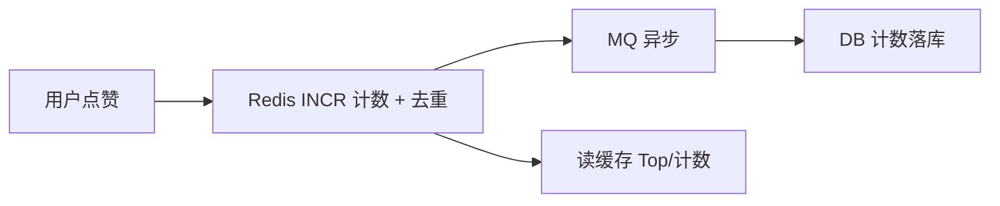

# 排行榜与实时统计（榜单 / UV / 在线人数 / 计数）

## 〇、本体介绍

**排行榜与实时统计**：游戏战力榜、热销榜、热搜榜、直播间在线人数、日活 UV、点赞计数……背后是同一类需求——**对海量数据做实时排名与去重计数**。Redis 的 ZSet、HyperLogLog、Bitmap 是三大主力武器。

**核心矛盾**：
1. 排名要**实时**（秒级更新），但全量排序太贵；
2. 去重计数要**精确或可容忍近似**，但内存要可控；
3. 榜单是**读多写少**热点，要防打爆缓存；
4. 时间窗口榜（周/月榜）要处理**过期与滚动**。

**核心主线**：ZSet 排名 → 时间窗口榜 → 去重 UV（HLL）→ 在线人数（Bitmap）→ 点赞计数 → 读侧保护。

---

## 一、ZSet：排名的基础数据结构

| 命令 | 用途 |
|------|------|
| `ZADD key score member` | 写入/增量（`ZINCRBY`） |
| `ZREVRANGE key 0 N` | 取 Top-N（从高到低） |
| `ZRANK / ZREVRANK` | 排名 |
| `ZSCORE` | 当前分数 |
| `ZCOUNT key min max` | 区间计数 |
| `ZREMRANGEBYSCORE` | 按分数裁剪（过期清理） |

- **实现**：跳表 + 哈希表，`ZINCRBY` O(log n)、`ZREVRANGE` O(log n + m)。
- 经典应用：**销量榜**（销量即 score）、**热销商品榜**、**贡献榜**。

```java
// 销量 +1 并取 Top10（一次调用）
redisTemplate.opsForZSet().incrementScore("rank:sale:daily:20260806", "sku_1001", 1);
Set<ZSetOperations.TypedTuple<Object>> top = redisTemplate.opsForZSet()
    .reverseRangeWithScores("rank:sale:daily:20260806", 0, 9);
```

---

## 二、时间窗口榜（周榜/月榜/滚动榜）

### 2.1 方案对比

| 方案 | 做法 | 优点 | 缺点 |
|------|------|------|------|
| **固定窗口 key** | 每天一个 key（`rank:daily:20260806`），榜内只查当日 | 简单、天然过期（TTL） | 周榜需**合并 7 个 key** |
| **多 key 合并** | `ZUNIONSTORE` 周榜 = 7 个日榜 | 精确 | 冷热不均匀、内存多 7 倍 |
| **滚动窗口（精确）** | 用户维度 hash 存"每日得分"，滚动 30 天实时算 | 精确滚动 | 计算量随用户数上涨 |
| **滑动计数窗口（近似）** | 时间分桶 + 前缀求和 | 内存小 | 有误差 |

### 2.2 工业级常用组合

- **日榜**：日 key 直查（简单、权威）。
- **周/月榜**：`ZUNIONSTORE rank:week = 7 个日榜`，**计算一次缓存 5 分钟**（榜单是读多写少的近似实时，不必逐秒刷新）。
- **热搜榜**：关键词 `ZINCRBY`（次数为 score）+ 时间衰减（每小时 ×0.9，防老词霸榜）+ Top50 读缓存。

> 口诀：**"日榜单 key，周榜并集缓存；热搜时间衰减，读多写少快照。"**

---

## 三、去重 UV（HyperLogLog）

### 3.1 为什么用 HLL

精确去重（Set）内存随量线性涨——1 亿 UV 用 Set 约 4GB；**HyperLogLog 固定 12KB 可统计 2⁶⁴ 级别基数，误差 ~0.81%**，换取"千万级去重计数"。

| 命令 | 用途 |
|------|------|
| `PFADD key userId` | 加入 |
| `PFCOUNT key` | 计数 |
| `PFMERGE dest s1 s2` | 合并多天（周 UV） |

```bash
# 每日一个 key，周 UV = PFMERGE 7 天
PFADD uv:20260806 user_1 user_2 user_1
PFCOUNT uv:20260806            # ≈ 2
PFMERGE uv:week_0806 uv:20260801 ... uv:20260806
PFCOUNT uv:week_0806
```

### 3.2 何时不能忍误差

- 业务必须**精确去重**（如营销对账）→ 用 **Bitmap 分桶**：`userId % N` 分桶，每桶一个 Bitmap（按 id 偏移），内存 = 用户上限/8，命中 O(1)。
- 取舍：**HLL 给"量级"（大盘、看板）、Bitmap 给"精确"（明细系统）**。

---

## 四、在线人数（Bitmap 时间槽）

直播间/游戏在线数 = 对**活动窗口内的心跳**去重：

- 方案：**1 分钟一个 Bitmap key**，`SETBIT online:1530 用户slot 1`；在线数 = 最近 N 分钟 Bitmap 的 **OR 合并 + 位统计**（`BITCOUNT`）。
- 复杂度：1 个 key 8 万用户 = 10KB，10 分钟窗口 × 10 个 key 内存可控。
- 更简单近似：**ZSet + 过期**（member=用户，score=最后心跳时间，`ZREMRANGEBYSCORE key 0 now-5min`，`ZCARD` 即在线数）——够用且实现快。

| 方案 | 精确度 | 内存 | 适用 |
|------|--------|------|------|
| Bitmap 槽位合并 | 精确 | 用户上限/8 × 槽数 | 大直播间、需精确 |
| ZSet 心跳 | 精确 | 在线人数 × 常数 | 中小规模、实现最快 |
| HLL | 近似 | 极小 | 只需要量级 |

---

## 五、点赞 / 计数系统

### 5.1 计数链路



- **计数**：`INCR like:content:10086`（Gauge 语义词，可 INCRBY 批量）。
- **去重**（一人一赞）：`Set` 存点赞人（内容维度），或用 **Bitmap**（`SETBIT`）大内容量场景。
- **合流落库**：MQ 攒批（如 1s 或 50 条一批）合并写 DB，减少写放大；DB 是最终计数源，Redis 崩溃可重建。
- **防刷**：设备/账号频率限制 + 异常行为风控（见「[Redis 实现限流](redis实现限流.md)」）。

### 5.2 赞数与榜单联动

- 点赞数可直接作为榜单 score 增量（`ZINCRBY`），实现"热度榜"。
- 读侧：内容详情页计数读缓存，**缓存穿透/击穿防护**见「[缓存经典三问与一致性](缓存经典三问与一致性.md)」。

---

## 六、读侧保护（防打爆）

- 榜单 Top-N 是**高读热点**：结果**缓存 5~30 秒**（Redis 副本缓存），降级返回上一份快照。
- 写侧热点（热门内容被狂赞）：**合并写** + 本地缓冲，避免 Redis 单 key 写放大。
- 缓存双写一致性见「[多级缓存框架](多级缓存框架.md)」。

---

## 七、与其他板块的关系

- **Redis 知识**：ZSet/HLL/Bitmap 的数据结构原理。
- **缓存经典三问**：榜单缓存的穿透/击穿/雪崩防护。
- **场景设计/Feed 信息流**：Feed 排序可用同一套 ZSet 时间线。
- **业务模型/内容短视频**：热度榜是内容业务的核心组件。

---

## 八、速查表

| 需求 | 武器 | 一句话 |
|------|------|--------|
| Top-N 榜 | ZSet + ZREVRANGE | 跳表 O(log n) |
| 周/月榜 | ZUNIONSTORE 日榜并集 | 结果快照缓存 |
| 热搜衰减 | ZINCRBY + 每小时衰减 | 防老词霸榜 |
| UV 量级 | HyperLogLog | 12KB 管 2⁶⁴，误差 0.81% |
| UV 精确 | Bitmap 分桶 | 内存=上限/8 |
| 在线人数 | Bitmap 时间槽 / ZSet 心跳 | 槽合并 OR |
| 点赞计数 | INCR + MQ 合流落库 | 写放大缓解 |
| 读侧 | Top-N 快照缓存 | 防打爆 |

---

## 面试高频问题（15+ 条）

1. **排行榜用什么实现？** Redis ZSet：ZINCRBY 更新，ZREVRANGE 取 Top-N。
2. **ZSet 底层结构？** 跳表 + 哈希表；增删改查 O(log n)。
3. **周榜怎么做？** 日榜并集 ZUNIONSTORE，结果缓存；或固定周 key 滚动。
4. **热搜榜怎么防老词霸榜？** score 时间衰减（每小时 ×0.9）+ Top-K 截断。
5. **UV 统计用什么？为什么？** HyperLogLog：固定内存（12KB）统计亿级基数，误差 0.81%。
6. **HLL 误差不能忍怎么办？** Bitmap 分桶精确去重（内存=用户上限/8），或精确 DB。
7. **怎么算近 7 天 UV？** PFMERGE 7 个日 key 后 PFCOUNT。
8. **在线人数怎么算？** 1 分钟一个 Bitmap 槽，窗口内 BITOR + BITCOUNT；或 ZSet 心跳去重。
9. **点赞计数怎么防 DB 写放大？** Redis 计数 + MQ 攒批合流落库。
10. **一人一赞怎么去重？** 内容维 Set / 大内容 Bitmap SETBIT。
11. **榜单读热点怎么保护？** Top-N 快照缓存 5~30s + 降级。
12. **ZCOUNT 干什么？** 分数区间计数（如"60 分以上多少人"）。
13. **ZREMRANGEBYSCORE 干什么？** 清理过期成员（心跳窗口滑动）。
14. **榜单精度和成本的取舍？** 大榜量级用 HLL/快照，小榜精确用 ZSet。
15. **怎么和 Feed 联动？** 时间线即 ZSet score=时间戳，倒序取 Feed。
