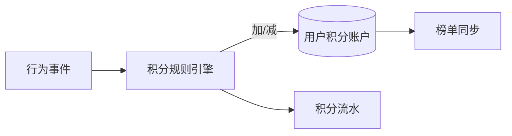

# 排行榜与积分系统设计实战

> 排行榜（榜单）与积分体系是激励用户活跃的核心手段，广泛应用于游戏、电商、社区。技术挑战在于：实时更新、海量用户排序、防作弊、多维度榜单。

## 1. 榜单类型

| 类型 | 特点 | 实现 |
| --- | --- | --- |
| 总榜 | 全量用户排名 | 有序集合全局排序 |
| 周/月榜 | 周期重置 | 按周期分 key |
| 分段榜 | 好友/地区榜 | 子集合排序 |
| 实时榜 | 秒级更新 | 内存有序结构 |

## 2. 基于 Redis ZSet 的实现

Redis 的 Sorted Set 天然适合排行榜：

```redis
# 用户 score 增加
ZINCRBY leaderboard:2026W35 10 user:1001
# 取 Top 10
ZREVRANGE leaderboard:2026W35 0 9 WITHSCORES
# 查用户排名（从0开始）
ZREVRANK leaderboard:2026W35 user:1001
# 查用户分数
ZSCORE leaderboard:2026W35 user:1001
```

- **score**：积分值；相同分按字典序或时间戳 tie-break。
- **周期榜**：key 带周期（如 `2026W35`），到期自然冷处理。
- **分段榜**：用 `ZINTERSTORE` 对好友集合取交集再排序。

## 3. 积分体系



- **规则引擎**：签到 +5、发帖 +10、消费 1元=1分，可配置。
- **流水账**：每笔积分变动记流水，便于对账与申诉。
- **防刷**：行为频率限制、异常行为识别（短时间暴分）。

## 4. 实时与一致性

- 热点用户频繁更新，ZSet 单 key 写入有热点，可：
  - 本地累加 + 定时批量上报；
  - 或按分片分散 key。
- 读取走缓存，排名允许秒级延迟。

## 5. 大规模优化

- **亿级用户**：单 ZSet 内存压力大，按 score 分桶或分服。
- **只关心 Top N**：用「Top-K 堆 + 全量异步计算」双轨，实时榜只维护头部。
- **离线全量榜**：Spark/Flink 计算后快照到存储，定时刷新。

## 6. 防作弊

| 风险 | 对策 |
| --- | --- |
| 刷分 | 行为风控、频率限制 |
| 分数回退 | 扣分清零规则、流水可查 |
| 排名抖动 | tie-break 稳定（同分按时间） |
| 榜单污染 | 异常账号移出榜单 |

## 7. 常见坑

| 坑 | 现象 | 对策 |
| --- | --- | --- |
| 同分排名乱 | 顺序不稳定 | 加时间 tie-break |
| 内存爆 | 用户过多 | 分桶/分段 |
| 实时性差 | 排名陈旧 | 本地累加+批量 |
| 刷分 | 榜单失公 | 风控+流水 |

## 8. 面试题

1. 为什么用 ZSet 做排行榜？
2. 同分如何稳定排名？
3. 亿级用户榜单如何优化内存？
4. 积分如何防刷？
5. 周期榜如何设计与重置？

## 9. 小结

排行榜 = ZSet 有序集合 + 积分规则引擎 + 防刷流水。小中型直接用 Redis ZSet，超大规模用分桶/离线计算，并始终保留积分流水保障公平与可溯。
