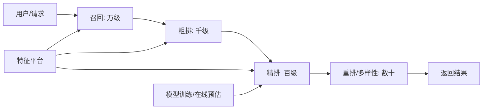

# 推荐系统设计

> 推荐系统是「信息过载时代的注意力分发器」：从海量内容中给每个用户挑出最可能点击/购买的那一批。本篇讲清推荐系统**完整架构（召回→粗排→精排→重排）、核心算法、特征工程、冷启动、评估指标与线上部署**，面向后端工程师的系统设计视角。与「[AB 测试与实验平台设计](AB测试与实验平台设计.md)」「[Feed 信息流设计](Feed信息流设计.md)」「[搜索系统设计](搜索系统设计.md)」「[基础知识/大数据](../基础知识/大数据/README.md)」互链。

---

## 一、推荐系统总体架构



| 阶段 | 规模 | 目标 | 手段 |
|------|------|------|------|
| **召回（Recall）** | 全量 → 数千/万 | 快速捞取候选，求「全」 | 多路召回：热门/协同过滤/向量(ANN)/规则/多路融合 |
| **粗排（Coarse Rank）** | 万 → 千 | 过滤明显不相关，控制精排计算量 | 轻量模型（双塔/DSSM）、向量检索 |
| **精排（Fine Rank）** | 千 → 百 | 精确预估点击率/转化率 | CTR/CVR 模型：LR→FM→DeepFM→多任务 |
| **重排（Re-rank）** | 百 → 数十 | 多样性/商业规则/去重 | MMR、规则干预、强插（广告/运营位） |

> **漏斗思想**：每层精度递增、代价递增，整体控制在毫秒级时延（P95 < 100ms）。

---

## 二、核心算法速览

### 2.1 召回：多路并行

| 召回路 | 原理 | 特点 |
|--------|------|------|
| **热门召回** | 全局热度（可做时间衰减） | 简单兜底、冷启动友好 |
| **协同过滤** | 用户-物品交互矩阵（UserCF/ItemCF） | 经典、依赖行为数据 |
| **向量召回（ANN）** | Embedding 近邻检索（FAISS/Milvus/HNSW） | 效果好、在线可扩展 |
| **规则召回** | 类目/标签/同城/关注 | 业务可控 |
| **多路融合** | 各路加权/打分合并 | 工程核心：分数归一化+权重 |

### 2.2 精排：CTR 模型演进

```
LR → FM（特征交叉）→ DeepFM（浅层+深度）→ 多任务（ESMM: CTR+CVR 联合）
```

- 特征：用户特征（历史/画像）、物品特征（内容/价格）、上下文（时间/位置）、交叉特征；
- 在线预估：模型服务（如 TensorFlow Serving / 自研 Paddle），特征由特征平台实时组装；
- 双塔模型（user tower / item tower）：预计算物品向量，线上只算用户向量 → 全量检索。

### 2.3 特征工程（推荐效果的天花板）

| 特征类型 | 例子 | 工程要点 |
|----------|------|----------|
| 用户画像 | 年龄/性别/地域/兴趣标签 | 实时画像 + 离线画像 |
| 行为序列 | 最近浏览/点击/购买序列 | 序列特征（特征交叉主力） |
| 物品特征 | 类目/价格/发布时间/质量分 | 物品冷启动也靠它 |
| 上下文 | 时间/位置/设备/天气 | 场景化推荐 |
| 交叉特征 | 用户-类目点击率 | 组合特征计算量大，做特征平台缓存 |

---

## 三、冷启动问题

| 场景 | 策略 |
|------|------|
| **新用户** | 热门/地域/年龄性别基础推荐 → 引导选择兴趣标签 → 行为积累后个性化 |
| **新物品** | 内容特征（标题/类目）先推送给高活跃用户试水 → 攒行为后进入协同过滤 |
| **冷门物品** | 探索机制（UCB/EE 策略）保证一定曝光 |

> **EE（探索-利用）**：既要用已知偏好（利用），又要留流量试新（探索）——ε-greedy、UCB、汤普森采样。工程上通常**固定小比例流量做探索**（如 5% 新策略试跑）。

---

## 四、评估指标

| 维度 | 指标 | 说明 |
|------|------|------|
| 效果 | CTR、CVR、GMV、时长 | 业务主指标 |
| 相关性 | 精排打分分布 | 诊断用 |
| 多样性/新鲜度 | 类目覆盖率、新内容占比 | 防信息茧房 |
| 系统 | 时延（P95）、QPS、可用性 | 工程指标 |
| **离线** | AUC、GAUC（用户维度加权 AUC） | 离线评估模型；GAUC 更贴近业务 |
| **在线** | 上线前 AB 实验（显著胜出才全量） | 最终验收，见 [AB 测试](AB测试与实验平台设计.md) |

> **离线好 ≠ 在线好**：必须走 AB 实验验收；离线只看「方向性」。

---

## 五、系统设计关键点（后端视角）

### 5.1 在线链路设计

```
请求 → 网关/统一入口 → 组装用户特征(特征平台) → 多路召回(并行走, 带超时)
    → 粗排过滤 → 精排打分(模型服务, 有降级) → 重排(多样性+规则) → 兜底推荐
```

| 工程要点 | 方案 |
|----------|------|
| 时延控制 | 各阶段独立超时（如召回 20ms/精排 30ms）+ 超时走兜底 |
| 降级 | 模型服务挂 → 热门/规则召回兜底；特征缺失 → 默认值 |
| 缓存 | 热门列表/用户最近结果/模型参数本地缓存 |
| 幂等与限流 | 与 [稳定性三板斧](稳定性三板斧：限流-熔断-降级.md) 联动 |

### 5.2 数据链路

```
行为日志（曝光/点击/转化）→ Kafka → Flink 实时特征 + 离线数仓
→ 特征平台（实时+离线特征统一在线组装）→ 训练样本 → 模型训练 → 模型上线
```

- **样本生成**：曝光日志 + 点击/转化 join（负样本=曝光未点击）；
- **离线在线一致性**：特征口径必须一致（防止「离线 AUC 高、在线不涨」）；
- 呼应 [基础知识/大数据](../基础知识/大数据/README.md) 的实时/离线双链路。

---

## 六、与其他板块的关联

- **评估验收**：推荐迭代必须配 [AB 测试与实验平台设计](AB测试与实验平台设计.md) 的实验体系。
- **Feed 场景**：信息流中推荐与运营位编排见 [Feed 信息流设计](Feed信息流设计.md)。
- **搜索**：与 [搜索系统设计](搜索系统设计.md) 共享「召回-排序」漏斗思想。
- **基础设施**：向量检索（Milvus/FAISS）与 [数据基础设施与中间件](../开源项目/09-数据基础设施与中间件.md) 呼应。

---

## 七、面试高频追问（12+ 条）

1. Q：推荐系统几层漏斗？ A：召回（万）→粗排（千）→精排（百）→重排（数十）。
2. Q：为什么需要多路召回？ A：单路覆盖有限，多路互补（热门兜底/协同行为/向量语义）。
3. Q：向量召回是什么？ A：用户/物品映射到向量空间，ANN 近邻检索（HNSW/FAISS/Milvus）。
4. Q：双塔模型为什么适合线上？ A：物品塔预计算存库，线上只算用户塔一次。
5. Q：CTR 模型怎么演进？ A：LR→FM→DeepFM→多任务（ESMM），核心是特征交叉能力。
6. Q：冷启动怎么解决？ A：新用户走热门/标签引导；新物品靠内容特征+探索曝光。
7. Q：EE 是什么？ A：探索-利用权衡，保证新内容被尝试（固定小比例流量做探索）。
8. Q：GAUC 和 AUC 区别？ A：AUC 全局排序能力；GAUC 按用户加权，更贴近业务。
9. Q：离线效果好但在线不行？ A：特征口径不一致/数据穿越/新奇效应，需一致性校验+AB 验收。
10. Q：推荐系统的负样本是什么？ A：曝光未点击；正负样本比例与采样策略影响大。
11. Q：精排挂了怎么办？ A：降级到粗排分数/热门兜底，保证永远有结果返回。
12. Q：怎么防信息茧房？ A：多样性重排（MMR）、探索流量、运营干预位。
13. Q：特征平台做什么？ A：统一组装实时+离线特征，保证口径一致、延迟可控。
14. Q：推荐时延怎么保证？ A：各阶段超时+并行召回+缓存+降级链路，P95 控制在百毫秒内。
