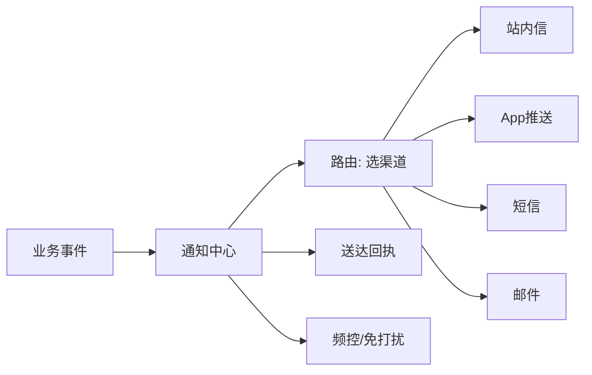

# 推送与通知中心进阶实战

> 通知中心把"站内信、短信、App 推送、邮件、Webhook"统一编排，按用户偏好与渠道可达性智能投递。它要解决高并发下发、渠道限流、送达追踪与免打扰，是用户触达的中枢。

## 1. 架构



## 2. 渠道编排

- **优先级策略**：App 在线走推送，离线走短信兜底。
- **去重合并**：同类通知合并（如"你有 3 条新消息"）。
- **降级**：渠道限流时降级到其他渠道或延迟。

## 3. 频控与免打扰

```python
def can_send(user, channel, now):
    if in_dnd_window(user, now):        # 免打扰时段
        return False
    if rate_limit_exceeded(user, channel, now):  # 频控
        return False
    return True
```

- **全局频控**：单用户每日上限。
- **业务频控**：营销类单独限额。
- **免打扰**：夜间/用户设置不推送。

## 4. 送达追踪

- **回执**：渠道回传送达/点击事件，更新状态。
- **重试**：失败按退避重试，超限标记失败。
- **统计**：送达率、点击率驱动优化。

## 5. 常见坑

| 坑 | 现象 | 对策 |
| --- | --- | --- |
| 推送轰炸 | 用户卸载 | 频控 + 免打扰 |
| 渠道限流 | 发不出去 | 降级 + 排队 |
| 重复通知 | 体验差 | 去重合并 |
| 回执丢失 | 状态不准 | 补偿查状态 |
| 成本失控 | 短信超支 | 渠道预算上限 |

## 6. 面试题

1. 多渠道如何编排投递？
2. 通知频控怎么做？
3. 免打扰如何实现？
4. 送达率如何追踪？
5. 推送和站内信如何兜底？

## 7. 小结

通知中心 = 渠道编排 + 频控免打扰 + 送达追踪 + 降级重试。核心是"在对的时间、用对的渠道、不打扰地触达用户"。
