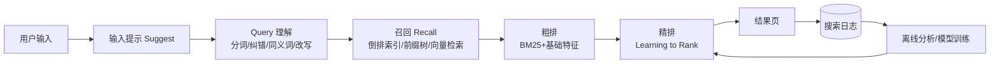

# 搜索系统设计

## 〇、本体介绍

**搜索系统**：把"用户输入的关键词"变成"排序好的商品/文章/文档列表"。核心链路是 **Query 理解 → 召回（Recall）→ 粗排 → 精排**，上层是输入提示、搜索日志与质量评估。

**核心矛盾**：
1. **召回率 vs 精确率**：召回太少漏结果，召回太多噪声大；
2. **相关性排序**：BM25 不够用，业务特征（销量/热度/时效/个性化）要融合进排序；
3. **查询变体**：同义词（"笔记本"=“laptop"）、拼音、错别字、口语化（"苹果13" vs "iPhone 13"）；
4. **高并发**：大促搜索 QPS 极高，缓存与降级要分层设计。

**核心主线**：Query 理解 → 召回（倒排/BK树/向量）→ 粗排 → 精排 → 搜索质量度量。

> 与「[基础知识/ES体系](../基础知识/ES体系.md)」互链：本文讲**搜索系统的架构设计**（链路、排序策略、质量评估），ES 内部原理（倒排/分词/打分细节）见 ES 体系篇。

---

## 一、整体架构



| 阶段 | 目标 | 数据量 | 技术 |
|------|------|--------|------|
| Query 理解 | 搞清楚用户要什么 | 1 条 | 分词、纠错、同义词、实体识别、改写 |
| 召回 | 候选集召回（宁滥勿缺） | 万~百万 | 倒排索引、前缀树（suggest）、向量检索 |
| 粗排 | 快速砍到百级 | 万级 | BM25 + 简单业务特征 |
| 精排 | 输出最终序 | 百级 | 复杂特征模型（LR/GBDT/DNN） |
| 兜底 | 无结果时给替代 | — | 相关搜索、热词兜底 |

> 口诀：**"理解要准、召回要全、粗排要快、精排要准、无结果要兜。"**

---

## 二、Query 理解

| 手段 | 例子 | 实现 |
|------|------|------|
| 分词 | "苹果手机13" → 苹果/手机/13 | IK 等词典 + 新词挖掘 |
| 纠错 | "iPhoe" → "iPhone" | 编辑距离、拼音、搜索日志高频词 |
| 同义词 | "笔记本" ↔ "laptop"；"手机" ↔ "电话" | 同义词词典（业务维护） |
| 实体识别 | "iphone 13 128G 官网价" 抽取机型/内存/意图 | 规则 + NER 模型 |
| Query 改写 | 口语→标准词："苹果13" → "iphone 13" | 点击日志挖掘映射表 |
| 意图分类 | 找商品 / 找文章 / 找店铺 | 分类模型 |

- **词典要业务化**：电商维护商品类目同义词、社区维护黑话；纯通用词典效果差。
- **Query 改写双写**：改写前后两个 Query 都去召回，用重排融合，避免改写错误导致召回丢失。

---

## 三、召回（Recall）

### 3.1 倒排索引召回（主流）

- 分词后建 `term → postings`（倒排表），查询时取交集/并集取回文档 ID。
- 底层引擎：ES/Lucene、Solr、自研（B 站/微信都自研倒排）。
- **过滤**：类目、价格带、上架状态在召回后过滤（filter 不参与打分）。

### 3.2 前缀召回（搜索提示）

- **Trie / 前缀树**：用户输入"苹"，提示"苹果/苹果手机/苹果13"；工程用 **T9 拼音前缀 + 热点词 Top-K**。
- 提示词来源：搜索日志高频 Query，按热度加权，缓存热点提示。

### 3.3 向量召回（语义检索）

- 文本 → embedding 向量，ANN 检索（HNSW）取语义相近文档，兜住**字面不同语义相同**（"怎么减肥" vs "减脂方法"）。
- 电商/搜索混合架构：**倒排保精确、向量保召回**，两路结果融合（RRF 合并）。
- 向量检索服务：Milvus / Faiss / ES kNN；向量 + 倒排的混合检索见「[大模型/RAG/02-进阶检索技术](../大模型/RAG/02-进阶检索技术.md)」。

---

## 四、排序：BM25 → 精排

### 4.1 粗排：BM25

```
score = IDF * TF 加权（词频 + 文档长度归一 + 饱和）
```

- 倒排召回后先按 BM25 粗排，把万级候选砍到百级。
- BM25 只考虑**词项统计**，与业务无关——所以必须叠加业务特征。

### 4.2 精排：业务特征融合

| 特征类 | 例子 |
|--------|------|
| 静态质量 | 商品销量、好评率、价格、上架时长、库存 |
| 相关性 | BM25 分、词位置（标题命中 > 描述命中）、类目匹配 |
| 用户侧 | 历史点击、购买偏好、地域（附近商品加权） |
| 时效 | 新闻时间衰减、活动热度 |
| 个性化 | 协同过滤/用户向量与商品向量相似度 |

- 工程实现：**特征拼接 → GBDT/DNN 打分 → 排序**；电商常用 **LTR（Learning to Rank）**，样本来自搜索日志（点击/下单作为正负样本）。
- 规则兜底：新商品加权（扶持）、无库存降权、违规商品下架不进索引。

> ⚠️ 排序是**业务决策**：电商"销量高"不等于"相关性高"，精排模型要把相关性与商业目标（GMV/点击率）一起建模。

---

## 五、搜索质量评估

| 指标 | 含义 | 作用 |
|------|------|------|
| **PV-CTR** | 点击率 = 点击 PV / 展示 PV | 结果是否吸引人 |
| **无结果率** | Query 返回空的比例 | 召回覆盖，目标 <1% |
| **长尾覆盖** | 冷门 Query 有结果的比例 | 词典/纠错是否到位 |
| **首屏点击** | 前 3 名点击占比 | 排序是否合理 |
| **改词率** | 用户重新输入/翻页比例 | 结果是否满足 |
| **离线 NDCG/MAP** | 标注集排序质量 | 模型迭代基准 |

- **搜索日志**是核心资产：Query、结果、点击、下单全量落 Kafka，离线做评估与模型训练。
- **A/B 实验**：排序策略灰度发布，按 PV-CTR/转化率决策。

---

## 六、高并发与缓存

| 层 | 手段 |
|----|------|
| 网关 | 限流、防爬（Query 频率限制）、地域路由 |
| 应用层 | 热点 Query 结果缓存（Redis 短 TTL，如"iphone13"大促词）；建议词缓存 |
| 引擎层 | ES 集群读副本、Query 缓存（相同 DSL 命中）、分片副本均衡 |
| 降级 | 精排模型超时 → 降级 BM25；向量检索超时 → 只走倒排；引擎全挂 → 热词榜兜底 |
| 预加载 | 大促前把 Top-10 万热词结果预热到本地缓存 |

- 搜索 QPS 峰值是平时的 10~50 倍（大促开门红），**缓存 + 降级 + 容量预案**三件套（见「[大促容量规划与备战](大促容量规划与备战.md)」）。

---

## 七、无结果与兜底

| 场景 | 兜底策略 |
|------|----------|
| 无结果 | 相关搜索推荐（日志共现）、热词榜单、去词重搜（"苹果手机 保护壳"删一个词） |
| 结果少 | 放宽过滤（类目/价格带）、同义词扩展、向量召回兜底 |
| 输入错误 | 纠错提示"你是不是想搜：iPhone 13" |
| 禁词/违规 | 命中安全词库直接返回空或提示，不进兜底 |

---

## 八、与相关主题的关联

- 「[基础知识/ES体系](../基础知识/ES体系.md)」：引擎内部原理与调优。
- 「[大模型/RAG/02-进阶检索技术](../大模型/RAG/02-进阶检索技术.md)」：混合检索（倒排+向量+RRF）与重排序。
- 「[基础知识/中间件/ClickHouse](../基础知识/中间件/ClickHouse.md)」：搜索日志 OLAP 分析（CTR/漏斗）。
- 「[大促容量规划与备战](大促容量规划与备战.md)」：搜索峰值容量与预案。
- 「[多级缓存框架](多级缓存框架.md)」：热点 Query 缓存与击穿防护。
- 「[业务模型/电商业务模型](../业务模型/电商业务模型.md)」：搜索在电商中的业务位置。

---

## 九、速查表

| 主题 | 一句话 |
|------|--------|
| 链路 | Query 理解 → 召回 → 粗排 → 精排 → 兜底 |
| Query 理解 | 分词/纠错/同义词/改写，词典要业务化 |
| 召回 | 倒排保精确、向量保语义、前缀保提示 |
| 粗排 | BM25 快速砍到百级 |
| 精排 | 业务特征 + LTR 模型，相关性与商业目标一起建模 |
| 评估 | PV-CTR / 无结果率 / 首屏点击 / 离线 NDCG |
| 高并发 | 热点缓存 + 引擎副本 + 三级降级 + 热词兜底 |
| 兜底 | 无结果出相关搜索，错误出纠错提示 |

---

## 面试高频问题（15+ 条）

1. **搜索系统整体流程？** Query 理解 → 召回 → 粗排 → 精排 → 兜底，离线日志驱动模型迭代。
2. **召回和排序的区别？** 召回求全（倒排取候选，万级+），排序求准（打分排序，百级输出）。
3. **倒排索引是什么？** term → 文档列表，分词后建索引，查询词直接取 postings 求交并。
4. **BM25 的直觉？** 词频（TF）加权但饱和、文档越长权重越打折（IDF 词区分度），与查询词匹配度。
5. **为什么 BM25 不够？** 只算词项统计，不含销量/时效/个性化等业务信号，需要精排模型融合。
6. **搜索提示（suggest）怎么实现？** Trie 前缀树 + 热点词 Top-K 缓存，日志高频词加权。
7. **同义词怎么处理？** 业务同义词词典 + 点击日志挖掘，改写双路召回。
8. **错别字怎么办？** 编辑距离 + 拼音纠错，结合搜索日志高频词库。
9. **无结果怎么办？** 相关搜索（日志共现）+ 热词榜 + 去词重搜 + 向量兜底。
10. **怎么评估搜索质量？** 线上 PV-CTR/首屏点击/改词率 + 离线标注 NDCG，A/B 灰度。
11. **大促搜索怎么扛？** 热点 Query 缓存 + 引擎读副本 + 精排降级 BM25 + 热词榜兜底。
12. **向量检索用在搜索哪？** 语义召回（同义不同形），与倒排双路融合（RRF）。
13. **搜索和推荐的区别？** 搜索有明确意图（Query），推荐无 Query 靠行为；排序信号一个偏相关一个偏偏好。
14. **搜索结果要过滤广告/违规吗？** 要：安全词库前置过滤，广告单独队列 + 标注，不能污染自然结果。
15. **日志怎么用？** 全量落 Kafka：Query/结果/点击/下单，离线算指标、训练 LTR、挖掘同义词与改词表。
16. **Query 改写会出问题吗？** 改写错误会丢召回，所以双写双路召回 + 重排融合兜底。
17. **什么场景不用 ES？** 超大规模自研引擎（B 站/微信），或强语义场景向量库为主；ES 适合快速落地。
18. **搜索延迟预算？** 通常 P99 < 100ms：召回 20ms、粗排 10ms、精排 30ms、网络与组装余量。

---

> 配套：引擎原理 →「[基础知识/ES体系](../基础知识/ES体系.md)」；大促容量 →「[大促容量规划与备战](大促容量规划与备战.md)」。
