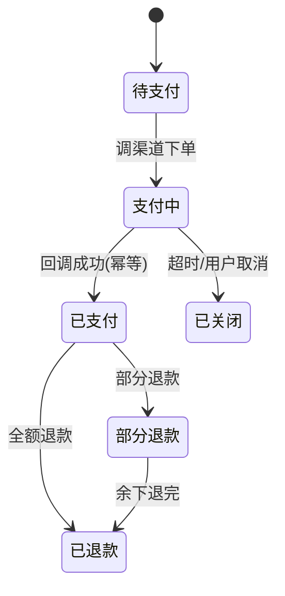

# 支付系统核心设计

> 板块：场景设计 　|　 返回：[README](README.md)
> 适用：电商/本地生活/内容付费/打赏/SaaS 等任何涉及「收钱」的业务。

## 一、支付的复杂性

支付不是「扣钱」一句话，而是涉及：渠道接入、订单、账务、对账、退款、风控、幂等、异步通知。任何一步错都会资损（多扣/少扣/重复扣/重复发货）。

> 支付系统第一原则：**钱不能错。一致性 > 性能。可审计 > 灵活。**
> 宁可慢一点、多校验，也不能算错一笔账。

## 二、核心实体（领域模型）

```
         ┌────────────┐        ┌──────────────┐
         │  PayOrder  │ 1:1   │  ChannelTx   │
         │  支付订单   │──────▶│  渠道交易记录 │
         └────────────┘        └──────────────┘
                │ 1:N
                ▼
         ┌────────────┐        ┌──────────────┐
         │   Refund   │ 1:1   │    Ledger     │
         │   退款单   │──────▶│   账务流水     │
         └────────────┘        └──────────────┘
```

- **支付订单（PayOrder）**：一次支付请求，含金额、渠道、状态、outTradeNo。
- **渠道交易（ChannelTx）**：对下游渠道（微信/支付宝/银联/卡组织）的交易记录。
- **账务流水（Ledger）**：每笔资金变动的借贷记录，用于对账与审计。
- **退款单（Refund）**：逆向交易，关联原支付订单。
- **账户（Account）**：用户余额/商户待结算/平台应收等资金账户。

## 三、支付流程（同步下单 + 异步通知）

```
用户下单 → 创建支付订单(待支付) → 调渠道 SDK 下单 → 返回支付凭证
   → 用户支付（在渠道侧完成）
   → 渠道异步回调 notify_url（携带签名 + 交易结果）
   → 验签 → 幂等校验(outTradeNo) → 更新订单(已支付) → 记账(Ledger)
   → 通知业务系统(发货/开通权益)
```

- 渠道回调是 **异步** 且 **可能重复/乱序**，必须幂等处理。
- 订单状态机：待支付 → 支付中 → 已支付 / 已关闭 / 已退款 / 部分退款。
- 前端轮询 / 渠道主动查单作兜底（防回调丢失）。



## 四、幂等设计（重中之重）

重复支付/重复回调是资损第一来源。

- 每个支付/退款请求带 **`outTradeNo`（业务唯一号）**。
- 渠道回调用 `outTradeNo` 做幂等键，重复通知直接返回「已处理成功」。
- DB 唯一索引防并发重复处理；处理时用事务 + 状态机防重入。

```sql
ALTER TABLE pay_order ADD UNIQUE KEY uk_out_trade_no (out_trade_no);

-- 回调处理伪逻辑
BEGIN;
SELECT * FROM pay_order WHERE out_trade_no = ? FOR UPDATE;  -- 行锁
if status == 已支付: COMMIT; return "success";              -- 幂等返回
UPDATE pay_order SET status='已支付', channel_tx_id=? WHERE out_trade_no=?;
-- 记账 ...
COMMIT;
```

> 关键：先查后改 + 数据库唯一约束 + 锁，三层保证同一笔只处理一次。

## 五、渠道接入与适配器

- 每个渠道一个适配器（见 [适配器模式](../../设计模式/结构型/适配器模式.md)），统一 `PaymentGateway` 接口：

```java
interface PaymentGateway {
    PreOrderResult preOrder(PreOrderReq req);   // 下单
    QueryResult    query(String outTradeNo);     // 查单
    RefundResult   refund(RefundReq req);        // 退款
    void           handleNotify(NotifyReq req);  // 回调
}
// 微信/支付宝/银联各自实现，业务层只依赖接口
```

- 渠道配置（商户号、密钥、证书）隔离，支持多渠道路由。
- **渠道路由 + 降级**：主渠道故障 → 自动路由到其他渠道（如微信挂切支付宝）；同渠道多商户号轮询。
- 渠道额度/费率管理：选低成本/高成功率渠道。

## 六、对账（Reconciliation，资损最后防线）

- 每日 T+1 拉取渠道流水文件（或对账 API），与本地账务逐笔核对。
- 差异分类：
  - **长款**：渠道有、本地无（可能漏记回调）→ 补单/挂账；
  - **短款**：本地有、渠道无（可能渠道未结算）→ 挂账核查；
  - **错账**：金额不一致 → 人工复核。
- 差错处理：挂账、调账、人工复核、上游追溯。
- 对账是发现资损的最后防线，**必须有且自动化 + 人工兜底**。

```sql
-- 简化对账：以渠道流水为准比对本地
SELECT c.trade_no, c.amount, l.out_trade_no, l.amount
FROM channel_bill c
LEFT JOIN pay_order l ON c.out_trade_no = l.out_trade_no
WHERE l.out_trade_no IS NULL OR l.amount <> c.amount;
```

## 七、账务与复式记账

- 每笔交易记借贷双方（用户余额、平台应收、渠道待清算、手续费支出）。
- 账户余额用「余额 + 流水」双写，流水不可变（只追加，体现资金轨迹）。
- 余额变更用「条件更新 + 乐观锁/行锁」保证正确。

```sql
-- 扣减用户余额，余额不足则失败（原子）
UPDATE account
SET balance = balance - ?, version = version + 1
WHERE id = ? AND balance >= ?;
-- 影响行数 = 0 → 余额不足，回滚并提示

-- 账务流水（只追加）
INSERT INTO ledger (account_id, debit, credit, balance_after, ref_id, type)
VALUES (?, 0, ?, ?, ?, 'PAY');
```

> 复式记账保证「借贷平衡」，任何时刻 `Σ 借 = Σ 贷`，是审计与对账的基础。

## 八、退款与逆向

- 退款需 **原路退回**（原卡/原渠道），部分退款要记录已退金额与次数。
- 退款也走渠道异步回调，同样幂等（refundNo 唯一）。
- 退款后账务做反向记账（借/贷反转）。
- 退款时效：渠道有窗口（如 T+7 内），超时需要线下处理。

## 九、风控

| 层级 | 手段 |
|------|------|
| 实时规则 | 大额、异地、频繁小额测试卡、半夜交易 |
| 限额 | 单笔/单日/单用户上限 |
| 名单 | 黑名单账户/设备/卡 bin、白名单商户 |
| 设备指纹 | 设备 ID、IP 信誉、行为序列 |
| 人工 | 可疑交易拦截 + 审核通道 |

- 风控与支付解耦：风控结果（pass/review/reject）异步/同步返回，阻断高危交易但不阻塞正常。
- 规则热更新：风控规则可配置，避免每次改代码。

## 十、安全

- **回调验签**：所有渠道回调必须验签（RSA/MD5+HMAC），防伪造回调篡改金额。
- **金额权威**：金额由服务端计算，绝不信任前端传值；前端只传商品/数量，服务端算价。
- **敏感加密**：卡号脱敏存储、密钥托管（KMS）、证书定期轮换。
- **防篡改**：订单号、金额、状态全部服务端权威；传输用 HTTPS + 签名。
- **最小权限**：支付服务独立部署，与业务系统网络隔离。

## 十一、性能与一致性权衡

- 下单/回调链路的「记账 + 状态变更」必须事务一致；
- 通知业务、发短信、积分等非核心动作 **异步化**（MQ），不阻塞支付主链路；
- 高并发秒杀支付：预扣库存 + 异步确认，避免超卖。

## 十二、常见坑

1. 回调不幂等 → 重复到账/重复发货（用 outTradeNo + 唯一索引）。
2. 不做对账 → 渠道少结算才发现资损（必须 T+1 自动对账）。
3. 余额更新无并发控制 → 超扣（用条件更新/行锁）。
4. 金额信任前端 → 被篡改 0.01 元下单（服务端算价）。
5. 退款不校验原订单 → 退了没付的钱（校验原支付状态）。
6. 渠道秘钥硬编码 → 泄露资损（用 KMS/配置中心）。
7. 只依赖回调 → 回调丢失订单卡死（加定时查单兜底）。
8. 账务只记单边 → 无法对账（用复式记账）。
9. 退款未原路 → 合规风险（必须原路退回）。
10. 无风控 → 洗钱/盗刷（实时 + 名单 + 限额）。

## 十三、落地清单

1. 订单 + 渠道 + 账务三件套建模（PayOrder/ChannelTx/Ledger）。
2. 全链路幂等（outTradeNo / refundNo + 唯一索引 + 锁）。
3. 渠道适配器 + 路由降级。
4. 每日自动对账 + 差错处理 + 人工兜底。
5. 复式记账 + 余额并发控制。
6. 回调验签 + 服务端算价 + 敏感加密。
7. 风控（实时 + 名单 + 限额）+ 监控告警（掉单/对账差异）。

## 十四、延伸阅读

- [分布式事务与最终一致性实战](../场景设计/分布式事务与最终一致性实战.md)
- [适配器模式](../../设计模式/结构型/适配器模式.md)
- [幂等设计（场景设计）](分布式锁与幂等设计.md)
- [分布式锁与幂等设计](分布式锁与幂等设计.md)
- [业务模型/支付清结算与账务模型](../业务模型/支付清结算与账务模型.md)
