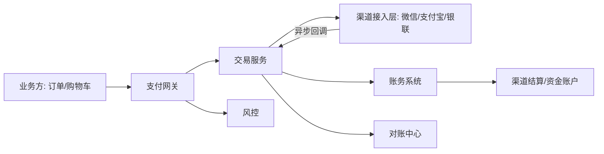
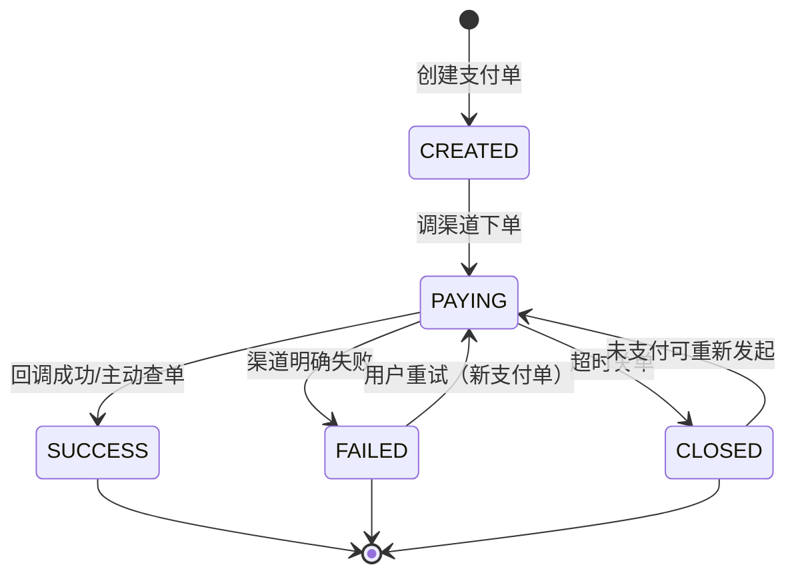

# 支付系统设计：回调、幂等与对账

## 〇、本体介绍

**支付系统**：业务（订单/充值/打赏）与资金渠道（微信/支付宝/银联）之间的**资金桥**。它把"用户付钱"这件事做成**可审计、可对账、不丢不重**的闭环，是**资金安全 + 最终一致**的教科书级场景。

**核心矛盾**：
1. 钱**绝对不能错**：多扣/少扣/重复扣都是事故，比宕机严重得多；
2. 渠道交互是**异步、不可靠**的：回调可能乱序、重复、丢失；
3. 资金链路涉及**多系统多账户**（用户→平台→渠道），任何一环失败都要可追溯；
4. 支付是**高频高并发**入口，还不能因降级损失资金正确性。

**核心主线**：支付单建模 → 支付网关 → 渠道接入 → 回调处理 → 幂等/状态机 → 对账与差错处理。

---

## 一、整体架构与模块划分



| 模块 | 职责 | 关键点 |
|------|------|--------|
| **支付网关** | 统一入口：协议转换、加解密、验签、路由、限流 | 无状态、高可用；对外只暴露网关 |
| **交易服务** | 支付单生命周期：创建→支付中→成功/失败/关单 | 状态机 + 幂等 |
| **渠道接入层** | 适配各家渠道报文/签名/回调 | 渠道隔离、超时与重试策略、渠道熔断 |
| **风控** | 金额、频次、设备、黑白名单、实时拦截 | 异步决策为主，秒级放行 |
| **账务系统** | 资金账户与复式记账（见「[钱包与账务系统设计](钱包与账务系统设计：账户、流水与日终对账.md)」） | 交易与账务分离 |
| **对账中心** | 本地流水 vs 渠道账单逐笔核对 | 日终对账 + 差错处理 |

> 口诀：**"网关收口，交易建模，渠道隔离，账务分离，对账兜底。"**

---

## 二、核心数据模型

### 2.1 交易单 vs 支付单（两层单）

| 单据 | 谁发起 | 作用 | 关系 |
|------|--------|------|------|
| **业务订单** | 业务方（订单系统） | 表达交易意图（买什么） | 1 笔业务单可 0..N 次支付尝试 |
| **支付单** | 支付系统 | 记录一次**支付尝试**（用什么渠道付多少） | 每次发起支付新建一条 |

- 拆两层的原因：用户可能**反复尝试支付**（超时重试、换渠道），支付单天然支持**重试/换渠道**而不污染业务订单。
- **支付单号（内部单号）**是贯穿全链路的幂等键：唯一索引，创建即锁。

### 2.2 支付单核心字段

```sql
CREATE TABLE payment_order (
    id             BIGINT PRIMARY KEY,
    payment_no     VARCHAR(32)  UNIQUE NOT NULL,  -- 支付单号（幂等键）
    biz_order_no   VARCHAR(32)  NOT NULL,          -- 业务订单号
    user_id        BIGINT       NOT NULL,
    amount         BIGINT       NOT NULL,          -- 金额，单位分
    channel        VARCHAR(16),                    -- 渠道: WX/ALI/UNIONPAY
    channel_trade_no VARCHAR(64),                  -- 渠道侧交易号（回调带回）
    status         TINYINT      NOT NULL,          -- 见状态机
    notify_count   INT          DEFAULT 0,         -- 回调通知次数（业务侧）
    created_at     DATETIME,
    updated_at     DATETIME
) COMMENT '支付单';
```

- **金额一律整数分**；支付金额与业务订单金额由支付系统**二次校验**（防业务方传错/被篡改）。
- 渠道交易号在回调到达时回填，是**对账时的关联键**。

---

## 三、状态机（支付单）



- **状态单向流转、只增不回退**；SUCCESS 为终态，任何重复回调不得改变终态（幂等的第一层防线）。
- 关单后若渠道仍回调成功 → **异常单**，走人工/自动差错处理（资金已收、订单已关，需要退款或补发货）。
- 状态变更统一走 `UPDATE ... WHERE status = 期望旧状态`（CAS），并发回调只赢一次。

---

## 四、渠道接入与回调处理（核心）

### 4.1 发起支付（前置交互）

1. 校验：风控、金额、幂等（同业务单未支付时复用支付单，**防止重复下单**）；
2. 落库支付单（CREATED）→ 调渠道下单接口；
3. 渠道返回收银参数（小程序参数/二维码链接）→ 返回给前端。

> 口诀：**"先落库、后调渠道；调渠道必须带本系统支付单号。"**（渠道原样带回，回调才能关联）

### 4.2 回调机制（异步通知）

| 环节 | 要点 |
|------|------|
| **验签** | 回调报文必须验签（RSA/SHA256withRSA、平台证书），**验签失败直接丢弃**，防伪造 |
| **幂等判重** | 同一支付单重复回调：已 SUCCESS 直接返回成功应答，不再处理 |
| **状态核对** | 以回调状态 + 渠道侧查单接口**二次确认**（防回调延迟/乱序导致的错误终态） |
| **应答约定** | 处理成功必须返回渠道约定的应答（如"SUCCESS"），否则渠道会**按策略重试**（如 15s/30s/1min/…阶梯） |
| **补偿** | 回调丢失不依赖渠道：**定时主动查单**（轮询未终态支付单调渠道查询接口）+ 对账兜底 |

### 4.3 通知业务方（主动外呼）

- 支付成功 → 向业务方发**支付成功通知**（MQ + HTTP 回调双重保障）。
- 业务方处理也需**幂等**（业务侧按支付单号判重，见「[幂等设计](幂等设计.md)」）。
- 通知失败阶梯重试（如 1min/5min/30min/2h/…），最终对账兜底。

---

## 五、幂等设计（资金不重复的根基）

| 层 | 幂等键 | 手段 |
|----|--------|------|
| 发起支付 | 业务订单号 | 未终态支付单复用（unique 索引兜底） |
| 渠道回调 | 支付单号 | 状态机 CAS + 唯一索引 |
| 业务通知 | 支付单号 | 接收方去重表 |
| 入账 | 支付单号 → 账务流水号 | 账务系统唯一约束（见账务篇） |

- **去重表**是最朴实的兜底：`callback_dedup(payment_no, channel_notify_id)` 唯一索引，重复通知 insert 即败。
- **关键原则：幂等键必须来自本系统已存在的单号，而不是依赖渠道通知内容**（渠道通知可能不携带稳定 ID）。

> 口诀：**"一切重复处理，都靠唯一键硬扛；状态机 + 唯一索引 + 去重表三层兜底。"**

---

## 六、对账与差错处理

### 6.1 日终对账流程

1. **取数**：渠道侧下载 T-1 结算账单（文件/SFTP），解析为标准流水；
2. **配对**：`本地支付流水 vs 渠道账单`按 `渠道交易号/支付单号` 匹配；
3. **核对**：逐笔对金额、状态；汇总对**总笔数、总金额**；
4. **差错分类**：

| 差异类型 | 含义 | 处理 |
|----------|------|------|
| **长款** | 渠道有、本地没有（用户付了钱本地没记录） | 补单/人工核查，追回资金记录 |
| **短款** | 本地有、渠道没有 | 渠道方问题，联系渠道/排查伪造 |
| **金额不符** | 记录存在但金额不同 | 高优先级，人工介入 |
| **成功/失败状态不符** | 回调与账单冲突 | 以账单为准修正状态 |

- 对账规则与告警详见「[SRE与稳定性工程/06-日志与告警规则库](../SRE与稳定性工程/06-日志与告警规则库.md)」。
- 差额>阈值（如 0.01 元或 1 笔）即告警，**资金差错零容忍**。

### 6.2 对账与清结算分离

- **对账**（核对差异）与**清结算**（资金归集/出款）是两套流程：对账发现问题 → 冻结相关资金 → 修复后再结算，防止"账还没对平钱先出去了"。

---

## 七、高可用与安全

| 方面 | 措施 |
|------|------|
| 网关高可用 | 无状态 + 多活部署，入口限流（见「[Redis 实现限流](redis实现限流.md)」） |
| 渠道故障 | 超时/重试策略隔离，渠道级熔断降级（见「[稳定性三板斧](稳定性三板斧：限流-熔断-降级.md)」） |
| 数据安全 | 敏感数据（卡号等）加密存储 + 脱敏展示，密钥托管（KMS），符合 PCI-DSS 类要求 |
| 审计 | 全链路流水留痕，支付操作可回溯 |
| 资金保护 | 交易与账务分离、复式记账、日终对账（见「[钱包与账务系统设计](钱包与账务系统设计：账户、流水与日终对账.md)」） |

---

## 八、与其他板块的关系

- **钱包与账务系统设计**：支付成功后的资金落地（复式记账/日终对账），本节的对账也是账务对账的上游输入。
- **幂等设计**：回调/通知/入账三处幂等的通用方法论。
- **Redis 实现限流**：支付网关入口的流量控制。
- **稳定性三板斧**：渠道熔断、网关降级（如暂停某个渠道）。
- **延迟任务与订单超时关闭**：支付单超时关单的定时兜底与"未支付订单"检查。
- **大促容量规划与备战**：支付链路是促销峰值的第一压力点（下单→支付）。
- **SRE与稳定性工程/06-日志与告警规则库**：对账差异告警、回调积压告警。

---

## 九、速查表

| 主题 | 一句话 |
|------|--------|
| 两层单 | 业务订单（意图）+ 支付单（尝试），支付单可重试 |
| 金额 | 整数分；支付金额与业务金额二次校验 |
| 状态机 | 单向流转不回退，CAS 更新，SUCCESS 终态 |
| 发起 | 先落库后调渠道，渠道原样带回支付单号 |
| 回调 | 验签 → 幂等判重 → 二次查单确认 → 应答渠道 |
| 通知业务 | MQ + HTTP 回调，阶梯重试，接收方幂等 |
| 幂等 | 状态机 + 唯一索引 + 去重表三层 |
| 对账 | 日终取渠道账单逐笔配对，长短款分类处理 |
| 差错 | 长款补单、短款追查、金额不符人工介入 |
| 安全 | 加密存储、脱敏、验签、审计留痕 |

---

## 面试高频问题（15+ 条）

1. **支付系统核心难点？** 资金不错、不丢、不重；异步回调的最终一致；可对账可审计。
2. **为什么要有业务订单和支付单两层？** 一次购买可多次尝试支付（重试/换渠道），支付单隔离尝试与意图。
3. **支付单号为什么能当幂等键？** 它由本系统生成、全局唯一、贯穿全链路，不依赖渠道通知内容。
4. **回调重复到达怎么办？** 验签 + 状态机（终态不变）+ 去重表（channel_notify_id 唯一索引）。
5. **回调丢失怎么办？** 不依赖渠道：定时任务轮询未终态支付单，调渠道查单接口确认。
6. **怎么防伪造回调？** RSA 验签 + 平台证书校验 + 查单接口二次确认。
7. **渠道通知乱序怎么办？** 不以通知顺序定终态，以"查单接口结果 + 状态机正向流转"为准。
8. **金额怎么保证一致？** 整数分存储，创建时与业务单二次校验，对账逐笔核对。
9. **对账怎么做的？** 渠道 T-1 账单与本地流水按渠道交易号配对，对笔数对金额，差错分类处理。
10. **长短款怎么处理？** 长款补单核查、短款追渠道排查、金额不符人工介入，先冻结再结算。
11. **对账和清结算为什么要分离？** 账不平就先结算会导致资金错付，先对账确认再出款。
12. **支付网关挂了会怎样？** 网关无状态多活 + 限流；渠道侧熔断降级，交易服务本身不挂。
13. **怎么防止用户重复发起支付？** 同业务单未终态复用支付单（unique 约束 + 状态检查）。
14. **支付成功通知业务方失败怎么办？** MQ + HTTP 双通道，阶梯重试，业务方按支付单号幂等，对账兜底。
15. **安全上有哪些要求？** 敏感数据加密存储/脱敏、密钥 KMS 托管、全链路审计、验签防伪。
16. **如何支撑大促峰值？** 网关无状态扩容、限流削峰、异步化（回调/通知/入账异步）、渠道多活。

---

> 配套：资金落地与日终对账 →「[钱包与账务系统设计](钱包与账务系统设计：账户、流水与日终对账.md)」；通用幂等方法论 →「[幂等设计](幂等设计.md)」；真实案例参考 →「[抖音支付十万级 TPS 流量发券实践](抖音支付十万级 TPS 流量发券实践.md)」。
