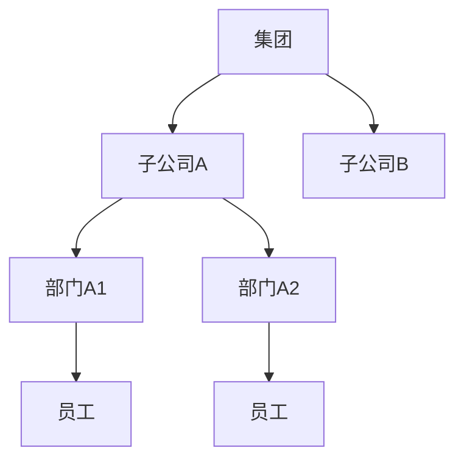

# 数据权限与多组织架构设计实战

> 企业级系统里，"谁能看什么数据"是刚需：集团-公司-部门-个人多层级组织，数据要按组织隔离又要有跨级汇总。数据权限做不好，要么越权泄露，要么正常业务看不全。

## 1. 组织模型



## 2. 权限模型：RBAC + 数据范围

- **功能权限（RBAC）**：角色决定能进哪些菜单、调哪些接口。
- **数据范围（Data Scope）**：决定能看到哪些组织的数据。

| 范围类型 | 含义 |
| --- | --- |
| 全部 | 看全集团 |
| 本级及下级 | 看自己部门及下属 |
| 本级 | 仅本部门 |
| 仅本人 | 只看自己的数据 |

## 3. 实现方式

- **注解 + 拦截器**：`@DataScope(deptAlias)` 在查询前注入过滤条件。
- **SQL 改写**：自动拼 `dept_id IN (可见部门集合)`。
- **行级策略**：数据库层 RLS（Row-Level Security）兜底。

```sql
-- 拦截器注入后的查询
SELECT * FROM order o
WHERE o.dept_id IN (
  SELECT dept_id FROM dept_path WHERE ancestor = :userDept
);
```

## 4. 多组织与数据隔离

- **组织树预计算**：维护 `dept_path`（祖先路径），快速求下属集合。
- **跨组织汇总**：用"本级及下级"聚合，不泄露兄弟节点数据。
- **租户隔离**：SaaS 场景叠加 `tenant_id` 物理/逻辑隔离。

## 5. 常见坑

| 坑 | 现象 | 对策 |
| --- | --- | --- |
| 越权看数 | 泄密 | 服务端强制注入 |
| 看不全 | 业务受阻 | 范围配置准确 |
| 性能差 | 查询慢 | 部门路径索引 |
| 改组织漏权 | 权限错乱 | 组织变更同步范围 |
| 前端绕过 | 直接调接口 | 后端再校验 |

## 6. 面试题

1. 功能权限与数据权限区别？
2. 多层级组织如何快速求下属部门？
3. 数据权限为什么不能只在前端做？
4. RBAC 如何扩展到数据范围？
5. 行级安全与 SQL 改写如何配合？

## 7. 小结

数据权限 = RBAC 功能权限 + 数据范围 + SQL 改写/RLS。核心是"服务端强制、组织树预计算、范围可配置"，既防越权又保业务可用。
