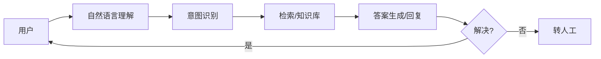

# 智能客服与对话系统设计实战

> 智能客服是 NLP/LLM 最早规模落地的场景之一：意图识别、FAQ 检索、多轮对话、人工兜底。目标是在不降低满意度的前提下提升自助解决率、降低人工成本。架构上要平衡"准确"与"可控"。

## 1. 系统结构

## 2. 核心模块

| 模块 | 关键 |
| --- | --- |
| 意图识别 | 分类 + 槽位抽取 |
| 知识库 | FAQ、文档、商品知识 |
| 检索/召回 | 向量 + 关键词混合 |
| 对话管理 | 多轮状态、上下文 |
| 转人工 | 意图升级、满意度 |

## 3. LLM 增强

- 用 RAG 从知识库取答案，减少幻觉。
- 对低置信度问题转人工，不硬答。
- 对话摘要辅助人工座席快速接手。
- 敏感/违规问题走安全护栏。

## 4. 效果度量

- 自助解决率、转人工率、满意度。
- 答非所问率（人工抽检）。
- 平均处理时长。

## 5. 常见坑

| 坑 | 现象 | 对策 |
| --- | --- | --- |
| 幻觉 | 胡说 | RAG + 拒答 |
| 转人工晚 | 差评 | 置信度阈值 |
| 上下文丢 | 答非所问 | 会话状态 |
| 知识过期 | 错答 | 知识更新 |
| 安全 | 被诱导 | 护栏 |

## 6. 面试题

1. 智能客服如何减少幻觉？
2. 何时转人工？
3. 多轮对话如何管理状态？
4. 知识库如何更新？
5. 如何度量客服效果？

## 7. 小结

智能客服 = 意图识别 + 知识检索 + 对话管理 + 人工兜底。核心是"用 RAG 保证准确、用转人工保证兜底、用指标驱动迭代"。
