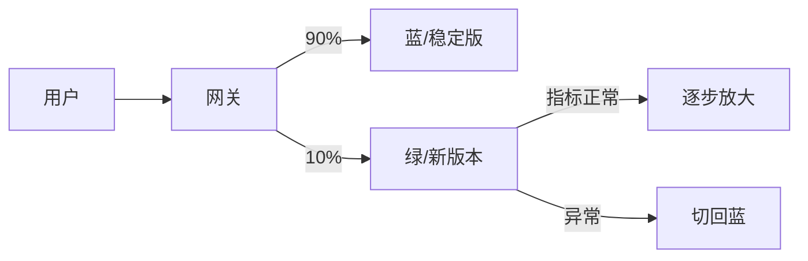

# 灰度发布与蓝绿部署实战

> 发布是稳定性最危险的时刻。灰度（金丝雀）与蓝绿部署让新版本先小流量验证、出问题秒级回滚，把"全量故障"降级为"少量影响"。它们是高可用体系的必备能力。

## 1. 三种发布对比

| 方式 | 机制 | 回滚 | 资源 |
| --- | --- | --- | --- |
| 全量 | 直接替换 | 慢 | 省 |
| 蓝绿 | 两套环境切流量 | 秒级切回 | 双倍 |
| 金丝雀 | 逐步放量 | 缩回流量 | 略增 |

## 2. 金丝雀流程

1. 部署新版本（v2），不接流量。
2. 网关按规则（1% → 5% → 20% → 100%）放量。
3. 每阶段监控错误率、延迟、业务指标。
4. 异常则自动缩回 + 告警；正常则继续放大。

## 3. 蓝绿切换

- 蓝（v1）承载全部流量，绿（v2）预热就绪。
- 切换时改路由权重到绿，瞬间完成。
- 异常切回蓝，用户无感。

## 4. 关键支撑

- **流量染色**：header 标记版本，全链路一致。
- **健康检查**：就绪探针未过不接流。
- **指标驱动**：基于 SLO 自动决策放大/回滚。
- **数据兼容**：新老版本共用 DB，需向后兼容。

## 5. 常见坑

| 坑 | 现象 | 对策 |
| --- | --- | --- |
| 数据不兼容 | 新版本写旧字段报错 | 先兼容后清理 |
| 缓存击穿 | 切流瞬间打满 | 预热 + 限流 |
| 状态不一致 | 有状态服务切错 | 无状态化 |
| 回滚慢 | 影响扩大 | 流量级回滚 |
| 监控盲区 | 异常未发现 | 全链路指标 |

## 6. 面试题

1. 蓝绿和金丝雀区别？
2. 金丝雀为什么从小流量开始？
3. 有状态服务如何做蓝绿？
4. 发布异常如何自动回滚？
5. 新老版本共用 DB 要注意什么？

## 7. 小结

灰度/蓝绿 = 小步验证 + 流量可控 + 秒级回滚。核心原则：任何发布都可被快速撤销，用流量而非赌运气来保障稳定。
