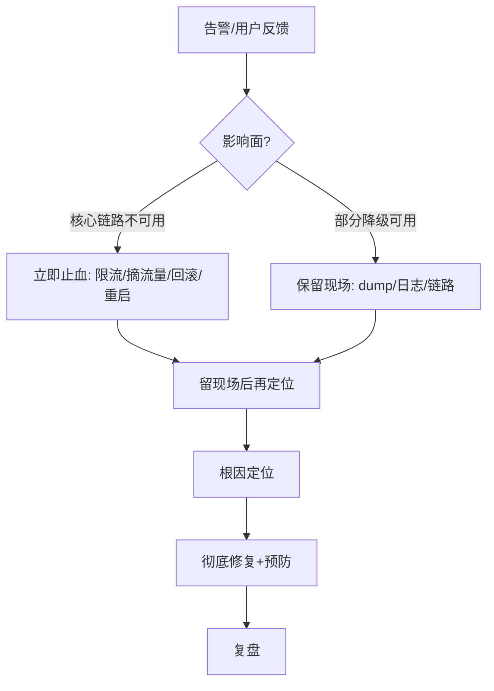
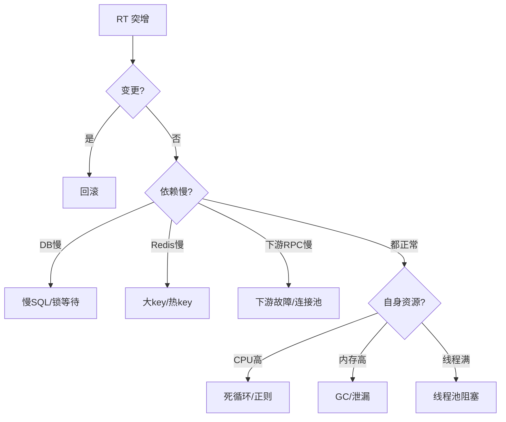
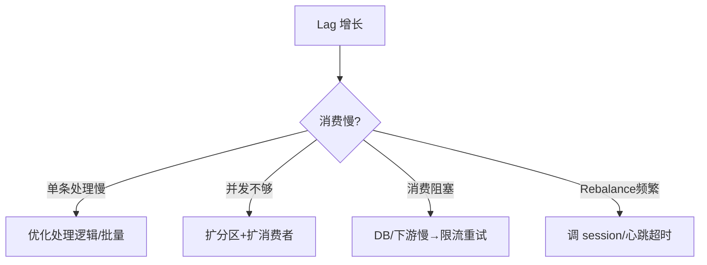
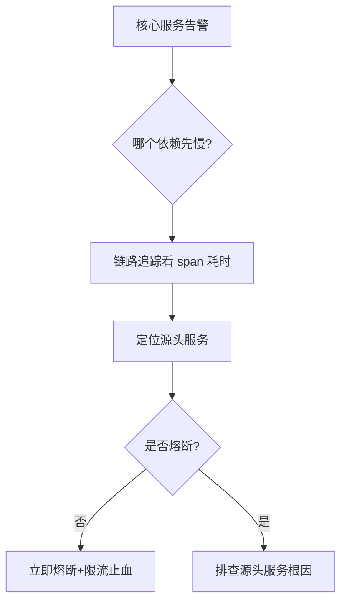

# 生产问题排查实战：常见故障与处置步骤

> 线上故障千奇百怪，但高频的就那几类。本文按 **"现象 → 影响面 → 先止血 → 根因 → 排查步骤 → 解决 → 复盘预防"** 的结构，整理后端日常最高频的生产事故处置剧本。
>
> 与「[问题定位](问题定位.md)」互补：那里是**通用方法论与工具链**（Arthas / jstack / 火焰图 / performance_schema），本文是**具体事故的作战手册**——你遇到某类故障，直接照剧本一步步走。涉及工具细节请回看「问题定位」。

---

## 总原则：先止血，再留现场，后定位

任何生产故障，第一动作永远是**恢复业务**，不是追根问底。



| 动作 | 适用场景 | 注意 |
|------|----------|------|
| 限流/熔断 | 流量异常、依赖变慢 | 先保核心，非核心可降级 |
| 摘流量（下线实例） | 某实例异常、单机问题 | 保留该实例现场再处理 |
| 回滚 | 发布/配置变更引入 | 最快最有效，优先怀疑变更 |
| 重启 | 死锁/卡死/内存泄漏临时缓解 | **重启前先 dump**，否则现场丢失 |
| 扩容 | 容量不足、消费滞后 | 治标，需配合根治 |

> ⚠️ **铁律：重启/回滚前，务必保留现场**（jstack、heap dump、GC 日志、慢 SQL、链路 trace）。否则恢复后永远不知道为什么。

---

## 一、接口 RT 突增 / 超时率上涨（最通用入口）

### 现象
- 监控显示 P99 RT 从 50ms 飙到 2s+，或 5xx/超时率突增。
- 用户反馈"页面转圈""下单失败"。

### 影响面
核心交易链路受阻，订单/支付下跌，可能资损；上游调用方被拖慢引发级联。

### 先止血
1. 先看**最近 30 分钟有无发布/配置变更**——有则直接回滚（70% 的故障是变更引入）。
2. 非变更引起：对异常接口**限流**，非核心功能**降级**返回兜底。
3. 单机问题：把该实例从负载均衡**摘掉**，保留现场。

### 根因分类与排查步骤


**步骤 1：用链路追踪定位慢在哪个环节**（SkyWalking / Jaeger）：
```bash
# 看哪个 span 耗时最高：是 DB? Redis? 还是下游 RPC?
# 定位到具体服务/方法，再下钻
```

**步骤 2：按环节下钻**
- 若是 **DB 慢** → 跳到「四、慢 SQL 与锁等待」。
- 若是 **Redis 慢** → 跳到「六、Redis 大 Key / 热 Key」。
- 若是 **下游 RPC 慢** → 检查下游健康度、连接池（见「五、连接池耗尽」「八、线程池打满」）。
- 若**都没慢，是自身慢** → 看 CPU/内存/线程（见二、三、八）。

### 解决
- 变更引入 → 回滚 + 修复后灰度发布。
- 依赖慢 → 加超时、熔断、降级；推动下游修复。
- 自身资源问题 → 对应章节根治。

### 预防
- 所有外部调用**必须设超时**（默认超时是灾难源头）。
- 核心接口接入限流 + 熔断 + 降级（呼应「[稳定性三板斧](稳定性三板斧：限流-熔断-降级.md)」）。
- 发布走灰度 + 自动回归，监控 RT/错误率自动阻断。

> 口诀：**"RT 突增先查变，链路下钻定环节；超时熔断兜底，回滚最快复原。"**

---

## 二、CPU 飙高（死循环 / 正则回溯 / 序列化）

### 现象
- `top` 显示某 Java 进程 CPU 接近 100%×核数。
- 接口 RT 随之上涨，甚至机器假死。

### 影响面
单实例吞吐骤降，若多实例同时中招则服务整体不可用。

### 先止血
- 若是发布引入 → 回滚。
- 单机 → 摘流量保留现场，其他实例扛量；必要时重启该实例（先 dump）。

### 根因与排查步骤
**步骤 1：定位高 CPU 线程**
```bash
top -Hp <pid>              # 找到 CPU 最高的线程 tid
printf '%x\n' <tid>        # 转 16 进制 nid，如 0x3a
```

**步骤 2：抓线程栈看它在干什么**
```bash
jstack <pid> | grep -A 30 <nid>
# 或用 Arthas 直接定位热点方法
thread -n 3                # 找出最忙的 3 个线程栈
```

**步骤 3：定位具体方法（Arthas）**
```bash
# CPU 火焰图，一眼看最宽栈帧
profiler start && sleep 30 && profiler stop --format svg
# 或实时 trace 热点方法
trace com.example.OrderService createOrder
```

**常见根因**：
| 根因 | 特征 | 例子 |
|------|------|------|
| 死循环 / 空转 | 线程一直 RUNNABLE，无阻塞 | `while(!done)` 退出条件不满足 |
| 正则灾难性回溯 | CPU 100% 且仅一个线程 | `^(a+)+$` 匹配长字符串 |
| 频繁序列化/反序列化 | 大对象 JSON 转换 | 一次返回几 MB 列表 |
| 锁竞争自旋 | 大量线程 BLOCKED | 见「十一、分布式锁」 |
| 频繁 GC | 伴随高 sys CPU | 见「三、内存」 |

### 解决
- 死循环 → 修复退出条件。
- 正则回溯 → 改写正则（避免嵌套量词），对用户输入限长。
- 大对象序列化 → 分页、裁剪字段、用流式序列化。
- 锁竞争 → 减小锁粒度 / 改用无锁结构。

### 预防
- 正则对外部输入必须限长 + 线性时间正则库（如 `RE2`/`javacc`）。
- 大列表接口强制分页，响应体大小监控。
- CPU 使用率告警 + 自动 thread dump 采集。

---

## 三、内存泄漏与 OOM（含频繁 Full GC）

### 现象
- `java.lang.OutOfMemoryError: Java heap space` 或直接进程被 OOM Killer 杀掉。
- 频繁 Full GC，STW 导致 RT 周期性飙高（"锯齿状" RT）。

### 影响面
Full GC 期应用完全暂停（Stop-The-World），所有请求卡住；OOM 则进程崩溃，实例下线。

### 先止血
- OOM 实例：摘流量，重启恢复（**重启前 jmap 留 dump**）。
- 频繁 Full GC：临时扩容 / 重启缓解，保留 GC 日志。

### 排查步骤
**步骤 1：看 GC 是否异常**
```bash
jstat -gcutil <pid> 1000     # 观察 FGCT(Full GC 总耗时)、O(老年代占用)
# 老年代持续上涨不回落 = 疑似泄漏
```

**步骤 2：导出堆找"谁占着内存"**
```bash
jmap -histo:live <pid> | head -20          # 对象 Top，看有无异常大类
jmap -dump:live,format=b,file=heap.hprof <pid>   # 导出用 MAT 分析
```

**步骤 3：MAT 分析支配树（Dominator Tree）**
- 找 **Retained Heap 最大**的对象，顺引用链找到 GC Roots。
- 典型泄漏点：`static Map` 缓存无上限、`ThreadLocal` 未 remove、`InputStream` 未关、监听器/回调未注销。

**步骤 4：频繁 Full GC 但没 OOM**
- 看 GC 日志晋升失败（`Promotion Failed`）、老年代碎片。
- 往往是**短命大对象**或**缓存无 TTL**把老年代填满。

```bash
# GC 日志常开，故障时才能算清
-XX:+PrintGCDetails -XX:+PrintGCDateStamps -Xloggc:/path/gc.log
```

### 解决
- 修复泄漏点：缓存加容量上限 + TTL；`ThreadLocal` 用 `try-finally` remove；资源用 `try-with-resources`。
- 调堆：短期调大 `-Xmx`，长期治本。
- 换 G1/ZGC 降低大堆 STW。

### 预防
- 所有本地缓存**必须上限 + TTL**（Caffeine 的 `maximumSize` + `expireAfterWrite`）。
- `ThreadLocal` 严禁在线程池场景长期持有（线程复用导致串数据+泄漏）。
- GC 日志常开，监控老年代增长率、Full GC 频率。

> 口诀：**"内存泄漏看支配，static 缓存 ThreadLocal；OOM 前先 dump，重启别丢现场。"**

---

## 四、数据库慢 SQL 与锁等待 / 死锁

### 现象
- 接口 RT 上涨，DB 连接数打满。
- 日志出现 `Lock wait timeout exceeded` 或 `Deadlock found`。

### 影响面
慢 SQL 拖垮连接池 → 整个服务拿不到连接 → 雪崩；死锁导致事务回滚、业务失败。

### 先止血
- 慢 SQL：Kill 掉长时间运行的查询（`KILL <id>`），加索引/限流临时缓解。
- 死锁：业务侧加重试（幂等重试），避免用户大面积失败。

### 排查步骤
**步骤 1：开慢日志抓元凶**
```sql
-- 确认慢日志开启
SHOW VARIABLES LIKE 'slow_query_log';
SHOW VARIABLES LIKE 'long_query_time';
-- 抓取当前在跑的 SQL 与耗时
SHOW PROCESSLIST;
SELECT * FROM information_schema.processlist
  WHERE TIME > 5 ORDER BY TIME DESC;   -- 跑了 5s 以上的
```

**步骤 2：EXPLAIN 看执行计划**
```sql
EXPLAIN SELECT * FROM order WHERE user_id = ? AND status = ? ORDER BY create_time DESC;
-- 看 type(是否 ALL 全表)、key(用没用索引)、rows(扫描行数)、Extra(Using filesort/index)
```

**步骤 3：锁等待定位**（详细见「[问题定位](问题定位.md)」）
```sql
-- 锁等待链：锁等待 → 锁 → 事务 → 线程 → 加锁 SQL
SELECT * FROM information_schema.innodb_lock_waits;
SELECT * FROM information_schema.innodb_trx;
SHOW ENGINE INNODB STATUS;   -- 看 LATEST DETECTED DEADLOCK
```

### 常见根因
| 根因 | 表现 | 修复 |
|------|------|------|
| 缺索引 / 索引失效 | `type=ALL`、扫描百万行 | 加联合索引；避免对索引列函数运算 |
| 深分页 `LIMIT 1000000,10` | 越翻越慢 | 游标分页 / 延迟关联 |
| 大事务持锁久 | 锁等待链长 | 拆小事务、去掉事务内 RPC |
| 间隙锁冲突 | 范围更新互锁 | 缩小范围、降隔离级别（RR→RC） |
| N+1 查询 | 循环查 DB | 批量查 / join |

### 解决
- 加索引（覆盖索引避免回表）、改写 SQL、深分页改游标。
- 大事务拆分；事务内不做远程调用。
- 死锁：统一加锁顺序、缩短事务、加重试。

### 预防
- 慢 SQL 监控 + 自动 kill 长跑查询。
- 上线前 `EXPLAIN` 评审；索引使用率监控。
- 事务粒度评审，禁止事务内调用外部服务。

---

## 五、数据库连接池耗尽（HikariCP / Druid）

### 现象
- 应用日志大量 `Cannot get connection from pool` / `Connection acquire timeout`。
- 接口大面积超时，但 DB 本身 CPU 很低（说明不是 DB 慢，是连接借不到）。

### 影响面
所有需要 DB 的请求全卡在"等连接"，服务事实停摆；常由一条慢 SQL 引发连锁。

### 先止血
- 找到并 kill 持连接的慢 SQL（见四）。
- 临时调大连接池上限 + 缩短 `connection-timeout` 快速失败。

### 排查步骤
```bash
# 1. 看 DB 端连接来自哪些应用、状态
SELECT host, COUNT(*) FROM information_schema.processlist
  WHERE command != 'Sleep' GROUP BY host;
# 2. 看连接是不是被慢查询占着
SELECT * FROM information_schema.processlist WHERE TIME > 3;
# 3. 应用侧看池使用：HikariCP 暴露 metrics
#    hikaricp.connections.active / idle / pending
```

```java
// HikariCP 关键参数（易错点）
HikariConfig cfg = new HikariConfig();
cfg.setMaximumPoolSize(20);          // 不是越大越好！= (core_count*2)+disk_count
cfg.setConnectionTimeout(3000);      // 借不到连接 3s 就失败，别设成 0(无限等)
cfg.setIdleTimeout(600000);
cfg.setMaxLifetime(1800000);         // 小于 DB wait_timeout，避免用到被服务端关的连接
```

### 根因
- **慢 SQL 持连接不放** → 连接被占满，新请求等不到（最常见）。
- 连接泄露：代码没 `close()`（用连接池却手动拿连接忘了还）。
- `maxPoolSize` 配太小 / `connectionTimeout` 设 0（无限等待 = 线程全阻塞）。
- 跨服务共用一个 DB，某服务把连接吃光。

### 解决
- 根治慢 SQL（见四）；连接泄露加 `try-with-resources` / 框架托管。
- 合理设池大小：经验值 `(CPU核心数 * 2) + 磁盘数`，再通过压测调。
- `connectionTimeout` 必须有限值，快速失败优于无限阻塞。

### 预防
- 连接池 active/idle/pending 指标监控 + 告警。
- 慢 SQL 自动 kill；SQL 超时（`statement-timeout`）兜底。
- 连接泄露检测（Druid 的 `removeAbandoned`）。

> 口诀：**"连接耗尽先看 DB 端，十有八九慢 SQL；池子别无限等，超时快失败。"**

---

## 六、Redis 大 Key / 热 Key / 缓存雪崩（线上实战）

### 现象
- 大 Key：Redis 某实例内存不均、RT 偶发卡顿、`DEL` 大 Key 时阻塞。
- 热 Key：单分片 CPU 100%，其他分片空闲，集群倾斜。
- 缓存雪崩：大量请求穿透到 DB，DB 被打垮（呼应「[缓存经典三问](缓存经典三问与一致性.md)」）。

### 影响面
大/热 Key 导致 Redis 卡顿甚至主从切换；雪崩直接击穿 DB，引发全链路故障。

### 先止血
- 大 Key：异步渐进删除（`UNLINK` 代替 `DEL`），避免主线程阻塞。
- 热 Key：本地缓存兜底 + 多副本分散（key 加随机后缀分流到不同分片）。
- 雪崩：限流 + DB 降级 + 快速预热。

### 排查步骤
```bash
# 1. 找大 Key（离线扫描，别用 KEYS）
redis-cli --bigkeys
# 2. 找热 Key（监控 top 访问）
redis-cli info commandstats
# 或代理层/客户端统计热 Key
# 3. 实时查某 key 大小与类型
DEBUG OBJECT <key>          # serializedlength
MEMORY USAGE <key>
# 4. 集群倾斜：各分片 CPU/内存不均
redis-cli cluster nodes ; CLUSTER SLOTS
```

### 根因与解决
| 问题 | 根因 | 解决 |
|------|------|------|
| 大 Key | 一个 Hash/List/ZSet 存几十万元素 | 拆分（按 hash 取模分桶）、`UNLINK` 删除、控制单 key ≤ 10KB |
| 热 Key | 单个 key QPS 极高集中在一分片 | 本地缓存(Caffeine) + 多副本(后缀分流) + 读写分离 |
| 缓存雪崩 | 批量 key 同时过期 / Redis 宕机 | 随机 TTL + 集群高可用 + 多级缓存（见缓存三问） |
| 缓存击穿 | 热点 key 失效瞬间 | 互斥锁 / 逻辑过期（见缓存三问） |

```java
// 大 Key 拆分示例：按 uid 分桶
int bucket = userId % 100;
String key = "user:actions:" + bucket + ":" + userId;
// 渐进删除，避免阻塞
redis.unlink(bigKey);     // 代替 DEL
```

### 预防
- 写入时控制单 Key 体积（≤ 10KB），大集合必须分桶。
- 监控：大 Key 巡检、热 Key 识别、各分片均衡度。
- 缓存设计遵循「[缓存经典三问](缓存经典三问与一致性.md)」的随机 TTL + 多级缓存。

---

## 七、消息队列堆积（Kafka / RocketMQ 消费滞后）

### 现象
- 监控 `consumer lag` 持续增长，消息延迟从秒级变分钟/小时级。
- 下游依赖（如结算、通知）数据大面积延迟。

### 影响面
业务状态不一致（如支付成功但通知延迟数小时）；积压过多可能触发消息过期丢弃。

### 先止血
- 紧急扩容消费者实例（Kafka 分区数 = 最大并发消费数，先加分区）。
- 非核心消息：临时跳过/转存，优先消核心 topic。

### 排查步骤
```bash
# Kafka 看 lag
kafka-consumer-groups.sh --bootstrap-server <broker> \
  --describe --group <group>
# 看各分区 lag，定位是否某分区倾斜

# RocketMQ 看堆积
mqadmin brokerConsumeStats -b <broker>
```



### 根因
- **消费逻辑慢**：单条处理 200ms，吞吐量上不去。
- **并发不足**：消费者数 > 分区数，多出的消费者空转。
- **消费阻塞**：消费中调慢 DB/RPC，线程卡住。
- **频繁 Rebalance**：心跳超时、poll 间隔过长。

### 解决
- 优化消费逻辑：批量消费、异步化处理、去掉事务内远程调用。
- 加分区 + 扩容消费者（Kafka 分区数决定上限）。
- 消费与 DB 写解耦：先落本地再异步处理。
- 批量 + 幂等消费（见「十二、幂等」）。

### 预防
- Lag 监控告警（> 阈值自动扩容）。
- 消费逻辑避免重操作；必要时批量 + 异步。
- 分区数按峰值吞吐量预留（后期加分区有成本）。

> 口诀：**"堆积先看 Lag 与分区，消费慢就优化，并发不够扩分区；批量幂等有底气。"**

---

## 八、线程池打满 / 异步任务阻塞

### 现象
- 接口 RT 上涨，日志出现任务被拒绝 `RejectedExecutionException`。
- 线程数达到上限且全是 `WAITING`/`BLOCKED`（在等 DB/下游响应）。

### 影响面
异步能力失效，任务拒绝；若主流程依赖线程池，则功能不可用。

### 先止血
- 临时调大核心/最大线程数 + 队列长度（治标）。
- 降级：非核心异步任务暂不做，先保主流程。

### 排查步骤
```bash
jstack <pid> | grep -A 20 "pool-"     # 看线程池线程卡在哪
# 多数情况：卡在 socket read(DB/下游) → 说明没设超时
thread -b                              # Arthas 找阻塞源头
```

```java
// 典型错误：用 Executors.newFixedThreadPool 无界队列 + 无超时
// 一旦下游慢，队列无限增长 → OOM
ExecutorService es = Executors.newFixedThreadPool(200); // 反例！

// 正例：自定义 ThreadPoolExecutor，有界队列 + 合理拒绝策略 + 任务超时
ThreadPoolExecutor executor = new ThreadPoolExecutor(
    20, 50, 60L, TimeUnit.SECONDS,
    new LinkedBlockingQueue<>(1000),     // 有界队列
    new ThreadFactoryBuilder().setNameFormat("biz-%d").build(),
    new ThreadPoolExecutor.CallerRunsPolicy()); // 拒绝时由调用方执行，保护下游
```

### 根因
- **下游无超时**：线程阻塞等响应，池被占满（最常见）。
- 无界队列 → 堆积 OOM。
- 线程池参数不合理：核心数过小 / 队列过大。
- 任务内同步调慢服务，没异步化。

### 解决
- 给所有下游调用加超时；线程池用有界队列 + 合理拒绝策略。
- 任务超时控制：`Future.get(timeout)` 或 `CompletableFuture.orTimeout`。
- 监控线程池：active / queue size / rejected count。

### 预防
- 禁止 `Executors` 快捷工厂（无界风险），一律手写 `ThreadPoolExecutor`。
- 线程池指标接入监控；任务级超时兜底。
- 下游必须设超时（呼应「一、RT 突增」）。

---

## 九、磁盘打满 / 日志风暴

### 现象
- `df -h` 显示 `/` 或数据盘 100%，应用写日志/落盘失败。
- 现象连锁：DB 无法写 binlog、Redis 无法 AOF、应用无法写临时文件 → 大面积异常。

### 影响面
磁盘满 → 所有依赖落盘的服务异常，可能 DB 主从断、应用崩溃，是"隐形杀手"。

### 先止血
```bash
df -h                         # 看哪个盘满
du -sh /path/* | sort -rh | head   # 找大目录
# 快速释放：删旧日志/临时文件/ core dump
find /var/log -name "*.log" -mtime +7 -delete
# 或清空正在写的大文件（不要 rm，用 truncate 避免句柄泄漏）
truncate -s 0 /var/log/big.log
```

### 排查步骤
```bash
# 1. 找谁在疯狂写（iotop）
iotop -o                       # 只看有 IO 的进程
# 2. 找大文件/被删但句柄未释放的文件（常见：rm 了大文件但进程还持有）
lsof | grep deleted            # 这些文件占空间但不显示，需重启进程释放
# 3. inode 是否耗尽（小文件过多）
df -i
```

### 根因
- 日志级别不当（生产开 DEBUG）、异常堆栈循环打印 → 日志风暴。
- 大文件未清理：core dump、heap dump、临时上传文件。
- 删了大文件但进程仍持有句柄（`lsof | grep deleted`），空间不释放。
- inode 耗尽（海量小文件，如缓存缩略图）。

### 解决
- 立即释放：truncate 大日志、删旧文件、重启持有已删文件的进程。
- 根因：调日志级别为 INFO/WARN；异常堆栈限频打印；日志轮转（`logrotate`）。
- 临时文件用完即删，上传文件落对象存储而非本地盘。

### 预防
- 磁盘使用率 + inode 监控告警（80% 预警）。
- `logrotate` 按大小/时间切割 + 压缩 + 保留策略。
- 日志级别生产用 INFO，异常堆栈去重限频。

> 口诀：**"磁盘打满先 df 后 du，删前看句柄 lsof deleted；日志别开 DEBUG，轮转要配齐。"**

---

## 十、服务雪崩与级联故障

### 现象
- 一个下游慢 → 调用方线程池/连接池占满 → 调用方也变慢 → 上游跟着挂，像多米诺骨牌。
- 监控呈现"故障扩散图"，从边缘服务一路烧到核心。

### 影响面
局部故障演变为全局不可用，恢复慢（依赖链层层超时叠加）。

### 先止血
- 对故障下游**熔断**（快速失败，不再发请求）。
- 核心链路**限流**，非核心**降级**。
- 必要时**回滚**最近变更。

### 排查步骤


- 用链路追踪找出"第一个变慢的环节"（源头），其余都是被它拖垮的受害者。
- 看各服务线程池/连接池是否被打满（见八、五）。

### 根因
- 缺少超时：A 等 B 30s，B 等 C 30s，层层叠加。
- 缺少熔断：下游挂了仍疯狂重试，把下游彻底打死。
- 缺少限流：流量超过下游处理能力，恶性循环。
- 同步阻塞调用链：一处卡，全链路线程耗尽。

### 解决（稳定性三板斧）
- **限流**：保护自身不被冲垮（令牌桶/漏桶）。
- **熔断**：下游不可用时快速失败，给下游喘息（半开探测恢复）。
- **降级**：非核心功能返回兜底（默认值/缓存/静态页）。
- 超时层层收敛：上游超时 < 下游超时，避免累计。

详见「[稳定性三板斧：限流-熔断-降级](稳定性三板斧：限流-熔断-降级.md)」。

### 预防
- 每个依赖默认熔断 + 超时 + 降级。
- 全链路压测，找出最弱环节。
- 混沌工程演练（主动杀实例/注入延迟），验证韧性。

---

## 十一、分布式锁失效（超卖 / 重复处理）

### 现象
- 本该"一人一单""库存扣减一次"的场景，出现超卖、重复的发券/扣款。
- 锁内逻辑偶发并发执行。

### 影响面
资损（多扣钱/多发券）、数据不一致，是资金类高危故障。

### 先止血
- 对账发现异常订单，人工冲正/冻结。
- 紧急加数据库唯一约束兜底（见十二、幂等）。

### 排查步骤
```java
// 常见错误 1：锁未设过期时间 → 业务异常锁永不释放 → 后续全阻塞或靠重启
// 常见错误 2：锁过期时间 < 业务执行时间 → 锁提前释放，别人拿到锁，双写
// 常见错误 3：解锁未校验持有者 → 误删别人的锁（A 的锁过期，B 拿到，A 执行完删了 B 的锁）
Boolean locked = redis.setnx(key, "1");   // 反例：无过期、无持有者校验
```

```java
// 正确做法（Redisson 自动续期 watch dog，或手写带唯一值+Lua 释放）
// Redisson 推荐
RLock lock = redisson.getLock("order:" + userId);
lock.lock(10, TimeUnit.SECONDS);   // watch dog 自动续期
try { /* 业务 */ } finally { lock.unlock(); }

// 手写：value=唯一token，释放用 Lua 保证原子
String token = UUID.randomUUID().toString();
redis.set(key, token, "NX", "EX", 30);
// 释放
String script = "if redis.call('get',KEYS[1])==ARGV[1] then return redis.call('del',KEYS[1]) else return 0 end";
redis.eval(script, Collections.singletonList(key), Collections.singletonList(token));
```

### 根因
- 锁无过期 / 过期短于业务耗时 → 提前释放。
- 释放未校验持有者 → 误删他人锁。
- 非原子加锁（setnx + expire 分开，setnx 后崩了没设过期）。
- Redis 主从切换瞬间锁丢失（Redlock 争议大，强一致场景用 DB/事务兜底）。

### 解决与预防
- 用 Redisson（自带续期 + 可重入 + 正确释放）。
- 原子加锁 + 持有者校验释放。
- **资金类强一致：分布式锁 + 数据库唯一约束/乐观锁**双保险（见十二）。

详见「[分布式锁](分布式锁.md)」。

> 口诀：**"分布式锁要过期，释放先验持有者；资金场景加 DB 兜底，锁不是银弹。"**

---

## 十二、幂等缺失导致重复扣款 / 重复下单

### 现象
- 用户点两次提交、网络重试、MQ 重复投递 → 同一笔业务被执行多次。
- 表现：重复订单、重复扣款、重复发券。

### 影响面
直接资损与用户投诉，是最该在上游就堵住的问题。

### 先止血
- 对账识别重复记录，标记/退款/冲正。
- 临时对关键接口加幂等拦截（见下文）。

### 排查步骤
- 查重复记录的 `biz_id` / `request_id` 是否相同（相同 = 同一请求重放）。
- 看是否前端未防重、网关未去重、MQ 消费未做幂等。

### 解决方案对比
| 方案 | 做法 | 适用 |
|------|------|------|
| 唯一索引 | 表加 `UNIQUE(biz_id)`，重复插入报错 | 最可靠，数据库兜底 |
| 防重表 | 插入 request_id 成功才执行业务 | 通用，先查后插 |
| 状态机 | 只有特定前置状态才允许流转 | 订单状态变更 |
| 乐观锁 | `UPDATE ... WHERE version=old` | 库存扣减 |
| Token 机制 | 下单前取 token，提交带 token 且一次性消费 | 表单重复提交 |
| Redis 去重 | `SETNX(biz_id, 1, EX)` 抢到才执行 | 高并发前置拦截 |

```java
// 方案1：唯一索引兜底（最稳）
try {
    insertOrder(order);   // UNIQUE(user_id, biz_no)
} catch (DuplicateKeyException e) {
    return getExistingOrder(order.getBizNo());  // 返回已存在的，不重复创建
}

// 方案2：Redis 去重 + 数据库唯一索引双保险
if (!redis.setnx("idemp:" + bizNo, "1", 300)) {
    throw new BizException("重复请求");
}
// 业务执行... 最终仍依赖 DB 唯一索引兜最后一道
```

### 预防
- **所有写接口默认做幂等**，尤其支付/扣款/发券。
- 前端防重 + 网关去重（request_id）+ 消费端幂等（MQ）。
- 数据库唯一约束作为最后兜底，永远不要只靠应用层判断。

详见「[幂等设计](幂等设计.md)」。

> 口诀：**"写接口必幂等，唯一索引兜底；前端网关消费端，三层防重才保险。"**

---

## 十三、网络层问题（连接超时 / TIME_WAIT / 跨机房）

### 现象
- 应用日志大量 `Connection timed out` / `Read timed out`，但目标服务其实正常。
- 高并发下本地端口耗尽：`Cannot assign requested address`。

### 影响面
调用失败率升高，看似"下游挂了"实际是网络/连接管理问题，易误判。

### 先止血
- 检查是否跨机房调用（延迟高 → 改同机房 / 就近）。
- 端口耗尽：调内核参数或改连接池复用。

### 排查步骤
```bash
# 1. 基础连通性与逐跳延迟
ping <host>
mtr <host>                  # 看哪一跳 RTT 劣化（跨机房常见）
# 2. 连接状态分布
netstat -an | grep :8080 | awk '{print $6}' | sort | uniq -c   # ESTABLISHED/TIME_WAIT
ss -s                       # 整体 socket 统计
# 3. 抓包看重传/超时
tcpdump -i any -nn 'tcp port 3306 and (tcp-retrans or tcp-syn)' -w db.pcap
# 4. 本地端口是否耗尽（高并发短连接）
cat /proc/sys/net/ipv4/ip_local_port_range
```

### 根因与解决
| 问题 | 根因 | 解决 |
|------|------|------|
| 连接超时 | 下游慢 / 跨机房延迟 / 没设超时 | 设超时 + 同机房部署 + 就近路由 |
| TIME_WAIT 堆积 | 高并发短连接，端口回收慢 | `net.ipv4.tcp_tw_reuse=1`；改连接池长连接 |
| 本地端口耗尽 | `ip_local_port_range` 太小 | 扩大端口范围 + 复用连接 |
| 重传率高 | 网络丢包 / 抖动 | `mtr` 定位链路，联系网络团队 |
| DNS 解析慢 | 每次解析阻塞 | 本地缓存 / HTTPDNS |

```bash
# 内核调优（TIME_WAIT 复用）
sysctl -w net.ipv4.tcp_tw_reuse=1
sysctl -w net.ipv4.tcp_fin_timeout=30
# 扩大本地端口范围
sysctl -w net.ipv4.ip_local_port_range="1024 65535"
```

### 预防
- 所有外部调用设合理超时（连接 + 读）。
- 服务同机房/同城部署，跨机房走专用链路。
- 连接池复用（长连接），避免短连接风暴。
- DNS 缓存，避免每次解析。

> 网络问题常伪装成"应用慢"——先用 `ping`/`mtr`/`tcpdump` 排除，再下钻应用层。

---

## 附：高频故障速查表

| 故障 | 第一怀疑 | 最快止血 | 关键命令/工具 |
|------|----------|----------|---------------|
| RT 突增 | 最近变更 | 回滚 | 链路追踪 |
| CPU 100% | 死循环/正则 | 摘流量+重启(先dump) | `top -Hp` / Arthas `thread` |
| OOM/频繁FGC | 内存泄漏 | 重启(先dump) | `jstat` / `jmap` / MAT |
| 慢 SQL | 缺索引 | kill 慢查询 | `EXPLAIN` / 慢日志 |
| 连接池满 | 慢 SQL 持连接 | kill 慢 SQL | `processlist` / Hikari metrics |
| 缓存雪崩 | 批量过期 | 限流+预热 | `--bigkeys` / 多级缓存 |
| MQ 堆积 | 消费慢 | 扩分区+扩消费者 | `kafka-consumer-groups` |
| 线程池满 | 下游无超时 | 调大池+降级 | `jstack` / `thread -b` |
| 磁盘满 | 日志风暴 | truncate 大日志 | `df` / `du` / `lsof deleted` |
| 服务雪崩 | 缺熔断 | 熔断+限流 | 链路追踪 |
| 分布式锁失效 | 锁提前释放 | 对账冲正 | Redisson / Lua 释放 |
| 重复扣款 | 幂等缺失 | 对账退款 | 唯一索引 / Redis 去重 |
| 网络超时 | 没设超时/跨机房 | 设超时+同机房 | `mtr` / `tcpdump` |

---

## 复盘模板（每次故障后用）

```markdown
## 故障复盘：<标题>
- 时间线：发现(10:02) → 止血(10:08) → 定位(10:25) → 恢复(10:40)
- 影响面：错误率峰值 12%，影响订单 ~3 万，资损 ~?
- 根因：<一句话> + 证据（火焰图/锁链/慢SQL/链路）
- 触发条件 vs 根因：区分"是什么触发"和"为什么会发生"
- 临时止血：限流/重启/摘流量/回滚
- 长期改进：
  1. <架构/代码>
  2. <监控/告警补充>
  3. <预案/演练>
- 经验教训：<可复用的方法论>
```

**复盘原则**：对事不对人；先复原时间线与证据；区分"触发条件"与"根因"；每条改进有 owner、有 deadline、可验证。

---

> 参考：
> - 「[问题定位](问题定位.md)」通用排查方法论与工具链
> - 「[缓存经典三问与一致性](缓存经典三问与一致性.md)」缓存故障模式
> - 「[稳定性三板斧：限流-熔断-降级](稳定性三板斧：限流-熔断-降级.md)」雪崩应对
> - 「[分布式锁](分布式锁.md)」「[幂等设计](幂等设计.md)」资金安全
> - Arthas 官方文档、MySQL performance_schema、Kafka/RocketMQ 运维手册、Google SRE 故障复盘实践
