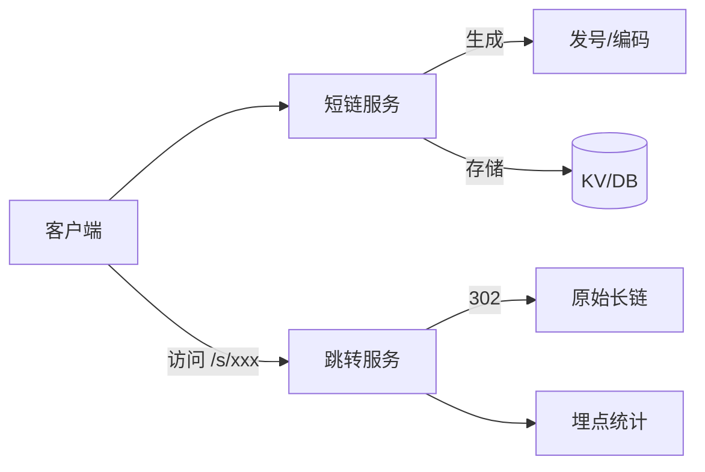

# 短链系统与防刷设计实战

> 短链（Short URL）系统将长 URL 映射为简短可访问的链接，广泛用于营销、短信、分享等场景。它看似简单，却涉及高并发发号、冲突处理、防刷与统计分析等典型工程问题。

## 1. 核心需求

| 维度 | 要求 |
| --- | --- |
| 功能 | 长链→短链、短链→长链重定向 |
| 性能 | 生成与跳转均低延迟、高 QPS |
| 容量 | 支持百亿级短码不冲突 |
| 安全 | 防恶意批量生成、防短链钓鱼 |
| 统计 | 点击数、来源、地域等埋点 |

## 2. 整体架构



## 3. 短码生成方案

### 3.1 自增 ID + 进制转换
用全局自增 ID（雪花/发号器），转 62 进制缩短长度：

```python
BASE62 = "0123456789abcdefghijklmnopqrstuvwxyzABCDEFGHIJKLMNOPQRSTUVWXYZ"
def to_base62(n):
    if n == 0: return "0"
    s = ""
    while n:
        s = BASE62[n % 62] + s
        n //= 62
    return s
# 示例: 1000000 -> "4c92"
```

- 优点：短码递增、无冲突、长度可控。
- 缺点：可枚举（泄露总量/顺序），需加扰。

### 3.2 哈希 + 冲突重试
对长链做 MD5/ murmur，取片段 base62；冲突则换盐或追加位。

### 3.3 随机码
`random 6~8 位 base62`，冲突查库重试。简单但高并发下冲突率上升。

## 4. 存储设计

- **写少读多**：短链生成后基本不变，跳转是主要流量。
- **KV 优先**：Redis / 类似 KV 存 `shortCode -> longUrl`，毫秒级跳转。
- **持久化**：DB 存全量 + 统计，异步同步到 KV。
- **TTL**：临时短链设过期，长期短链永久。

## 5. 跳转实现

```python
@app.get("/s/{code}")
async def redirect(code: str):
    long_url = await cache.get(code)
    if not long_url:
        long_url = db.query(code)
        if not long_url:
            raise HTTPException(404)
        await cache.set(code, long_url, ttl=3600)
    # 异步埋点，不阻塞跳转
    background_tasks.add_task(track_click, code, request)
    return RedirectResponse(long_url, status_code=302)
```

用 301（永久缓存）还是 302（每次回源）取决于是否需统计：要统计点击用 302。

## 6. 防刷设计

| 风险 | 手段 | 对策 |
| --- | --- | --- |
| 批量生成短链发垃圾 | 频率限制 | 单 IP/用户 QPS 限流 |
| 短链跳钓鱼 | 域名黑名单 | 长链域名校验、用户举报 |
| 枚举遍历 | 短码加扰 | 非纯自增，加随机盐 |
| 刷点击量 | 去重计数 | 按 IP+UA+设备去重 |
| 短链被利用做 C&C | 内容扫描 | 跳转目标定期扫描 |

## 7. 统计与埋点

- 点击事件写入消息队列，离线/实时聚合。
- 维度：时间、来源 referer、设备、地域（IP 解析）。
- 实时大屏用流式聚合（Flink）+ OLAP 查询。

## 8. 高可用与容量

- **发号器**：用号段模式（每次取一段 ID 缓存在本地），降低 DB 压力。
- **缓存**：热点短链常驻内存，防缓存击穿（互斥重建 / 逻辑过期）。
- **多机房**：短码全局唯一，跨机房同步用同一发号器分区。

## 9. 常见坑

| 坑 | 现象 | 对策 |
| --- | --- | --- |
| 短码冲突 | 覆盖旧链 | 生成后查重，冲突重试 |
| 缓存击穿 | 热点失效雪崩 | 逻辑过期+互斥 |
| 301 缓存导致统计失准 | 点击数偏少 | 需统计用 302 |
| 可被枚举 | 遍历出所有链 | 短码加随机盐 |

## 10. 面试题

1. 短码生成有哪几种方案？如何避免冲突？
2. 301 与 302 跳转在短链场景如何选择？
3. 如何防止短链被用于钓鱼？
4. 百亿级短码如何保证不重复且短？
5. 高并发下发号器如何设计？

## 11. 小结

短链系统是"发号 + 编码 + KV 存储 + 302 跳转 + 防刷埋点"的组合。核心是短码唯一性与跳转性能，同时在安全与统计上做足防护。
