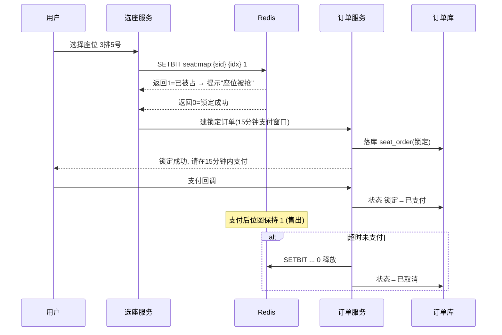
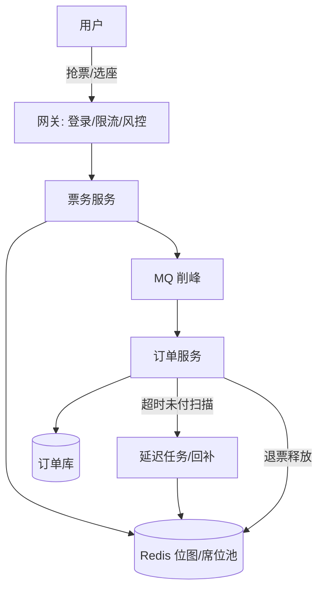

# 票务与选座系统设计（锁座/余票/12306）

## 〇、本体介绍

**票务与选座**：演唱会/电影/火车票的**座位级资源售卖**——每张票绑定一个唯一座位（火车按车次余票），多用户同时抢同一座位。与秒杀「库存只是一个数字」不同，票务的库存是**二维空间结构（场次 × 区域 × 排 × 座）**，还要支持**锁座、退改签、余票查询、候补**。

**核心难点三件套**：
1. **座位级并发**：同一个座位（如 3 排 5 号）被 N 人同时点击——必须互斥，选走即锁。
2. **余票实时性**：热门场次「余票 X 张」要秒级准确，否则「显示有票点进去没票」体验崩塌。
3. **超卖红线**：座位唯一，**绝不卖两张**；火车票还要考虑**同程同方向不冲突**（区间占用）。

**两类票务的本质差异**：

| 维度 | 演唱会/电影（选座） | 火车票（12306 余票） |
|------|-------------------|---------------------|
| 票的粒度 | 唯一座位（区域×排×座） | 车次×席别×区间（数量库存） |
| 用户诉求 | 选座体验（靠前/靠边） | 抢到就行（有票就行） |
| 库存模型 | 座位位图（每座一位） | 余票数字（区间占用拆分） |
| 并发热点 | 好位置热座 | 热门车次区间 |

**核心主线**：场次/车次 → 座位/区间库存模型 → 锁座（Redis 位图/分段）→ 下单 → 支付超时释放 → 退改签回补 → 候补排队。

---

## 一、数据模型

### 1.1 选座型（电影/演唱会）

```sql
-- 场次表
CREATE TABLE session (
    id BIGINT PRIMARY KEY,
    movie_id BIGINT, hall_id BIGINT,
    show_time DATETIME,
    seat_map VARCHAR(2000)      -- 座位图: 行*列 + 可用/维护标记
);

-- 订单表
CREATE TABLE seat_order (
    id BIGINT PRIMARY KEY AUTO_INCREMENT,
    order_no VARCHAR(64) UNIQUE,
    session_id BIGINT NOT NULL,
    user_id BIGINT NOT NULL,
    seats VARCHAR(128),         -- "3-5,3-6" 排-座 列表
    status TINYINT,             -- 1锁定 2已支付 3已取消 4已使用
    expire_time DATETIME,       -- 锁定到期
    UNIQUE KEY uk_session_seat (session_id, seats(32))  -- 防重
);
```

**Redis 座位位图（核心）**：

```
key = seat:map:{sessionId}                     -- 位图: 每位一个座位
    第 N 个座位 = 1（已售/锁定） 0（可售）
锁座:  SETBIT seat:map:{sessionId} {seatIdx} 1   -- 返回 1 说明已被抢 → 失败
解锁:  SETBIT seat:map:{sessionId} {seatIdx} 0
余票:  BITCOUNT key  (整个位图 0 的个数)
按区余票:  BITCOUNT key start end  (按字节区间统计区域)
```

> **为什么用位图？** 一个 1000 座的场次只需 125 字节；`SETBIT` 原子天然防「同一座位被两人锁走」；`BITCOUNT` 秒出余票与区域余票。比「每座一个 key」省内存、比「座列表」快。

### 1.2 余票型（12306 区间占用）

- 车次库存不是「总座位数-X」，而是**区间占用**：同一座位，乘客买 A→C，会占住 A→C 的全部子区间，B 站之后的人只能买 B→C 以外的余票。

```
-- 席位池：每个车次每席别一个 ZSet
-- key: ticket:seat:{trainNo}:{class}   member=座位号  score=占用位图(每站一位)
```

**12306 区间余票的经典做法（分段库存）**：把车次全程切成 N 段（站与站之间），每个座位记账为「哪些段被占用」；买票时检查目标区间的所有段是否空闲，空闲则全部标记占用。粒度用**席位池（ZSet + 位图）**，Redis 按「每列车一个 key」扛热点，同型逻辑在「#四」给出 Lua。

---

## 二、锁座流程（选座型）



- **锁座 = SETBIT 原子**：返回 1 表示已被抢（可能正被别的用户锁着），直接提示失败，**不会超卖**。
- **下单有支付窗口**（15 分钟）：锁定不支付会释放，这是「库存共振」的来源——释放瞬间又是抢票小高峰。
- **一人限购**：同一场次同一用户限 N 张（订单表唯一索引 `(user_id, session_id)` 或业务校验）。

---

## 三、余票实时性：BITCOUNT + 位图分段

| 查询 | 操作 | 耗时 |
|------|------|------|
| 全场余票 | `BITCOUNT` | O(n) 内存统计，毫秒级 |
| 区域余票（如「中间靠前」） | `BITCOUNT key start end`（按字节） | 毫秒级 |
| 具体座位是否可售 | `GETBIT` | O(1) |
| 座位图渲染 | 整个位图 GET 一次，前端画格 | 一次网络往返 |

> 体验细节：**「余票 5 张」≠「一定能买到」**——热门场次余票在秒级变化，客户端展示余票后进入选座页时仍可能已被人锁走，属正常，提示文案要能兜住。

---

## 四、12306 式区间余票的并发控制

**分段占用 + 原子更新**（防止「同一段同时卖给两人」）：

```lua
-- KEYS[1]=车次席位池  ZSet: member=座位号, score=占用位图(每站一位)
-- ARGV[1]=出发段起始位  ARGV[2]=到达段结束位  ARGV[3]=orderNo
local seg = 0
for i = ARGV[1], ARGV[2] do seg = seg | (1 << i) end   -- 目标区间掩码
local seats = redis.call('ZRANGEBYSCORE', KEYS[1], '-inf', '+inf')
for _, seat in ipairs(seats) do
    local bitmap = tonumber(redis.call('ZSCORE', KEYS[1], seat) or 0)
    if (bitmap & seg) == 0 then                        -- 区间全空闲
        redis.call('ZADD', KEYS[1], bitmap | seg, seat)
        redis.call('HSET', 'ticket:order:'..ARGV[3], 'seat', seat)
        return seat                                    -- 命中, 返回座位
    end
end
return nil
```

- ZSet member = 座位号，score = 占用位图（每站一位）——「这个座位被哪些段占」合并进一个整数，判断与占用一次 Lua 完成。
- **热点**：热门车次单 key 并发高，可按「车次+席别分片」或「先候补池后直售」分流。
- **候补**：没抢到进候补队列，有人退票 → 按排队顺序自动兑现（延迟任务 + 幂等通知）。

---

## 五、退改签与库存回补

| 动作 | 库存侧 | 订单侧 |
|------|--------|--------|
| 退票 | SETBIT 清位 / ZADD 回归释放区间 | 状态机：已支付→已退款 |
| 未支付超时 | 位图释放（SETBIT 0） | 锁定→已取消 |
| 改签 | 先锁新座位成功，再释放旧座位 | 原单作废 + 新单生成 |

> **释放必须幂等且顺序正确**：改签不能「先释放旧的再锁新的」——否则旧座位瞬间被抢、改签失败。顺序是**先锁新、成则释放旧**（与「[分布式锁](分布式锁.md)」的加锁-操作-释放同一心智）。

---

## 六、防刷与风控

- 抢票接口**必须登录 + 实名**（黄牛大本营）；同账号/同设备/同支付渠道限购。
- 候补与直售分离，黄牛更爱直售热座——**直接没票也不让他看到余票接口**（模糊化）。
- 高并发场景：入口限流 + 验证码仅在异常触发（与「[秒杀系统设计](秒杀系统设计.md)」一致）：热门场次开票 30 秒是流量峰，扛法同秒杀：静态化 + 限流 + 预扣 + 队列。

---

## 七、架构总览



---

## 八、与其他篇的关系

- 锁座/防超卖与「[秒杀系统设计](秒杀系统设计.md)」「[抢红包系统设计](抢红包系统设计.md)」同源：Redis 原子操作是第一道防线。
- 超时未付释放与「[延迟任务与订单超时关闭](延迟任务与订单超时关闭.md)」一致。
- 支付回调幂等见「[支付系统设计：回调、幂等与对账](支付系统设计：回调、幂等与对账.md)」；资格幂等见「[幂等设计](幂等设计.md)」。

---

## 九、速查表

| 主题 | 一句话 |
|------|--------|
| 选座库存 | Redis 位图：一 seat 一位，SETBIT 原子锁座 |
| 余票统计 | BITCOUNT / BITCOUNT start end |
| 12306 | 席位池 ZSet + 占用位图，Lua 判断区间空闲再占用 |
| 超卖防护 | SETBIT 返回 1 即拒绝 + DB 唯一索引 + 状态机 |
| 支付窗口 | 15 分钟未付释放，释放即回补 |
| 退改签 | 先锁新再释放旧，释放幂等 |
| 候补 | 队列 + 退票自动兑现 + 幂等通知 |
| 风控 | 实名、限购、入口限流、热座不放余票接口 |

---

## 十、面试高频追问（12+）

1. Q：电影选座的库存怎么存？ A：Redis 位图 `seat:map:{sessionId}`，一个座位一位，SETBIT 原子抢占，BITCOUNT 统计余票。
2. Q：两个用户同时选同一座位会怎样？ A：SETBIT 竞态：只有一个返回 0（成功），另一个返回 1 直接被拒——原子性天然解决，不需要锁。
3. Q：为什么不用数据库行锁？ A：DB 行锁能串行化但吞吐低；位图原子 SETBIT 是 O(1) 内存操作，百万并发只打 Redis 单 key。
4. Q：余票实时吗？ A：BITCOUNT 内存统计毫秒级出结果；展示层可缓存 1~3s 防抖，但「显示有票点进去没票」要能兜住文案。
5. Q：12306 区间余票怎么设计？ A：把线路切成段，每个座位存占用位图；买票检查目标区间掩码是否全空，Lua 一次完成判断+占用。
6. Q：热门车次热点怎么扛？ A：按车次分 key + 席别分片；直售与候补分流；极端用多副本+本地缓存+对账。
7. Q：锁定的座位不支付怎么办？ A：支付窗口 15 分钟，延迟任务扫描释放位图、订单置取消；释放的座位重新可售。
8. Q：退票和改签怎么做？ A：退票清位图/区间；改签先锁新座位、成功后再释放旧座位，避免旧座被抢。
9. Q：怎么防黄牛？ A：实名 + 登录 + 限购 + 设备指纹 + 异常流量风控；热座不暴露余票接口。
10. Q：电影票和火车票库存模型一样的吗？ A：不一样——电影是「座位唯一」位图；火车是「区间占用」——同一个座位可分段卖给不同区间乘客，模型复杂一个维度。
11. Q：一人能买几张？ A：限购（订单唯一索引 (user_id, session_id)），黄牛主要靠多号，需设备维度限制。
12. Q：开票瞬间流量和秒杀一样吗？ A：一样是瞬时脉冲——用同样的削峰手段：静态化、入口限流、MQ 削峰、异步落库。

---

> 一句话：**选座 = 位图原子锁座 + BITCOUNT 实时余票 + 15 分钟支付窗口 + 退改返回补；12306 = 区间占用位图 + Lua 原子分配 + 候补自动兑现。**

---