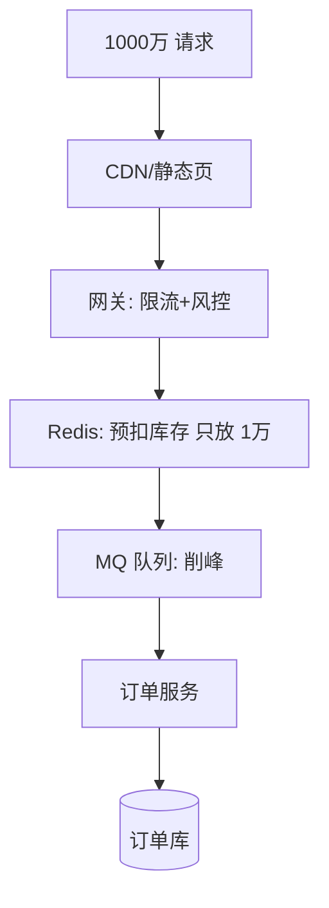
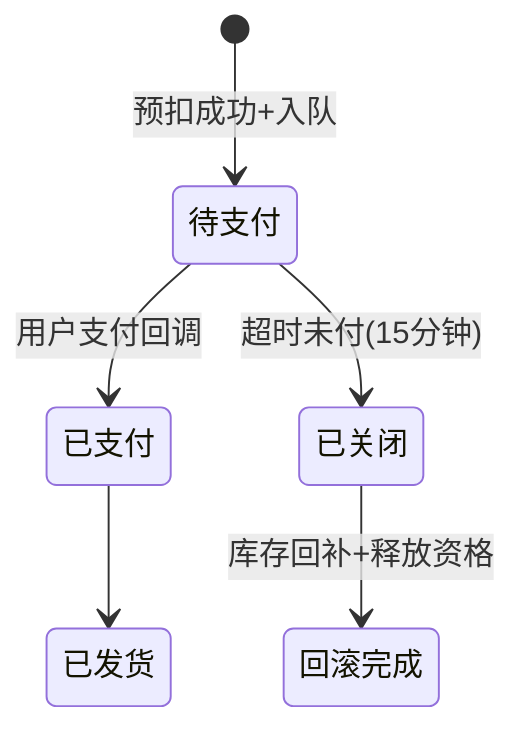
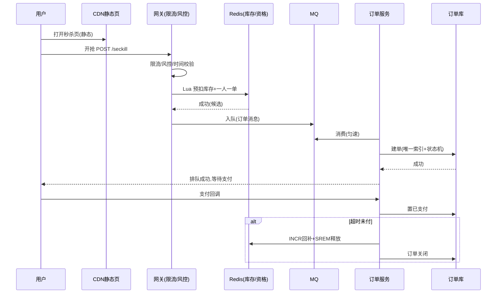

# 秒杀系统设计

## 〇、本体介绍

**秒杀**：极短时间窗口内（如 0 点开抢 1 分钟）对**极小库存**（如 1 万台）发起**极高并发**（百万级 QPS）的抢购。核心难点不是「库存够不够」，而是**怎么在"瞬时洪峰"下把流量削到数据库扛得住、且一个都不多卖**。

**与普通购买的本质区别**：

| 维度 | 普通购买 | 秒杀 |
|------|----------|------|
| 流量形态 | 平缓 | 瞬时脉冲（开抢瞬间到达 99% 流量） |
| 库存稀缺 | 充足 | 稀缺，抢到即赚 |
| 用户行为 | 理性 | 脚本/外挂抢，恶意流量占比极高 |
| 技术诉求 | 稳定 | **削峰 + 防超卖 + 反作弊** |

**核心矛盾**：峰值流量比均值高 2~3 个数量级。如果按峰值建设，99% 时间资源闲置；如果按均值建设，开抢即雪崩。答案是**分层削峰**：能挡的挡（CDN/静态化）、能缓的缓（队列）、能限的限（限流）、能缩的缩（只让"真正能买到的请求"到达后端）。

**核心主线**：动静分离 → 页面静态化 → 入口限流 → 资格校验 → 库存原子扣减 → 异步下单 → 订单落库 → 超时未付回滚。

---

## 一、需求与指标拆解

### 1.1 功能需求

- 开抢时间点精准（不能早一秒、不能晚一秒）。
- 库存准确：**不超卖**（100 台最多 100 个成功）。
- 一人一单：同账号/同设备不能重复抢。
- 下单后限时支付，超时未付库存释放。

### 1.2 非功能需求与指标

| 指标 | 目标量级 |
|------|----------|
| 峰值 QPS | 100 万~1000 万（瞬时） |
| 商品库存 | 千~万级 |
| 接口成功率 | 抢购请求 > 99.9%（成功/失败都要有明确响应） |
| 超卖容忍 | **0**（资损红线） |
| 下单延迟 | 秒级返回「成功/失败/排队中」 |
| 反作弊 | 拦截脚本/机器流量 > 90% |

### 1.3 设计分界线（关键认知）

> **「抢购请求」≠「下单请求」**。开抢瞬间 1000 万请求里只有 1 万个能买到——剩下 999 万**根本不需要走到订单系统**。设计的第一原则：**让"买不到的请求"在最外层就死掉**，越往后端，流量越小。



---

## 二、总体架构：四层削峰

```
用户层        客户端防抖 + 倒计时对齐（抢购按钮开抢前禁用）
接入层        CDN/静态化（页面不查库）+ 网关限流/黑白名单/风控
服务层        Redis 预扣（资格校验）→ MQ 削峰 → 订单异步落库
存储层        Redis（库存/资格）+ DB（订单/流水）
```

### 2.1 第一层：动静分离与页面静态化

- 秒杀页商品信息、倒计时、按钮状态**全部静态化到 CDN**，开抢前不碰任何后端。
- 开抢瞬间客户端只发一个**抢购请求**（POST /seckill/order），页面其余资源零后端请求。
- 倒计时以**服务器时间**为准（客户端时间可篡改，用接口下发 + 本地校正）。

### 2.2 第二层：网关限流与风控

| 手段 | 说明 |
|------|------|
| 用户维度限流 | 同一用户单位时间限 N 次（Redis INCR + TTL） |
| 设备维度限流 | 同设备/同 IP 频控，拦脚本（响应头 X-Device-Id） |
| 接口级限流 | 令牌桶/漏桶（Sentinel/自研），超限直接返回「已售罄」 |
| 风控 | 注册时长/行为特征/U-A 特征/代理检测，黑名单直接丢弃 |
| 验证码/滑块 | 高峰可降级：只在异常特征时弹出（勿全程弹，伤转化） |

### 2.3 第三层：资格校验（核心防线）

**目标：把 1000 万请求过滤到只剩 ~几万"候选"进队。**

1. **预扣库存（Redis Lua 原子）**：真正能买到的人才放行：

```lua
-- KEYS[1]=库存key  KEYS[2]=已购用户集合  ARGV[1]=userId
local stock = redis.call('GET', KEYS[1])
if not stock or tonumber(stock) <= 0 then
    return 0                      -- 售罄
end
if redis.call('SISMEMBER', KEYS[2], ARGV[1]) == 1 then
    return -1                     -- 已抢过（一人一单）
end
redis.call('DECR', KEYS[1])
redis.call('SADD', KEYS[2], ARGV[1])
return 1                          -- 预扣成功，放行进队
```

> 注意：这里**先扣后付**（预扣）。用户不支付时由**超时回滚**释放库存（见 §五）。

2. **资格查询接口与抢购接口分离**：「是否有货」走查询接口（宽松），「抢」走抢购接口（严格）。二者都不过度暴露库存细节，避免被脚本精准扫描。

### 2.4 第四层：MQ 削峰 + 异步落库

- 预扣成功的请求**写入 MQ**（如 RocketMQ/Kafka），订单服务按自己吞吐消费，**把 1 万 TPS 的瞬时压力摊平成 10 分钟匀速处理**。
- 订单状态机：`预扣成功(待支付) → 已支付 → 已发货`；超时未付 → 回滚 Redis 库存 + 释放 SADD 集合成员 + 订单置失败。
- 消费端必须**幂等**（订单号唯一索引 + 状态机），MQ 重投不重复建单。

---

## 三、防超卖：四道防线

| 防线 | 位置 | 手段 | 作用 |
|------|------|------|------|
| 1 | Redis | Lua 原子 `DECR` | 并发下不超扣（原子性） |
| 2 | 数据库 | 扣减 SQL 加条件 `WHERE stock >= n` | 兜底：即使 Redis 被绕过也不超卖 |
| 3 | 数据库 | 订单唯一索引（user_id+sku+活动） | 一人一单硬约束 |
| 4 | 对账 | 定时核对 Redis 余量 + DB 订单数 + 库存台账 | 发现偏差立即人工介入 |

```sql
-- 防线 2：条件扣减，受影响行数=0 即库存不足
UPDATE seckill_stock SET stock = stock - #{n}
WHERE sku_id = #{skuId} AND stock >= #{n};
```

> **为什么不能只靠 DB 条件扣减？** 行锁让并发扣减串行化，DB 能扛的 TPS 有限（千级），秒杀峰值是百万级——**DB 只能当兜底，不能当主力**。Redis 单点原子操作可到十万级，Lua 保证"判断+扣减"原子。

---

## 四、限流：单机版与分布式

### 4.1 单机令牌桶（本地限流，首选）

```java
// 每实例本地令牌桶：无网络开销，秒级平滑
RateLimiter limiter = RateLimiter.create(500);      // 500 QPS/实例
if (!limiter.tryAcquire()) return fail("已售罄");
```

- 优点：零跨网络，性能最高。缺点：各实例独立，总量 = 实例数 × 单实例，需按实例数配准。
- 配合 **Nginx lua / 网关**在接入层再放一层，防单实例被打满。

### 4.2 分布式限流（全局精确）

- Redis + Lua 令牌桶 / 滑动窗口（INCR + EXPIRE）。精确但增加 RT（毫秒级），高频抢购有损性能。
- 实践：**入口用本地限流扛总量，关键资格校验用 Redis 原子保证精确**——粗细结合。

---

## 五、超时未付与库存回滚



- **回滚动作**（必须幂等）：Redis `INCR` 库存回补 + `SREM` 释放用户资格 + DB 订单状态置「已关闭」。
- 回滚时机：延迟队列/定时任务扫描（见「[延迟任务与订单超时关闭](延迟任务与订单超时关闭.md)」），秒杀通常 15 分钟。
- 回滚的库存立即**重新可抢**（可提示"少量回流，点击刷新"），这是秒杀的常见运营玩法。

---

## 六、反作弊与风控（秒杀特有）

| 攻击手段 | 特征 | 对策 |
|----------|------|------|
| 脚本直刷接口 | 无浏览器指纹/高频同 IP | 网关 UA/指纹校验 + 频率限制 |
| 多账号批量 | 同设备/IP 注册多个号 | 设备指纹 + 注册时长门槛 + 设备维度限流 |
| 提前拿到接口 | 开抢前就有请求 | 接口签名/令牌，时间未到拒绝 |
| 撞库存接口 | 高频轮询"是否有货" | 资格查询限流 + 不返回精确余量 |

> 风控本质是**成本博弈**：让"脚本批量抢"的成本高于"正常用户抢"的成本（滑块、验证码、设备绑定、答题），同时不伤正常用户转化。

---

## 七、其他关键设计点

### 7.1 时间对齐

- 客户端倒计时 = 服务器时间 - 本地偏移（开抢前接口下发 `serverTime`）。
- 服务端对**提前到达**的请求（时间戳 < 开抢时间 - 容忍窗口）直接拒绝，防"卡点脚本"。

### 7.2 库存预热与热点拆分

- 开抢前将库存从 DB **预热到 Redis**（秒杀专属 key，与日常库存隔离）。
- 单 key 热点：可拆 N 个分片 key（`stock:100:{1..10}`），Lua 轮询分片扣减，把单点热点摊平。

### 7.3 结果查询与异步化

- 抢购接口**同步只返回**「已受理/售罄/排队中」，最终结果（成功/失败）由轮询或推送通知。
- 大促可对**失败原因模糊化**（统一"很遗憾没抢到"），防脚本推断规则。

### 7.4 数据库压测与容量

- 订单表按 user_id 哈希分表；支付回调与订单状态更新走状态机 `WHERE status=...` 防重入。
- 库存台账单独表，防误删；全链路压测用**影子库**（见「[大促容量规划与备战](大促容量规划与备战.md)」）。

---

## 八、架构总览（完整链路）



---

## 九、速查表

| 主题 | 一句话 |
|------|--------|
| 削峰 | 买不到的请求在最外层死掉：CDN→限流→预扣→MQ |
| 防超卖 | Redis Lua 原子扣 + DB 条件扣兜底 + 唯一索引 + 对账 |
| 一人一单 | SADD 资格集合 + 订单唯一索引 |
| 限流 | 本地令牌桶扛总量，Redis 原子保精确 |
| 异步 | 预扣后入 MQ，订单服务按吞吐匀速落库 |
| 回滚 | 超时未付：INCR 回补 + SREM 释放 + 订单关闭（幂等） |
| 反作弊 | 设备指纹/频控/签名/模糊失败原因 |
| 热点 | 库存预热 + 分片 key + 资格/库存分离 |

---

## 十、面试高频追问（15+）

1. Q：秒杀最大难点是什么？ A：瞬时洪峰 + 极稀缺库存——需要四层削峰（静态化/限流/预扣/异步），而不是把 DB 扛到百万 QPS。
2. Q：怎么保证不超卖？ A：Redis Lua 原子「判断+扣减」做主防线，DB `WHERE stock >= n` 条件扣减兜底，订单唯一索引防重，定时对账发现偏差。
3. Q：为什么 Redis 扣库存比 DB 快？ A：DB 行锁串行化 + 磁盘落盘，TPS 千级；Redis 单线程原子操作 + 内存，单点十万级，Lua 脚本保证判断与扣减原子。
4. Q：Redis 挂了怎么办？ A：降级策略——秒杀直接返回「活动太火爆」拒绝（宁可少卖不可超卖）；DB 条件扣减兜底开关可开；核心是让 Redis 高可用（主从/集群/哨兵）。
5. Q：一人一单怎么实现？ A：Redis SADD 用户集合（预扣时原子判断）+ DB 订单唯一索引 `(user_id, sku_id, activity_id)` 双重保障。
6. Q：为什么抢购接口和下单要异步？ A：预扣成功只代表"有资格"，下单走 MQ 匀速落库，把瞬时 1 万 TPS 摊平成 10 分钟处理，保护订单 DB。
7. Q：怎么限流？ A：接入层网关限流（用户/设备/接口三级）+ 本地令牌桶扛峰值 + 关键路径 Redis 原子限流；峰值超高时牺牲体验保稳定。
8. Q：库存预热到哪？怎么防热点？ A：开抢前从 DB 预热到 Redis 独立 key；单 key 拆 N 分片（stock:sku:{i}）轮询扣减，摊平热点。
9. Q：超时未付怎么处理？ A：延迟任务/定时扫描，幂等回滚：Redis INCR 回补库存、SREM 释放资格、DB 订单置关闭；回滚库存可重新可抢。
10. Q：怎么防脚本抢购？ A：网关 UA/设备指纹/频率限制 + 注册时长门槛 + 接口签名 + 滑块/验证码（仅异常触发）+ 失败原因模糊化。
11. Q：倒计时怎么对齐？ A：服务器时间接口下发 + 客户端校正；提前到达的请求直接拒绝（服务端校验时间窗）。
12. Q：秒杀和普通下单架构区别？ A：秒杀多出三层：入口限流与风控、Redis 预扣资格、MQ 削峰异步化；普通下单直连订单服务。
13. Q：MQ 消费积压了怎么办？ A：只影响"建单延迟"，不影响"不超卖"（库存已在 Redis 扣掉）；监控积压水位，必要时加消费者实例。
14. Q：接口返回什么？ A：同步只返回「受理/售罄/排队中」，最终结果异步查询；失败原因模糊化防脚本分析。
15. Q：秒杀后补货/回流怎么设计？ A：回滚接口幂等，回流库存可再次进入预扣流程，前端提示"少量回流"引导刷新。

---

## 十一、与其他篇的关系

- 库存原子扣减与「[抢红包系统设计](抢红包系统设计.md)」「[优惠券系统设计](优惠券系统设计.md)」同源（Redis Lua 防超发）。
- 超时回滚与「[延迟任务与订单超时关闭](延迟任务与订单超时关闭.md)」机制一致。
- 入口限流详见「[稳定性三板斧：限流-熔断-降级](稳定性三板斧：限流-熔断-降级.md)」与「[Redis 实现限流](redis实现限流.md)」。
- 容量预估与压测见「[大促容量规划与备战](大促容量规划与备战.md)」；支付回调幂等见「[支付系统设计：回调、幂等与对账](支付系统设计：回调、幂等与对账.md)」。
- 资格幂等与「[幂等设计](幂等设计.md)」互补：预扣+入队+建单全链路幂等。

> 一句话：**秒杀 = 把 1000 万流量在四层里削到 1 万、用原子操作保证 1 万不超卖、用异步把 1 万摊平成 10 分钟——能挡的挡、能缓的缓、能限的限。**
