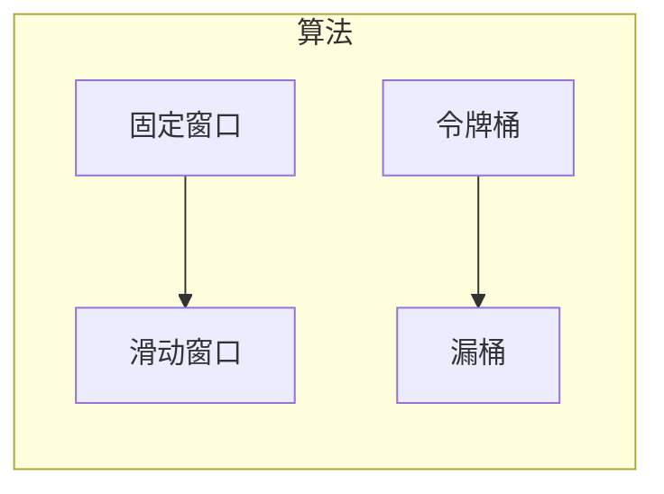
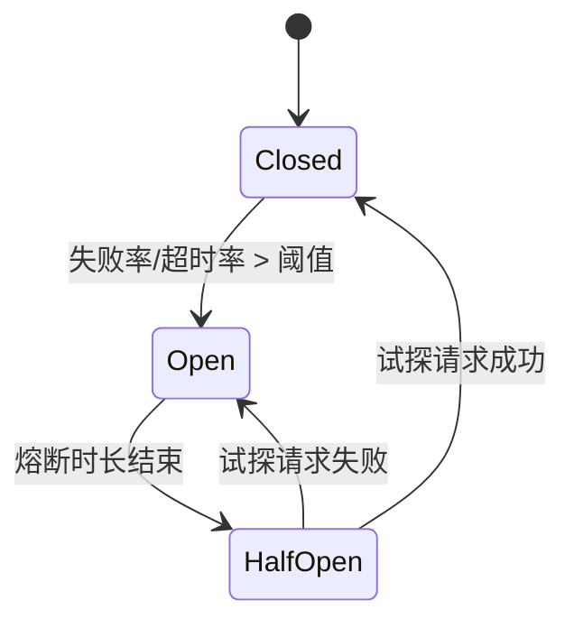

# 稳定性三板斧：限流 / 熔断 / 降级

> 雪崩的根源是"同步调用 + 无超时 + 无熔断保护"。限流控入口、熔断防扩散、降级保核心——三者组合，是微服务高可用的三板斧。

与「[redis 实现限流](redis实现限流.md)」互补：那里讲 Redis 计数器/令牌桶实现，这里讲**三者区别、算法原理、熔断器状态机与 Sentinel 落地**。

## 一、三者到底有什么区别

| 维度 | 限流 (Rate Limit) | 熔断 (Circuit Breaker) | 降级 (Degradation) |
|------|------|------|------|
| 触发原因 | 流量超阈值（主动控入口） | 依赖持续故障（被动防扩散） | 资源紧张/保核心（主动牺牲支线） |
| 目标 | 控制流量，保护自身 | 隔离故障，防雪崩 | 舍弃非核心，保主线 |
| 动作 | 拒绝超额请求 | 切断调用，快速失败 | 关功能，返回兜底/缓存 |
| 层面 | 框架级入口 | 框架级（底层隔离） | 业务级（配置开关） |
| 典型工具 | Sentinel / Gateway | Sentinel / Hystrix | 配置中心开关 |

> 口诀：**"限流管入口，熔断切故障，降级弃支线。"**

## 二、限流算法对比



| 算法 | 原理 | 优点 | 缺点 | 适用 |
|------|------|------|------|------|
| 固定窗口 | 单位时间计数，超阈拒绝，周期清零 | 最简单 | **临界突刺**：两窗口叠加可达 2 倍阈值 | 粗略限流 |
| 滑动窗口 | 拆成多个小窗，随时间滑动求和 | 解决边界突刺，精度高 | 内存略高 | Nginx / Sentinel |
| 令牌桶 | 恒定速率发令牌，请求消耗令牌，桶有容量 | **允许突发**（桶内积累） | 比固定窗口复杂 | 秒杀 / API 限流 ⭐ |
| 漏桶 | 请求入桶，恒定速率流出，满则拒 | 绝对平滑，削峰 | 无法处理合理突发 | MQ 消费控制 |

> 生产优选**令牌桶**（Sentinel、Guava RateLimiter 默认）：兼顾平滑限流与突发。突发流量（秒杀开门）靠桶内积攒的令牌吸收，长期速率受控。

## 三、熔断器状态机（核心）



| 状态 | 行为 | 触发 |
|------|------|------|
| Closed（闭合） | 正常放行，统计失败/超时率 | 默认状态 |
| Open（打开） | 直接失败返回 fallback，不调下游 | 失败率超阈值（如 50%） |
| Half-Open（半开） | 放少量试探请求，成功则恢复，失败则重开 | 熔断时长（如 5~10s）结束 |

```java
// Sentinel 熔断注解（错误率>50% 熔断10s，最小请求数100）
@SentinelResource(value = "stockService",
    fallback = "fallbackStock",
    circuitBreaker = @CircuitBreaker(errorRatio = 0.5, minRequestAmount = 100, sleepWindow = 10))
public Stock checkStock(Product p) { return stockService.getStock(p); }

public Stock fallbackStock(Product p, Throwable ex) {
    return new Stock(0, "熔断中");   // 快速失败兜底
}
```

## 四、降级（保核心，弃支线）

压力大/出问题时，关掉非核心功能，返回兜底/默认值/缓存：
- **非核心接口**：推荐、热搜、统计。
- **非核心查询**：复杂计算、多表联查。
- **第三方依赖**：短信、日志上报、埋点。
- 实现：配置中心开关（如双 11 关闭退货功能保障交易核心链路），业务代码读开关短路。

## 五、Sentinel 落地（阿里开源，活跃维护）

Hystrix 已于 2018 年停止维护，**新项目用 Sentinel**。核心能力：流量控制、熔断降级、系统负载保护（CPU/Load）。

- **Slots 责任链**：NodeSelector → ClusterBuilder → Statistic(统计 RT/QPS/异常) → **FlowSlot(限流)** → **DegradeSlot(熔断)** → SystemSlot(系统保护)。
- **限流维度**：QPS、并发线程数、热点参数（商品/用户/IP）、调用来源。
- **限流行为**：快速失败（默认）、匀速排队（Wait）、预热 Warm Up（冷启动保护）。
- **隔离**：信号量 + 并发线程数（Hystrix 用线程池隔离，资源消耗大）。

| 维度 | Hystrix | Sentinel |
|------|---------|----------|
| 现状 | 停更 | 活跃维护 |
| 隔离 | 线程池（重） | 信号量 + 线程数（轻） |
| 限流 | 不支持 | QPS + 并发数 |
| 控制台 | 简单 | 完善，动态规则 |

## 六、隔离与最佳实践

- **线程池/信号量隔离**：把慢调用（如第三方）隔离在独立资源，避免占满公共线程池拖垮全局。
- **超时控制**：所有下游调用必须设超时，避免无限等待堆积。

> ⚠️ **三大坑**：
> 1. **限流误杀**：阈值拍脑袋可能误伤正常流量 → 基于压测 + SLO 设阈值，预热模式保护冷服务。
> 2. **熔断误判**：小流量下失败率易超阈（minRequestAmount 要够），半开试探比例要合理。
> 3. **降级开关遗漏**：降级后核心链路依赖的"兜底数据"要预先准备好，否则降级变"无响应"。

## 七、生产 Checklist

- [ ] 入口限流 + 下游超时 + 熔断，三者缺一不可（防雪崩铁三角）。
- [ ] 限流用令牌桶，阈值基于压测/SLO，冷服务加 Warm Up。
- [ ] 熔断配错误率 + 最小请求数 + 熔断窗口，fallback 返回兜底而非抛异常。
- [ ] 非核心功能加降级开关，预案演练（双 11 式）。
- [ ] 监控：限流拒绝率、熔断次数、降级触发、线程池/连接池水位。
- [ ] 新项目首选 Sentinel（Hystrix 已停更），规则可动态下发。

> 参考：Alibaba Sentinel 官方文档、Resilience4j、Netflix Hystrix（Wiki）、Spring Cloud Circuit Breaker、Nginx/Guava RateLimiter 限流实现。
