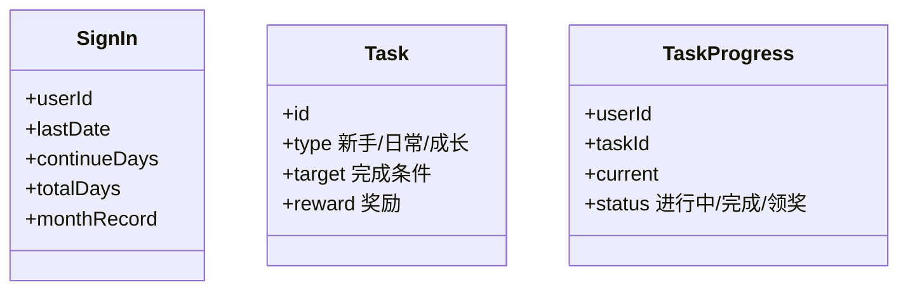

# 签到与任务系统设计实战

> 连续签到、新手任务、成长任务是最常见的用户留存手段。系统设计要处理：连续天数计算、断签逻辑、奖励发放、任务进度追踪与防作弊。

## 1. 业务模型



## 2. 连续签到

核心字段：`last_sign_date`、`continue_days`、`total_days`。

```python
def do_sign(user_id, today):
    rec = get_record(user_id)
    if rec.last_date == today:
        return "已签到"
    yest = today - 1day
    if rec.last_date == yest:
        rec.continue_days += 1
    else:
        rec.continue_days = 1   # 断签重置
    rec.total_days += 1
    rec.last_date = today
    # 发放奖励（按连续天数阶梯）
    reward = reward_rule(rec.continue_days)
    grant(user_id, reward)
    save(rec)
```

- **阶梯奖励**：第 7/30 天给大礼，刺激连续。
- **补签**：允许消耗道具补签，需记录补签标记。

## 3. 签到日历存储

- 当月签到用位图（bitmap）：`SETBIT sign:uid:202608 offset day 1`，O(1) 查当月哪些天签了。
- 跨月归档到记录表，释放 bitmap。

```redis
SETBIT sign:1001:202608 30 1   # 8月30日签到
GETBIT sign:1001:202608 30     # 是否签到
BITCOUNT sign:1001:202608      # 当月签到天数
```

## 4. 任务系统

- **任务定义**：行为型（看视频）、累计型（累计消费）、成就型（邀请 3 人）。
- **进度追踪**：事件驱动，用户行为产生事件 → 匹配任务 → 累加进度。
- **完成判定**：进度达 target 则置完成，可领奖。

```python
def on_event(user_id, event):
    for task in active_tasks(event.type):
        prog = get_or_create(user_id, task.id)
        prog.current = task.calc(prog.current, event)
        if prog.current >= task.target and prog.status == "进行中":
            prog.status = "完成"
        save(prog)
```

## 5. 奖励发放与幂等

- 领奖用 `user_id+task_id` 唯一，防重复领。
- 奖励经统一发奖服务，支持积分/券/实物多种类型。
- 失败重试 + 对账，保证不漏发不多发。

## 6. 防作弊

| 风险 | 对策 |
| --- | --- |
| 模拟签到 | 服务端校验日期+设备 |
| 刷任务进度 | 事件来源可信校验 |
| 多账号刷奖励 | 设备/实名风控 |
| 时间篡改 | 统一服务端时间 |

## 7. 高并发

- 签到是写多读少，写走 DB + 缓存双写。
- 大促期间签到峰值高，用 MQ 削峰，异步发奖。
- 进度更新用乐观锁或单行锁防并发错乱。

## 8. 常见坑

| 坑 | 现象 | 对策 |
| --- | --- | --- |
| 断签误判 | 时区/跨天 | 统一日期基准 |
| 重复发奖 | 资损 | 领奖幂等 |
| 进度丢失 | 并发覆盖 | 行锁/原子更新 |
| 任务堆积 | 性能差 | 事件驱动+异步 |

## 9. 面试题

1. 连续签到断签如何判定与重置？
2. 为什么用 bitmap 存签到日历？
3. 任务进度如何追踪而不丢？
4. 领奖如何防重复？
5. 签到高峰如何削峰？

## 10. 小结

签到与任务 = 连续天数状态机 + bitmap 日历 + 事件驱动进度 + 幂等发奖。重点是日期基准统一、状态原子更新与防刷风控。
