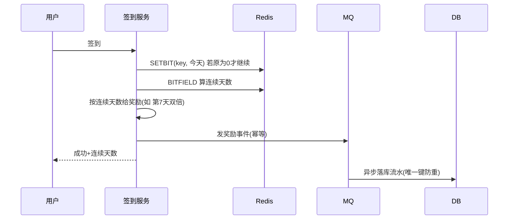

# 签到系统设计

## 〇、本体介绍

**签到**：低成本高频的**用户活跃手段**——每天点一下，连续打卡领奖励。功能小，但**天天跑、人人跑**，且与奖励发放（积分/券）绑定，是"轻量但高并发 + 不能多发"的典型。

**核心矛盾**：
1. 签到是**高频小写**（每天一次/人），但**总量大**（DAU 级）；
2. **连续签到判定**要准：漏签断签、补签卡；
3. 奖励**不能重复发**（一天一次）、不能多发（并发双击）。

**核心主线**：签到模型 → Redis Bitmap 存储 → 连续天数判定 → 奖励发放 → 补签。

---

## 一、数据模型

| 表 | 字段 | 说明 |
|----|------|------|
| **签到流水** | user_id, sign_date, reward_type/amount, created_at | 每用户每天最多一行，唯一键 `(user_id, sign_date)` 幂等 |
| **签到月表**（可选） | user_id, month, days(bitmap/字符串), continuous_max | 月度汇总，加速展示 |

```sql
CREATE TABLE sign_in_log (
    id         BIGINT PRIMARY KEY AUTO_INCREMENT,
    user_id    BIGINT NOT NULL,
    sign_date  DATE NOT NULL,
    reward     VARCHAR(32),          -- 奖励类型: 积分/优惠券
    amount     BIGINT DEFAULT 0,
    created_at DATETIME,
    UNIQUE KEY uk_user_day (user_id, sign_date)   -- 幂等：一天只能签一次
) COMMENT '签到流水';
```

---

## 二、Redis Bitmap 存储（核心）

**每月一个 key，按天一位**：

```
key = sign:{userId}:{yyyyMM}     e.g. sign:10086:202608
第 N 天签到 => SETBIT key (N-1) 1
```

| 操作 | Redis 命令 |
|------|-----------|
| 签到 | `SETBIT sign:10086:202608 5 1` |
| 今天是否已签 | `GETBIT sign:10086:202608 5` |
| 本月签到天数 | `BITCOUNT key` |
| 连续签到数 | `BITFIELD key GET u{今天位} 0` → 从第 0 位取到今天位，统计尾部连续 1 个数 |
| 展示月历 | 一次 `BITFIELD`/`BITCOUNT` 拿到整月位图，前端画格 |

- **一个用户一年 12 个 key，每个 32 字节**（8 天/字节），千万用户一个月才 ~40MB，极省。
- 连续判定代码：

```java
// BITFIELD 取出今天为止的位图，从末位向前数连续 1
long bits = redis.bitfield("sign:" + uid + ":" + yyyyMM)
                 .get(u(dayPos)).toLong();   // u(dayPos) 取低 dayPos 位
int streak = 0;
while ((bits & 1) == 1) { streak++; bits >>>= 1; }
```

> 口诀：**"一人一月一个 key，一天一位；连续天数看位图尾部连续 1。"**

---

## 三、签到流程



1. **SETBIT 返回值即幂等**：返回 1 说明已签过，直接返回"已签到"（天然防双击）。
2. **奖励规则**：按连续天数阶梯（3 天/7 天/30 天节点给大额），规则表配置。
3. **奖励发放**：走 MQ + 幂等（见「[优惠券系统设计](优惠券系统设计.md)」的发放；积分走「[钱包与账务系统设计](钱包与账务系统设计：账户、流水与日终对账.md)」入账）。
4. **落库**：流水异步写，唯一键 `(user_id, sign_date)` 兜底防重。

---

## 四、补签与断签

| 场景 | 方案 |
|------|------|
| 漏签断签 | 签到接口带 `is_repair` + 补签卡库存扣减，SETBIT 历史位 |
| 补签限制 | 每月限 N 次、只能补最近 N 天 |
| 连续重算 | 补签后重新 BITFIELD 计算并刷新缓存 |

---

## 五、与其他板块的关系

- **优惠券系统设计**：签到奖励的发放链路（券实例生成、幂等）。
- **钱包与账务系统设计**：积分入账（账户 + 流水 + 对账）。
- **Redis 实现限流**：签到入口的频控防刷（同设备多账号）。
- **排行榜与实时统计**：签到人数/活跃度统计。

---

## 六、速查表

| 主题 | 一句话 |
|------|--------|
| 存储 | Redis Bitmap：一人一月一 key，一天一位 |
| 幂等 | SETBIT 返回值判重 + 流水唯一键 |
| 连续 | BITFIELD 取位图，尾部数连续 1 |
| 奖励 | 阶梯规则配置，MQ 异步发放幂等 |
| 补签 | 补签卡扣减 + 历史位 SETBIT |

---

## 面试高频问题（10+ 条）

1. **签到数据怎么存？** Redis Bitmap 按月，`sign:{uid}:{yyyyMM}`，一天一位。
2. **为什么用 Bitmap？** 一月 32 字节/人，千万用户才几十 MB，省内存且位操作极快。
3. **怎么判断今天已签到？** GETBIT；SETBIT 返回 1 表示已签过（原子防重复）。
4. **连续签到怎么算？** BITFIELD 取出到今天的位图，从末位往前数连续 1。
5. **并发双击会重复发奖吗？** SETBIT 原值判定 + 奖励事件幂等 + 流水唯一键三重保障。
6. **签到奖励怎么发？** MQ 异步 + 业务键幂等，积分/券各走各的发放链路。
7. **漏签了怎么补？** 补签卡 + 补签接口限次限时，SETBIT 历史位后重算连续。
8. **签到月历怎么展示？** BITFIELD 取整月位图一次返回，前端画格。
9. **量大了怎么办？** 按月份 key 天然分散；DB 流水按月分表。
10. **怎么防刷？** 入口限流 + 设备维度频控 + 异常账号风控。

---

> 配套：发奖 →「[优惠券系统设计](优惠券系统设计.md)」；入账 →「[钱包与账务系统设计](钱包与账务系统设计：账户、流水与日终对账.md)」。
