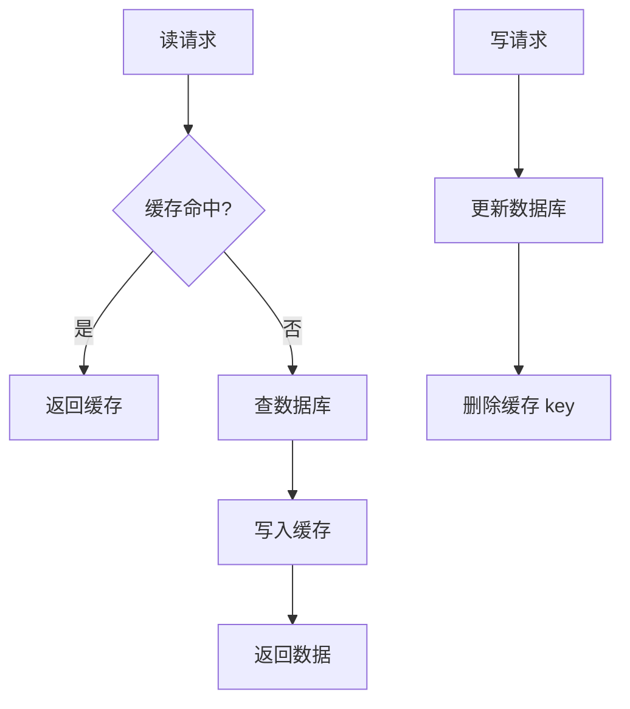

# 缓存经典三问与一致性

> 缓存是性能第一道防线，但缓存失效的三种模式（穿透/击穿/雪崩）和一致性问题，是高并发系统的"三大杀手"。理解底层原理，才能在危机时从容应对。

本文与「[多级缓存框架](多级缓存框架.md)」互补：那里讲分层架构，这里讲**故障模式与一致性协议**。

## 一、缓存读写基础（Cache Aside）

最常用模式：读先查缓存，未命中查 DB 并回填；写先更新 DB，再**删除**缓存。



> 为什么不"更新缓存"而要"删除"？因为并发写交叉时，后更新的 DB 值可能被先写入的旧缓存覆盖，产生脏数据。删除让下次读自动回填最新值，更简单安全。

## 二、缓存穿透：查不存在的数据

**现象**：查询数据库中根本不存在的数据（如 `user_id=-1`），请求穿过缓存直达 DB，恶意攻击可压垮数据库。

**本质**：数据本身不存在，缓存层没有"拦截屏障"。

**解决方案**：
| 方案 | 实现 | 优点 | 缺点 |
|------|------|------|------|
| 缓存空对象 | DB 查不到也写短期空值（如 60s） | 简单、挡瞬时攻击 | 占内存；空值期内数据不一致 |
| 布隆过滤器 | 将存在的 key 哈希到位图，查前先过滤 | 内存极小、根本防御 | 有误判率、传统布隆不支持删除、需预热 |

```java
// 方案1: 缓存空对象
User user = redis.get("user:" + id);
if (user != null) return user.equals("NULL") ? null : user;
user = mapper.selectById(id);
if (user != null) redis.set("user:"+id, user, 3600);
else redis.set("user:"+id, "NULL", 300);   // 短期空值

// 方案2: 布隆过滤器（Redisson）
RBloomFilter<String> bf = redisson.getBloomFilter("userBF");
bf.tryInit(1_000_000L, 0.01);               // 100万预期, 1%误判
if (!bf.contains(userId)) return null;       // 一定不存在, 直接拦截
```

> 口诀：**"穿透防幽灵——不存在的一律拦（布隆优先，空值兜底）。"**

## 三、缓存击穿：热点 Key 过期瞬间

**现象**：某个扛大并发的**热点 Key** 在失效瞬间，海量请求同时发现缓存 miss，一起涌向 DB。

**本质**：单个热点 Key 失效，而非数据不存在。

**解决方案**：
| 方案 | 语义 | 优点 | 缺点 |
|------|------|------|------|
| 互斥锁 | 只允许一个线程重建缓存，其余等待重试 | 强一致 | 性能损耗、可能死锁 |
| 逻辑过期 | 不设物理 TTL，值内封装过期时间，异步更新，期间返回旧值 | 高可用、用户无感 | 短暂不一致 |

```java
// 互斥锁方案（Redisson）
public Product getWithLock(String pid) {
    Product p = redis.get("product:" + pid);
    if (p == null) {
        RLock lock = redisson.getLock("lock:product:" + pid);
        if (lock.tryLock(3, 10, TimeUnit.SECONDS)) {
            try {
                if ((p = redis.get("product:" + pid)) == null) {  // 双重检查
                    p = mapper.selectById(pid);
                    setWithRandomExpire("product:" + pid, p);     // 防雪崩
                }
            } finally { lock.unlock(); }
        } else { Thread.sleep(50); return getWithLock(pid); }      // 重试
    }
    return p;
}
```

> 口诀：**"击穿保热点——只能一人修（互斥锁强一致 / 逻辑过期高可用）。"**

## 四、缓存雪崩：大量 Key 同时失效

**现象**：同一时刻大量 Key 集中过期，或 Redis 宕机，请求全部转向 DB。

**本质**：大规模 Key 失效或服务不可用。

**解决方案**：
1. **随机过期时间**：基础 TTL + 随机偏移（如 1h + 0~10min），错开失效。
2. **高可用架构**：Redis 主从 + 哨兵 + 集群，防单点。
3. **多级缓存**：本地缓存（Caffeine/Guava）作一级，Redis 作二级，即使 Redis 崩也能挡部分。
4. **服务降级/熔断**：DB 压力过大时对非核心返回兜底（呼应「[稳定性三板斧](稳定性三板斧：限流-熔断-降级.md)」）。
5. **缓存预热**：大促前提前加载热点，避免冷启动雪崩。

```java
// 随机过期时间防雪崩
int base = 3600, random = new Random().nextInt(600);
redis.set(key, value, base + random, TimeUnit.SECONDS);
```

> 口诀：**"雪崩防灾难——过期时间要分散（随机 TTL + 集群高可用 + 多级缓存）。"**

## 五、缓存与数据库一致性

Cache Aside 的"先更新 DB 再删缓存"仍有极小不一致窗口（更新 DB 后、删缓存前，若有读请求回填旧值）。进阶策略：

| 策略 | 做法 | 适用 |
|------|------|------|
| 先删后写 | 先删缓存→更新 DB | 简单，但有回填旧值风险 |
| 延迟双删 | 删缓存→更新 DB→sleep→再删缓存 | 降低不一致窗口，常用 |
| 读写穿透(Read/Write Through) | 缓存层代理 DB 读写 | 统一封装，业务无感 |
| 异步校验 | Binlog(Canal)监听→失效缓存 | 最终一致，解耦业务 |

```java
// 延迟双删（降低不一致窗口）
redis.delete(key);
db.update(...);
Thread.sleep(500);          // 等可能的脏读回填完成
redis.delete(key);           // 再删一次
```

> ⚠️ **一致性权衡**：缓存本质是副本。"互斥锁"换强一致但损性能，"逻辑过期/异步"换高可用但容忍短暂不一致。金融类严格一致，资讯类可接受最终一致——别过度设计。

## 六、组合拳与最佳实践

生产环境通常**组合使用**：布隆过滤器防穿透 + 随机 TTL 防雪崩 + 核心热点逻辑过期防击穿 + 多级缓存兜底。

| 问题 | 首选 | 备选 | 关键口诀 |
|------|------|------|---------|
| 穿透 | 布隆过滤器 | 缓存空对象 | 不存在一律拦 |
| 击穿 | 互斥锁(强一致) | 逻辑过期(高可用) | 热点只能一人修 |
| 雪崩 | 随机 TTL + 集群 | 多级缓存 + 限流降级 | 过期时间要分散 |

- [ ] 监控先行：缓存命中率、DB QPS、Redis 内存使用率（Prometheus + Grafana）。
- [ ] 不要过度设计：小项目"随机 TTL + 空值"足够；大促/秒杀才上布隆与锁。
- [ ] 一致性方案随业务选：资金严格、资讯最终。

> 参考：Redis 官方缓存模式、美团/阿里技术博客（缓存三大问题与多级缓存）、Cache Aside Pattern（Microsoft / Amazon Builder's Library）。
