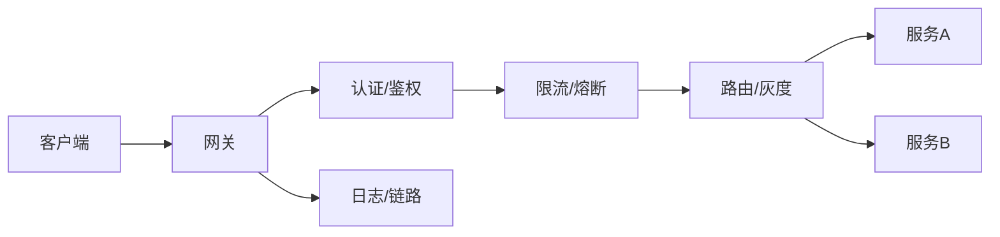

# 网关与 API 治理设计实战

> API 网关是南北向流量的统一入口：认证、限流、路由、灰度、协议转换、日志审计都在这里收口。它决定了系统的安全边界与可观测性起点，是微服务架构的"守门员"。

## 1. 网关职责



## 2. 核心能力

| 能力 | 说明 |
| --- | --- |
| 认证鉴权 | JWT/OAuth2/API Key 校验 |
| 路由 | 按路径/host 转发到后端 |
| 限流 | 令牌桶/滑动窗口防过载 |
| 熔断降级 | 后端故障快速失败 |
| 灰度 | 按 header/用户路由到新版本 |
| 协议转换 | HTTP→gRPC、WS 聚合 |

## 3. 限流实现

```redis
-- 滑动窗口限流
local now = tonumber(ARGV[1])
redis.call('ZREMRANGEBYSCORE', KEYS[1], 0, now - 1000)
local cnt = redis.call('ZCARD', KEYS[1])
if cnt < tonumber(ARGV[2]) then
  redis.call('ZADD', KEYS[1], now, ARGV[3])
  return 1
end
return 0
```

## 4. 灰度与路由

- **规则路由**：`x-user-id % 100 < 10` 走新版本。
- **染色透传**：网关打标后全链路透传，下游按标分流。
- **无损**：配合健康检查，摘流后再发布。

## 5. 可观测与治理

- **统一日志**：请求/响应/耗时留痕。
- **链路追踪**：注入 traceId，串起全链路。
- **治理面板**：QPS、错误率、P99 实时可见。

## 6. 常见坑

| 坑 | 现象 | 对策 |
| --- | --- | --- |
| 网关单点 | 全站不可用 | 多实例 + 集群 |
| 限流误伤 | 正常流量被拦 | 合理阈值 + 白名单 |
| 透传膨胀 | header 过大 | 精简透传字段 |
| 路由错配 | 请求打错服务 | 路由单测 |
| 性能瓶颈 | 延迟升高 | 异步 + 连接池 |

## 7. 面试题

1. 网关和 LB 区别？
2. 网关限流有哪些算法？
3. 灰度发布网关怎么配合？
4. 网关如何做统一鉴权？
5. 网关成为瓶颈怎么办？

## 8. 小结

API 网关 = 入口收口 + 认证限流 + 灰度路由 + 可观测。它是系统的"安全门"与"仪表盘"，所有横切关注点尽量上提到这里统一治理。
