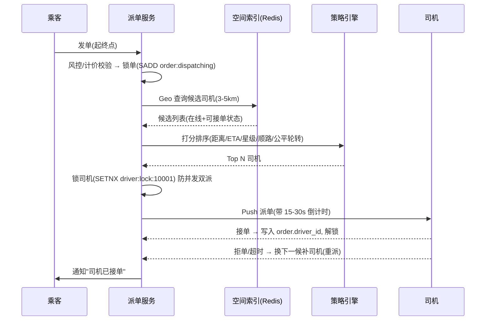

# 网约车派单系统设计

## 〇、本体介绍

**网约车派单**：乘客发单 → 系统在**秒级内**从数十万在线司机中找出"距离近、时效够、服务好"的最优司机完成撮合。是**典型的地理空间实时匹配问题**，核心诉求是**快（延迟 < 1s）、准（全局最优）、稳（百万 QPS 级）**。

**核心矛盾**：
1. 空间检索：几十万移动点实时查"半径 3km 内有谁"——**索引随之移动**（司机一直在动）；
2. 供需不平衡：高峰期（雨天/晚高峰）供不应求，派给谁都会引发体验问题；
3. 一单一派 vs 全局最优：用户要快、平台要效率（空驶率）、司机要公平（派单规则）。

**与其他场景关系**：本质是**极低延迟的实时匹配系统**，与「附近的人与地理围栏」共享 GeoHash 底座，但多出**司机状态管理（在途/接单/收车）**与**派单策略引擎（打分）**两层。

**核心主线**：订单状态机 → 空间索引定位候选司机 → 派单打分排序 → 锁单/推送 → 超时重派 → 全局均衡。

---

## 一、需求与指标

### 1.1 功能需求

- 乘客发单后可取消；司机可接单/拒单/超时未接。
- 多乘客同时发单时**不会把同一司机派给两人**（互斥）。
- 派单对象要"最优"：距离、ETA、司机服务质量、车型匹配、顺路度。
- 高峰期有排队/加价/预约等策略。

### 1.2 指标

| 指标 | 目标 |
|------|------|
| 派单延迟 | 从发单到司机接到 Push < 1~2s |
| 接单率 | 平台整体 > 70%（高峰期可降） |
| 空驶率 | 越低越好（全局最优的收益落点） |
| 派单冲突 | 0（一单一人、一人一单） |
| 并发量 | 一线城市晚高峰万级单/分钟，司机在线 20 万+ |

---

## 二、核心数据模型

```sql
-- 订单表（主）: 状态机驱动
CREATE TABLE order_info (
    id            BIGINT PRIMARY KEY AUTO_INCREMENT,
    order_no      VARCHAR(64) NOT NULL UNIQUE,   -- 幂等键
    passenger_id  BIGINT NOT NULL,
    driver_id     BIGINT,                        -- 命中司机，派单后写入
    status        TINYINT NOT NULL,              -- 1待派 2待接 3已接 4行程中 5已完成 6已取消
    start_lng     DECIMAL(10,6), start_lat DECIMAL(10,6),
    end_lng       DECIMAL(10,6),  end_lat  DECIMAL(10,6),
    create_time   DATETIME, update_time DATETIME,
    KEY idx_status_time (status, create_time)
);

-- 司机在线状态表（Redis 为主，DB 兜底对账）
-- key: driver:online:hash   field: driverId  value: {lng,lat,status,lastUpdate,score...}
-- key: driver:list:{geohash}  (每 geo 格一个 ZSet: member=driverId, score=updatedAt)
```

**存哪才"实时"？**

| 数据 | 存储 | 原因 |
|------|------|------|
| 司机实时位置/状态 | Redis（Hash + Geo/ZSet） | 秒级读写，单点几十万无压力 |
| 订单主数据 | MySQL（分表） | 强一致、审计、财务报表 |
| 派单日志 | MQ → 日志/OLAP | 复盘、风控、司机画像 |

> **为什么不用 MySQL 存经纬度做空间索引？** 司机位置秒级更新 → 是"写密集型空间数据"，MySQL 空间索引对高频写入 + 范围查询（半径）力不从心；Redis GEO 单 key 百万成员 + 半径查询毫秒级，是标配。MySQL 只做订单与对账。

---

## 三、空间索引方案

### 3.1 Redis GEO（首选，5.0+）

```bash
GEOADD online_drivers 116.397 39.908 10001        # 上报位置
GEOSEARCH online_drivers FROMLONLAT 116.405 39.915 BYRADIUS 3 km ASC COUNT 50    # 附近候选
```

- 底层是 **ZSet（geohash 编码的 score）**，半径查询 = ZRANGEBYSCORE，毫秒级。
- 注意：**一个 key 全量司机**在极端量（百万+）下 GEO 仍吃力，可按下单区**分片**（见 3.3）。

### 3.2 GeoHash 手动分桶（GEO 的替代/补充）

- 把地图切成网格（GeoHash 6 位 ≈ 1.2km×0.6km，7 位 ≈ 150m×150m），每格一个 ZSet/Hash。
- 查候选：算乘客所在格 → 取**本格 + 周边 9 格**（9 patch 查询）→ 合并后按距离排序。
- 网格边界问题：恰好在格边界的司机可能被漏掉——必须查 9 格而非 1 格（同「[附近的人与地理围栏](附近的人与地理围栏.md)」的边界 9 宫格）。
- **相对 GEO 的好处**：按格分片天然可扩容、可只更新所在格的 key（写扩散小）。

### 3.3 分片策略（超大规模）

| 方案 | 做法 | 适用 |
|------|------|------|
| 按城市分片 | 每城市一个 GEO/ZSet 集 | 多城市部署，隔离故障 |
| 按 Geohash 前缀分片 | 格 key：`drv:{geohash7}` | 单城百万级司机 |
| 按订单热点分片 | 商圈高峰临时切分 | 局部热点治理 |

> 位置上报频率：司机 App **每 2~5s 上报一次位置**（高频伤电伤流量，低频派单不准）；服务端上报与派单读分离，上报道 MQ 异步写 Redis。

---

## 四、派单流程与状态机



### 4.1 关键动作的原子性

- **锁司机**：`SET driver:lock:{id} {orderNo} NX EX 60`——只允许本单持有，防"两个订单抢一个司机"；
- **锁订单**：`SET order:lock:{orderNo} NX EX 60`——防同一订单被并发处理两次；
- 接单那一刻 **对比 Redis 里的 orderNo 是否一致**再写入 DB 司机 ID（防网络抖动下错配）。

### 4.2 超时与重派（派单保底）

| 情形 | 动作 |
|------|------|
| 首司机 15~30s 未接/拒单 | 按打分序列**轮询下一名**（每次派单不重复同一人） |
| 全部候选拒单 | 扩大半径（3km → 5km → 8km）再次检索 |
| 全部司机不可用 | 订单进入「排队」，提示：附近暂无可用车辆，可加价/预约 |
| 乘客取消 | 撤销派单：删除锁、释放司机、通知已接单司机取消 |

> 重派的关键：**重派必须幂等**——同一订单不能同时有两个司机被锁；重派前先解锁旧司机，写派单流水便于审计。

---

## 五、派单策略引擎（全局最优 vs 局部最优）

### 5.1 打分模型

```
score = w1·距离分 + w2·ETA分 + w3·司机等级分 + w4·顺路度分 + w5·公平轮转分
```

| 因子 | 说明 | 权重倾向 |
|------|------|----------|
| 距离/ETA | 司机到乘客的接驾时间 | 高（体验） |
| 司机服务分 | 星级/投诉率/取消率 | 高（质量） |
| 车型匹配 | 快车/专车/拼车 | 固定过滤 |
| 顺路度 | 司机当前行程目的地方向（拼车/顺风车） | 拼车场景高 |
| 公平轮转 | 长期接单少的司机加权 | 中（生态） |

- **分数低但不是零**：派单要"最优"，但也要避免"某个司机永远不被选中"——引入随机扰动 ε + 轮转加权，兼顾公平。
- 打分计算要在 **100ms 内完成**：候选通常 50 人以内，内存打分即可，**不做复杂模型**（重模型放离线画像，派单时查表取分）。

### 5.2 排队与调度（高峰期）

- 供不应求时**不是不派，而是换策略**：
  - 一手单模式（快）：就近先派，体验优先；
  - 全局匹配模式：同一时刻**批量订单 + 批量司机**做全局分配（匈牙利/贪心），平台空驶率最低——**这是 Uber 的全局最优派单思想**：晚高峰 30 秒攒一批单和一批司机，一起算，而不是一单一单抢。
- 价格杠杆：动态调价（加价倍数）在需求侧削峰，是派单系统的"限流"。

---

## 六、可靠性、幂等与一致性

| 问题 | 方案 |
|------|------|
| 派单消息丢 | 派单动作写 DB 派单流水 + MQ 可靠投递，补偿 job 扫"已派未接"超时单 |
| 接单回调重复 | 订单状态机 `WHERE status=待接` 条件更新，幂等 |
| 司机位置丢失 | 每 30s 心跳 + 状态机下发（司机端定时上报 + 服务端 TTL 判离线） |
| 双派（一单两司机） | 锁司机 SETNX + 接单时订单号校验（双保险） |
| Redis 不可用 | 派单降级：本地内存缓存热区司机 + 拒新单 + 告警；核心是 Redis 集群化 |

> 一致性平衡：派单链路对"最终一致"容忍度较高（短暂出现"两人都以为自己接到单"会引发客诉）——**锁冲突 0 是硬要求**，宁可多锁 1 秒也别双派。

---

## 七、优化与延伸

1. **ETA 预估**：接驾时间不能只看直线距离——用历史车速/路况数据（分段 ETA），高峰期否则"距离近但堵 20 分钟"。
2. **顺路拼单**：司机的第二行程与第一行程方向夹角 < 阈值才允许，需要**行程方向索引**。
3. **预测派单**（前端调度）：根据历史供需数据**提前把司机调到预测热点区域**（预调度），减少接驾距离。
4. **派单与订单的读写分离**：派单（高频写 Redis）与订单落库（低频写 DB）解耦；对账 job 每天核对"派单日志 vs 订单表"。
5. **可观测**：派单延迟 P99、司机响应超时率、接单率漏斗（候选→推送→接单→上车）。

---

## 八、速查表

| 主题 | 一句话 |
|------|--------|
| 司机位置 | Redis GEO / GeoHash 桶，2~5s 上报一次，MQ 异步写 |
| 候选检索 | GEO 半径 3km→5km→8km 逐级放大 + 9 格边界 |
| 防双派 | 司机与订单双 SETNX 锁 + 接单校验 orderNo |
| 派单规则 | 打分排序：距离/ETA/服务分/顺路/公平轮转 |
| 超时重派 | 15~30s 轮询下一候选，写派单流水幂等 |
| 高峰策略 | 批量订单+批量司机全局匹配 + 动态调价削峰 |
| 兜底 | 派单流水 + 补偿 job + 状态机幂等 + 对账 |

---

## 九、面试高频追问（12+）

1. Q：司机位置怎么存、多久更新？ A：Redis GEO（或 GeoHash 桶），司机端每 2~5s 上报，MQ 异步写 Redis，服务端查询内存命中毫秒级。
2. Q：为什么不用 MySQL 存位置？ A：位置是"高频写 + 半径查询"数据，MySQL 空间索引写性能与并发扛不住；Redis 内存 + 单线程原子，毫秒级。
3. Q：候选司机怎么找？ A：GEO 半径查询 / GeoHash 9 格合并；半径从 3km 逐级放大；同时过滤在线 + 可接单状态。
4. Q：怎么保证不把同一司机派给两个订单？ A：司机锁 SETNX（带订单号）+ 接单回写时校验，DB 订单状态机兜底，双保险。
5. Q：司机拒单/超时怎么办？ A：按打分队列重派下一候选（不重复同一人）；全部拒单扩大半径；再不行进入排队。
6. Q：怎么选"最优"司机？ A：打分模型 w1·距离 + w2·ETA + w3·服务分 + w4·顺路 + w5·公平轮转，内存计算 100ms 内完成。
7. Q：高峰期怎么派？ A：批量全局匹配（一批单+一批司机一起算）+ 动态调价 + 排队/预约，兼顾体验与平台空驶率。
8. Q：ETA 怎么估？ A：分段路径 ETA（历史车速 + 实时路况），不能直线距离估算；可离线模型在线查表。
9. Q：派单消息丢了怎么办？ A：派单流水落库 + MQ 可靠投递 + 补偿 job 扫"已派未接"超时单重派；接单幂等。
10. Q：失误把司机派错了能改吗？ A：能——取消派单（解锁司机 + 通知司机 + 写流水），重新进入派单流程；关键是无双派与可追溯。
11. Q：司机位置数据量多大？ A：20 万司机 × 2~5s 上报 = 4~10 万次写入/秒，Redis 完全能扛；上报与查询分离，写走 MQ 批量。
12. Q：和外卖骑手派单的区别？ A：外卖是"多取多送"路径优化（VRPTW，见「业务模型/04-即时配送」），网约车是"一单一人"空间匹配；外卖重路径规划，网约车重实时位置与互斥派单。

---

## 十、与其他篇的关系

- 空间索引与边界处理见「[附近的人与地理围栏](附近的人与地理围栏.md)」（GeoHash 原理、9 宫格防漏）。
- 派单状态机与「[幂等设计](幂等设计.md)」「[分布式锁](分布式锁.md)」组合：锁司机防双派、状态机防重入。
- 高峰期批量匹配与「[大促容量规划与备战](大促容量规划与备战.md)」同思路：峰值削峰 + 全局最优。
- 司机端长连接推送见「[长连接](长连接.md)」「[IM 消息系统设计](IM消息系统设计.md)」：派单 Push 走长连通道。
- 业务侧派单打分与 ETA 详见「业务模型/即时配送」篇（VRPTW 合单与出餐预估）。

> 一句话：**派单 = 实时空间索引找候选（GEO）+ 打分排序选最优（策略引擎）+ 双锁防冲突（互斥）+ 超时重派保接单（自愈）——1 秒内完成，一单只派一人。**