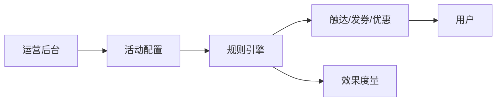

# 营销活动配置平台实战

> 营销活动（满减、秒杀、拼团、发券）迭代极快，若每次都硬编码开发，运营等不起、研发累死。营销配置平台把"活动"做成可配置的数据 + 通用执行引擎，让运营自助搭建，研发只维护底层能力。

## 1. 平台结构

## 2. 配置模型

- **活动**：时间窗、人群、渠道、目标。
- **规则**：trigger（触发条件）+ action（执行动作）。
- **素材**：文案、优惠、落地页。
- **审批流**：上线前审核，防误操作。

## 3. 执行引擎

- 统一活动生命周期：草稿→审批→上线→结束。
- 规则引擎解释执行配置，无需发版。
- 人群圈选：标签 + 行为组合。
- 限流防骚扰：单用户参与上限。

## 4. 效果闭环

- 实时看参与、转化、ROI。
- A/B 对比不同配置。
- 异常自动暂停（如超预算）。

## 5. 常见坑

| 坑 | 现象 | 对策 |
| --- | --- | --- |
| 配置错 | 发错券 | 审批 + 预览 |
| 超预算 | 资损 | 预算上限 + 熔断 |
| 重复参与 | 薅羊毛 | 频次限制 |
| 性能 | 大人群卡 | 异步圈选 |
| 难debug | 黑盒 | 配置留痕 |

## 6. 面试题

1. 营销平台如何做到运营自助？
2. 活动配置如何防错？
3. 预算熔断如何实现？
4. 人群圈选怎么做？
5. 配置与执行如何解耦？

## 7. 小结

营销配置平台 = 配置化活动 + 规则引擎 + 审批 + 效果闭环。核心是"把变化交给配置、把稳定留在引擎"，让营销快速试错。
