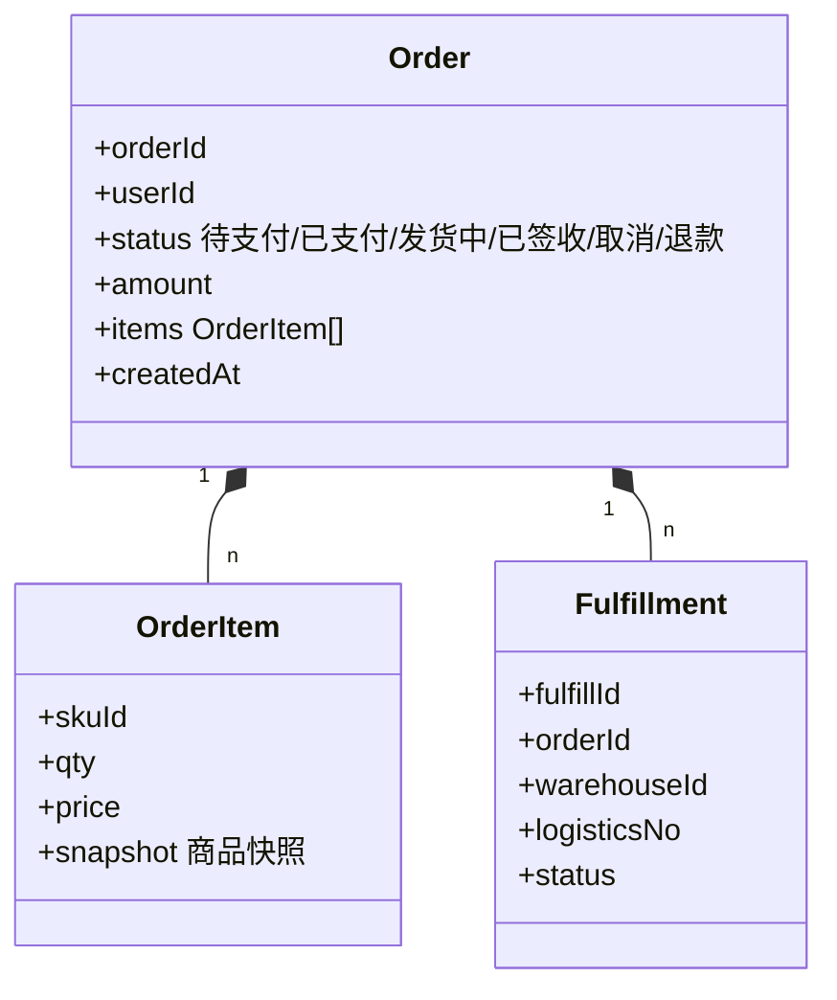
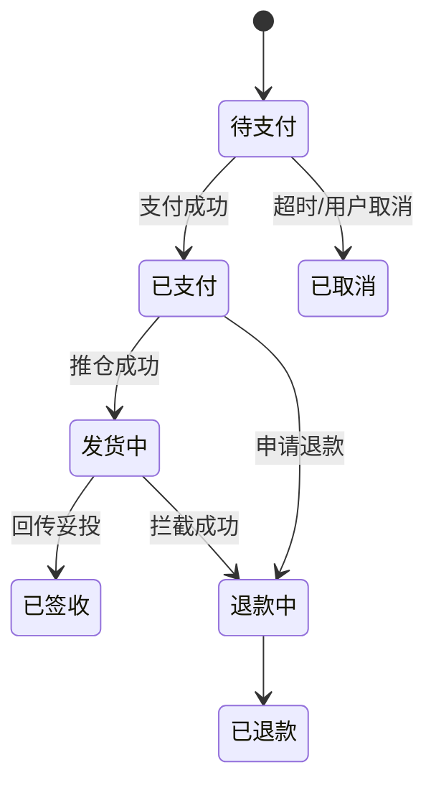

# 订单与履约系统设计实战

> 订单是交易链路的"咽喉"：它串联购物车、库存、支付、履约、售后，是状态机最复杂、一致性要求最高的系统之一。一笔订单从创建到妥投，要经过数十个状态流转与多方协同。

## 1. 核心领域模型



## 2. 状态机设计

订单状态必须收敛为**有限状态机（FSM）**，禁止任意跳转：



- 用枚举 + 转移表校验，非法转移直接拒绝。
- 状态变更必须带版本号/乐观锁，防并发覆盖。

## 3. 下单扣减与一致性

- **下单不立即扣库存**：先预占（冻结），支付成功后转实扣，超时释放。
- **幂等下单**：`userId + 购物车指纹 + 防重 token`，重复提交返回同一订单。
- **最终一致性**：下单本地事务写订单，通过 MQ 异步通知库存/营销/积分，失败进重试与对账。

```sql
-- 预占库存（乐观锁）
UPDATE sku_stock SET frozen = frozen + ?,
       version = version + 1
WHERE sku_id = ? AND (available - frozen) >= ? AND version = ?;
```

## 4. 履约拆分与发货

- **拆单**：按仓库、品类、是否预售拆分履约单，分别推仓。
- **寻仓**：根据收货地址 + 库存分布 + 时效选最优仓。
- **物流回传**：订阅物流轨迹 MQ，更新履约状态，触发"已签收"。

## 5. 超时与补偿

| 环节 | 超时 | 补偿 |
| --- | --- | --- |
| 待支付 | 30 min | 关单 + 释放预占 |
| 已支付未推仓 | 5 min | 重推 + 告警 |
| 发货中无轨迹 | 24 h | 人工介入 + 客户通知 |

## 6. 常见坑

| 坑 | 现象 | 对策 |
| --- | --- | --- |
| 超卖 | 库存为负 | 预占 + 乐观锁 |
| 重复下单 | 多笔订单 | 防重 token |
| 状态错乱 | 已退款仍发货 | FSM 强校验 + 拦截 |
| 消息丢失 | 库存未扣 | 对账 + 补偿 |
| 金额不一致 | 支付少付 | 服务端算价 |

## 7. 面试题

1. 为什么下单用预占而非直接扣库存？
2. 订单状态机如何防止非法跳转？
3. 下单与库存如何保证最终一致？
4. 拆单的触发条件有哪些？
5. 关单补偿如何设计？

## 8. 小结

订单系统 = 状态机 + 预占扣减 + 异步履约 + 对账补偿。核心是"状态收敛、扣减原子、跨域最终一致"，用幂等与对账兜住所有异常。
