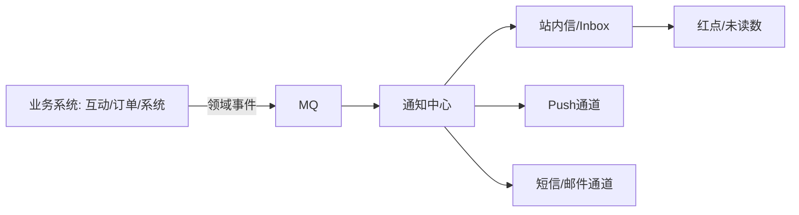

# 通知中心与站内信设计

## 〇、本体介绍

**通知中心**：把系统事件（互动/订单/系统公告）触达给用户的统一出口，形态包括**站内信（inbox）、红点、Push、短信、邮件**。核心是把"事件产生"与"触达方式"解耦，并解决**大规模投递 + 已读管理 + 防打扰**。

**核心矛盾**：
1. 事件**量大**（每篇内容每个互动都产生通知），投递方式多，直接同步发必然拖垮业务；
2. **读扩散 vs 写扩散**：广播通知（全站公告）给每个人存一份还是读时拉取；
3. **已读/未读**是高频查询（红点），实时性要求高；
4. **防打扰**：推送太多用户流失，免打扰时段、频控、退订。

**核心主线**：事件与通知解耦 → 投递模式（读扩散/写扩散）→ 站内信模型 → 红点与已读 → 多通道触达 → 防打扰。

---

## 一、架构：事件驱动



1. 业务方只发**领域事件**（如 `CommentEvent{postId,userId,authorId}`），不关心怎么触达；
2. 通知中心订阅 MQ，**异步处理**：过滤（本人不通知自己、黑名单）→ 投递决策（渠道/模板）→ 落库 + 发 Push/短信；
3. **业务与通知解耦**：通知中心故障不影响主业务，MQ 天然削峰与重试。

> 口诀：**"业务发事件，中心管投递；异步解耦不拖累，MQ 重试保送达。"**

---

## 二、投递模式：读扩散 vs 写扩散

| 模式 | 做法 | 适用 |
|------|------|------|
| **写扩散（push 模式）** | 通知产生时给每个接收者 inbox 插一条 | 点对点互动通知（评论/点赞/私信） |
| **读扩散（pull 模式）** | 只存一条全局通知，用户拉取时拼接 | 全站广播（公告/系统消息） |

- **互动类用写扩散**：每个用户的通知列表是独立分页数据，天然支持已读管理。
- **公告类用读扩散**：千万用户"每人一份"是存储灾难；改为 `global_notice` 表 + 用户已读记录表（`user_read(notice_id, user_id)`），拉取时按"公告 + 个人通知"合并展示。
- 混合：**热点广播内容（如大促公告）必须读扩散**，普通互动写扩散——根据接收者规模切换策略。

```sql
-- 写扩散：站内信
CREATE TABLE inbox (
    id           BIGINT PRIMARY KEY,
    user_id      BIGINT NOT NULL,      -- 接收者
    biz_type     VARCHAR(32),          -- 评论/点赞/订单…
    biz_id       VARCHAR(64),          -- 业务ID
    content      JSON,                 -- 通知体（标题/摘要/跳转）
    read_flag    TINYINT DEFAULT 0,    -- 0未读 1已读
    read_at      DATETIME,
    created_at   DATETIME,
    KEY idx_user (user_id, read_flag, created_at)
) COMMENT '站内信';

-- 读扩散：公告 + 已读记录
CREATE TABLE global_notice (
    id         BIGINT PRIMARY KEY,
    title      VARCHAR(255), content TEXT,
    start_time DATETIME, end_time DATETIME
);
CREATE TABLE notice_read (
    notice_id  BIGINT NOT NULL, user_id BIGINT NOT NULL,
    PRIMARY KEY (notice_id, user_id)
) COMMENT '公告已读';
```

---

## 三、红点与未读数

- **未读数 = 未读站内信数 + 未读公告数**，是首页最高频查询（每次进 App 都问）。
- Redis 维护：`unread:{userId}` 计数（INCR/DECR），列表页与未读数**分两个接口**——红点只查计数，进列表才拉详情。
- 已读操作：批量接口 `markRead(ids)` 或"全部已读"；已读后 DECR 未读数并异步落库（`read_flag`）。
- **一致性**：未读数 Redis 权威展示，DB 每日对账回填（同「[钱包与账务系统设计](钱包与账务系统设计：账户、流水与日终对账.md)」对账思想）；通知到期删除后未读数同步清理。

---

## 四、多通道触达（Push/短信/邮件）

| 通道 | 场景 | 注意 |
|------|------|------|
| 站内信 | 默认承载（全部通知） | 红点引导 |
| **Push** | 高价值互动、营销 | 频控、免打扰、退订；iOS 证书/厂商通道 |
| 短信 | 高价值（验证码/支付/预警） | 成本高、频控严格、合规（退订） |
| 邮件 | 账单/周报 | 低优先 |

- **通道策略可配置**：模板 + 路由规则（如"订单相关→Push+站内信，营销→仅站内信"）。
- **多通道幂等**：同一事件多条通道各自独立发送，业务键幂等防重发。
- Push 送达率不可控 → 站内信是**最终保底**（App 内必达）。

---

## 五、防打扰与治理

| 手段 | 说明 |
|------|------|
| 免打扰时段 | 夜间（22:00–8:00）只发站内信不发 Push |
| 频控 | 每人每小时/每天 Push 上限，超额合并成"汇总通知" |
| 退订/开关 | 通知分类开关（互动/营销/系统），尊重用户 |
| 内容去重 | 同一帖子多次点赞合并成"xx 和另外 N 人赞了你" |
| 失败降级 | Push 通道故障 → 降级为仅站内信，告警见「[SRE与稳定性工程/06-日志与告警规则库](../SRE与稳定性工程/06-日志与告警规则库.md)」 |

> 口诀：**"通知可开关，夜间不发推；高频做合并，通道要降级。"**

---

## 六、与其他板块的关系

- **MQ / 消息中间件**：事件驱动与削峰（见「[延迟任务与订单超时关闭](延迟任务与订单超时关闭.md)」的异步思路）。
- **Feed 信息流设计**：互动事件的源头（评论/点赞产生通知）。
- **Redis 实现限流**：Push 频控与发送限流。
- **钱包与账务系统设计**：对账思想用于未读数与通知数的一致性核对。
- **短连接/长连接**：站内信实时性可叠加长连接推送（见「[长连接](长连接.md)」）。

---

## 七、速查表

| 主题 | 一句话 |
|------|--------|
| 解耦 | 业务发领域事件，通知中心异步投递 |
| 写扩散 | 互动通知每人 inbox 一条，管理已读 |
| 读扩散 | 公告全局一条 + 已读记录表，避免存储爆炸 |
| 红点 | Redis 未读数 + 列表分接口，对账回填 |
| 通道 | 站内信保底 + Push/短信按规则路由 |
| 防打扰 | 免打扰时段 + 频控 + 开关 + 合并去重 |

---

## 面试高频问题（12+ 条）

1. **通知中心为什么独立成系统？** 通知是横切关注点，业务只发事件、中心负责投递，解耦且可复用。
2. **什么是写扩散/读扩散？** 写扩散=事件产生时为每人插一条；读扩散=存一条全局的，拉取时合并。互动用写、公告用读。
3. **全站公告千万用户怎么发？** 读扩散：global_notice 一条 + notice_read 已读表，绝不给每人插 inbox。
4. **红点怎么实现？** Redis `unread:{uid}` 计数 + 站内信列表分接口，红点只查计数。
5. **已读怎么处理？** 批量 markRead + 全部已读，DECR 计数异步落库 read_flag。
6. **通知丢失怎么办？** MQ 重试 + 对账（未读数与 DB 比对回填）。
7. **Push 和站内信什么关系？** 站内信是保底必达，Push 是可扰动的增强通道。
8. **怎么防推送轰炸？** 免打扰时段 + 每小时/天频控 + 通知分类开关 + 同内容合并。
9. **多通道怎么防重发？** 事件业务键幂等，每通道独立幂等发送。
10. **通知中心挂了影响业务吗？** 不影响，事件先进 MQ，恢复后继续消费（削峰+解耦）。
11. **同帖子 100 人点赞发 100 条？** 合并窗口聚合：N 秒内同类事件合并成一条。
12. **通知的实时性怎么提升？** 站内信 + 长连接/Push 双通道，App 内实时拉取。

---

> 配套：事件驱动 →「[延迟任务与订单超时关闭](延迟任务与订单超时关闭.md)」；实时触达 →「[长连接](长连接.md)」。
